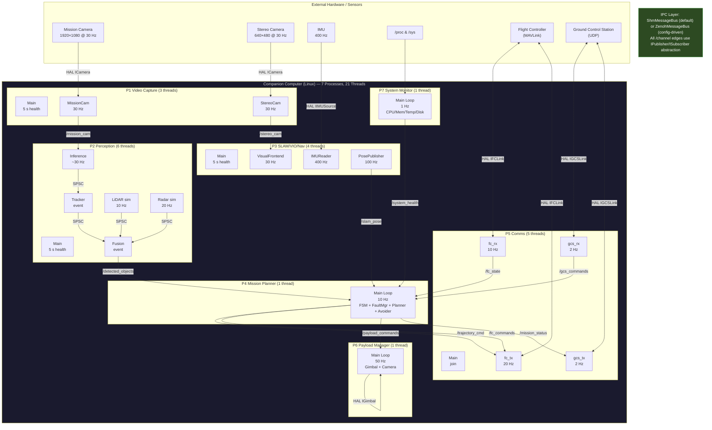
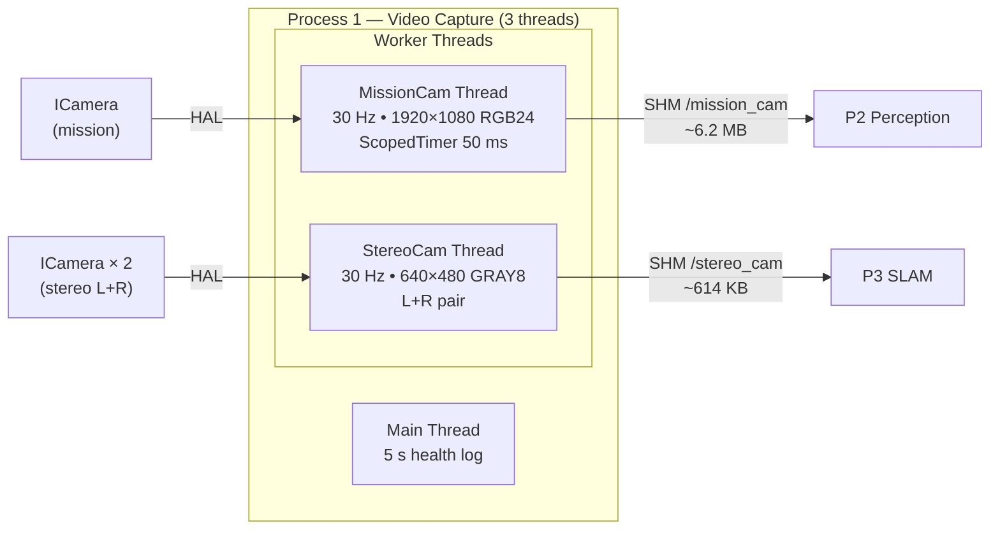
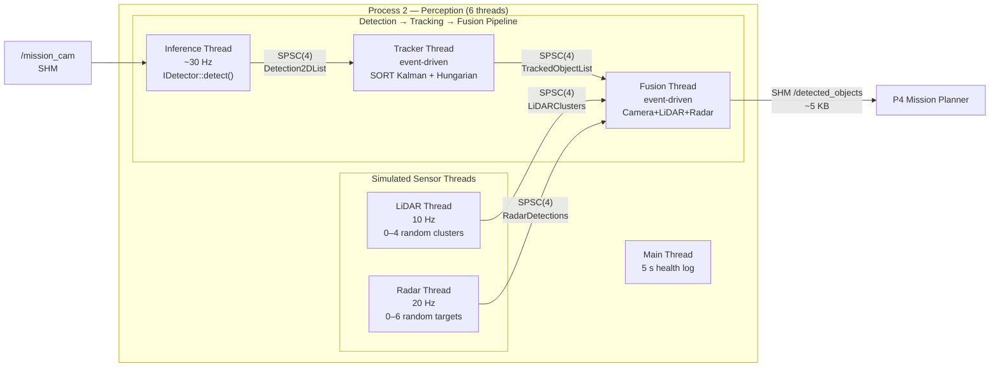
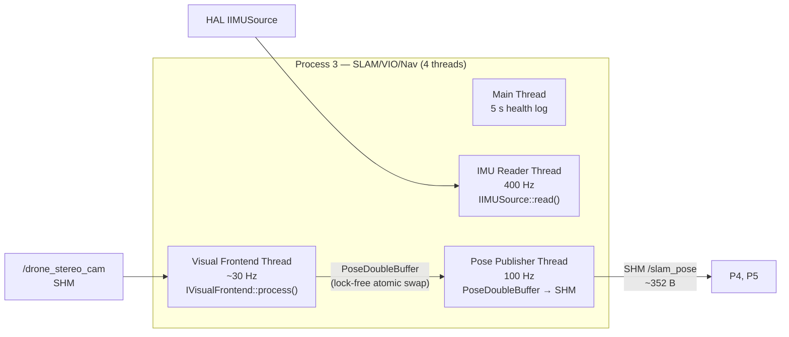
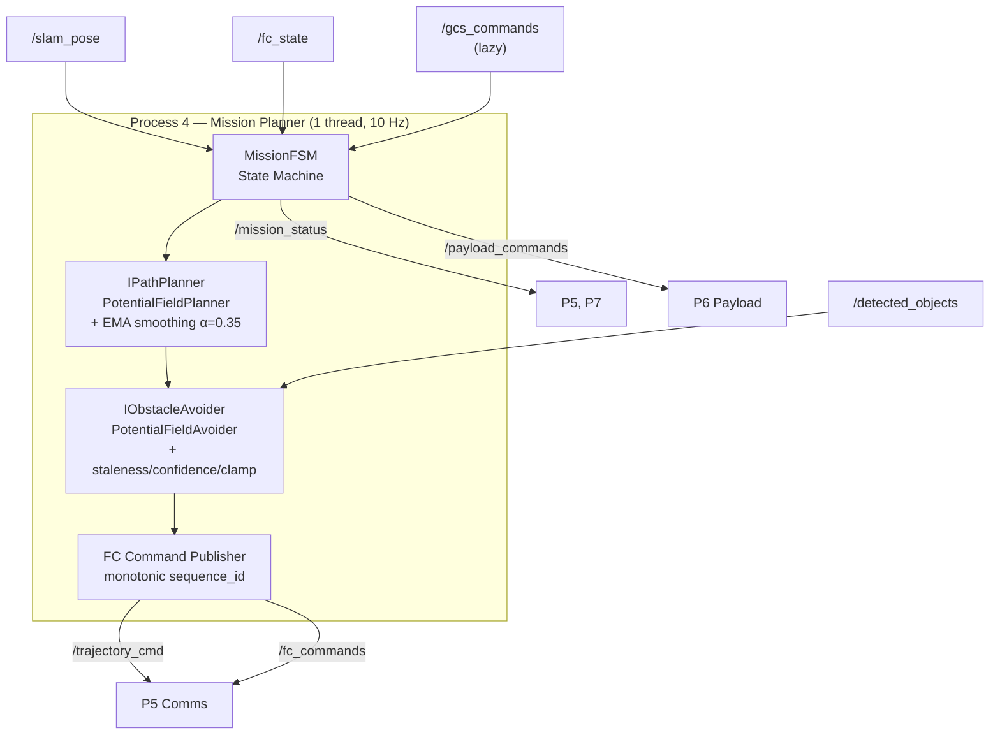
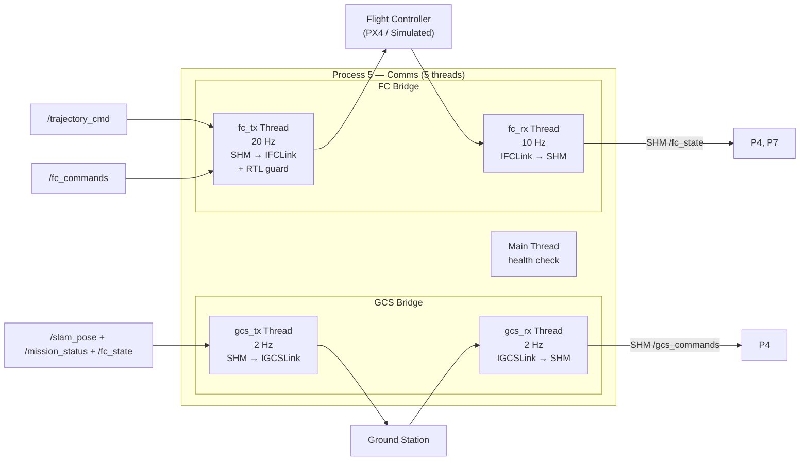
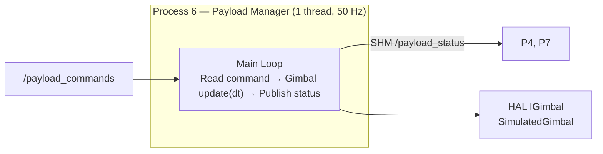
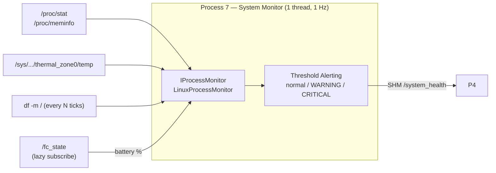
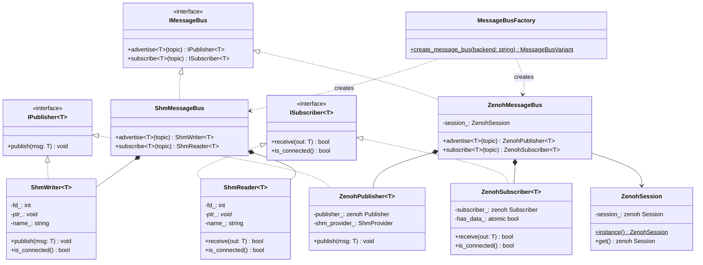

# Drone Companion Computer Software Stack

Multi-process C++17 software stack for an autonomous drone companion computer. 7 independent Linux processes communicate via a **config-driven IPC layer** — POSIX shared memory (default) or **Eclipse Zenoh** zero-copy SHM + network-transparent pub/sub, selectable at build time ([ADR-001](docs/adr/ADR-001-ipc-framework-selection.md), [Epic #45](https://github.com/nmohamaya/companion_software_stack/issues/45) — completed). All algorithms are **written from scratch** — no external ML/CV/SLAM frameworks are used. Hardware is abstracted behind a HAL layer; the default `simulated` backends generate synthetic data so the full stack runs on any Linux box.

**Target hardware:** NVIDIA Jetson Orin (Nano/NX/AGX, aarch64, JetPack 6.x, CUDA 12.x)

## Architecture

### System Overview



**Thread summary:** 21 threads total across 7 Linux processes (3 + 6 + 4 + 1 + 5 + 1 + 1). All inter-process communication uses the `IPublisher<T>` / `ISubscriber<T>` abstraction — backed by lock-free POSIX shared memory (SeqLock, default) or **Zenoh** zero-copy SHM + network transport (`-DENABLE_ZENOH=ON`, [Epic #45](https://github.com/nmohamaya/companion_software_stack/issues/45)). The backend is selected via `ipc_backend` in the JSON config. Intra-process queues (Process 2 only) use lock-free SPSC ring buffers.

**Reliability:** Every worker thread registers a `ThreadHeartbeat` (lock-free `atomic_store`, ~1 ns) — `ThreadWatchdog` detects stuck threads via configurable timeout. `ProcessManager` handles crash recovery with exponential-backoff restart policies and a dependency graph for cascading restarts. In production, seven independent **systemd** service units (`BindsTo=` dependency semantics + `WatchdogSec` on P7) provide OS-level supervision. Sanitizer-clean (ASan/TSan/UBSan). See [tests/TESTS.md](tests/TESTS.md) for test counts, [Epic #88](https://github.com/nmohamaya/companion_software_stack/issues/88) and [docs/process-health-monitoring.md](docs/process-health-monitoring.md).

### IPC Channel Map

All channels are abstracted behind `IPublisher<T>` / `ISubscriber<T>`. The backend is selected via `ipc_backend` in the JSON config (`"shm"` or `"zenoh"`). SHM uses POSIX segment names; Zenoh uses key expressions.

```
 P1 ──▶ /drone_mission_cam ──────▶ P2           (Zenoh: drone/video/frame)
 P1 ──▶ /drone_stereo_cam ──────▶ P2, P3        (Zenoh: drone/video/stereo_frame)
 P2 ──▶ /detected_objects ──────▶ P4             (Zenoh: drone/perception/detections)
 P3 ──▶ /slam_pose ─────────────▶ P4, P5, P6    (Zenoh: drone/slam/pose)
 P4 ──▶ /trajectory_cmd ────────▶ P5            (Zenoh: drone/mission/trajectory)
 P4 ──▶ /mission_status ────────▶ P5, P7         (Zenoh: drone/mission/status)
 P4 ──▶ /payload_commands ──────▶ P6              (Zenoh: drone/mission/payload_command)
 P5 ──▶ /fc_state ──────────────▶ P4, P7          (Zenoh: drone/comms/fc_state)
 P5 ──▶ /gcs_commands ──────────▶ P4              (Zenoh: drone/comms/gcs_command)
 P6 ──▶ /payload_status ────────▶ P4, P7          (Zenoh: drone/payload/status)
 P7 ──▶ /system_health ─────────▶ P4              (Zenoh: drone/monitor/health)
```

### Hardware Abstraction Layer (HAL)

All hardware access goes through abstract C++ interfaces. A factory reads the `"backend"` key from config and instantiates the corresponding implementation.

| Interface | Purpose | Simulated Backend | Gazebo/SITL Backend | Planned Real Backend |
|---|---|---|---|---|
| `ICamera` | Frame capture | `SimulatedCamera` — synthetic gradient frames | `GazeboCamera` (gz-transport) | V4L2 / libargus (Jetson) |
| `IDetector` | Object detection | `SimulatedDetector` — random bounding boxes | — | TensorRT YOLOv8 |
| | | `ColorContourDetector` — HSV segmentation + union-find (pure C++) | — | |
| | | `OpenCvYoloDetector` — YOLOv8-nano via OpenCV DNN (`HAS_OPENCV`) | — | |
| `IFCLink` | Flight controller comms | `SimulatedFCLink` — synthetic battery drain, GPS | `MavlinkFCLink` (MAVSDK) | MAVLink 2 via serial UART |
| `IGCSLink` | Ground station comms | `SimulatedGCSLink` — simulated RTL after 120 s | — | UDP / MAVLink GCS protocol |
| `IGimbal` | Gimbal control | `SimulatedGimbal` — rate-limited slew model | — | UART / PWM gimbal protocol |
| `IIMUSource` | Inertial measurement | `SimulatedIMU` — noisy synthetic accel + gyro | `GazeboIMU` (gz-transport) | SPI / I2C IMU driver |
| `IVisualFrontend` | Pose estimation | `SimulatedVisualFrontend` — circular trajectory + noise | `GazeboVisualFrontend` (gz-transport odometry) | ORB-SLAM3 / VINS-Fusion |
| `IPathPlanner` | Path planning | `PotentialFieldPlanner` — attractive force + EMA smoothing | — | RRT* / D* Lite |
| `IObstacleAvoider` | Obstacle avoidance | `PotentialFieldAvoider` — repulsive force + clamping | — | VFH+ / 3D-VFH |
| `IProcessMonitor` | System metrics | `LinuxProcessMonitor` — /proc, /sys | — | — |

---

## Algorithms & Implementation Details

> **Note:** Core algorithms (tracking, fusion, path planning, obstacle avoidance, gimbal control, system monitoring) are **written from scratch** in C++17. The only external runtime libraries are spdlog (logging), Eigen3 (linear algebra), nlohmann/json (config parsing), and **optionally** OpenCV DNN (for YOLOv8 object detection) and MAVSDK (for PX4 MAVLink communication). The stack always builds and runs with simulated backends — no OpenCV, MAVSDK, or Gazebo required.

### Process 1 — Video Capture



Two capture threads publish frames to shared memory.

| Parameter | Mission Camera | Stereo Camera |
|---|---|---|
| Resolution | 1920 × 1080 | 640 × 480 |
| Color | RGB24 (3 channels) | GRAY8 (1 channel) |
| Frame rate | 30 Hz | 30 Hz |
| SHM buffer size | ~6.2 MB | ~307 KB per eye |
| Backends | `SimulatedCamera`, `GazeboCamera` | `SimulatedCamera`, `GazeboCamera` |

The `SimulatedCamera` generates a deterministic gradient pattern (not random noise) so downstream algorithms receive structured input. The `GazeboCamera` subscribes to gz-transport image topics for SITL simulation. Real backends would use V4L2 or NVIDIA libargus.

---

### Process 2 — Perception



Perception runs a multi-stage pipeline across 5 worker threads connected by lock-free SPSC queues (depth 4 each).

#### 2.1 Detection — `IDetector` Strategy Pattern

Three detector backends are available via the factory (`create_detector()`):

| Backend Config | Class | Compile Guard | Algorithm |
|---|---|---|---|
| `"simulated"` | `SimulatedDetector` | None | Generates 1–5 random bounding boxes per frame (testing only) |
| `"color_contour"` | `ColorContourDetector` | None | **Pure C++** — RGB→HSV conversion, HSV range thresholding, connected-component labeling via union-find. No OpenCV. Config-driven color→class mapping. |
| `"yolov8"` | `OpenCvYoloDetector` | `HAS_OPENCV` | **YOLOv8-nano** via OpenCV DNN module. Loads ONNX model (12.8 MB), 80-class COCO detection with NMS, maps subset to `ObjectClass`. ~7–13 FPS on CPU (640×480). |

| Config key | Default | Description |
|---|---|---|
| `perception.backend` | `"simulated"` | Detector backend selection |
| `confidence_threshold` | 0.5 | Min detection confidence |
| `nms_threshold` | 0.4 | NMS IoU threshold (YOLOv8) |
| `max_detections` | 64 | Max detections per frame |
| `model_path` | `models/yolov8n.onnx` | ONNX model path (YOLOv8) |
| `input_size` | 640 | Network input size (YOLOv8) |

**Object classes:** `PERSON`, `VEHICLE_CAR`, `VEHICLE_TRUCK`, `DRONE`, `ANIMAL`, `BUILDING`, `TREE`

#### 2.2 Tracking — Linear Kalman Filter (SORT-style)

| Aspect | Detail |
|---|---|
| **Algorithm** | **Linear Kalman Filter** — constant-velocity model on bounding box coordinates |
| **NOT used** | Extended Kalman Filter (EKF), Unscented Kalman Filter (UKF), DeepSORT |
| **State vector** | 8D: $[c_x, c_y, w, h, \dot{c}_x, \dot{c}_y, \dot{w}, \dot{h}]$ |
| **Measurement** | 4D: $[c_x, c_y, w, h]$ (bounding box center + size) |
| **Motion model** | Constant velocity: $\mathbf{x}_{k+1} = \mathbf{F}\mathbf{x}_k$ where $\mathbf{F}$ is an $8\times8$ transition matrix with $dt = 1/30\text{s}$ |
| **Process noise Q** | $\text{diag}(1,\; 1,\; 1,\; 1,\; 0.01,\; 0.01,\; 0.0001,\; 0.0001)$ |
| **Measurement noise R** | $\text{diag}(1,\; 1,\; 1,\; 1)$ |
| **Initial covariance P** | $\text{diag}(10, 10, 10, 10, 1000, 1000, 1000, 1000)$ |
| **Track confirmation** | After `min_hits` = 3 consecutive matches |
| **Track deletion** | After `max_age` = 10 consecutive misses |
| **Written from scratch** | Yes — `KalmanBoxTracker` + `MultiObjectTracker` classes |

#### 2.3 Data Association — Greedy Nearest-Neighbor

| Aspect | Detail |
|---|---|
| **Algorithm** | **Greedy nearest-neighbor** assignment (NOT the $O(n^3)$ Hungarian/Munkres algorithm) |
| **Cost metric** | Euclidean distance between predicted bbox center and detection center |
| **Gate threshold** | `max_association_cost` = 100.0 pixels |
| **Written from scratch** | Yes — `HungarianSolver::solve()` (class is named "Hungarian" but implementation is greedy) |

#### 2.4 Sensor Fusion — Weighted Position Merge

| Aspect | Detail |
|---|---|
| **Algorithm** | Multi-sensor weighted averaging (camera + LiDAR + radar) |
| **Camera depth** | Inverse-perspective heuristic: $d = \frac{h_{cam} \times 500}{\max(10,\; c_y)}$ |
| **LiDAR fusion** | Nearest centroid within 5.0 m; weight 0.8 LiDAR + 0.2 camera; confidence boost +0.15 |
| **Radar fusion** | Position within 3.0 m; overwrites velocity with decomposed radial velocity; confidence boost +0.1 |
| **Calibration** | Camera intrinsics: $f_x=500,\; f_y=500,\; c_x=960,\; c_y=540$; extrinsics: identity (sim) |
| **Covariance reduction** | LiDAR-fused track: covariance × 0.3 |
| **Written from scratch** | Yes — `FusionEngine` class |

---

### Process 3 — SLAM/VIO/Nav



Three worker threads + main health-check loop. The visual frontend produces `Pose` objects into a **lock-free double buffer** (`PoseDoubleBuffer` — atomic index swap), consumed by the pose publisher thread which writes to SHM.

#### Visual Frontend — `IVisualFrontend` Strategy Pattern

| Backend | Class | Compile Guard | Algorithm |
|---|---|---|---|
| `"simulated"` | `SimulatedVisualFrontend` | None | Circular trajectory with Gaussian noise: $x = 5\cos(0.5t),\; y = 5\sin(0.5t),\; z = 2 + 0.1\sin(t)$, noise $\mathcal{N}(0, 0.01)$ per axis. Quality = 2 (good). |
| `"gazebo"` | `GazeboVisualFrontend` | `HAVE_GAZEBO` | Subscribes to gz-transport odometry topic (`/model/x500_companion_0/odometry`). Returns ground-truth pose with Gazebo→internal frame swap (N=GzY, E=GzX). Quality = 3 (excellent). |

| Aspect | Detail |
|---|---|
| **Covariance** | Fixed $6\times6$ identity $\times 0.01$ |
| **IMU data** | Read via HAL `IIMUSource` at 400 Hz (placeholder — not integrated into pose estimate) |
| **Loop closure** | Not implemented |
| **Optimization** | Not implemented (no graph optimization, bundle adjustment, or factor graph) |
| **Thread-safe exchange** | Custom `PoseDoubleBuffer` — lock-free double buffer with atomic index |
| **Written from scratch** | Yes |

**IMU noise model parameters** (defined but not yet consumed by a VIO pre-integrator):

| Parameter | Value |
|---|---|
| Gyro noise density | 0.004 rad/s/√Hz |
| Gyro random walk | 2.2 × 10⁻⁵ rad/s² |
| Accel noise density | 0.012 m/s²/√Hz |
| Accel random walk | 8.0 × 10⁻⁵ m/s³ |

---

### Process 4 — Mission Planner



Single-threaded 10 Hz loop: FSM tick → **fault evaluation** → path planning → obstacle avoidance → FC command dispatch. Subscribes mandatory to `FC_STATE` (armed check, altitude feedback), lazy to `GCS_COMMANDS` (dedup by timestamp), and optional to `SYSTEM_HEALTH` (for fault detection).

#### FaultManager — Graceful Degradation ([#61](https://github.com/nmohamaya/companion_software_stack/issues/61))

A config-driven **FaultManager** library evaluates system health each loop tick and returns graduated response actions. Escalation-only policy — once raised, actions never downgrade within a flight.

**Response Severity Ladder:** `NONE → WARN → LOITER → RTL → EMERGENCY_LAND`

| # | Fault Condition | Trigger | Action |
|---|-----------------|---------|--------|
| 1 | Critical process death | comms/SLAM died | LOITER |
| 2 | Pose data stale | No update >500 ms | LOITER |
| 3 | Battery low | <20% remaining | RTL |
| 4 | Battery critical | <10% remaining | EMERGENCY_LAND |
| 5 | Thermal warning | Zone 2 (hot) | WARN |
| 6 | Thermal critical | Zone 3 (critical) | RTL |
| 7 | Perception dead | Process died | WARN |
| 8 | FC link lost | Disconnected >3 s | LOITER |

**Key design:** FaultManager is a library in P4 (not a separate process) — zero IPC latency, P4 already owns FSM + FC command authority, PX4 failsafe covers P4 death. All thresholds are config-driven via `fault_manager.*` JSON keys. Loiter auto-escalates to RTL after configurable timeout (default 30 s).

#### FSM States

```
  ┌──────┐  arm   ┌───────────┐ takeoff ┌─────────┐ navigate ┌──────────┐
  │ IDLE │──────▶│ PREFLIGHT │───────▶│ TAKEOFF │────────▶│ NAVIGATE │
  └──────┘       └───────────┘        └─────────┘         └────┬─────┘
     ▲                                                          │
     │ landed                                    loiter ┌───────▼───────┐
     │◀──── LAND ◀──── RTL ◀────────────────────────────│    LOITER     │
                                                        └───────────────┘
                         ▲
                         │ emergency
                    ┌────┴──────┐
                    │ EMERGENCY │  (terminal)
                    └───────────┘
```

**Key state behaviors:**
- **PREFLIGHT:** Re-sends ARM command every 3 s until `fc_state.armed == true`
- **TAKEOFF:** Transitions to NAVIGATE when `fc_state.rel_alt >= takeoff_alt * 0.9`
- **NAVIGATE → RTL:** On last waypoint, sends RTL FC command + publishes invalid trajectory (`valid=false`) to stop comms forwarding stale velocity commands
- **GCS RTL/LAND:** Handles by (1) sending FC command, (2) publishing invalid trajectory, (3) transitioning FSM

#### Path Planning — `IPathPlanner` (Artificial Potential Field)

| Aspect | Detail |
|---|---|
| **Algorithm** | **Artificial Potential Field** (attractive + repulsive forces) |
| **NOT used** | RRT, RRT*, A*, D*, PRM, or any sampling/graph-based planner |
| **Attractive force** | Unit vector toward waypoint × $\min(\text{cruise\_speed},\; \|\mathbf{d}\|)$ |
| **EMA smoothing** | $\mathbf{v}_t = \alpha \cdot \mathbf{v}_{raw} + (1-\alpha) \cdot \mathbf{v}_{t-1}$, $\alpha = 0.35$ (config: `ema_alpha`, clamped [0.05, 1.0]). Prevents jitter from noisy pose input. |
| **Speed ramping** | Linear ramp from `cruise_speed` to `min_speed` (1.0 m/s floor) within last 3 m of waypoint |
| **Waypoint acceptance** | Euclidean distance < `acceptance_radius_m` (2.0 m in Gazebo config) |
| **Velocity control** | Direct velocity commands — **no PID controller** |
| **Written from scratch** | Yes — `PotentialFieldPlanner::compute_trajectory()` |

#### Obstacle Avoidance — `IObstacleAvoider` (Potential Field)

| Aspect | Detail |
|---|---|
| **Repulsive force** | For each obstacle within $r_{influence}$: $\mathbf{F}_{rep} = \frac{k_{rep}}{d^2} \hat{\mathbf{n}}_{away}$ |
| **Staleness filter** | Skips objects with timestamp > 500 ms old |
| **Confidence filter** | Skips objects with confidence < 0.3 |
| **Repulsion clamp** | Max repulsion capped at ±2.0 m/s per axis |
| **Config** | `influence_radius_m` = 5.0, `repulsive_gain` = 2.0, `min_distance_m` = 2.0 |
| **Written from scratch** | Yes — `PotentialFieldAvoider::adjust_trajectory()` |

**Gazebo waypoints** (3 waypoints at 5 m altitude):

| WP | X | Y | Z | Yaw (rad) | Speed | Payload trigger |
|---|---|---|---|---|---|---|
| 1 | 15 | 0 | 5 | 0 | 5.0 | No |
| 2 | 15 | 15 | 5 | 1.57 | 5.0 | Yes |
| 3 | 0 | 0 | 5 | 0 | 5.0 | No |

---

### Process 5 — Comms



Five threads (main + 4 workers) bridge the companion computer with the flight controller and ground station.

| Thread | HAL Interface | Protocol | Direction |
|---|---|---|---|
| `fc_rx` | `IFCLink` | MAVLink heartbeat + sys_status | FC → Companion |
| `fc_tx` | `IFCLink` | MAVLink `SET_POSITION_TARGET_LOCAL_NED` | Companion → FC |
| `gcs_rx` | `IGCSLink` | UDP command polling | GCS → Companion |
| `gcs_tx` | `IGCSLink` | UDP telemetry (pos + battery + state) | Companion → GCS |

#### FC Link — `IFCLink` Strategy Pattern

| Backend Config | Class | Compile Guard | Detail |
|---|---|---|---|
| `"simulated"` | `SimulatedFCLink` | None | Models battery drain at 0.05%/s, GPS satellites oscillating as $12 + 3\sin(0.1t)$. Thread-safe (`std::mutex`). |
| `"mavlink"` | `MavlinkFCLink` | `HAVE_MAVSDK` | MAVSDK `ComponentType::GroundStation` (passes PX4 GCS heartbeat preflight). Velocity in NED via `Offboard::set_velocity_ned()`, auto-starts offboard on first call. Sets RTL return altitude to 5 m. |

#### Key Safety Mechanisms

- **RTL stale-trajectory guard:** On RTL or LAND FC command, `fc_tx_thread` sets `last_traj_ts = UINT64_MAX`, permanently blocking all subsequent trajectory commands from being forwarded to the FC. Prevents stale velocity SHM values from re-entering offboard mode after RTL/LAND.
- **FC command dedup:** Monotonic `sequence_id` (set by P4) — each command forwarded only once.
- **Trajectory dedup:** By `timestamp_ns` — only forwards if timestamp > last sent.

---

### Process 6 — Payload Manager



| Aspect | Detail |
|---|---|
| **Gimbal algorithm** | **Rate-limited slew** — each axis moves at most $R \times dt$ per step |
| **NOT used** | PID controller, velocity feedforward, or cascaded control loops |
| **Max slew rate** | 60°/s (configurable `max_slew_rate_dps`) |
| **Pitch limits** | -90° (nadir) to +30° |
| **Yaw limits** | -180° to +180° |
| **Actions** | `GIMBAL_POINT`, `CAMERA_CAPTURE`, `CAMERA_START_VIDEO`, `CAMERA_STOP_VIDEO` |
| **Command dedup** | By `timestamp_ns` |
| **Written from scratch** | Yes |

---

### Process 7 — System Monitor



| Metric | Source | Method |
|---|---|---|
| CPU usage | `/proc/stat` | Two-sample delta: $\frac{\Delta\text{active}}{\Delta\text{total}} \times 100$ |
| Memory | `/proc/meminfo` | $(total - available) / total \times 100$ |
| CPU temperature | `/sys/class/thermal/thermal_zone0/temp` | Read millidegrees ÷ 1000 |
| Disk usage | `df -m /` via `popen()` | Parsed % used (checked every N ticks to reduce popen overhead) |
| Battery | SHM `FC_STATE` (lazy subscribe) | Forwarded from P5; defaults to 100% if unavailable |
| Power estimate | `battery × 0.16` watts | Rough linear estimate |

**Thermal zone states:** 0 = normal, 2 = WARNING (CPU/mem/temp above warn OR battery < warn), 3 = CRITICAL (temp > crit OR disk > crit OR battery < crit)

**Alert thresholds** (configurable):

| Threshold | Default |
|---|---|
| CPU warning | 90% |
| Memory warning | 90% |
| Temperature warning | 80°C |
| Temperature critical | 95°C |
| Battery warning | 20% |
| Battery critical | 10% |
| Disk critical | 98% |

---

## Timing & Sampling Rates

### Component Timing Table

| Component | Rate | Period | Warn Threshold | Thread |
|---|---|---|---|---|
| Mission camera capture | 30 Hz | 33 ms | 50 ms | `mission_cam_thread` |
| Stereo camera capture | 30 Hz | 33 ms | — | `stereo_cam_thread` |
| Object detection (inference) | ~30 Hz | event-driven | 33 ms | `inference_thread` |
| Multi-object tracker | ~30 Hz | event-driven | 10 ms | `tracker_thread` |
| Sensor fusion | ~30 Hz | event-driven | 15 ms | `fusion_thread` |
| Simulated LiDAR | 10 Hz | 100 ms | — | `lidar_thread` |
| Simulated radar | 20 Hz | 50 ms | — | `radar_thread` |
| Visual frontend (SLAM) | 30 Hz | 33 ms | — | `visual_frontend_thread` |
| IMU reader | 400 Hz | 2.5 ms | — | `imu_reader_thread` |
| Pose publisher | 100 Hz | 10 ms | — | `pose_publisher_thread` |
| Mission planner loop | 10 Hz | 100 ms | 120 ms | main thread |
| FC RX (heartbeat) | 10 Hz | 100 ms | — | `fc_rx_thread` |
| FC TX (trajectory cmds) | 20 Hz | 50 ms | — | `fc_tx_thread` |
| GCS RX (commands) | 2 Hz | 500 ms | — | `gcs_rx_thread` |
| GCS TX (telemetry) | 2 Hz | 500 ms | — | `gcs_tx_thread` |
| Gimbal control loop | 50 Hz | 20 ms | — | main thread |
| System health monitor | 1 Hz | 1000 ms | — | main thread |

### Timing Diagram (one cycle at steady state)

```
Time (ms)  0    2.5    10     20     33      50       100      500     1000
           │     │      │      │      │       │         │        │        │
IMU read   ├──●──●──●──●──●──●──●──●──●──●──●──●──●──●──●──●──●──●──●──●─
           │                                                              │
Pose pub   ├─────────●─────────●─────────●─────────●─────────●──────────●─
           │                                                              │
Camera     ├──────────────────────────────●───────────────────────────────●─
           │                                                              │
Detection  ├──────────────────────────────●───────────────────(event)─────
Tracker    ├──────────────────────────────●───────────────────(event)─────
Fusion     ├──────────────────────────────●───────────────────(event)─────
           │                                                              │
Radar      ├───────────────────────●─────────────────────────●────────────
LiDAR      ├────────────────────────────────────────────────●─────────────
           │                                                              │
Gimbal     ├───────────────────●──────────────────●──────────────────●────
FC TX      ├───────────────────────────────────────────●──────────────────
Planner    ├────────────────────────────────────────────────────●──────────
           │                                                              │
FC RX      ├────────────────────────────────────────────────────●──────────
GCS TX/RX  ├──────────────────────────────────────────────────────────●───
SysMon     ├─────────────────────────────────────────────────────────────●
```

### SHM Data Structures & Sizes

| SHM Segment | Type | Size (approx) | Producer | Consumer(s) |
|---|---|---|---|---|
| `/drone_mission_cam` | `ShmVideoFrame` | ~6.2 MB | P1 | P2 |
| `/drone_stereo_cam` | `ShmStereoFrame` | ~614 KB | P1 | P3 |
| `/detected_objects` | `ShmDetectedObjectList` | ~5 KB | P2 | P4 |
| `/slam_pose` | `ShmPose` | ~352 B | P3 | P4, P5 |
| `/mission_status` | `ShmMissionStatus` | ~48 B | P4 | P5 |
| `/trajectory_cmd` | `ShmTrajectoryCmd` | ~48 B | P4 | P5 |
| `/payload_commands` | `ShmPayloadCommand` | ~32 B | P4 | P6 |
| `/fc_commands` | `ShmFCCommand` | ~48 B | P4 | P5 |
| `/fc_state` | `ShmFCState` | ~64 B | P5 | P4, P7 |
| `/gcs_commands` | `ShmGCSCommand` | ~40 B | P5 | P4 |
| `/payload_status` | `ShmPayloadStatus` | ~32 B | P6 | — |
| `/system_health` | `ShmSystemHealth` | ~56 B | P7 | — |

Each segment is wrapped in `ShmBlock { atomic<uint64_t> seq, uint64_t timestamp_ns, T data }` adding 16 bytes. Total SHM footprint: **~7 MB** (12 segments).

---

## Common Libraries

All common libraries are **header-only** and written from scratch.

### SeqLock IPC (`ShmWriter<T>` / `ShmReader<T>`) — Default Backend

- **Mechanism:** Optimistic sequence-counter concurrency (SeqLock). Writer increments sequence to odd (writing), copies `T`, increments to even (done). Reader retries up to 4 times if sequence is odd or torn.
- **Memory:** POSIX `shm_open()` + `mmap()`. Each segment holds one `ShmBlock<T>`.
- **Constraint:** `T` must be `trivially_copyable` (enforced via `static_assert`).
- **Cleanup:** Writer calls `shm_unlink()` in destructor (RAII).

### Zenoh IPC (`ZenohPublisher<T>` / `ZenohSubscriber<T>`) — Optional Backend

- **Build:** `-DENABLE_ZENOH=ON -DALLOW_INSECURE_ZENOH=ON` (or provide `-DZENOH_CONFIG_PATH` for TLS)
- **Mechanism:** Zenoh pub/sub with SHM zero-copy for large messages (> threshold) and serialized bytes for small messages.
- **Session:** Singleton `ZenohSession` — heap-allocated, intentionally leaked (avoids Rust atexit panic).
- **Network:** Same pub/sub API works across processes (SHM) and across machines (TCP/UDP/QUIC) — enables drone↔GCS communication.
- **Health:** Liveliness tokens (`drone/alive/{process}`) with automatic death callbacks for process crash detection.
- **Service:** `ZenohServiceClient` / `ZenohServiceServer` for request-response patterns (correlation IDs + timeouts).

### IPC Backend Class Hierarchy



### SPSC Ring Buffer (`SPSCRing<T, N>`)

- **Type:** Lock-free single-producer / single-consumer ring buffer.
- **Constraint:** `N` must be a power of 2 (enforced via `static_assert`).
- **Cache-line aligned:** Producer and consumer indices on separate 64-byte cache lines to avoid false sharing.
- **Operations:** `try_push()` (returns false if full), `try_pop()` (returns `std::nullopt` if empty).
- **Usage:** All intra-process queues in P2 Perception (capacity 4).

### Config System (`drone::Config`)

- Built on **nlohmann/json** (external, header-only).
- Dot-separated key access: `cfg.get<int>("slam.imu_rate_hz", 400)`.
- Single config file: [config/default.json](config/default.json).

### Utilities

| Utility | Purpose |
|---|---|
| `ScopedTimer` | RAII timer — logs warning if elapsed > threshold |
| `SignalHandler` | SIGINT/SIGTERM → atomic bool; SIGPIPE ignored |
| `set_thread_params()` | Thread naming, CPU pinning, RT scheduling (SCHED_FIFO) |
| `LogConfig` | spdlog with console + rotating file sink (5 MB × 3) |
| `parse_args()` | CLI: `--config`, `--log-level`, `--sim`, `--help` |

---

## Algorithm Improvement Roadmap — Path to Production

This section maps every algorithm/component currently in the stack to the production-grade alternatives that should replace it. Use this as a prioritized engineering roadmap.

**Legend:**  🟢 = Production-ready  |  🟡 = Functional placeholder  |  🔴 = Stub / simulated

### P1 — Video Capture

| Component | Current (Status) | Production Replacement | Notes |
|---|---|---|---|
| Camera backend | 🔴 `SimulatedCamera` — synthetic gradient pattern | **V4L2** (USB/CSI) or **libargus** (Jetson CSI) | HAL `ICamera` interface already exists; implement `V4L2Camera` |
| Color conversion | 🟡 Raw RGB24 / GRAY8 passthrough | **ISP pipeline**: Bayer demosaic → white balance → gamma → NV12/YUV420 | NVIDIA ISP on Jetson, or `v4l2_ioctl` with `V4L2_PIX_FMT_*` |
| Frame timestamping | 🟡 `steady_clock::now()` | **Kernel timestamps** via `v4l2_buffer.timestamp` (monotonic) | Critical for VIO — host-side timestamps have jitter |
| Stereo sync | 🔴 Independent captures | **Hardware-triggered stereo** (GPIO sync line) or **CSI frame sync** | Required for accurate stereo depth |

### P2 — Perception

| Component | Current (Status) | Production Replacement | Notes |
|---|---|---|---|
| Object detection | � `SimulatedDetector`, `ColorContourDetector`, `OpenCvYoloDetector` (CPU, ~7–13 FPS) | **YOLOv8-Nano** via **TensorRT** (INT8 on Jetson Orin: ~2 ms/frame) | Current OpenCV DNN backend is functional but CPU-only. TensorRT gives 10-50× speedup on GPU. Keep `IDetector` interface. |
| | | **RT-DETR** (transformer-based, no NMS needed) | Emerging option. Slower but no post-processing. Publicly available: [PaddleDetection](https://github.com/PaddlePaddle/PaddleDetection) |
| NMS | 🟢 `OpenCvYoloDetector` runs full NMS (IoU-based) | Production-ready for current scale | For higher throughput: TensorRT's built-in NMS plugin |
| Tracking — filter | 🟡 **Linear Kalman Filter** (8D constant-velocity) | **Extended Kalman Filter (EKF)** with constant-turn-rate model | Handles manoeuvring targets better. Publicly available reference: [rlabbe/Kalman-and-Bayesian-Filters](https://github.com/rlabbe/Kalman-and-Bayesian-Filters-in-Python) |
| | | **Unscented Kalman Filter (UKF)** | Better nonlinear handling than EKF, no Jacobian derivation. Higher compute cost. |
| | | **Interacting Multiple Model (IMM)** | Bank of 2–3 motion models (CV + CT + CA); best for targets that switch between straight-line and manoeuvring. Production-grade choice. |
| Tracking — association | 🟡 **Greedy nearest-neighbor** (misnamed HungarianSolver) | **Hungarian (Munkres) algorithm** — $O(n^3)$ optimal assignment | Standard. Write from scratch or use [mcximing/hungarian-algorithm-cpp](https://github.com/mcximing/hungarian-algorithm-cpp) |
| | | **JPDA** (Joint Probabilistic Data Association) | Handles ambiguous close-proximity targets. Higher compute cost. |
| Tracking — appearance | 🔴 None — position-only matching | **DeepSORT** — CNN appearance descriptor (128-D Re-ID vector) | Publicly available: [nwojke/deep_sort](https://github.com/nwojke/deep_sort). Reduces ID switches by 45%+. |
| | | **ByteTrack** — uses low-confidence detections for re-association | Publicly available: [ifzhang/ByteTrack](https://github.com/ifzhang/ByteTrack). Simpler than DeepSORT, competitive accuracy. |
| Sensor fusion | 🟡 **Weighted average** (camera + LiDAR + radar position merge) | **EKF/UKF fusion** with per-sensor measurement models | Proper uncertainty propagation via covariance intersection |
| | | **Factor graph fusion** (GTSAM / Ceres Solver) | Batch optimization over sliding window. Publicly available: [borglab/gtsam](https://github.com/borglab/gtsam) |
| Depth estimation | 🟡 Inverse-perspective heuristic ($d = 500 h_{cam} / c_y$) | **Stereo block matching** (SGM / Semi-Global Matching) | OpenCV `StereoSGBM` or from-scratch SAD/census-based matching |
| | | **Monocular depth network** (MiDaS, Depth Anything) | Falls back to single camera. Publicly available: [isl-org/MiDaS](https://github.com/isl-org/MiDaS) |

### P3 — SLAM / VIO / Navigation

| Component | Current (Status) | Production Replacement | Notes |
|---|---|---|---|
| Pose estimation | � **SimulatedVisualFrontend** (circular trajectory) + **GazeboVisualFrontend** (ground-truth odometry) | **Visual-Inertial Odometry (VIO)** — tightly-coupled EKF or optimization | Gazebo backend provides ground-truth for testing; need real VIO for production |
| | | **MSCKF** (Multi-State Constraint Kalman Filter) | Efficient EKF-based VIO. Used in Google Tango. Publicly available: [KumarRobotics/msckf_vio](https://github.com/KumarRobotics/msckf_vio) |
| | | **VINS-Mono / VINS-Fusion** | Optimization-based VIO with loop closure. Publicly available: [HKUST-Aerial-Robotics/VINS-Fusion](https://github.com/HKUST-Aerial-Robotics/VINS-Fusion) |
| | | **ORB-SLAM3** | Full visual-inertial SLAM with relocalization and map merging. Publicly available: [UZ-SLAMLab/ORB_SLAM3](https://github.com/UZ-SLAMLab/ORB_SLAM3) (GPLv3) |
| | | **Kimera-VIO** | MIT-licensed, real-time VIO with mesh reconstruction. Publicly available: [MIT-SPARK/Kimera-VIO](https://github.com/MIT-SPARK/Kimera-VIO) |
| IMU pre-integration | 🔴 IMU data read but **not integrated into pose** | **On-manifold pre-integration** (Forster et al. 2017) | Required for any tightly-coupled VIO. Reference implementation in GTSAM. |
| Feature extraction | 🔴 Not implemented | **ORB** (Rublee et al. 2011) — rotation-invariant binary descriptor | Fast on embedded. Used by ORB-SLAM. Publicly available in OpenCV. |
| | | **SuperPoint** — learned keypoint detector + descriptor | More robust than ORB in low-texture / motion blur. Publicly available: [magicleap/SuperPointPretrainedNetwork](https://github.com/magicleap/SuperPointPretrainedNetwork) |
| Loop closure | 🔴 Not implemented | **DBoW2 / DBoW3** — bag-of-visual-words | Standard. Publicly available: [dorian3d/DBoW2](https://github.com/dorian3d/DBoW2) |
| | | **NetVLAD** — CNN-based place recognition | More robust than BoW. Publicly available: [Relja/netvlad](https://github.com/Relja/netvlad) |
| Graph optimization | 🔴 Not implemented | **g2o** — sparse graph optimizer | Standard backend for SLAM. Publicly available: [RainerKuemmerle/g2o](https://github.com/RainerKuemmerle/g2o) (BSD) |
| | | **GTSAM** — factor graph library (Georgia Tech) | More flexible API, incremental solving (iSAM2). Publicly available: [borglab/gtsam](https://github.com/borglab/gtsam) (BSD) |
| Map representation | 🔴 None — no map stored | **OctoMap** — probabilistic 3D occupancy grid | Lightweight, well-suited for planning. Publicly available: [OctoMap/octomap](https://github.com/OctoMap/octomap) |
| | | **Voxblox** — TSDF-based volumetric mapping | Better for surface reconstruction. Publicly available: [ethz-asl/voxblox](https://github.com/ethz-asl/voxblox) |

### P4 — Mission Planner

| Component | Current (Status) | Production Replacement | Notes |
|---|---|---|---|
| Path planning | 🟡 **Artificial Potential Field** (attractive + repulsive) | **RRT\*** (asymptotically optimal rapidly-exploring random tree) | Handles complex 3D obstacle fields. Write from scratch or use [OMPL](https://ompl.kavrakilab.org/) (BSD). |
| | | **D\* Lite** — incremental replanning | Efficient for changing environments. Original paper: Koenig & Likhachev 2002. |
| | | **A\*** on 3D voxel grid (with OctoMap) | Simple, optimal, well-understood. Best paired with an occupancy map. |
| | | **MPC** (Model Predictive Control) — receding horizon | Handles dynamics constraints (max velocity, acceleration). Write from scratch or use [acados](https://github.com/acados/acados). |
| Velocity control | 🔴 **Direct velocity command** — no PID | **Cascaded PID** (position → velocity → acceleration) | Standard for MAVLink offboard control. Gains must be tuned per airframe. |
| | | **PID with feedforward + anti-windup** | Production-grade controller. Write from scratch; well-documented in Åström & Murray. |
| Obstacle avoidance | 🟡 Potential field repulsive force ($F \propto 1/d^2$) | **VFH+** (Vector Field Histogram) | Handles sensor noise better. Published: Ulrich & Borenstein 1998. |
| | | **3DVFH+** — volumetric extension for 3D flight | Used in PX4 avoidance stack. |
| Geofencing | 🔴 Not implemented | **Polygon + altitude geofence** with hard and soft boundaries | Hard fence = forced RTL; soft fence = warning. Standard for Part 107 / BVLOS. |
| Contingency logic | 🟡 Basic RTL + LAND on low battery | **Fault tree** with priority-ranked contingencies | e.g., comm loss → loiter 30s → RTL; GPS loss → VIO-only mode; battery critical → emergency land nearest. |

### P5 — Comms

| Component | Current (Status) | Production Replacement | Notes |
|---|---|---|---|
| FC link | � `SimulatedFCLink` + `MavlinkFCLink` (MAVSDK, Gazebo SITL tested) | **MAVLink 2** via serial UART (/dev/ttyTHS1) for real hardware | MAVSDK backend complete; needs serial transport for physical FC. Currently UDP only. |
| GCS link | 🔴 `SimulatedGCSLink` — synthetic RTL at 120 s | **MAVLink UDP** or **custom protobuf-based protocol over TCP/TLS** | MAVLink is standard; protobuf is better for custom telemetry payloads. |
| Telemetry compression | 🔴 Not implemented | **Delta encoding + LZ4** for video relay, raw for low-rate telemetry | [lz4/lz4](https://github.com/lz4/lz4) (BSD). |
| Video streaming | 🔴 Not implemented | **H.265/HEVC** via NVIDIA hardware encoder + RTP/RTSP | GStreamer pipeline on Jetson: `nvv4l2h265enc` → `rtph265pay`. |
| Encryption | 🔴 Not implemented | **libsodium** or **WolfSSL** for authenticated encryption | Required for Beyond Visual Line of Sight (BVLOS) operations. |

### P6 — Payload Manager

| Component | Current (Status) | Production Replacement | Notes |
|---|---|---|---|
| Gimbal control | 🟡 **Rate-limited slew** (clamp step to $R \times dt$) | **PID controller** (pitch + yaw axes) with velocity feedforward | Handles inertia and wind disturbance. Write from scratch. |
| | | **Cascaded PID** (angle → rate → motor current) | Used by commercial gimbals (SimpleBGC, Storm32). |
| Gimbal protocol | 🔴 Simulated | **SimpleBGC / Storm32 UART protocol** | Byte-level serial protocol. Docs publicly available. |
| | | **MAVLink GIMBAL_DEVICE_SET_ATTITUDE** | Standard for MAVLink-compatible gimbals. |
| Image geotagging | 🔴 Not implemented | **EXIF tagging** with lat/lon/alt from FC state at capture time | Requires syncing gimbal capture timestamp with FC GPS. |
| Payload trigger sync | 🟡 SHM command-based | **GPIO trigger** synchronized to frame timestamp | Sub-ms sync between camera shutter and pose for photogrammetry. |

### P7 — System Monitor

| Component | Current (Status) | Production Replacement | Notes |
|---|---|---|---|
| Health metrics | 🟢 CPU, memory, temp, disk, battery | Add **GPU usage** (Jetson: `/sys/devices/gpu.0/load`) | Also: network I/O, process RSS, SHM latency watchdog |
| Watchdog | 🔴 Not implemented | **Process supervisor** — restart crashed processes | Heartbeat-based: each process writes timestamp to SHM, supervisor checks. |
| | | **systemd watchdog** integration via `sd_notify()` | Standard on Linux; auto-restart with back-off. Publicly available. |
| Telemetry logging | 🟡 spdlog text files | **Binary telemetry log** (flatbuffers / protobuf) for post-flight analysis | [google/flatbuffers](https://github.com/google/flatbuffers) — zero-copy deserialization. |
| OTA updates | 🔴 Not implemented | **Mender** or **SWUpdate** | Standard embedded OTA. Publicly available: [mendersoftware/mender](https://github.com/mendersoftware/mender) |

### IPC / Infrastructure

| Component | Current (Status) | Production Replacement | Notes |
|---|---|---|---|
| IPC | � **SeqLock** over POSIX SHM — lock-free, ~100 ns latency | **Eclipse Zenoh** — zero-copy SHM (loan-based) + network transport | [ADR-001](docs/adr/ADR-001-ipc-framework-selection.md), [Epic #45](https://github.com/nmohamaya/companion_software_stack/issues/45). 6 phases: [#46](https://github.com/nmohamaya/companion_software_stack/issues/46)–[#51](https://github.com/nmohamaya/companion_software_stack/issues/51) |
| IPC — network | 🔴 Local-only (no drone↔GCS transport) | **Zenoh network transport** — same pub/sub API over UDP/TCP/QUIC | [Phase E #50](https://github.com/nmohamaya/companion_software_stack/issues/50). Enables [#34](https://github.com/nmohamaya/companion_software_stack/issues/34) (GCS telemetry) + [#35](https://github.com/nmohamaya/companion_software_stack/issues/35) (video streaming) |
| Process health | 🔴 No crash detection | **Zenoh liveliness tokens** — automatic process death callbacks | [Phase F #51](https://github.com/nmohamaya/companion_software_stack/issues/51). Enables [#28](https://github.com/nmohamaya/companion_software_stack/issues/28) (heartbeat) + [#41](https://github.com/nmohamaya/companion_software_stack/issues/41) (fault tree) |
| Serialization | 🟢 Trivially-copyable structs via `memcpy` | Production-ready for SHM; add wire format header for network path | If schema evolution needed: **FlatBuffers** (zero-copy) or **Cap'n Proto** |
| Config | 🟢 nlohmann/json | Production-ready | Consider **TOML** for human-edited configs (less error-prone syntax) |
| Build system | 🟢 CMake 3.16+ | Add **Conan** or **vcpkg** for dependency management | Simplifies cross-compilation for Jetson (aarch64) |

### Prioritized Production Roadmap

Based on the analysis above, here is the recommended implementation order:

| Priority | Item | Effort | Impact | Dependency |
|---|---|---|---|---|
| **P0** | ~~MAVLink 2 FC link (real `IFCLink` backend)~~ | ~~1 week~~ | ✅ **DONE** — `MavlinkFCLink` via MAVSDK | None |
| **P0** | V4L2 / libargus camera backend | 1 week | Enables real sensor input | None |
| **P1** | ~~YOLOv8-Nano via TensorRT detection~~ | 2 weeks | 🟡 **Partial** — `OpenCvYoloDetector` (CPU DNN) done; TensorRT GPU upgrade remaining | V4L2 camera |
| **P1** | VIO (MSCKF or VINS-Mono integration) | 3 weeks | Replaces simulated trajectory | V4L2 camera, IMU driver |
| **P1** | Process supervisor / watchdog | 1 week | Crash recovery in flight | None |
| **P2** | Hungarian algorithm (optimal association) | 2 days | Better tracking accuracy | None |
| **P2** | EKF/UKF tracker upgrade | 1 week | Manoeuvring target handling | None |
| **P2** | Cascaded PID velocity controller | 1 week | Smooth flight dynamics | MAVLink FC link |
| **P2** | Stereo depth (SGM block matching) | 2 weeks | Real 3D object positions | Stereo camera sync |
| **P3** | RRT* or D* Lite path planner | 2 weeks | Complex obstacle avoidance | Occupancy map |
| **P3** | DeepSORT / ByteTrack appearance model | 1 week | Reduced ID switches | TensorRT |
| **P3** | H.265 video streaming | 1 week | GCS live view | V4L2 camera |
| **P4** | Loop closure + graph optimization | 3 weeks | Drift-free long-duration | VIO |
| **P4** | Geofencing + advanced contingencies | 1 week | Regulatory compliance | Mission planner |
| **P4** | OTA update system | 2 weeks | Field deployment | None |

### Messaging Patterns Architecture

The current IPC layer uses a **shared-register (SeqLock)** model — every reader sees only the latest value. This is optimal for real-time telemetry but insufficient for reliable command delivery and external integrations. A production stack needs three complementary messaging patterns:

#### Pattern Comparison

| Pattern | Semantics | Current State | Production Target (Zenoh) | Transport |
|---|---|---|---|---|
| **Pub-Sub** | 1-to-N, latest-value or queued | `IPublisher` / `ISubscriber` on `ShmMessageBus` (latest-value only) | `ZenohMessageBus` — zero-copy SHM + network pub/sub, configurable history depth ([#46](https://github.com/nmohamaya/companion_software_stack/issues/46)–[#48](https://github.com/nmohamaya/companion_software_stack/issues/48)) | SHM (local) + UDP/TCP (GCS) |
| **Request-Response** | 1-to-1, with ACK/timeout | `IServiceClient` / `IServiceServer` over `ShmService*` with correlation IDs + timeouts | Zenoh queryable pattern — `ZenohServiceClient` / `ZenohServiceServer` ([#49](https://github.com/nmohamaya/companion_software_stack/issues/49)) | SHM (local) + network |
| **Services (RPC)** | External N-to-1, schema-defined | Simulated GCS link (polled SHM) | Zenoh network transport — GCS subscribes to `drone/**` over TCP/UDP ([#50](https://github.com/nmohamaya/companion_software_stack/issues/50)) | TCP/UDP/QUIC |
| **Health / Liveness** | 1-to-N, presence-based | None | Zenoh liveliness tokens — `drone/alive/{process}`, automatic death callbacks ([#51](https://github.com/nmohamaya/companion_software_stack/issues/51)) | SHM + network |

#### Where Each Pattern Applies

```
Pub-Sub (high-rate telemetry):
  P1 → P2,P3    frames @ 30 Hz
  P3 → P4       pose @ 100 Hz
  P2 → P4       detections @ 30 Hz
  P5 → P4       GCS commands (latest)
  P7 → all      health heartbeats @ 1 Hz

Request-Response (reliable commands):
  P4 → P5       trajectory cmd  →  ACK/NACK
  P4 → P6       payload trigger →  confirm
  P7 → P1-P6    health ping     →  pong
  P5 → P4       mode change req →  ACK

Services (external RPC):
  GCS → P5              telemetry stream, mission upload (gRPC/MAVLink)
  Fleet manager → P5    task assignment (gRPC)
  P7 → ground ops       alert escalation (gRPC)
```

#### Implementation Plan

| Priority | Item | Effort | Impact |
|---|---|---|---|
| **P1** | ~~`IPublisher<T>` / `ISubscriber<T>` + `ShmMessageBus`~~ | ~~3 days~~ | ✅ **DONE** — `ShmMessageBus`, `ShmPublisher/Subscriber`, `ShmServiceChannel` |
| **P1** | ~~`IServiceClient` / `IServiceServer` — request-response~~ | ~~2 days~~ | ✅ **DONE** — correlation IDs, timeouts, `ServiceEnvelope<T>` |
| **P1** | ~~Zenoh IPC migration~~ | ~~14–19 days~~ | ✅ **DONE** — [Epic #45](https://github.com/nmohamaya/companion_software_stack/issues/45) completed (6 phases, PRs #52–#57 merged). `ZenohMessageBus` + SHM zero-copy + network transport + liveliness tokens + service channels. Config-driven backend selection (`ipc_backend: "shm"` or `"zenoh"`) |
| **P2** | Internal process interfaces (`IVisualFrontend`, `IPathPlanner`, `IObstacleAvoider`, `IProcessMonitor`) — **DONE** | — | All strategy interfaces implemented with simulated + real backends |
| **P3** | ~~gRPC service layer for external comms~~ | ~~2 weeks~~ | Superseded by Zenoh network transport ([#50](https://github.com/nmohamaya/companion_software_stack/issues/50)) — same pub/sub API over TCP/UDP |

---

## Prerequisites

```bash
# Ubuntu 22.04 / 24.04 — core dependencies
sudo apt-get install -y build-essential cmake libspdlog-dev libeigen3-dev \
    nlohmann-json3-dev libgtest-dev
```

### Optional: Gazebo + PX4 SITL (for simulation backends)

The Gazebo/MAVSDK backends are **optional** — the stack always builds and runs with simulated backends. To enable simulation backends:

```bash
# See full guide: docs/gazebo_setup.md
sudo apt-get install -y gz-harmonic       # Gazebo Harmonic
# MAVSDK: build from source (see docs/gazebo_setup.md §4)
# PX4 SITL: clone and build (see docs/gazebo_setup.md §2)
```

CMake auto-detects these and enables compile guards (`HAVE_MAVSDK`, `HAVE_GAZEBO`).

## Build

```bash
# From the project root directory:
mkdir -p build && cd build
cmake -DCMAKE_BUILD_TYPE=Release ..
make -j$(nproc)
```

Or use the build script:
```bash
./deploy/build.sh                 # Release build, SHM backend (default)
./deploy/build.sh --zenoh         # Release build, Zenoh IPC backend
./deploy/build.sh Debug           # Debug build, SHM backend
./deploy/build.sh Debug --zenoh   # Debug build, Zenoh backend
./deploy/build.sh --clean         # Delete build/ first, then build
./deploy/build.sh --clean --zenoh # Clean rebuild with Zenoh
```

Binaries are placed in `build/bin/`.

## Run

### Deploy scripts reference

| Script | Purpose | When to use |
|---|---|---|
| `deploy/clean_build_and_run_shm.sh [--gui]` | Clean build (SHM) + Gazebo SITL flight | First run, or after code changes — uses POSIX SHM IPC |
| `deploy/clean_build_and_run_zenoh.sh [--gui]` | Clean build (Zenoh) + Gazebo SITL flight | First run with Zenoh, or after code changes — uses Zenoh IPC |
| `deploy/build.sh [--zenoh] [--clean]` | Build only (no launch) | Quick incremental builds during development |
| `deploy/launch_all.sh` | Launch 7 processes (no PX4/Gazebo) | Standalone launch with `default.json`, or when PX4 is already running |
| `deploy/launch_gazebo.sh [--gui]` | PX4 SITL + Gazebo + 7 processes | Launch simulation without rebuilding |
| `deploy/launch_hardware.sh [--config ...] [--dry-run]` | Real drone hardware launch | Production flight on real hardware |
| `deploy/install_dependencies.sh [--all]` | Install all dependencies | Fresh machine setup |

### Clean build and run (recommended for first use)

These scripts clean-build the entire stack, run all unit tests, then launch a full
Gazebo SITL autonomous flight:

```bash
# SHM backend (POSIX shared memory):
bash deploy/clean_build_and_run_shm.sh          # headless
bash deploy/clean_build_and_run_shm.sh --gui    # with Gazebo 3-D GUI

# Zenoh backend (requires zenohc ≥ 1.0 installed):
bash deploy/clean_build_and_run_zenoh.sh         # headless
bash deploy/clean_build_and_run_zenoh.sh --gui   # with Gazebo 3-D GUI
```

Both scripts: kill stale processes → `rm -rf build/` → cmake + build → ctest → launch Gazebo SITL.

### Launch Gazebo SITL (without rebuilding)

If the stack is already built, launch simulation directly:

```bash
# SHM backend (default config):
bash deploy/launch_gazebo.sh --gui

# Zenoh backend:
CONFIG_FILE=config/gazebo_zenoh.json bash deploy/launch_gazebo.sh --gui
```

The `--gui` flag is optional — omit it for headless mode.

### Launch all processes (standalone, no PX4/Gazebo)

The launch script handles SHM cleanup, library path fixes, and starts all 7 processes in the correct dependency order:

```bash
# As root (recommended — enables RT thread scheduling and CPU pinning):
sudo ./deploy/launch_all.sh

# As normal user (works fine, but thread affinity/RT scheduling will be skipped):
./deploy/launch_all.sh
```

Press `Ctrl+C` to gracefully stop all processes.

### Launch on real hardware

```bash
# Validate config and FC connection without starting (dry run):
bash deploy/launch_hardware.sh --dry-run

# Launch with default hardware config (config/hardware.json — Zenoh backend):
bash deploy/launch_hardware.sh

# Launch with a custom config:
bash deploy/launch_hardware.sh --config config/my_drone.json
```

The hardware launcher auto-detects Pixhawk serial devices, validates the config,
checks disk/memory/temperature, and monitors process health during flight.

### Run individual processes

Start processes in dependency order — upstream producers first, then consumers:

```bash
# 1. No dependencies — start first
./build/bin/system_monitor &
./build/bin/video_capture &
./build/bin/comms &

# 2. Depends on video_capture IPC
./build/bin/perception &
./build/bin/slam_vio_nav &

# 3. Depends on slam_vio_nav + perception + comms IPC
./build/bin/mission_planner &

# 4. Depends on mission_planner IPC
./build/bin/payload_manager &
```

### Command-line options

All processes accept:
```
--config <file>       Config file (default: config/default.json)
--log-level <level>   Set log level: trace/debug/info/warn/error (default: info)
--sim                 Simulation mode (default — all hardware is simulated)
--help                Show help
```

Example:
```bash
sudo ./deploy/launch_all.sh --log-level debug
```

### Logs

Logs are written to `drone_logs/` (inside the project root) with automatic rotation (5 MB per file, 3 rotated files). Console output uses colored spdlog formatting.

## Troubleshooting

### `GLIBCXX_3.4.30 not found` (Anaconda conflict)

**Symptom:**
```
./build/bin/video_capture: .../anaconda3/lib/libstdc++.so.6: version `GLIBCXX_3.4.30' not found
```

**Cause:** Anaconda ships an older `libstdc++.so.6` and its `LD_LIBRARY_PATH` takes precedence over the system library.

**Fix:** The launch script already handles this automatically by prepending the system library path. If running individual binaries manually, prefix the command:
```bash
LD_LIBRARY_PATH="/usr/lib/x86_64-linux-gnu:$LD_LIBRARY_PATH" ./build/bin/video_capture
```

Or deactivate Anaconda before running:
```bash
conda deactivate
./deploy/launch_all.sh
```

### `Failed to create SHM` errors

**Symptom:**
```
[video_capture] [error] Failed to create SHM: /drone_mission_cam
```

**Cause:** Stale shared memory segments from a previous run (possibly owned by a different user or with incompatible permissions).

**Fix:** Remove leftover segments:
```bash
sudo rm -f /dev/shm/drone_* /dev/shm/detected_objects /dev/shm/slam_pose \
           /dev/shm/mission_status /dev/shm/trajectory_cmd /dev/shm/payload_commands \
           /dev/shm/fc_state /dev/shm/gcs_commands /dev/shm/payload_status \
           /dev/shm/system_health
```

The launch script does this automatically on every start. If you switch between running as root and as a normal user, you may need to clean them manually since root-owned segments can't be overwritten by a normal user.

> **Note:** When using the Zenoh backend (`ipc_backend: "zenoh"`), SHM segment cleanup is handled automatically by Zenoh — no manual `/dev/shm` cleanup is needed, and process crash scenarios are handled via liveliness tokens.

### Thread affinity / RT scheduling warnings

**Symptom:**
```
[warn] setaffinity(0) failed: 22
[warn] setschedparam(1,50) failed: 1
```

**Cause:** Thread pinning (`pthread_setaffinity_np`) and real-time scheduling (`SCHED_FIFO`) require elevated privileges.

**Fix:** Run as root:
```bash
sudo ./deploy/launch_all.sh
```

These warnings are **harmless** — the stack runs correctly without RT scheduling, just without hard real-time guarantees. On a production Jetson, the systemd services would run with `CAP_SYS_NICE` capability.

### Processes exit immediately

**Cause:** A process can't connect to an upstream SHM segment (e.g., `mission_planner` starts before `slam_vio_nav` has created its SHM).

**Fix:** Use the launch script which starts processes in the correct order with 500ms delays. If running manually, ensure producers are started before consumers (see dependency order above).

## Project Structure

```
.
├── CMakeLists.txt                    # Super-build
├── config/
│   ├── default.json                  # All tunables (simulated backends)
│   ├── gazebo_sitl.json              # Gazebo SITL config (mavlink FC, gazebo cameras)
│   └── gazebo.json                   # Full Gazebo config (+ gazebo visual frontend)
├── common/
│   ├── ipc/                          # Shared memory IPC library
│   │   └── include/ipc/
│   │       ├── shm_writer.h          # SeqLock writer template
│   │       ├── shm_reader.h          # SeqLock reader template
│   │       └── shm_types.h           # All IPC data structures (12 SHM segment types)
│   ├── hal/                          # Hardware Abstraction Layer
│   │   └── include/hal/
│   │       ├── icamera.h             # Camera interface
│   │       ├── ifc_link.h            # Flight controller interface
│   │       ├── igcs_link.h           # Ground station interface
│   │       ├── igimbal.h             # Gimbal interface
│   │       ├── iimu_source.h         # IMU interface
│   │       ├── hal_factory.h         # Config-driven factory
│   │       ├── simulated_camera.h    # Synthetic gradient frames
│   │       ├── simulated_fc_link.h   # Simulated MAVLink (thread-safe)
│   │       ├── simulated_gcs_link.h  # Simulated GCS UDP (thread-safe)
│   │       ├── simulated_gimbal.h    # Rate-limited slew model
│   │       ├── simulated_imu.h       # Noisy synthetic IMU data
│   │       ├── gazebo_camera.h       # Gazebo gz-transport camera (HAVE_GAZEBO)
│   │       ├── gazebo_imu.h          # Gazebo gz-transport IMU (HAVE_GAZEBO)
│   │       └── mavlink_fc_link.h     # MAVSDK MAVLink FC link (HAVE_MAVSDK)
│   └── util/                         # Utility library
│       └── include/util/
│           ├── signal_handler.h      # Graceful SIGINT/SIGTERM
│           ├── arg_parser.h          # CLI argument parsing
│           ├── config.h              # JSON config (nlohmann/json) + [[nodiscard]]
│           ├── config_validator.h    # Config schema validation (7 process schemas)
│           ├── result.h              # Result<T,E> monadic error type
│           ├── log_config.h          # spdlog config + resolve_log_dir()
│           ├── realtime.h            # Thread naming/affinity/RT
│           ├── scoped_timer.h        # RAII timing + budget warnings
│           └── spsc_ring.h           # Lock-free SPSC ring buffer
├── process1_video_capture/           # Mission + stereo camera capture (3 threads)
├── process2_perception/              # Detection → tracking → fusion pipeline (6 threads)
│   ├── include/perception/
│   │   ├── detector_interface.h      # IDetector strategy interface
│   │   ├── color_contour_detector.h  # Pure C++ HSV contour detector (no OpenCV)
│   │   ├── opencv_yolo_detector.h    # YOLOv8 via OpenCV DNN (HAS_OPENCV)
│   │   ├── types.h                   # Detection/tracking types + ObjectClass enum
│   │   ├── fusion_engine.h           # Multi-sensor fusion
│   │   └── kalman_tracker.h          # Linear Kalman filter tracker
│   └── src/
│       ├── main.cpp                  # 6-thread pipeline orchestration
│       ├── detector_factory.cpp      # create_detector() — backend selection
│       ├── simulated_detector.cpp    # Random bounding box generator
│       ├── opencv_yolo_detector.cpp  # YOLOv8n ONNX inference + NMS
│       ├── kalman_tracker.cpp        # SORT-style tracker + greedy association
│       └── fusion_engine.cpp         # Camera+LiDAR+radar fusion
├── process3_slam_vio_nav/            # VIO/pose estimation (4 threads)
│   └── include/slam/
│       ├── ivisual_frontend.h        # IVisualFrontend strategy interface
│       └── types.h                   # Pose, ImuSample, KeyframePolicy
├── process4_mission_planner/         # FSM + fault manager + potential field planner (1 thread)
│   └── include/planner/
│       ├── mission_fsm.h             # 8-state finite state machine
│       ├── fault_manager.h           # FaultManager — graceful degradation engine (#61)
│       ├── ipath_planner.h           # IPathPlanner + PotentialFieldPlanner (EMA)
│       └── iobstacle_avoider.h       # IObstacleAvoider + PotentialFieldAvoider
├── process5_comms/                   # MAVLink + GCS comms (5 threads)
│   └── include/comms/
│       ├── gcs_link.h                # GCS link implementation
│       └── mavlink_sim.h             # MAVLink simulation helpers
├── process6_payload_manager/         # Gimbal control + camera trigger (1 thread)
├── process7_system_monitor/          # /proc + /sys health monitoring (1 thread)
│   └── include/monitor/
│       ├── iprocess_monitor.h        # IProcessMonitor + LinuxProcessMonitor
│       └── sys_info.h                # CPU, memory, temperature utilities
├── tests/                            # Unit & E2E tests — see [tests/TESTS.md](tests/TESTS.md) for full catalog
│   └── TESTS.md                      # Test inventory (suites, counts, run instructions)
├── models/
│   └── yolov8n.onnx                 # YOLOv8-nano ONNX model (12.8 MB)
└── deploy/
    ├── build.sh                      # Build (Release/Debug, --zenoh, --clean)
    ├── clean_build_and_run_shm.sh    # Clean build + Gazebo SITL (SHM backend)
    ├── clean_build_and_run_zenoh.sh  # Clean build + Gazebo SITL (Zenoh backend)
    ├── install_dependencies.sh       # Full dependency installer (interactive)
    ├── launch_all.sh                 # Launch 7 processes (no PX4/Gazebo)
    ├── launch_gazebo.sh              # PX4 SITL + Gazebo + 7 processes
    ├── launch_hardware.sh            # Real drone hardware launch
    └── view_coverage.sh              # Build with coverage, run tests, open HTML report
```

## Simulation Mode

All hardware dependencies (V4L2 cameras, TensorRT, CUDA, GTSAM, MAVLink serial, etc.) are replaced with **simulated HAL backends** that generate synthetic data. This allows the full stack to compile and run on any Linux system with only spdlog, Eigen3, nlohmann/json, and GTest installed. Optional backends (OpenCV DNN, MAVSDK, Gazebo gz-transport) are auto-detected by CMake via compile guards (`HAS_OPENCV`, `HAVE_MAVSDK`, `HAVE_GAZEBO`).

To switch a component to real hardware, change `"backend": "simulated"` to the real backend name in [config/default.json](config/default.json) and implement the corresponding HAL interface.

## Dependencies

All dependencies are standard Ubuntu packages — no custom builds required for the base stack. Optional dependencies enable Gazebo simulation and YOLOv8 detection.

| Library | Version | Purpose | Install | Required |
|---|---|---|---|---|
| CMake | ≥ 3.16 | Build system | `apt install cmake` | Yes |
| spdlog | ≥ 1.12 | Logging (console + file) | `apt install libspdlog-dev` | Yes |
| Eigen3 | ≥ 3.4 | Linear algebra (Kalman, poses) | `apt install libeigen3-dev` | Yes |
| nlohmann/json | ≥ 3.11 | JSON config parsing | `apt install nlohmann-json3-dev` | Yes |
| Google Test | ≥ 1.14 | Unit testing | `apt install libgtest-dev` | Yes |
| GCC | ≥ 11 | C++17 compiler | `apt install build-essential` | Yes |
| zenohc | ≥ 1.0 | Zenoh IPC backend (`ZenohMessageBus`) | [Pre-built `.deb`](https://github.com/eclipse-zenoh/zenoh-c/releases) or `deploy/install_dependencies.sh` | Optional (`HAVE_ZENOH`) |
| zenoh-cpp | ≥ 1.0 | Header-only C++17 Zenoh bindings | [zenoh-cpp](https://github.com/eclipse-zenoh/zenoh-cpp) or `deploy/install_dependencies.sh` | Optional (with `HAVE_ZENOH`) |
| OpenCV | ≥ 4.6 | YOLOv8 DNN inference (`OpenCvYoloDetector`) | Build from source or `apt install libopencv-dev` | Optional (`HAS_OPENCV`) |
| MAVSDK | ≥ 2.12 | MAVLink FC link (`MavlinkFCLink`) | Build from source (see docs) | Optional (`HAVE_MAVSDK`) |
| Gazebo Harmonic | — | Camera/IMU/odometry simulation backends | `apt install gz-harmonic` | Optional (`HAVE_GAZEBO`) |
## Development Workflow

See [DEVELOPMENT_WORKFLOW.md](docs/DEVELOPMENT_WORKFLOW.md) for the full development workflow including:

- Branching & PR process (Steps 1–9)
- Bug fix workflow
- Documentation update requirements (`docs/PROGRESS.md` / `docs/ROADMAP.md`)
- Multi-phase feature development
- Pre-merge checklist
- Quick reference commands

**CI Pipeline:** 9-job GitHub Actions pipeline — format gate (clang-format-18) → 7-leg build matrix (shm/zenoh × ASan/TSan/UBSan) → coverage report (lcov). See [tests/TESTS.md](tests/TESTS.md) for current test counts and [docs/CI_SETUP.md](docs/CI_SETUP.md) for the full DevOps guide.