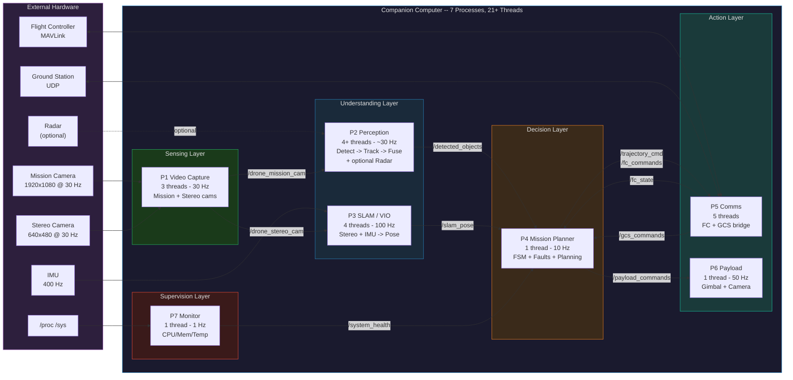

# Drone Companion Computer Software Stack

Multi-process C++17 software stack for an autonomous drone companion computer. 7 independent Linux processes communicate via a **config-driven IPC layer** — **Eclipse Zenoh** zero-copy SHM + network-transparent pub/sub (sole backend since [Issue #126](https://github.com/nmohamaya/companion_software_stack/issues/126)). All algorithms are **written from scratch** — no external ML/CV/SLAM frameworks are used. Hardware is abstracted behind a HAL layer; the default `simulated` backends generate synthetic data so the full stack runs on any Linux box.

**Target hardware:** NVIDIA Jetson Orin (Nano/NX/AGX, aarch64, JetPack 6.x, CUDA 12.x)

---

## Quick Start (5 minutes)

**New to this project?** Start here. For detailed setup, see [docs/guides/GETTING_STARTED.md](docs/guides/GETTING_STARTED.md).

### 1. Clone & Setup

```bash
git clone https://github.com/nmohamaya/companion_software_stack.git
cd companion_software_stack

# Automated setup: install deps -> build -> test -> launch
bash deploy/setup.sh --auto
```

### 2. Or Manual Steps

```bash
# Install dependencies
bash deploy/install_dependencies.sh --all

# Build
bash deploy/build.sh

# Test (expects 927 tests to pass)
bash tests/run_tests.sh

# Launch standalone demo (7 processes, simulated sensors)
bash deploy/launch_all.sh
```

### 3. With Gazebo SITL (Realistic Simulation)

```bash
# Clean build + Gazebo simulation with 3D visualizer
bash deploy/clean_build_and_run.sh --gui
```

Expected: drone takes off, navigates 3 waypoints, returns home.

### Next Steps

- **Deep dive?** Read [Architecture](#architecture) section below
- **First time contributing?** See [DEVELOPMENT_WORKFLOW.md](docs/guides/DEVELOPMENT_WORKFLOW.md)
- **Need details?** Check [docs/guides/GETTING_STARTED.md](docs/guides/GETTING_STARTED.md)
- **Troubleshooting?** Jump to [Troubleshooting](#troubleshooting) section

---

## Safety Disclaimer

**This software controls autonomous flight.** While reasonably tested and documented, **no autonomous software is risk-free.** Users and developers are solely responsible for:

1. **Independent validation** — Test thoroughly in controlled environments before any real flight
2. **Regulatory compliance** — Ensure your use complies with local aviation regulations (FAA Part 107, EASA regulations, etc.)
3. **Risk assessment** — Evaluate risks for your specific drone, environment, and mission profile
4. **Hardware qualification** — Validate sensors, flight controller, and compute platform for your use case
5. **Fail-safe design** — Implement geofencing, RTL mechanisms, and manual override capabilities

**See [LICENSE](LICENSE) for full liability disclaimers.** The authors provide this software *as-is* without warranties.

---

## Documentation Index

| Document | Purpose |
|----------|---------|
| [GETTING_STARTED.md](docs/guides/GETTING_STARTED.md) | Detailed setup and first-run guide |
| [perception_design.md](docs/design/perception_design.md) | P2 perception pipeline: detector backends, ByteTrack tracker, UKF fusion |
| [mission_planner_design.md](docs/design/mission_planner_design.md) | P4 FSM, fault management, D* Lite planner, obstacle avoidance, geofencing |
| [hardening-design.md](docs/design/hardening-design.md) | Three-layer watchdog, Result\<T,E\>, systemd integration, foundation hardening |
| [API.md](docs/design/API.md) | IPC interfaces, Zenoh pub/sub, HAL interfaces, message types |
| [ipc-key-expressions.md](docs/architecture/ipc-key-expressions.md) | Zenoh topic naming convention and complete channel table |
| [process-health-monitoring.md](docs/architecture/process-health-monitoring.md) | Zenoh liveliness tokens for crash detection |
| [CONFIG_GUIDE.md](docs/guides/CONFIG_GUIDE.md) | All 95+ JSON config keys with defaults and descriptions |
| [ROADMAP.md](docs/tracking/ROADMAP.md) | Completed milestones and planned production phases |
| [CPP_PATTERNS_GUIDE.md](docs/guides/CPP_PATTERNS_GUIDE.md) | Project C++17 patterns: Result\<T,E\>, ScopedGuard, thread safety |
| [DEVELOPMENT_WORKFLOW.md](docs/guides/DEVELOPMENT_WORKFLOW.md) | Branching, PRs, CI, review process |
| [BUG_FIXES.md](docs/tracking/BUG_FIXES.md) | Documented bugs fixed (good reference for common pitfalls) |
| [TESTS.md](tests/TESTS.md) | Full test inventory with suites, counts, and run instructions |

---

## Architecture

### System Overview



**Data flows top-down** through five conceptual layers: Sense -> Understand -> Decide -> Act, with lateral supervision. 21+ threads across 7 Linux processes (3 + 4+ + 4 + 1 + 5 + 1 + 1; P2 adds a radar thread when enabled). All inter-process communication uses the `IPublisher<T>` / `ISubscriber<T>` abstraction backed by **Eclipse Zenoh** zero-copy SHM + network transport (sole backend since [Issue #126](https://github.com/nmohamaya/companion_software_stack/issues/126)). Intra-process handoff (P2 only) uses `drone::TripleBuffer` (lock-free latest-value).

**Reliability:** Every worker thread registers a `ThreadHeartbeat` (lock-free `atomic_store`, ~1 ns) — `ThreadWatchdog` detects stuck threads via configurable timeout. In supervised deployments (`--supervised` flag), `ProcessManager` in P7 fork+execs the other processes and handles crash recovery with exponential-backoff restart policies and a dependency graph for cascading restarts. In production, seven independent **systemd** service units (`BindsTo=` stop propagation + `WatchdogSec` on P7) provide OS-level supervision, and P7 runs monitor-only. Sanitizer-clean (ASan/TSan/UBSan). See [hardening-design.md](docs/design/hardening-design.md) for the full three-layer watchdog architecture.

### IPC Channel Map

All channels are abstracted behind `IPublisher<T>` / `ISubscriber<T>`. The sole backend is **Zenoh** (the legacy POSIX SHM backend was removed in Issue #126). Zenoh uses key expressions for topic addressing and provides zero-copy SHM for local transport plus network transport (UDP/TCP) for GCS communication.

```
 P1 --> /drone_mission_cam -------> P2           (Zenoh: drone/video/frame)
 P1 --> /drone_stereo_cam -------> P2, P3        (Zenoh: drone/video/stereo_frame)
 P2 --> /detected_objects -------> P4             (Zenoh: drone/perception/detections)
 P3 --> /slam_pose ---------------> P4, P5, P6    (Zenoh: drone/slam/pose)
 P4 --> /trajectory_cmd ---------> P5            (Zenoh: drone/mission/trajectory)
 P4 --> /mission_status ---------> P5, P7         (Zenoh: drone/mission/status)
 P4 --> /payload_commands -------> P6              (Zenoh: drone/mission/payload_command)
 P5 --> /fc_state ----------------> P4, P7          (Zenoh: drone/comms/fc_state)
 P5 --> /gcs_commands -----------> P4              (Zenoh: drone/comms/gcs_command)
 P6 --> /payload_status ---------> P4, P7          (Zenoh: drone/payload/status)
 P7 --> /system_health ----------> P4              (Zenoh: drone/monitor/health)
```

> For the complete channel table with message types, sizes, and rates, see [ipc-key-expressions.md](docs/architecture/ipc-key-expressions.md).

### Hardware Abstraction Layer (HAL)

All hardware access goes through abstract C++ interfaces. A factory reads the `"backend"` key from config and instantiates the corresponding implementation.

| Interface | Purpose | Simulated Backend | Gazebo/SITL Backend | Planned Real Backend |
|---|---|---|---|---|
| `ICamera` | Frame capture | `SimulatedCamera` — synthetic gradient frames | `GazeboCamera` (gz-transport) | V4L2 / libargus (Jetson) |
| `IDetector` | Object detection | `SimulatedDetector` — random bounding boxes | — | TensorRT YOLOv8 |
| | | `ColorContourDetector` — HSV segmentation + union-find (pure C++) | — | |
| | | `OpenCvYoloDetector` — YOLOv8-nano via OpenCV DNN (`HAS_OPENCV`) | — | |
| `IFCLink` | Flight controller comms | `SimulatedFCLink` — synthetic battery drain, GPS | `MavlinkFCLink` (MAVSDK) | MAVLink 2 via serial UART |
| `IGCSLink` | Ground station comms | `SimulatedGCSLink` — simulated RTL after 120 s | — | UDP / MAVLink GCS protocol |
| `IGimbal` | Gimbal control | `SimulatedGimbal` — rate-limited slew model | — | UART / PWM gimbal protocol |
| `IIMUSource` | Inertial measurement | `SimulatedIMU` — noisy synthetic accel + gyro | `GazeboIMU` (gz-transport) | SPI / I2C IMU driver |
| `IVisualFrontend` | Pose estimation | `SimulatedVisualFrontend` — circular trajectory + noise | `GazeboVisualFrontend` (gz-transport odometry) | ORB-SLAM3 / VINS-Fusion |
| `IPathPlanner` | Path planning | `DStarLitePlanner` — 3D incremental search + obstacle awareness | — | RRT* |
| `IObstacleAvoider` | Obstacle avoidance | `ObstacleAvoider3D` — 3D repulsive field + velocity prediction | — | VFH+ / 3D-VFH |
| `IRadar` | Radar detections | `SimulatedRadar` — config-driven synthetic targets | `GazeboRadarBackend` (gpu_lidar + odometry) | SPI/UART radar driver |
| `IProcessMonitor` | System metrics | `LinuxProcessMonitor` — /proc, /sys | — | — |

> For interface signatures and class hierarchy, see [API.md](docs/design/API.md).

---

## Process Summaries

> **Note:** Core algorithms (tracking, fusion, path planning, obstacle avoidance, gimbal control, system monitoring) are **written from scratch** in C++17. The only external runtime libraries are Eclipse Zenoh (IPC middleware), spdlog (logging), Eigen3 (linear algebra), nlohmann/json (config parsing), and **optionally** OpenCV DNN (for YOLOv8 object detection) and MAVSDK (for PX4 MAVLink communication). The stack always builds and runs with simulated backends — no OpenCV, MAVSDK, or Gazebo required.

### Process 1 — Video Capture (3 threads)

Two capture threads acquire frames from mission camera (1920x1080 RGB, 30 Hz) and stereo camera (640x480 GRAY, 30 Hz), publishing to P2 and P3 respectively. The `SimulatedCamera` generates deterministic gradient patterns; the `GazeboCamera` subscribes to gz-transport image topics for SITL simulation. Real backends would use V4L2 or NVIDIA libargus.

> For camera configuration, frame formats, and backend details, see [video_capture_design.md](docs/design/video_capture_design.md).

### Process 2 — Perception (4+ threads)

A three-stage pipelined vision system: detection (IDetector), tracking (ByteTrack with Kalman filters and Hungarian assignment), and sensor fusion (camera-only monocular depth or camera+radar UKF). Stages are connected by `drone::TripleBuffer` (lock-free latest-value handoff), so consumers always see the most recent result. An optional `radar_read` thread runs when radar is enabled. Three detector backends are available: simulated (random boxes), color contour (HSV segmentation, pure C++), and YOLOv8-nano (OpenCV DNN, optional).

> For full pipeline details including Kalman state vectors, association algorithms, fusion backends, and config keys, see [perception_design.md](docs/design/perception_design.md).

### Process 3 — SLAM/VIO/Nav (4 threads)

Three worker threads plus a main health-check loop. The VIO pipeline extracts features, performs stereo matching, pre-integrates IMU data, and generates a 6-DOF pose published at 100 Hz. The `Pose.quality` field (0=lost to 3=excellent) reflects VIO health state, consumed by P4's FaultManager for safety response. Backends: `SimulatedVisualFrontend` (circular trajectory with noise) and `GazeboVisualFrontend` (ground-truth odometry).

> For VIO pipeline details, pose quality states, and IMU integration, see [slam_vio_nav_design.md](docs/design/slam_vio_nav_design.md).

### Process 4 — Mission Planner (1 thread, 10 Hz)

The autonomous decision-making core: fault evaluation (10+ fault conditions with escalation-only policy) -> FSM tick (IDLE -> PREFLIGHT -> TAKEOFF -> SURVEY -> NAVIGATE -> RTL -> LAND) -> D* Lite path planning with two-layer occupancy grid -> 3D obstacle avoidance with velocity prediction -> FC command dispatch. Includes polygon+altitude geofencing, GCS command handling, HD-map static obstacles, and waypoint advancement with payload triggering.

> For FSM state diagram, fault table, planner algorithms, geofencing details, and all config keys, see [mission_planner_design.md](docs/design/mission_planner_design.md).

### Process 5 — Comms (5 threads)

Five threads bridge the companion computer with the flight controller (fc_rx at 10 Hz, fc_tx at 20 Hz via IFCLink/MAVLink) and ground station (gcs_rx/gcs_tx at 2 Hz via IGCSLink/UDP). Key safety mechanisms include an RTL stale-trajectory guard (permanently blocks trajectory forwarding after RTL/LAND), FC command dedup by sequence ID, and trajectory dedup by timestamp.

> For MAVLink protocol details, thread responsibilities, and safety guards, see [comms_design.md](docs/design/comms_design.md).

### Process 6 — Payload Manager (1 thread, 50 Hz)

Gimbal control using a rate-limited slew algorithm (max 60 deg/s configurable) with pitch limits (-90 to +30 deg) and yaw limits (-180 to +180 deg). Supports gimbal pointing, camera capture, and video start/stop actions. Command dedup by timestamp.

> For gimbal algorithm details, payload actions, and configuration, see [payload_manager_design.md](docs/design/payload_manager_design.md).

### Process 7 — System Monitor (1 thread, 1 Hz)

Collects CPU usage (/proc/stat), memory (/proc/meminfo), CPU temperature (/sys/class/thermal), disk usage, and battery level (from P5). Publishes thermal zone state (0=normal, 2=WARNING, 3=CRITICAL) to P4's FaultManager for safety responses. All alert thresholds are configurable.

> For health monitoring architecture including liveliness tokens, see [process-health-monitoring.md](docs/architecture/process-health-monitoring.md).

---

## Common Libraries

All common libraries live in `common/` and are written from scratch.

- **IPC (`common/ipc/`)** — Zenoh-backed `IPublisher<T>` / `ISubscriber<T>` with zero-copy SHM for local transport and network transport (UDP/TCP/QUIC) for drone-to-GCS communication. Singleton `ZenohSession`, liveliness tokens for crash detection, and `ZenohServiceClient`/`ZenohServiceServer` for request-response patterns. All IPC structs must be trivially copyable.
- **HAL (`common/hal/`)** — Abstract interfaces (ICamera, IDetector, IFCLink, IGCSLink, IGimbal, IIMUSource, IVisualFrontend, IPathPlanner, IObstacleAvoider, IProcessMonitor) with config-driven factory. Simulated, Gazebo, and real backends.
- **Utilities (`common/util/`)** — `Result<T,E>` monadic error type, `Config` (nlohmann/json, dot-path access), `ThreadHeartbeat`/`ThreadWatchdog`, `SignalHandler`, `ScopedTimer`, `SPSCRing<T,N>` (lock-free ring buffer), `LogConfig` (spdlog), `parse_args()` CLI parsing.

> For IPC class hierarchy, interface signatures, and message type reference, see [API.md](docs/design/API.md).
> For the three-layer watchdog architecture, Result\<T,E\> patterns, and systemd integration, see [hardening-design.md](docs/design/hardening-design.md).
> For C++17 patterns used throughout the codebase, see [CPP_PATTERNS_GUIDE.md](docs/guides/CPP_PATTERNS_GUIDE.md).

---

## Prerequisites

**System Requirements:**
- **OS:** Ubuntu 22.04 LTS or 24.04 LTS
- **Architecture:** x86-64 (development) or aarch64 (Jetson Orin)
- **Resources:** 4 GB RAM (minimum), 8+ GB disk space
- **User:** Any user; `sudo` for optional real-time scheduling

**Quick install (recommended):**
```bash
bash deploy/setup.sh --auto        # One command: deps + build + test + launch
```

**Manual install:**
```bash
# Step 1: Install dependencies
bash deploy/install_dependencies.sh --all

# Step 2: Build
bash deploy/build.sh

# Step 3: Test (expected: 927 tests pass)
bash tests/run_tests.sh

# Step 4: Launch
bash deploy/launch_all.sh
```

For detailed setup, see [docs/guides/GETTING_STARTED.md](docs/guides/GETTING_STARTED.md).

## Run

### Quick Start Options

| Command | What it does | Time |
|---|---|---|
| `bash deploy/launch_all.sh` | Run all 7 processes (simulated sensors, fastest) | <1 sec startup |
| `bash deploy/launch_gazebo.sh --gui` | Run with Gazebo 3D simulator + PX4 SITL (realistic) | ~3-5 sec startup |
| `bash deploy/clean_build_and_run.sh --gui` | Clean build + test + Gazebo (first run only) | ~5-10 min total |

### Standalone Demo (Recommended First Run)

Launches all 7 processes with **simulated sensors** (no external dependencies):

```bash
bash deploy/launch_all.sh
```

Expected output:
```
[2026-03-30 14:22:15] [video_capture] [info] Starting mission camera thread...
[2026-03-30 14:22:15] [perception] [info] Detection thread initialized
[2026-03-30 14:22:15] [slam_vio_nav] [info] Pose estimator ready
...
```

Press `Ctrl+C` to stop gracefully. Logs saved to `drone_logs/`.

### With Gazebo SITL (Realistic Simulation)

Full physics simulation with flight controller and 3D visualizer:

```bash
bash deploy/clean_build_and_run.sh --gui    # First run (builds + tests + launches)
# OR
bash deploy/launch_gazebo.sh --gui          # Subsequent runs (if already built)
```

Expected: drone arms, takes off, navigates 3 waypoints, avoids obstacles, returns home.

### Deploy scripts reference

| Script | Purpose |
|---|---|
| `deploy/setup.sh --auto` | **One-line setup:** install deps -> build -> test -> launch |
| `deploy/clean_build_and_run.sh [--gui]` | Clean build + Gazebo SITL (first run) |
| `deploy/build.sh [--clean]` | Build only (no launch) |
| `deploy/launch_all.sh` | Run 7 processes (no Gazebo) |
| `deploy/launch_gazebo.sh [--gui]` | Run with Gazebo SITL |
| `deploy/install_dependencies.sh [--all]` | Install dependencies |

### Verify Your Build is Correct

After building, always verify:

```bash
# Check test count (should be 927)
ctest -N --test-dir build | grep "Total Tests:"

# Run all tests (should all pass)
bash tests/run_tests.sh

# Check for compiler warnings (should be zero)
# The build uses -Werror -Wall -Wextra, so if it compiled without errors, there are no warnings.
```

**Does it all pass?** You're good to go. Launch:
```bash
bash deploy/launch_all.sh              # Standalone
# OR
bash deploy/launch_gazebo.sh --gui     # With Gazebo
```

**Test count wrong?** (e.g., 922 instead of 927)
```bash
# Clean rebuild -- stale CMake cache from different build types
bash deploy/build.sh --clean
ctest -N --test-dir build | grep "Total Tests:"  # Check again
```

### Launch on real hardware

```bash
# Validate config and FC connection without starting (dry run):
bash deploy/launch_hardware.sh --dry-run

# Launch with default hardware config (config/hardware.json -- Zenoh backend):
bash deploy/launch_hardware.sh

# Launch with a custom config:
bash deploy/launch_hardware.sh --config config/my_drone.json
```

The hardware launcher auto-detects Pixhawk serial devices, validates the config,
checks disk/memory/temperature, and monitors process health during flight.

### Run individual processes

Start processes in dependency order — upstream producers first, then consumers:

```bash
# 1. No dependencies -- start first
./build/bin/system_monitor &
./build/bin/video_capture &
./build/bin/comms &

# 2. Depends on video_capture IPC
./build/bin/perception &
./build/bin/slam_vio_nav &

# 3. Depends on slam_vio_nav + perception + comms IPC
./build/bin/mission_planner &

# 4. Depends on mission_planner IPC
./build/bin/payload_manager &
```

### Command-line options

All processes accept:
```
--config <file>       Config file (default: config/default.json)
--log-level <level>   Set log level: trace/debug/info/warn/error (default: info)
--sim                 Simulation mode (default -- all hardware is simulated)
--help                Show help
```

Example:
```bash
sudo ./deploy/launch_all.sh --log-level debug
```

### Logs

Logs are written to `drone_logs/` (inside the project root) with automatic rotation (5 MB per file, 3 rotated files). Console output uses colored spdlog formatting.

### Scenario Run Reports

Scenario integration tests (`run_scenario_gazebo.sh`) produce **persistent timestamped run directories** under `drone_logs/scenarios_gazebo/<scenario_name>/`. Each run creates a unique directory (e.g., `2026-03-30_102030_PASS/`) that is never automatically deleted. Each directory contains:

- `mission_planner.log` / `perception.log` / `combined.log` — process logs
- `merged_config.json` — the config used for the run
- `run_metadata.json` — machine-readable metadata (git commit, result, duration)
- `run_report.txt` — human-readable report with automated observations

A `latest` symlink always points to the most recent run. An append-only `runs.jsonl` index tracks all runs for history queries. Manual cleanup is available via `tests/cleanup_old_runs.sh --days 30`.

## Troubleshooting

### `GLIBCXX_3.4.30 not found` (Anaconda conflict)

**Symptom:**
```
./build/bin/video_capture: .../anaconda3/lib/libstdc++.so.6: version `GLIBCXX_3.4.30' not found
```

**Cause:** Anaconda ships an older `libstdc++.so.6` and its `LD_LIBRARY_PATH` takes precedence over the system library.

**Fix:** The launch script already handles this automatically by prepending the system library path. If running individual binaries manually, prefix the command:
```bash
LD_LIBRARY_PATH="/usr/lib/x86_64-linux-gnu:$LD_LIBRARY_PATH" ./build/bin/video_capture
```

Or deactivate Anaconda before running:
```bash
conda deactivate
./deploy/launch_all.sh
```

### `Failed to create SHM` errors

**Symptom:**
```
[video_capture] [error] Failed to create SHM: /drone_mission_cam
```

**Cause:** Stale shared memory segments from a previous run (possibly owned by a different user or with incompatible permissions).

**Fix:** Remove leftover segments:
```bash
sudo rm -f /dev/shm/drone_* /dev/shm/detected_objects /dev/shm/slam_pose \
           /dev/shm/mission_status /dev/shm/trajectory_cmd /dev/shm/payload_commands \
           /dev/shm/fc_state /dev/shm/gcs_commands /dev/shm/payload_status \
           /dev/shm/system_health
```

The launch script does this automatically on every start. If you switch between running as root and as a normal user, you may need to clean them manually since root-owned segments can't be overwritten by a normal user.

> **Note:** When using the Zenoh backend (`ipc_backend: "zenoh"`), SHM segment cleanup is handled automatically by Zenoh — no manual `/dev/shm` cleanup is needed, and process crash scenarios are handled via liveliness tokens.

### Thread affinity / RT scheduling warnings

**Symptom:**
```
[warn] setaffinity(0) failed: 22
[warn] setschedparam(1,50) failed: 1
```

**Cause:** Thread pinning (`pthread_setaffinity_np`) and real-time scheduling (`SCHED_FIFO`) require elevated privileges.

**Fix:** Run as root:
```bash
sudo ./deploy/launch_all.sh
```

These warnings are **harmless** — the stack runs correctly without RT scheduling, just without hard real-time guarantees. On a production Jetson, the systemd services would run with `CAP_SYS_NICE` capability.

### Processes exit immediately

**Cause:** A process can't connect to an upstream SHM segment (e.g., `mission_planner` starts before `slam_vio_nav` has created its SHM).

**Fix:** Use the launch script which starts processes in the correct order with 500ms delays. If running manually, ensure producers are started before consumers (see dependency order above).

## Project Structure

```
.
├── CMakeLists.txt                    # Super-build
├── config/
│   ├── default.json                  # All tunables (simulated backends)
│   └── gazebo_sitl.json              # Gazebo SITL config (mavlink FC, gazebo cameras)
├── common/
│   ├── ipc/                          # Shared memory IPC library
│   │   └── include/ipc/
│   │       ├── shm_writer.h          # SeqLock writer template
│   │       ├── shm_reader.h          # SeqLock reader template
│   │       └── shm_types.h           # All IPC data structures (12 SHM segment types)
│   ├── hal/                          # Hardware Abstraction Layer
│   │   └── include/hal/
│   │       ├── icamera.h             # Camera interface
│   │       ├── ifc_link.h            # Flight controller interface
│   │       ├── igcs_link.h           # Ground station interface
│   │       ├── igimbal.h             # Gimbal interface
│   │       ├── iimu_source.h         # IMU interface
│   │       ├── hal_factory.h         # Config-driven factory
│   │       ├── simulated_camera.h    # Synthetic gradient frames
│   │       ├── simulated_fc_link.h   # Simulated MAVLink (thread-safe)
│   │       ├── simulated_gcs_link.h  # Simulated GCS UDP (thread-safe)
│   │       ├── simulated_gimbal.h    # Rate-limited slew model
│   │       ├── simulated_imu.h       # Noisy synthetic IMU data
│   │       ├── gazebo_camera.h       # Gazebo gz-transport camera (HAVE_GAZEBO)
│   │       ├── gazebo_imu.h          # Gazebo gz-transport IMU (HAVE_GAZEBO)
│   │       └── mavlink_fc_link.h     # MAVSDK MAVLink FC link (HAVE_MAVSDK)
│   └── util/                         # Utility library
│       └── include/util/
│           ├── signal_handler.h      # Graceful SIGINT/SIGTERM
│           ├── arg_parser.h          # CLI argument parsing
│           ├── config.h              # JSON config (nlohmann/json) + [[nodiscard]]
│           ├── config_validator.h    # Config schema validation (7 process schemas)
│           ├── result.h              # Result<T,E> monadic error type
│           ├── log_config.h          # spdlog config + resolve_log_dir()
│           ├── realtime.h            # Thread naming/affinity/RT
│           ├── scoped_timer.h        # RAII timing + budget warnings
│           └── spsc_ring.h           # Lock-free SPSC ring buffer
├── process1_video_capture/           # Mission + stereo camera capture (3 threads)
├── process2_perception/              # Detection -> tracking -> fusion pipeline (6 threads)
│   ├── include/perception/
│   │   ├── detector_interface.h      # IDetector strategy interface
│   │   ├── color_contour_detector.h  # Pure C++ HSV contour detector (no OpenCV)
│   │   ├── opencv_yolo_detector.h    # YOLOv8 via OpenCV DNN (HAS_OPENCV)
│   │   ├── types.h                   # Detection/tracking types + ObjectClass enum
│   │   ├── fusion_engine.h           # Multi-sensor fusion
│   │   └── kalman_tracker.h          # Linear Kalman filter tracker
│   └── src/
│       ├── main.cpp                  # 6-thread pipeline orchestration
│       ├── detector_factory.cpp      # create_detector() -- backend selection
│       ├── simulated_detector.cpp    # Random bounding box generator
│       ├── opencv_yolo_detector.cpp  # YOLOv8n ONNX inference + NMS
│       ├── kalman_tracker.cpp        # SORT-style tracker + greedy association
│       └── fusion_engine.cpp         # Camera-only fusion
├── process3_slam_vio_nav/            # VIO/pose estimation (4 threads)
│   └── include/slam/
│       ├── ivisual_frontend.h        # IVisualFrontend strategy interface
│       └── types.h                   # Pose, ImuSample, KeyframePolicy
├── process4_mission_planner/         # FSM + fault manager + D* Lite planner (1 thread)
│   └── include/planner/
│       ├── mission_fsm.h             # 8-state finite state machine
│       ├── fault_manager.h           # FaultManager -- graceful degradation engine (#61)
│       ├── ipath_planner.h           # IPathPlanner interface
│       └── iobstacle_avoider.h       # IObstacleAvoider interface
├── process5_comms/                   # MAVLink + GCS comms (5 threads)
│   └── include/comms/
│       ├── gcs_link.h                # GCS link implementation
│       └── mavlink_sim.h             # MAVLink simulation helpers
├── process6_payload_manager/         # Gimbal control + camera trigger (1 thread)
├── process7_system_monitor/          # /proc + /sys health monitoring (1 thread)
│   └── include/monitor/
│       ├── iprocess_monitor.h        # IProcessMonitor + LinuxProcessMonitor
│       └── sys_info.h                # CPU, memory, temperature utilities
├── tests/                            # Unit & E2E tests -- see tests/TESTS.md for full catalog
│   └── TESTS.md                      # Test inventory (suites, counts, run instructions)
├── models/
│   └── yolov8n.onnx                 # YOLOv8-nano ONNX model (12.8 MB)
└── deploy/
    ├── build.sh                      # Build (Release/Debug, --clean, --test)
    ├── clean_build_and_run.sh        # Clean build + Gazebo SITL
    ├── install_dependencies.sh       # Full dependency installer (interactive)
    ├── launch_all.sh                 # Launch 7 processes (no PX4/Gazebo)
    ├── launch_gazebo.sh              # PX4 SITL + Gazebo + 7 processes
    ├── launch_hardware.sh            # Real drone hardware launch
    └── view_coverage.sh              # Build with coverage, run tests, open HTML report
```

## Simulation Mode

All hardware dependencies (V4L2 cameras, TensorRT, CUDA, GTSAM, MAVLink serial, etc.) are replaced with **simulated HAL backends** that generate synthetic data. This allows the full stack to compile and run on any Linux system with only spdlog, Eigen3, nlohmann/json, and GTest installed. Optional backends (OpenCV DNN, MAVSDK, Gazebo gz-transport) are auto-detected by CMake via compile guards (`HAS_OPENCV`, `HAVE_MAVSDK`, `HAVE_GAZEBO`).

To switch a component to real hardware, change `"backend": "simulated"` to the real backend name in [config/default.json](config/default.json) and implement the corresponding HAL interface.

## Dependencies

All dependencies are standard Ubuntu packages — no custom builds required for the base stack. Optional dependencies enable Gazebo simulation and YOLOv8 detection.

| Library | Version | Purpose | Install | Required |
|---|---|---|---|---|
| CMake | >= 3.16 | Build system | `apt install cmake` | Yes |
| spdlog | >= 1.12 | Logging (console + file) | `apt install libspdlog-dev` | Yes |
| Eigen3 | >= 3.4 | Linear algebra (Kalman, poses) | `apt install libeigen3-dev` | Yes |
| nlohmann/json | >= 3.11 | JSON config parsing | `apt install nlohmann-json3-dev` | Yes |
| Google Test | >= 1.14 | Unit testing | `apt install libgtest-dev` | Yes |
| GCC | >= 11 | C++17 compiler | `apt install build-essential` | Yes |
| zenohc | >= 1.0 | Zenoh IPC backend (`ZenohMessageBus`) | [Pre-built `.deb`](https://github.com/eclipse-zenoh/zenoh-c/releases) or `deploy/install_dependencies.sh` | Yes (configure via `ALLOW_INSECURE_ZENOH` or `ZENOH_CONFIG_PATH`) |
| zenoh-cpp | >= 1.0 | Header-only C++17 Zenoh bindings | [zenoh-cpp](https://github.com/eclipse-zenoh/zenoh-cpp) or `deploy/install_dependencies.sh` | Yes (required with zenohc) |
| OpenCV | >= 4.6 | YOLOv8 DNN inference (`OpenCvYoloDetector`) | Build from source or `apt install libopencv-dev` | Optional (`HAS_OPENCV`) |
| MAVSDK | >= 2.12 | MAVLink FC link (`MavlinkFCLink`) | Build from source (see docs) | Optional (`HAVE_MAVSDK`) |
| Gazebo Harmonic | -- | Camera/IMU/odometry simulation backends | `apt install gz-harmonic` | Optional (`HAVE_GAZEBO`) |

### Licensing Notes

**YOLOv8 AGPL 3.0 (Important for Deployment)**

The optional YOLOv8n model (`models/yolov8n.onnx`, downloaded on demand) is licensed under **AGPL 3.0** by Ultralytics.

**AGPL 3.0 requires source code disclosure to end-users if you distribute or deploy the software.**

**If using YOLOv8 in production, choose one:**
1. **Obtain a [commercial Ultralytics license](https://ultralytics.com/license)** (recommended for commercial deployment)
2. **Use `ColorContourDetector` instead** — project-original HSV-based detector, no license constraint
3. **Replace with a permissively-licensed model** (e.g., YOLO-World, custom model trained on your data)

During development with simulated backends, YOLOv8 is optional and the license constraint does not apply.

**Zenoh EPL 2.0**

Zenoh is licensed under **EPL 2.0** (Eclipse Public License 2.0), which is permissive but copyleft-lite. Since this stack only *links* Zenoh without modifying it, EPL 2.0 compliance is straightforward. If you modify Zenoh itself, you must disclose those changes under EPL 2.0.

For full license details, see [ACKNOWLEDGMENTS.md](ACKNOWLEDGMENTS.md).

## Development Workflow

See [DEVELOPMENT_WORKFLOW.md](docs/guides/DEVELOPMENT_WORKFLOW.md) for the full development workflow including:

- Branching & PR process (Steps 1-9)
- Bug fix workflow
- Documentation update requirements (`docs/tracking/PROGRESS.md` / `docs/tracking/ROADMAP.md`)
- Multi-phase feature development
- Pre-merge checklist
- Quick reference commands

**CI Pipeline:** GitHub Actions pipeline — format gate (clang-format-18) -> sanitizer build matrix (ASan/TSan/UBSan, Zenoh-enabled) -> coverage report (lcov). See [tests/TESTS.md](tests/TESTS.md) for current test counts and [docs/guides/CI_SETUP.md](docs/guides/CI_SETUP.md) for the full DevOps guide.
