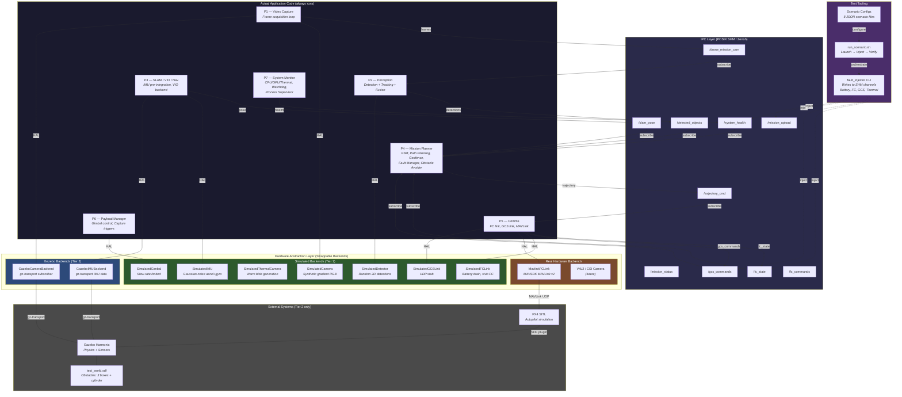
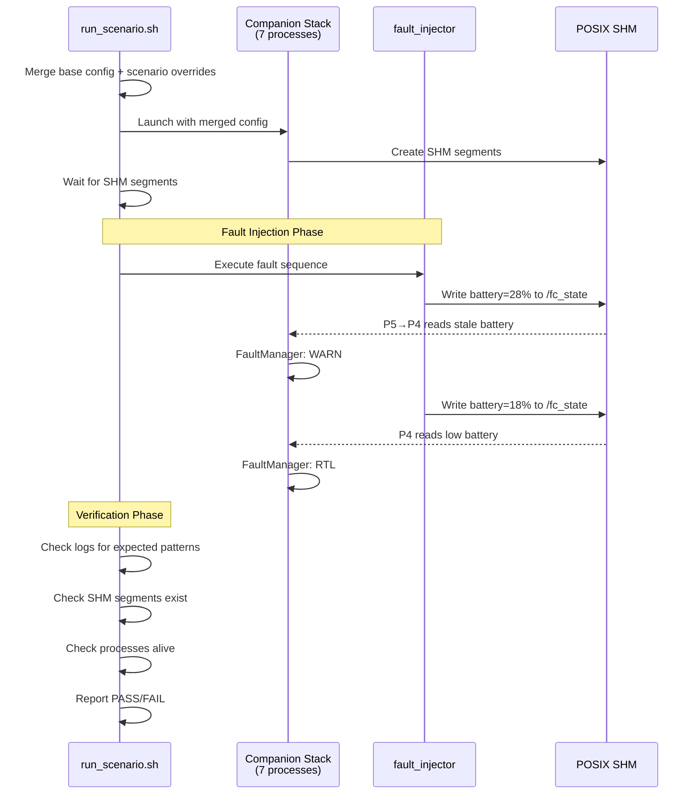

# Simulation Architecture

## Overview

The companion software stack supports **two-tier** testing — from lightweight
pure-simulated runs (Tier 1) to full Gazebo SITL flights (Tier 2). Every
hardware-touching component sits behind a **Hardware Abstraction Layer (HAL)**
interface. Swapping a single `"backend"` key in the JSON config switches
between simulated, Gazebo, or real-hardware implementations at link time.

---

## Architecture Diagram — Simulated vs Actual Code



---

## Two-Tier Testing Model

| | **Tier 1 — Pure Simulated** | **Tier 2 — Gazebo SITL** |
|---|---|---|
| **Hardware** | None required | GPU recommended |
| **External deps** | None | PX4-Autopilot, Gazebo Harmonic |
| **Camera** | `SimulatedCamera` (gradient) | `GazeboCameraBackend` (rendered) |
| **IMU** | `SimulatedIMU` (noise model) | `GazeboIMUBackend` (physics) |
| **FC Link** | `SimulatedFCLink` (stub) | `MavlinkFCLink` (MAVSDK) |
| **Detector** | `SimulatedDetector` (random) | `SimulatedDetector` or YOLO |
| **Physics** | None (open-loop) | Gazebo (closed-loop) |
| **Speed** | Fast (seconds) | Slow (minutes) |
| **Use case** | Unit/regression, CI, fault injection | Waypoint validation, obstacle avoidance |

### When to Use Each Tier

- **Tier 1**: Run on every commit in CI. Fast, deterministic, no external
  dependencies. Validates fault handling, FSM transitions, IPC flow, and
  config parsing. Use the `fault_injector` to simulate faults.

- **Tier 2**: Run before releases or when validating navigation. Requires
  PX4 + Gazebo installed. Validates closed-loop waypoint following, obstacle
  avoidance with real simulated sensor data, and MAVLink integration.

---

## Component Classification

### Always-Actual Code (never simulated)

These run identically in sim and on hardware:

| Component | Process | Description |
|---|---|---|
| Mission FSM | P4 | State machine: IDLE → PREFLIGHT → TAKEOFF → EXECUTING → RTL → LANDING → COMPLETE |
| FaultManager | P4 | 3-tier battery, FC link loss, geofence breach detection |
| Geofence | P4 | Point-in-polygon + altitude checks with warning margin |
| A* Path Planner | P4 | 3D occupancy grid, A* search, path smoothing |
| ObstacleAvoider3D | P4 | Velocity-space potential field with prediction |
| Kalman Tracker | P2 | Multi-object tracking with Hungarian assignment |
| Fusion Engine | P2 | UKF sensor fusion (LiDAR + camera + radar) |
| VIO Backend | P3 | Visual-inertial odometry with sliding window |
| IMU Pre-integrator | P3 | IMU measurement integration between keyframes |
| Watchdog | P7 | Thread heartbeat monitoring, process management |
| IPC Layer | All | SHM SeqLock pub/sub or Zenoh transport |

### HAL-Swappable Backends

| Interface | Simulated | Gazebo | Hardware |
|---|---|---|---|
| `ICamera` | `SimulatedCamera` | `GazeboCameraBackend` | V4L2/CSI (future) |
| `IIMUSource` | `SimulatedIMU` | `GazeboIMUBackend` | Serial IMU (future) |
| `IFCLink` | `SimulatedFCLink` | — | `MavlinkFCLink` |
| `IGCSLink` | `SimulatedGCSLink` | — | UDP GCS (future) |
| `IGimbal` | `SimulatedGimbal` | — | Serial gimbal (future) |
| `IDetector` | `SimulatedDetector` | — | `OpenCVYOLODetector` |

---

## Simulation Setup

### Prerequisites

**Tier 1 (pure-simulated) — no extra dependencies:**
```bash
# Standard build dependencies only
sudo apt install build-essential cmake libspdlog-dev libeigen3-dev nlohmann-json3-dev
```

**Tier 2 (Gazebo SITL):**
```bash
# PX4 Autopilot
git clone https://github.com/PX4/PX4-Autopilot.git --recursive
cd PX4-Autopilot && make px4_sitl_default

# Gazebo Harmonic
sudo apt install gz-harmonic

# MAVSDK
sudo apt install libmavsdk-dev  # or build from source
```

### Build

```bash
# Tier 1 build (default — all simulated)
mkdir -p build && cd build
cmake -DCMAKE_BUILD_TYPE=Release ..
make -j$(nproc)

# Tier 2 build (with Gazebo + MAVSDK)
cmake -DCMAKE_BUILD_TYPE=Release \
      -DENABLE_GAZEBO=ON \
      -DENABLE_MAVSDK=ON ..
make -j$(nproc)
```

### Configuration

Backend selection is **config-driven**. All backends read from a single JSON:

```json
{
    "video_capture": {
        "mission_cam": {
            "backend": "simulated"    // or "gazebo"
        }
    },
    "comms": {
        "mavlink": {
            "backend": "simulated"    // or "mavlink"
        }
    },
    "mission_planner": {
        "path_planner":      { "backend": "potential_field" },  // or "astar"
        "obstacle_avoider":  { "backend": "potential_field" },  // or "potential_field_3d"
        "geofence": {
            "polygon": [
                {"x": -50, "y": -50},
                {"x":  50, "y": -50},
                {"x":  50, "y":  50},
                {"x": -50, "y":  50}
            ],
            "altitude_ceiling_m": 120.0,
            "warning_margin_m": 5.0
        }
    },
    "fault_manager": {
        "battery_warn_percent": 30.0,
        "battery_rtl_percent": 20.0,
        "battery_crit_percent": 10.0,
        "fc_link_lost_timeout_ms": 3000,
        "fc_link_rtl_timeout_ms": 15000
    }
}
```

Config files in `config/`:
| File | Description |
|---|---|
| `default.json` | All simulated backends (Tier 1) |
| `gazebo.json` | Gazebo cameras, simulated FC |
| `gazebo_sitl.json` | Gazebo cameras + MAVLink FC (Tier 2) |
| `hardware.json` | Real hardware backends |

---

## How to Run Simulations

### Tier 1 — Pure Simulated (No Gazebo)

**Option A: Direct launch with default config**
```bash
./deploy/launch_all.sh --config config/default.json
```

**Option B: Run a specific scenario**
```bash
# List available scenarios
./tests/run_scenario.sh --list

# Run a single scenario
./tests/run_scenario.sh config/scenarios/01_nominal_mission.json

# Dry-run (show plan without executing)
./tests/run_scenario.sh config/scenarios/03_battery_degradation.json --dry-run

# Run all Tier 1 scenarios
./tests/run_scenario.sh --all --tier 1
```

**Option C: Manual fault injection (while stack is running)**
```bash
# In terminal 1: launch stack
./deploy/launch_all.sh --config config/default.json

# In terminal 2: inject faults manually
./build/bin/fault_injector battery 25          # trigger battery WARN
./build/bin/fault_injector battery 15          # trigger battery RTL
./build/bin/fault_injector fc_disconnect       # simulate FC link loss
./build/bin/fault_injector gcs_command rtl     # send RTL via GCS
./build/bin/fault_injector thermal_zone 3      # critical thermal
./build/bin/fault_injector mission_upload config/scenarios/data/upload_waypoints.json
```

### Tier 2 — Gazebo SITL

```bash
# Terminal 1: Launch PX4 + Gazebo + companion stack
PX4_DIR=~/PX4-Autopilot ./deploy/launch_gazebo.sh

# Terminal 2 (optional): Inject faults
./build/bin/fault_injector battery 18

# Or run the integration test
./tests/test_gazebo_integration.sh
```

---

## Fault Injection Tool

The `fault_injector` CLI writes directly to POSIX SHM IPC channels,
simulating the producing process. This lets you test fault handling
without modifying any application code.

### Available Commands

| Command | SHM Channel | Description |
|---|---|---|
| `battery <percent>` | `/fc_state` | Override FC battery level |
| `fc_disconnect` | `/fc_state` | Set FC to disconnected (stale timestamp) |
| `fc_reconnect` | `/fc_state` | Restore FC connection |
| `gcs_command <cmd> [p1 p2 p3]` | `/gcs_commands` | Inject GCS command |
| `thermal_zone <0-3>` | `/system_health` | Override thermal zone |
| `mission_upload <json>` | `/mission_upload` + `/gcs_commands` | Upload new waypoints |
| `sequence <json>` | Various | Execute timed fault sequence |

### Timed Sequence Format

```json
{
    "steps": [
        {"delay_s": 10, "action": "battery", "value": 28.0},
        {"delay_s": 5,  "action": "fc_disconnect"},
        {"delay_s": 20, "action": "fc_reconnect"},
        {"delay_s": 2,  "action": "gcs_command", "command": "rtl"}
    ]
}
```

---

## Test Scenarios

Eight pre-defined scenarios in `config/scenarios/`:

| # | Scenario | Tier | Gazebo | What it Tests |
|---|---|---|---|---|
| 01 | Nominal Mission | 1 | No | Basic 4-waypoint flight, landing |
| 02 | Obstacle Avoidance | 2 | Yes | A* planner through obstacle field |
| 03 | Battery Degradation | 1 | No | 3-tier: WARN → RTL → EMERGENCY_LAND |
| 04 | FC Link Loss | 1 | No | LOITER → RTL contingency |
| 05 | Geofence Breach | 1 | No | Polygon violation → RTL |
| 06 | Mission Upload | 1 | No | Mid-flight waypoint upload via GCS |
| 07 | Thermal Throttle | 1 | No | Zone escalation (0→1→2→3→0) |
| 08 | Full Stack Stress | 1 | No | Concurrent faults, high rates |

### Scenario JSON Structure

Each scenario file contains:

```json
{
    "scenario": {
        "name": "...",
        "description": "...",
        "tier": 1,
        "timeout_s": 120,
        "requires_gazebo": false
    },
    "config_overrides": { },
    "fault_sequence": {
        "steps": [ ]
    },
    "pass_criteria": {
        "log_contains": ["..."],
        "log_must_not_contain": ["..."],
        "processes_alive": ["..."],
        "shm_segments_exist": ["..."]
    },
    "manual_controls": {
        "notes": "What parameters can be adjusted"
    }
}
```

### Manual Controls

Every scenario includes a `manual_controls` section that documents
which parameters can be adjusted for manual testing:

- **Waypoints**: Edit `config_overrides.mission_planner.waypoints`
- **Speed**: Modify `cruise_speed_mps` within the documented range
- **Thresholds**: Adjust `fault_manager.*_percent` values
- **Fault timing**: Change `delay_s` in `fault_sequence.steps`
- **Geofence polygon**: Modify vertices in `geofence.polygon`
- **Backend selection**: Switch `path_planner.backend` between
  `"potential_field"` and `"astar"`

---

## Data Flow Diagram



---

## File Layout

```
companion_software_stack/
├── config/
│   ├── default.json                  # Tier 1 config (all simulated)
│   ├── gazebo_sitl.json              # Tier 2 config (Gazebo + MAVLink)
│   └── scenarios/
│       ├── 01_nominal_mission.json
│       ├── 02_obstacle_avoidance.json
│       ├── 03_battery_degradation.json
│       ├── 04_fc_link_loss.json
│       ├── 05_geofence_breach.json
│       ├── 06_mission_upload.json
│       ├── 07_thermal_throttle.json
│       ├── 08_full_stack_stress.json
│       └── data/
│           └── upload_waypoints.json
├── common/hal/include/hal/
│   ├── icamera.h                     # HAL interface
│   ├── simulated_camera.h            # Tier 1 backend
│   ├── gazebo_camera.h               # Tier 2 backend
│   └── hal_factory.h                 # Config-driven factory
├── tools/
│   └── fault_injector/
│       ├── CMakeLists.txt
│       └── main.cpp                  # Fault injection CLI
├── tests/
│   ├── run_scenario.sh               # Scenario runner
│   └── test_gazebo_integration.sh    # Gazebo smoke test
└── docs/
    └── SIMULATION_ARCHITECTURE.md    # This file
```
