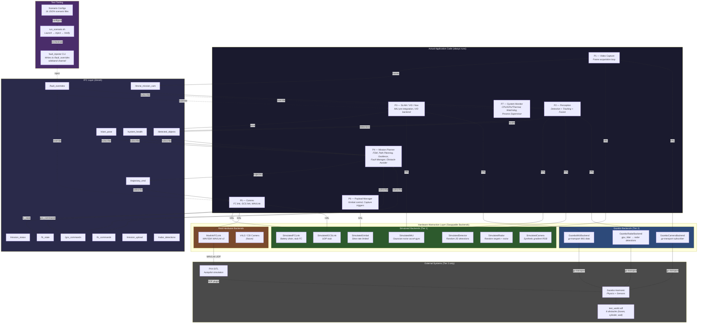
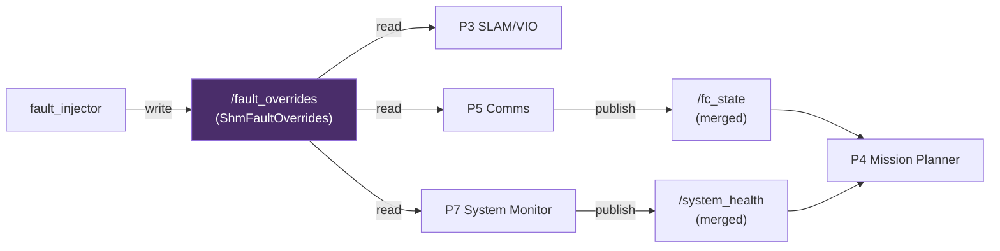
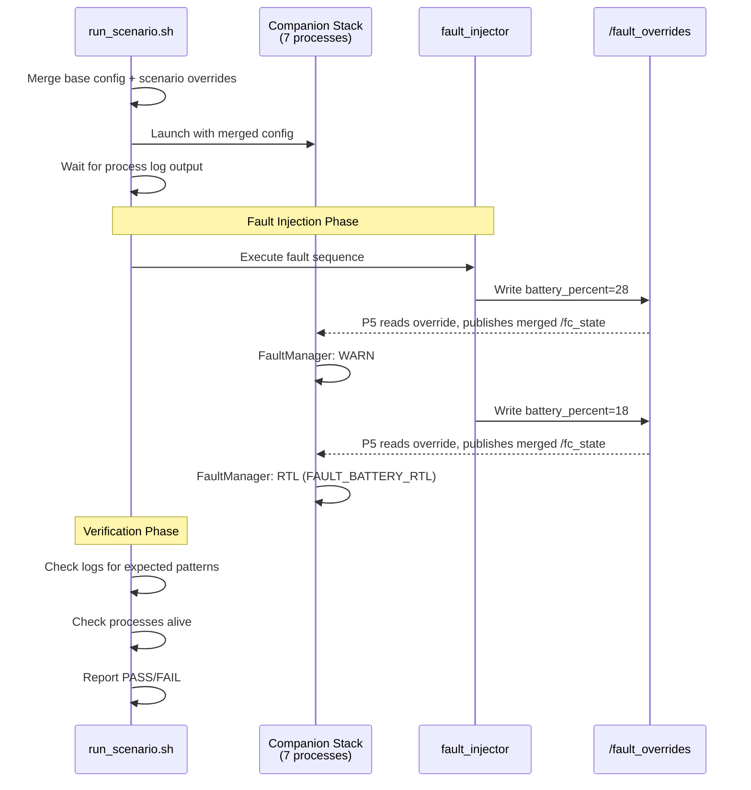

# Simulation Architecture

## Overview

The companion software stack supports **two-tier** testing — from lightweight
pure-simulated runs (Tier 1) to full Gazebo SITL flights (Tier 2). Every
hardware-touching component sits behind a **Hardware Abstraction Layer (HAL)**
interface. Swapping a single `"backend"` key in the JSON config switches
between simulated, Gazebo, or real-hardware implementations at link time.

---

## Architecture Diagram — Simulated vs Actual Code



---

## Two-Tier Testing Model

| | **Tier 1 — Pure Simulated** | **Tier 2 — Gazebo SITL** |
|---|---|---|
| **Hardware** | None required | GPU recommended |
| **External deps** | None | PX4-Autopilot, Gazebo Harmonic |
| **Camera** | `SimulatedCamera` (gradient) | `GazeboCameraBackend` (rendered) |
| **IMU** | `SimulatedIMU` (noise model) | `GazeboIMUBackend` (physics) |
| **FC Link** | `SimulatedFCLink` (stub) | `MavlinkFCLink` (MAVSDK) |
| **Radar** | `SimulatedRadar` (random targets) | `GazeboRadarBackend` (gpu_lidar + Doppler) |
| **Detector** | `SimulatedDetector` (random) | `SimulatedDetector` or YOLO |
| **Physics** | None (open-loop) | Gazebo (closed-loop) |
| **Speed** | Fast (seconds) | Slow (minutes) |
| **Use case** | Unit/regression, CI, fault injection | Waypoint validation, obstacle avoidance |

### When to Use Each Tier

- **Tier 1**: Run on every commit in CI. Fast, deterministic, no external
  dependencies. Validates fault handling, FSM transitions, IPC flow, and
  config parsing. Use the `fault_injector` to simulate faults.

- **Tier 2**: Run before releases or when validating navigation. Requires
  PX4 + Gazebo installed. Validates closed-loop waypoint following, obstacle
  avoidance with real simulated sensor data, and MAVLink integration.

---

## Component Classification

### Always-Actual Code (never simulated)

These run identically in sim and on hardware:

| Component | Process | Description |
|---|---|---|
| Mission FSM | P4 | State machine: IDLE → PREFLIGHT → TAKEOFF → EXECUTING → RTL → LANDING → COMPLETE |
| FaultManager | P4 | Battery 3-tier (WARN/RTL/CRIT), FC link loss, geofence breach, VIO quality degradation (debounced), thermal |
| Geofence | P4 | Point-in-polygon + altitude checks with warning margin |
| D* Lite Path Planner | P4 | 3D occupancy grid, incremental D* Lite search, path smoothing |
| ObstacleAvoider3D | P4 | Velocity-space potential field with prediction |
| Kalman Tracker | P2 | Multi-object tracking with Hungarian assignment |
| Fusion Engine | P2 | Camera + radar UKF sensor fusion |
| VIO Backend | P3 | Visual-inertial odometry with sliding window (sim uses `steady_clock` timestamps) |
| IMU Pre-integrator | P3 | IMU measurement integration between keyframes |
| Watchdog | P7 | Thread heartbeat monitoring, process management |
| IPC Layer | All | Zenoh pub/sub transport |

### HAL-Swappable Backends

| Interface | Simulated | Gazebo | Hardware |
|---|---|---|---|
| `ICamera` | `SimulatedCamera` | `GazeboCameraBackend` | V4L2/CSI (future) |
| `IIMUSource` | `SimulatedIMU` | `GazeboIMUBackend` | Serial IMU (future) |
| `IFCLink` | `SimulatedFCLink` | — | `MavlinkFCLink` |
| `IGCSLink` | `SimulatedGCSLink` | — | UDP GCS (future) |
| `IGimbal` | `SimulatedGimbal` | — | Serial gimbal (future) |
| `IRadar` | `SimulatedRadar` | `GazeboRadarBackend` | TI AWR1843 (future) |
| `IDetector` | `SimulatedDetector` | — | `OpenCVYOLODetector` |

---

## Gazebo Radar Backend — Design Deep Dive

Gazebo (Garden/Harmonic) has **no native radar sensor type**. There is also no mature
open-source radar plugin for gz-sim — CARLA and LGSVL have radar sensors, but those
are entirely different simulators (Unreal-based). The Gazebo community's established
workaround is to repurpose `gpu_lidar` as a geometric backbone and post-process
returns into radar-like data.

### Why HAL-Backend-Subscribes-to-gz-Transport (Not a Custom Plugin)

Our codebase already follows this pattern for camera and IMU: `GazeboCameraBackend`
and `GazeboIMUBackend` subscribe to gz-transport topics published by Gazebo's built-in
sensors — no custom `.so` plugin, no SDF `<plugin>` XML, no Gazebo API coupling.

| Concern | Custom Gazebo Plugin | HAL Backend (our approach) |
| --- | --- | --- |
| Build coupling | Must compile `.so` against Gazebo internal API; breaks on version bumps | Only depends on gz-transport message types (stable across versions) |
| Plugin loading | Requires SDF plugin XML, GZ_SIM_SYSTEM_PLUGIN_PATH, .so deployment | No plugin loading — just a gz-transport subscriber |
| Domain logic | Inside Gazebo server process | In our codebase, under our control and review |
| Testability | Need Gazebo running to test any logic | Can unit-test conversion logic with mock messages |
| HAL consistency | Separate code path from SimulatedRadar | Same IRadar interface, same noise pattern |
| Maintenance | Two codebases (plugin + HAL backend) | Single HAL backend |

### Architecture

```text
┌─────────────────────┐     gz-transport topics     ┌──────────────────────┐
│  Gazebo Server       │  ── /radar_lidar/scan ───▶  │  GazeboRadarBackend  │
│  (built-in sensors:  │     (LaserScan)              │  (HAL backend)       │
│   gpu_lidar, odom)   │  ── /model/.../odometry ──▶  │                      │
│                      │     (Odometry)               │  → RadarDetectionList│
└─────────────────────┘                              └──────────────────────┘
```

The `GazeboRadarBackend` subscribes to **two gz-transport topics**:

1. **`gz::msgs::LaserScan`** on `/radar_lidar/scan` — provides per-ray range and
   bearing angles from a `gpu_lidar` sensor configured as a radar FOV (32 horizontal
   rays × 8 vertical rays, 60° × 15° FOV, 0.5–100 m range, 20 Hz update rate).

2. **`gz::msgs::Odometry`** on `/model/{model}/odometry` — provides body-frame
   velocity for Doppler radial velocity projection.

### Scan Callback Pipeline

For each `LaserScan` message received, the scan callback (`on_scan`) processes
every valid lidar ray through this pipeline:

```text
For each ray with valid range (finite, within [range_min, range_max]):
  │
  ├─ 1. Compute azimuth/elevation from ray index + scan FOV geometry
  │     az = h_min + h_idx * (h_max - h_min) / (h_count - 1)
  │     el = v_min + v_idx * (v_max - v_min) / (v_count - 1)
  │
  ├─ 2. Compute Cartesian position from spherical coordinates
  │     x = range * cos(el) * cos(az)
  │     y = range * cos(el) * sin(az)
  │     z = range * sin(el)
  │
  ├─ 3. Project body velocity onto radial direction → Doppler
  │     Radial unit vector: rx = cos(el)*cos(az), ry = cos(el)*sin(az), rz = sin(el)
  │     radial_velocity = vx*rx + vy*ry + vz*rz
  │
  ├─ 4. Add Gaussian noise (same std::normal_distribution pattern as SimulatedRadar)
  │     range     += N(0, range_std_m)        — default 0.3 m
  │     azimuth   += N(0, azimuth_std_rad)    — default 0.026 rad (~1.5°)
  │     elevation += N(0, elevation_std_rad)  — default 0.026 rad (~1.5°)
  │     velocity  += N(0, velocity_std_mps)   — default 0.1 m/s
  │
  ├─ 5. Compute SNR from range (simplified radar equation)
  │     snr_db = max(0, 30 - 20*log10(max(1, range)))
  │     confidence = clamp(snr_db / 30, 0, 1)
  │
  └─ 6. Build RadarDetection and append to RadarDetectionList
```

After all valid rays are processed:

```text
  ├─ 7. Inject false alarms at configurable rate (default 2%)
  │     Random range/azimuth/elevation within FOV, low SNR (3 dB), low confidence (0.1)
  │
  └─ 8. Store RadarDetectionList under mutex → available via read()
```

### Doppler Velocity Projection

The key insight enabling radar simulation from lidar data is that Doppler radial
velocity can be computed from the body velocity and the ray direction. For a target
at azimuth `az` and elevation `el`, the radial unit vector is:

```text
r̂ = [cos(el)·cos(az), cos(el)·sin(az), sin(el)]
```

The radial velocity (what a real radar would measure) is the dot product:

```text
v_radial = v_body · r̂ = vx·cos(el)·cos(az) + vy·cos(el)·sin(az) + vz·sin(el)
```

This correctly produces:
- Full body speed for targets directly ahead (`az=0, el=0`)
- `cos(45°) ≈ 0.707×` for targets at 45° azimuth
- Zero radial velocity for targets at 90° (perpendicular)
- Vertical velocity contribution via `sin(el)` for elevated targets

### SDF Sensor Configuration

The `gpu_lidar` sensor is attached to `radar_lidar_link` on the `x500_companion` model
(`sim/models/x500_companion/model.sdf`):

| Parameter | Value | Rationale |
| --- | --- | --- |
| Horizontal samples | 32 | ~1.9° per ray across 60° FOV |
| Horizontal FOV | ±0.5236 rad (±30°) | Matches typical automotive radar |
| Vertical samples | 8 | ~1.9° per ray across 15° FOV |
| Vertical FOV | ±0.1309 rad (±7.5°) | Narrow vertical typical of radar |
| Range | 0.5–100 m | Short-range obstacle detection |
| Update rate | 20 Hz | Matches radar update rate config |
| Topic | `/radar_lidar/scan` | Distinct from any camera lidar |
| Noise | None | Noise injected in HAL backend, not sensor |

### Thread Safety

- **`mutex_`** guards `cached_detections_` — written by `on_scan()` callback thread,
  read by `read()` from the perception process thread.
- **`odom_mutex_`** guards `body_vx_/vy_/vz_` — written by `on_odom()` callback,
  read by `on_scan()`. Separate mutex avoids contention between the two topic callbacks.
- **`std::atomic<bool> active_`** — checked at the top of both callbacks to skip
  processing after `shutdown()`.

### Testing Without Gazebo

The static helper methods `ray_to_detection()` and `ray_index_to_angles()` are
deliberately exposed as public static functions. This allows 17 unit tests to verify:

| Test Category | What is Validated |
| --- | --- |
| Ray-to-detection conversion | Range, azimuth, elevation preserved; SNR computed from range |
| Doppler projection | Forward velocity → full radial velocity; oblique angles → cosine projection; vertical → sine projection |
| SNR vs range | Closer targets produce higher SNR and confidence values |
| FOV mapping | Single ray → center angles; multi-ray → min/max/center correctly distributed |
| Factory integration | `backend="gazebo"` creates `GazeboRadarBackend`; `backend="simulated"` still works |
| Lifecycle | `is_active()` false before `init()`; double `init()` returns false; `read()` returns empty before data |

All tests compile and run without Gazebo installed (conversion logic is pure math).
The `HAVE_GAZEBO` compile guard only affects the gz-transport subscription calls.

---

## Simulation Setup

### Prerequisites

**Tier 1 (pure-simulated) — no extra dependencies:**
```bash
# Standard build dependencies only
sudo apt install build-essential cmake libspdlog-dev libeigen3-dev nlohmann-json3-dev
```

**Tier 2 (Gazebo SITL):**
```bash
# PX4 Autopilot
git clone https://github.com/PX4/PX4-Autopilot.git --recursive
cd PX4-Autopilot && make px4_sitl_default

# Gazebo Harmonic
sudo apt install gz-harmonic

# MAVSDK
sudo apt install libmavsdk-dev  # or build from source
```

### Build

```bash
# Tier 1 build (default — all simulated)
mkdir -p build && cd build
cmake -DCMAKE_BUILD_TYPE=Release -DALLOW_INSECURE_ZENOH=ON ..
make -j$(nproc)

# Tier 2 build (with Gazebo + MAVSDK)
cmake -DCMAKE_BUILD_TYPE=Release \
      -DALLOW_INSECURE_ZENOH=ON \
      -DENABLE_GAZEBO=ON \
      -DENABLE_MAVSDK=ON ..
make -j$(nproc)
```

### Configuration

Backend selection is **config-driven**. All backends read from a single JSON:

```json
{
    "video_capture": {
        "mission_cam": {
            "backend": "simulated"    // or "gazebo"
        }
    },
    "comms": {
        "mavlink": {
            "backend": "simulated"    // or "mavlink"
        }
    },
    "mission_planner": {
        "path_planner":      { "backend": "dstar_lite" },
        "obstacle_avoider":  { "backend": "potential_field_3d" },
        "geofence": {
            "polygon": [
                {"x": -50, "y": -50},
                {"x":  50, "y": -50},
                {"x":  50, "y":  50},
                {"x": -50, "y":  50}
            ],
            "altitude_ceiling_m": 120.0,
            "warning_margin_m": 5.0
        }
    },
    "fault_manager": {
        "battery_warn_percent": 30.0,
        "battery_rtl_percent": 20.0,
        "battery_crit_percent": 10.0,
        "fc_link_lost_timeout_ms": 3000,
        "fc_link_rtl_timeout_ms": 15000,
        "vio_quality_loiter_threshold": 1,
        "vio_quality_rtl_threshold": 0
    }
}
```

Config files in `config/`:
| File | Description |
|---|---|
| `default.json` | All simulated backends (Tier 1) |
| `gazebo_sitl.json` | Gazebo cameras + MAVLink FC (Tier 2) |
| `hardware.json` | Real hardware backends |

---

## How to Run Simulations

### Tier 1 — Pure Simulated (No Gazebo)

**Option A: Direct launch with default config**
```bash
./deploy/launch_all.sh --config config/default.json
```

**Option B: Run a specific scenario**
```bash
# List available scenarios
./tests/run_scenario.sh --list

# Run a single scenario
./tests/run_scenario.sh config/scenarios/01_nominal_mission.json

# Dry-run (show plan without executing)
./tests/run_scenario.sh config/scenarios/03_battery_degradation.json --dry-run

# Run all Tier 1 scenarios
./tests/run_scenario.sh --all --tier 1
```

**Option C: Manual fault injection (while stack is running)**
```bash
# In terminal 1: launch stack
./deploy/launch_all.sh --config config/default.json

# In terminal 2: inject faults manually
./build/bin/fault_injector battery 25          # trigger battery WARN
./build/bin/fault_injector battery 15          # trigger battery RTL
./build/bin/fault_injector fc_disconnect       # simulate FC link loss
./build/bin/fault_injector gcs_command rtl     # send RTL via GCS
./build/bin/fault_injector thermal_zone 3      # critical thermal
./build/bin/fault_injector mission_upload config/scenarios/data/upload_waypoints.json
```

### Tier 2 — Gazebo SITL

```bash
# Terminal 1: Launch PX4 + Gazebo + companion stack
PX4_DIR=~/PX4-Autopilot ./deploy/launch_gazebo.sh

# Terminal 2 (optional): Inject faults
./build/bin/fault_injector battery 18

# Or run the integration test
./tests/test_gazebo_integration.sh
```

---

## Fault Injection Tool

The `fault_injector` CLI uses a **sideband override channel**
(`/fault_overrides`) rather than writing directly to production IPC
channels. This avoids race conditions — the producing processes (P5
Comms, P7 System Monitor) continue their normal publish loops and
**merge** overrides into the values they publish.

### How It Works



- **Sentinel values**: Override fields default to `-1` (no override).
  Only non-sentinel fields are applied.
- **Sequence counter**: Incremented on each write so consumers can
  detect fresh overrides vs stale values.
- **FC link loss**: When `fc_connected = 0`, P5 freezes the FC
  heartbeat timestamp so the FaultManager's stale-heartbeat check
  fires correctly.
- **Same IPC transport**: The `/fault_overrides` channel uses the
  same Zenoh transport as all other IPC channels.

### FaultOverrides Struct

```cpp
struct alignas(64) FaultOverrides {
    // FC state overrides (consumed by Process 5 comms)
    float   battery_percent = -1.0f;  // <0 = no override
    float   battery_voltage = -1.0f;  // <0 = no override
    int32_t fc_connected    = -1;     // <0 = no override, 0 = disconnected, 1 = connected
    // System health overrides (consumed by Process 7 system monitor)
    int32_t thermal_zone      = -1;     // <0 = no override, 0-3 = zone
    float   cpu_temp_override = -1.0f;  // <0 = no override
    // VIO quality override (consumed by Process 3 SLAM/VIO)
    int32_t vio_quality = -1;  // <0 = no override, 0-3 = quality level
    // Sequence counter
    uint64_t sequence = 0;     // incremented by injector
};
```

All override fields default to `-1` (no override) via default member initializers.
This ensures that `FaultOverrides{}` produces safe "no override" semantics —
a zero-initialized struct would activate every override at its most dangerous value.

### Available Commands

| Command | Override Field | Description |
|---|---|---|
| `battery <percent>` | `battery_percent` | Override FC battery level |
| `fc_disconnect` | `fc_connected = 0` | Freeze FC heartbeat → link-loss detection |
| `fc_reconnect` | `fc_connected = 1` | Release frozen timestamp |
| `gcs_command <cmd> [p1 p2 p3]` | `/gcs_commands` (direct) | Inject GCS command |
| `thermal_zone <0-3>` | `thermal_zone` | Override thermal zone |
| `vio_quality <0-3>` | `vio_quality` | Override VIO pose quality (0=lost, 1=degraded, 2=good, 3=excellent) |
| `vio_clear` | `vio_quality = -1` | Clear VIO quality override (restore actual VIO health) |
| `mission_upload <json>` | `/mission_upload` + `/gcs_commands` | Upload new waypoints |
| `sequence <json>` | Various | Execute timed fault sequence |

### Timed Sequence Format

```json
{
    "steps": [
        {"delay_s": 10, "action": "battery", "value": 28.0},
        {"delay_s": 5,  "action": "fc_disconnect"},
        {"delay_s": 20, "action": "fc_reconnect"},
        {"delay_s": 2,  "action": "gcs_command", "command": "rtl"},
        {"delay_s": 3,  "action": "vio_quality", "value": 1},
        {"delay_s": 10, "action": "vio_clear"}
    ]
}
```

---

## Test Scenarios

Seventeen pre-defined scenarios in `config/scenarios/`:

| # | Scenario | Tier | Gazebo | What it Tests |
|---|---|---|---|---|
| 01 | Nominal Mission | 1 | No | Basic 4-waypoint flight, landing, payload trigger |
| 02 | Obstacle Avoidance | 2 | Yes | D* Lite through 6-obstacle field, ByteTrack tracker, color_contour detector |
| 03 | Battery Degradation | 1 | No | 3-tier: WARN (30%) → RTL (20%) → EMERGENCY_LAND (10%) |
| 04 | FC Link Loss | 1 | No | LOITER (3 s) → RTL contingency (15 s) |
| 05 | Geofence Breach | 1 | No | Polygon violation (WP4 exits east boundary) → RTL |
| 06 | Mission Upload | 1 | No | Mid-flight 3-waypoint upload via GCS |
| 07 | Thermal Throttle | 1 | No | Zone escalation (0→1→2→3→0), thermal gates suspend P1/P2/P6 |
| 08 | Full Stack Stress | 1 | No | Concurrent faults (battery + thermal + FC), high rates (60 Hz cam, 200 Hz VIO) |
| 09 | Perception Tracking | 1 | No | ByteTrack two-stage association, low-confidence recovery |
| 10 | GCS Pause/Resume | 1 | No | GCS MISSION_PAUSE → LOITER, resume → NAVIGATE |
| 11 | GCS Abort | 1 | No | GCS MISSION_ABORT → RTL mid-flight |
| 12 | GCS RTL | 1 | No | Direct GCS RTL command (separate path from fault RTL) |
| 13 | GCS Land | 1 | No | GCS LAND at current position (not return-to-launch) |
| 14 | Altitude Ceiling Breach | 1 | No | Waypoint above geofence ceiling (10 m > 8 m limit) → RTL |
| 15 | FC Quick Recovery | 1 | No | FC link loss → quick reconnect before RTL timeout → resume |
| 16 | VIO Failure | 1 | No | VIO quality degradation (quality=1) → LOITER, recovery → fault clears |
| 17 | Radar Gazebo | 2 | Yes | GazeboRadarBackend produces detections, UKF fusion consumes them |

### Scenario JSON Structure

Each scenario file contains:

```json
{
    "scenario": {
        "name": "...",
        "description": "...",
        "tier": 1,
        "timeout_s": 120,
        "requires_gazebo": false
    },
    "config_overrides": { },
    "fault_sequence": {
        "steps": [ ]
    },
    "pass_criteria": {
        "log_contains": ["..."],
        "log_must_not_contain": ["..."],
        "processes_alive": ["..."],
        "processes_running": ["..."]
    },
    "manual_controls": {
        "notes": "What parameters can be adjusted"
    }
}
```

### Per-Scenario Backend Coverage

Which pluggable backends are exercised by each scenario:

| Scenario | Path Planner | Obstacle Avoider | Detector | Tracker | Fusion |
|---|---|---|---|---|---|
| 01 Nominal | `dstar_lite` | `potential_field_3d` | `simulated` | `bytetrack` | `camera_only` |
| 02 Obstacles | `dstar_lite` | `potential_field_3d` | `color_contour` | `bytetrack` | `camera_only` |
| 03 Battery | `dstar_lite` | `potential_field_3d` | `simulated` | `bytetrack` | `camera_only` |
| 04 FC Link | `dstar_lite` | `potential_field_3d` | `simulated` | `bytetrack` | `camera_only` |
| 05 Geofence | `dstar_lite` | `potential_field_3d` | `simulated` | `bytetrack` | `camera_only` |
| 06 Upload | `dstar_lite` | `potential_field_3d` | `simulated` | `bytetrack` | `camera_only` |
| 07 Thermal | `dstar_lite` | `potential_field_3d` | `simulated` | `bytetrack` | `camera_only` |
| 08 Stress | `dstar_lite` | `potential_field_3d` | `simulated` | `bytetrack` | `camera_only` |
| 09 Tracking | `dstar_lite` | `potential_field_3d` | `simulated` | `bytetrack` | `camera_only` |
| 10 Pause | `dstar_lite` | `potential_field_3d` | `simulated` | `bytetrack` | `camera_only` |
| 11 Abort | `dstar_lite` | `potential_field_3d` | `simulated` | `bytetrack` | `camera_only` |
| 12 GCS RTL | `dstar_lite` | `potential_field_3d` | `simulated` | `bytetrack` | `camera_only` |
| 13 GCS Land | `dstar_lite` | `potential_field_3d` | `simulated` | `bytetrack` | `camera_only` |
| 14 Alt Breach | `dstar_lite` | `potential_field_3d` | `simulated` | `bytetrack` | `camera_only` |
| 15 FC Recover | `dstar_lite` | `potential_field_3d` | `simulated` | `bytetrack` | `camera_only` |
| 16 VIO Failure | `dstar_lite` | `potential_field_3d` | `simulated` | `bytetrack` | `camera_only` |
| 17 Radar Gazebo | `dstar_lite` | `potential_field_3d` | `simulated` | `bytetrack` | `ukf` + radar |

### Per-Scenario Fault Coverage

Which fault types and FSM states are exercised:

| Scenario | Fault Types Triggered | FSM States Exercised | GCS Commands |
|---|---|---|---|
| 01 Nominal | None | IDLE → PREFLIGHT → TAKEOFF → NAVIGATE → RTL → LAND → IDLE | — |
| 02 Obstacles | None | IDLE → TAKEOFF → NAVIGATE → RTL → LAND | — |
| 03 Battery | BATTERY_LOW, BATTERY_RTL, BATTERY_CRITICAL | TAKEOFF → NAVIGATE → RTL → EMERGENCY_LAND | — |
| 04 FC Link | FC_LINK_LOST | NAVIGATE → LOITER → RTL | — |
| 05 Geofence | GEOFENCE_BREACH | NAVIGATE → RTL | — |
| 06 Upload | None | NAVIGATE (mid-flight waypoint change) | MISSION_UPLOAD |
| 07 Thermal | THERMAL_WARNING, THERMAL_CRITICAL, PERCEPTION_DEAD | NAVIGATE → RTL | — |
| 08 Stress | BATTERY_LOW, FC_LINK_LOST | NAVIGATE → LOITER | — |
| 09 Tracking | None | NAVIGATE → RTL → LAND | — |
| 10 Pause | None | NAVIGATE → LOITER → NAVIGATE | MISSION_PAUSE, MISSION_START |
| 11 Abort | None | NAVIGATE → RTL | MISSION_ABORT |
| 12 GCS RTL | None | NAVIGATE → RTL | RTL |
| 13 GCS Land | None | NAVIGATE → LAND | LAND |
| 14 Alt Breach | GEOFENCE_BREACH | NAVIGATE → RTL | — |
| 15 FC Recover | FC_LINK_LOST | NAVIGATE → LOITER → NAVIGATE | MISSION_START |
| 16 VIO Failure | VIO_DEGRADED | NAVIGATE → LOITER | — |
| 17 Radar Gazebo | None | IDLE → TAKEOFF → NAVIGATE → RTL → LAND | — |

---

## Simulation Coverage Gaps

The following code paths are **not exercised** by any scenario and rely solely on
unit tests for validation. This section is maintained to guide future scenario development.

### Backends Never Tested in Scenarios

| Backend  | Type     | Unit Tests | Why Not Covered                                        |
|----------|----------|------------|--------------------------------------------------------|
| `yolov8` | Detector | 24 tests   | Requires ONNX model + OpenCV; add to a Tier 2 scenario |

> **Previously untested (now resolved):** `ukf` fusion engine is now exercised by scenario 17
> (Radar Gazebo) which enables radar fusion with `GazeboRadarBackend`. See Issue #210 / #212.

### Backend Coverage Recommendations

Per the "maximise stack coverage in simulation" principle, most scenarios should
exercise the same backends that would run on real hardware:

- **Tracker**: All 16 scenarios now use ByteTrack (default changed from SORT in
  Issue #205). SORT was removed — ByteTrack strictly supersedes it with two-stage
  association for better occlusion handling.
- **Path planner**: All 16 scenarios now use D* Lite (default changed from
  `potential_field` in Issue #207). PotentialFieldPlanner was removed — D* Lite
  strictly supersedes it with 3D grid search and obstacle awareness.
- **Obstacle avoider**: All 16 scenarios now use `potential_field_3d` (default
  changed from `potential_field` in Issue #207). PotentialFieldAvoider (2D) was
  removed — ObstacleAvoider3D strictly supersedes it with full 3D repulsion and
  velocity prediction.

### Fault Types Never Triggered

| Fault | Description | Why Not Covered |
|---|---|---|
| `FAULT_POSE_STALE` | Pose age > 500 ms | Would require freezing VIO output; no injector command for this yet |
| `FAULT_CRITICAL_PROCESS` | Critical process (comms/SLAM) dead | Would require killing a process mid-scenario; not supported by fault_injector |

> **Previously untested (now resolved):** `FAULT_VIO_DEGRADED` and `FAULT_VIO_LOST`
> are now tested by scenario 16 (VIO Failure) using the `vio_quality` / `vio_clear`
> fault injector commands. VIO quality evaluation includes a debounce counter
> (3 consecutive low readings required) to prevent transient glitches from
> triggering irreversible RTL. See Issue #201 / PR #202.

### Subsystems With Partial Coverage

| Subsystem | What Is Tested | What Is Not |
|---|---|---|
| **Geofence** | Polygon east boundary (05), altitude ceiling (14) | Altitude floor, complex polygons, warning margin alerts |
| **Payload Manager (P6)** | Process alive, `payload_trigger` flag on waypoints | Actual gimbal commands, slew-rate limits, payload feedback (`/payload_status`) |
| **Watchdog / Process Mgmt** | Thermal gates in scenario 07 | Thread heartbeat timeout, process restart cascade, backoff recovery |
| **Camera → World rotation** | Implicit in all scenarios (fusion thread applies yaw) | Aggressive pitch/roll manoeuvres (yaw-only assumption not stress-tested) |
| **IPC latency** | Normal rates + high-rate stress (08) | Clock jitter, out-of-order timestamps, message loss |
| **FC link recovery** | Quick recovery before RTL timeout (15) | Recovery after RTL has already been commanded |

### Tier 2 Limitations

Only **scenarios 02 and 17** run on Gazebo SITL. The following fault scenarios would
benefit from Gazebo validation but are currently Tier 1 only:

- Battery degradation (03) — PX4 has its own battery model; Tier 1 uses injected values
- FC link loss (04, 15) — real MAVLink timeouts differ from simulated stubs
- Thermal throttle (07) — PX4 has thermal zone models; Tier 1 uses injected values

### Manual Controls

Every scenario includes a `manual_controls` section that documents
which parameters can be adjusted for manual testing:

- **Waypoints**: Edit `config_overrides.mission_planner.waypoints`
- **Speed**: Modify `cruise_speed_mps` within the documented range
- **Thresholds**: Adjust `fault_manager.*_percent` values
- **Fault timing**: Change `delay_s` in `fault_sequence.steps`
- **Geofence polygon**: Modify vertices in `geofence.polygon`
- **Backend selection**: Switch `path_planner.backend` between
  `"potential_field"` and `"dstar_lite"`
- **Obstacle avoider backend**: `"potential_field"` or
  `"potential_field_3d"` (3D variant — used by scenarios 01, 02, 08, 09)
- **IPC transport**: Zenoh (sole backend, configured via `config/default.json`)

---

## Data Flow Diagram



---

## File Layout

```
companion_software_stack/
├── config/
│   ├── default.json                  # Tier 1 config (all simulated)
│   ├── gazebo_sitl.json              # Tier 2 config (Gazebo + MAVLink)
│   └── scenarios/
│       ├── 01_nominal_mission.json
│       ├── 02_obstacle_avoidance.json
│       ├── 03_battery_degradation.json
│       ├── 04_fc_link_loss.json
│       ├── 05_geofence_breach.json
│       ├── 06_mission_upload.json
│       ├── 07_thermal_throttle.json
│       ├── 08_full_stack_stress.json
│       ├── 09_perception_tracking.json
│       ├── 10_gcs_pause_resume.json
│       ├── 11_gcs_abort.json
│       ├── 12_gcs_rtl.json
│       ├── 13_gcs_land.json
│       ├── 14_altitude_ceiling_breach.json
│       ├── 15_fc_quick_recovery.json
│       ├── 16_vio_failure.json
│       ├── 17_radar_gazebo.json
│       └── data/
│           └── upload_waypoints.json
├── common/hal/include/hal/
│   ├── icamera.h                     # HAL interface
│   ├── simulated_camera.h            # Tier 1 backend
│   ├── gazebo_camera.h               # Tier 2 backend
│   ├── iradar.h                      # Radar HAL interface
│   ├── simulated_radar.h             # Tier 1 radar (random targets)
│   ├── gazebo_radar.h                # Tier 2 radar (gpu_lidar → detections)
│   └── hal_factory.h                 # Config-driven factory
├── tools/
│   └── fault_injector/
│       ├── CMakeLists.txt
│       └── main.cpp                  # Fault injection CLI (sideband /fault_overrides)
├── tests/
│   ├── run_scenario.sh               # Scenario runner
│   └── test_gazebo_integration.sh    # Gazebo smoke test
├── drone_logs/
│   └── scenarios/                    # Scenario runner output logs
└── docs/
    └── SIMULATION_ARCHITECTURE.md    # This file
```
