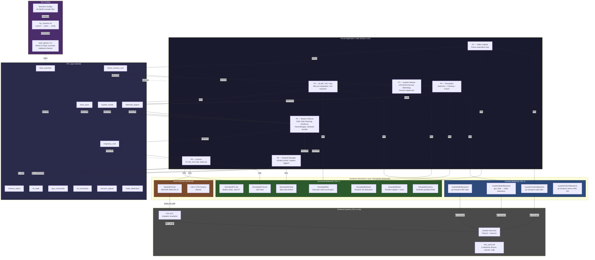
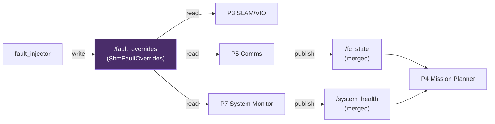
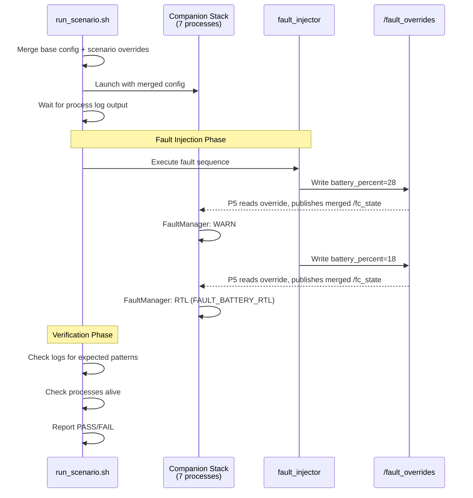

# Simulation Architecture

## Table of Contents

1. [Overview](#overview)
2. [Architecture Diagram — Simulated vs Actual Code](#architecture-diagram--simulated-vs-actual-code)
3. [Two-Tier Testing Model](#two-tier-testing-model)
4. [Component Classification](#component-classification)
5. [Gazebo Radar Backend — Design Deep Dive](#gazebo-radar-backend--design-deep-dive)
6. [Simulation Setup](#simulation-setup)
7. [Gazebo Environment Setup](#gazebo-environment-setup)
8. [Running Simulations](#running-simulations)
9. [Flight Guide](#flight-guide)
10. [Modifying the Flight Plan](#modifying-the-flight-plan)
11. [Adding Obstacles to the World](#adding-obstacles-to-the-world)
12. [Debugging Workflow](#debugging-workflow)
13. [Fault Injection Tool](#fault-injection-tool)
14. [Test Scenarios](#test-scenarios)
15. [Scenario Design Principles](#scenario-design-principles)
16. [Scenario Dependency Map](#scenario-dependency-map)
17. [Scenario Runtime and Tuning Guide](#scenario-runtime-and-tuning-guide)
18. [Known Flaky Scenarios](#known-flaky-scenarios)
19. [Simulation Coverage Gaps](#simulation-coverage-gaps)
20. [Data Flow Diagram](#data-flow-diagram)
21. [File Layout](#file-layout)

---

## Overview

The companion software stack supports **two-tier** testing — from lightweight
pure-simulated runs (Tier 1) to full Gazebo SITL flights (Tier 2). Every
hardware-touching component sits behind a **Hardware Abstraction Layer (HAL)**
interface. Swapping a single `"backend"` key in the JSON config switches
between simulated, Gazebo, or real-hardware implementations at link time.

The Gazebo SITL simulation connects three components:

```
┌─────────────────────────────────────────────────────────────────────┐
│                         Linux Host                                  │
│                                                                     │
│   ┌──────────────┐    MAVLink UDP     ┌──────────────────────────┐  │
│   │  PX4 SITL    │◄──────────────────►│  Companion Stack         │  │
│   │  Firmware     │  udp://:14540      │  (7 processes)           │  │
│   └──────┬───────┘                    │                          │  │
│          │                            │  P1 Video Capture        │  │
│   Gazebo │ libgz-sim                  │  P2 Perception           │  │
│   Plugin │                            │  P3 SLAM/VIO/Nav         │  │
│          ▼                            │  P4 Mission Planner      │  │
│   ┌──────────────┐    gz-transport    │  P5 Comms (MavlinkFCLink)│  │
│   │  Gazebo      │◄─────────────────►│  P6 Payload Manager      │  │
│   │  Harmonic    │  /camera, /imu,    │  P7 System Monitor       │  │
│   │  (Server)    │  /stereo_left      └──────────────────────────┘  │
│   └──────┬───────┘                                                  │
│          │                                                          │
│   ┌──────▼───────┐                                                  │
│   │  Gazebo GUI  │  (optional — 3D visualisation)                   │
│   │  Client      │                                                  │
│   └──────────────┘                                                  │
└─────────────────────────────────────────────────────────────────────┘
```

**Key points:**

- PX4 launches the Gazebo physics *server* (no GUI by default).
- The companion stack talks to PX4 via MAVSDK over MAVLink UDP.
- Video Capture and SLAM read Gazebo sensor topics (`/camera`, `/stereo_left`, `/imu`) via gz-transport.
- A separate Gazebo GUI client can be launched for 3D visualisation.
- All 7 companion processes communicate via Zenoh zero-copy pub/sub IPC.

---

## Architecture Diagram — Simulated vs Actual Code



---

## Two-Tier Testing Model

| | **Tier 1 — Pure Simulated** | **Tier 2 — Gazebo SITL** |
|---|---|---|
| **Hardware** | None required | GPU recommended |
| **External deps** | None | PX4-Autopilot, Gazebo Harmonic |
| **Camera** | `SimulatedCamera` (gradient) | `GazeboCameraBackend` (rendered) |
| **IMU** | `SimulatedIMU` (noise model) | `GazeboIMUBackend` (physics) |
| **FC Link** | `SimulatedFCLink` (stub) | `MavlinkFCLink` (MAVSDK) |
| **Radar** | `SimulatedRadar` (random targets) | `GazeboRadarBackend` (gpu_lidar + Doppler) |
| **VIO** | `SimulatedVIOBackend` (open-loop) | `GazeboFullVIOBackend` (stereo + IMU) |
| **Detector** | `SimulatedDetector` (random) | `SimulatedDetector` or YOLO |
| **Physics** | None (open-loop) | Gazebo (closed-loop) |
| **Speed** | Fast (seconds) | Slow (minutes) |
| **Use case** | Unit/regression, CI, fault injection | Waypoint validation, obstacle avoidance |

### When to Use Each Tier

- **Tier 1**: Run on every commit in CI. Fast, reproducible, no external
  dependencies. Validates fault handling, FSM transitions, IPC flow, and
  config parsing. Use the `fault_injector` to simulate faults.

- **Tier 2**: Run before releases or when validating navigation. Requires
  PX4 + Gazebo installed. Validates closed-loop waypoint following, obstacle
  avoidance with real simulated sensor data, and MAVLink integration.

---

## Component Classification

### Always-Actual Code (never simulated)

These run identically in sim and on hardware:

| Component | Process | Description |
|---|---|---|
| Mission FSM | P4 | State machine: IDLE -> PREFLIGHT -> TAKEOFF -> EXECUTING -> RTL -> LANDING -> COMPLETE |
| FaultManager | P4 | Battery 3-tier (WARN/RTL/CRIT), FC link loss, geofence breach, VIO quality degradation (debounced), thermal |
| Geofence | P4 | Point-in-polygon + altitude checks with warning margin |
| D* Lite Path Planner | P4 | 3D occupancy grid, incremental D* Lite search, path smoothing |
| ObstacleAvoider3D | P4 | Velocity-space potential field with prediction |
| Kalman Tracker | P2 | Multi-object tracking with Hungarian assignment |
| Fusion Engine | P2 | Camera + radar UKF sensor fusion |
| VIO Backend | P3 | Visual-inertial odometry with sliding window (sim uses `steady_clock` timestamps) |
| IMU Pre-integrator | P3 | IMU measurement integration between keyframes |
| Watchdog | P7 | Thread heartbeat monitoring, process management |
| IPC Layer | All | Zenoh pub/sub transport |

### HAL-Swappable Backends

| Interface | Simulated | Gazebo | Hardware |
|---|---|---|---|
| `ICamera` | `SimulatedCamera` | `GazeboCameraBackend` | V4L2/CSI (future) |
| `IIMUSource` | `SimulatedIMU` | `GazeboIMUBackend` | Serial IMU (future) |
| `IVIOBackend` | `SimulatedVIOBackend` | `GazeboFullVIOBackend` | — |
| `IFCLink` | `SimulatedFCLink` | — | `MavlinkFCLink` |
| `IGCSLink` | `SimulatedGCSLink` | — | UDP GCS (future) |
| `IGimbal` | `SimulatedGimbal` | — | Serial gimbal (future) |
| `IRadar` | `SimulatedRadar` | `GazeboRadarBackend` | TI AWR1843 (future) |
| `IDetector` | `SimulatedDetector` | — | `OpenCVYOLODetector` |

---

## Gazebo Radar Backend — Design Deep Dive

Gazebo (Garden/Harmonic) has **no native radar sensor type**. There is also no mature
open-source radar plugin for gz-sim — CARLA and LGSVL have radar sensors, but those
are entirely different simulators (Unreal-based). The Gazebo community's established
workaround is to repurpose `gpu_lidar` as a geometric backbone and post-process
returns into radar-like data.

### Why HAL-Backend-Subscribes-to-gz-Transport (Not a Custom Plugin)

Our codebase already follows this pattern for camera and IMU: `GazeboCameraBackend`
and `GazeboIMUBackend` subscribe to gz-transport topics published by Gazebo's built-in
sensors — no custom `.so` plugin, no SDF `<plugin>` XML, no Gazebo API coupling.

| Concern | Custom Gazebo Plugin | HAL Backend (our approach) |
| --- | --- | --- |
| Build coupling | Must compile `.so` against Gazebo internal API; breaks on version bumps | Only depends on gz-transport message types (stable across versions) |
| Plugin loading | Requires SDF plugin XML, GZ_SIM_SYSTEM_PLUGIN_PATH, .so deployment | No plugin loading — just a gz-transport subscriber |
| Domain logic | Inside Gazebo server process | In our codebase, under our control and review |
| Testability | Need Gazebo running to test any logic | Can unit-test conversion logic with mock messages |
| HAL consistency | Separate code path from SimulatedRadar | Same IRadar interface, same noise pattern |
| Maintenance | Two codebases (plugin + HAL backend) | Single HAL backend |

### Architecture

```text
┌─────────────────────┐     gz-transport topics     ┌──────────────────────┐
│  Gazebo Server       │  ── /radar_lidar/scan ───▶  │  GazeboRadarBackend  │
│  (built-in sensors:  │     (LaserScan)              │  (HAL backend)       │
│   gpu_lidar, odom)   │  ── /model/.../odometry ──▶  │                      │
│                      │     (Odometry)               │  → RadarDetectionList│
└─────────────────────┘                              └──────────────────────┘
```

The `GazeboRadarBackend` subscribes to **two gz-transport topics**:

1. **`gz::msgs::LaserScan`** on `/radar_lidar/scan` — provides per-ray range and
   bearing angles from a `gpu_lidar` sensor configured as a radar FOV (32 horizontal
   rays x 8 vertical rays, 60 deg x 15 deg FOV, 0.5-100 m range, 20 Hz update rate).

2. **`gz::msgs::Odometry`** on `/model/{model}/odometry` — provides body-frame
   velocity for Doppler radial velocity projection.

### Scan Callback Pipeline

For each `LaserScan` message received, the scan callback (`on_scan`) processes
every valid lidar ray through this pipeline:

```text
For each ray with valid range (finite, within [range_min, range_max]):
  |
  +-- 1. Compute azimuth/elevation from ray index + scan FOV geometry
  |     az = h_min + h_idx * (h_max - h_min) / (h_count - 1)
  |     el = v_min + v_idx * (v_max - v_min) / (v_count - 1)
  |
  +-- 2. Compute Cartesian position from spherical coordinates
  |     x = range * cos(el) * cos(az)
  |     y = range * cos(el) * sin(az)
  |     z = range * sin(el)
  |
  +-- 3. Project body velocity onto radial direction -> Doppler
  |     Radial unit vector: rx = cos(el)*cos(az), ry = cos(el)*sin(az), rz = sin(el)
  |     radial_velocity = vx*rx + vy*ry + vz*rz
  |
  +-- 4. Add Gaussian noise (same std::normal_distribution pattern as SimulatedRadar)
  |     range     += N(0, range_std_m)        -- default 0.3 m
  |     azimuth   += N(0, azimuth_std_rad)    -- default 0.026 rad (~1.5 deg)
  |     elevation += N(0, elevation_std_rad)  -- default 0.026 rad (~1.5 deg)
  |     velocity  += N(0, velocity_std_mps)   -- default 0.1 m/s
  |
  +-- 5. Compute SNR from range (simplified radar equation)
  |     snr_db = max(0, 30 - 20*log10(max(1, range)))
  |     confidence = clamp(snr_db / 30, 0, 1)
  |
  +-- 6. Build RadarDetection and append to RadarDetectionList
```

After all valid rays are processed:

```text
  +-- 7. Inject false alarms at configurable rate (default 2%)
  |     Random range/azimuth/elevation within FOV, low SNR (3 dB), low confidence (0.1)
  |
  +-- 8. Store RadarDetectionList under mutex -> available via read()
```

### Doppler Velocity Projection

The key insight enabling radar simulation from lidar data is that Doppler radial
velocity can be computed from the body velocity and the ray direction. For a target
at azimuth `az` and elevation `el`, the radial unit vector is:

```text
r_hat = [cos(el)*cos(az), cos(el)*sin(az), sin(el)]
```

The radial velocity (what a real radar would measure) is the dot product:

```text
v_radial = v_body . r_hat = vx*cos(el)*cos(az) + vy*cos(el)*sin(az) + vz*sin(el)
```

This correctly produces:
- Full body speed for targets directly ahead (`az=0, el=0`)
- `cos(45 deg) ~ 0.707x` for targets at 45 deg azimuth
- Zero radial velocity for targets at 90 deg (perpendicular)
- Vertical velocity contribution via `sin(el)` for elevated targets

### SDF Sensor Configuration

The `gpu_lidar` sensor is attached to `radar_lidar_link` on the `x500_companion` model
(`sim/models/x500_companion/model.sdf`):

| Parameter | Value | Rationale |
| --- | --- | --- |
| Horizontal samples | 32 | ~1.9 deg per ray across 60 deg FOV |
| Horizontal FOV | +/-0.5236 rad (+/-30 deg) | Matches typical automotive radar |
| Vertical samples | 8 | ~1.9 deg per ray across 15 deg FOV |
| Vertical FOV | +/-0.1309 rad (+/-7.5 deg) | Narrow vertical typical of radar |
| Range | 0.5-100 m | Short-range obstacle detection |
| Update rate | 20 Hz | Matches radar update rate config |
| Topic | `/radar_lidar/scan` | Distinct from any camera lidar |
| Noise | None | Noise injected in HAL backend, not sensor |

### Thread Safety

- **`mutex_`** guards `cached_detections_` — written by `on_scan()` callback thread,
  read by `read()` from the perception process thread.
- **`odom_mutex_`** guards `body_vx_/vy_/vz_` — written by `on_odom()` callback,
  read by `on_scan()`. Separate mutex avoids contention between the two topic callbacks.
- **`std::atomic<bool> active_`** — checked at the top of both callbacks to skip
  processing after `shutdown()`.

### Testing Without Gazebo

The static helper methods `ray_to_detection()` and `ray_index_to_angles()` are
deliberately exposed as public static functions. This allows 17 unit tests to verify:

| Test Category | What is Validated |
| --- | --- |
| Ray-to-detection conversion | Range, azimuth, elevation preserved; SNR computed from range |
| Doppler projection | Forward velocity -> full radial velocity; oblique angles -> cosine projection; vertical -> sine projection |
| SNR vs range | Closer targets produce higher SNR and confidence values |
| FOV mapping | Single ray -> center angles; multi-ray -> min/max/center correctly distributed |
| Factory integration | `backend="gazebo"` creates `GazeboRadarBackend`; `backend="simulated"` still works |
| Lifecycle | `is_active()` false before `init()`; double `init()` returns false; `read()` returns empty before data |

All tests compile and run without Gazebo installed (conversion logic is pure math).
The `HAVE_GAZEBO` compile guard only affects the gz-transport subscription calls.

---

## Simulation Setup

### Prerequisites

**Tier 1 (pure-simulated) — no extra dependencies:**
```bash
# Standard build dependencies only
sudo apt install build-essential cmake libspdlog-dev libeigen3-dev nlohmann-json3-dev
```

**Tier 2 (Gazebo SITL):**
```bash
# PX4 Autopilot
git clone https://github.com/PX4/PX4-Autopilot.git --recursive
cd PX4-Autopilot && make px4_sitl_default

# Gazebo Harmonic
sudo apt install gz-harmonic

# MAVSDK
sudo apt install libmavsdk-dev  # or build from source
```

### Build

```bash
# Tier 1 build (default — all simulated)
mkdir -p build && cd build
cmake -DCMAKE_BUILD_TYPE=Release -DALLOW_INSECURE_ZENOH=ON ..
make -j$(nproc)

# Tier 2 build (with Gazebo + MAVSDK)
cmake -DCMAKE_BUILD_TYPE=Release \
      -DALLOW_INSECURE_ZENOH=ON \
      -DENABLE_GAZEBO=ON \
      -DENABLE_MAVSDK=ON ..
make -j$(nproc)
```

### Configuration

Backend selection is **config-driven**. All backends read from a single JSON:

```json
{
    "video_capture": {
        "mission_cam": {
            "backend": "simulated"    // or "gazebo"
        }
    },
    "comms": {
        "mavlink": {
            "backend": "simulated"    // or "mavlink"
        }
    },
    "mission_planner": {
        "path_planner":      { "backend": "dstar_lite" },
        "obstacle_avoider":  { "backend": "potential_field_3d" },
        "geofence": {
            "polygon": [
                {"x": -50, "y": -50},
                {"x":  50, "y": -50},
                {"x":  50, "y":  50},
                {"x": -50, "y":  50}
            ],
            "altitude_ceiling_m": 120.0,
            "warning_margin_m": 5.0
        }
    },
    "fault_manager": {
        "battery_warn_percent": 30.0,
        "battery_rtl_percent": 20.0,
        "battery_crit_percent": 10.0,
        "fc_link_lost_timeout_ms": 3000,
        "fc_link_rtl_timeout_ms": 15000,
        "vio_quality_loiter_threshold": 1,
        "vio_quality_rtl_threshold": 0
    }
}
```

Config files in `config/`:
| File | Description |
|---|---|
| `default.json` | All simulated backends (Tier 1) |
| `gazebo_sitl.json` | Gazebo cameras + MAVLink FC (Tier 2) |
| `hardware.json` | Real hardware backends |

---

## Gazebo Environment Setup

Step-by-step guide to set up PX4 SITL with Gazebo Harmonic for testing the
companion software stack's HAL backends (MavlinkFCLink, GazeboCamera, GazeboIMU,
GazeboRadarBackend, GazeboFullVIOBackend).

**Target:** Ubuntu 24.04 LTS (amd64)
**Time to complete:** ~30 minutes (varies with internet speed)

### Install Gazebo Harmonic

```bash
# Add OSRF package repository
sudo curl -sSL https://packages.osrfoundation.org/gazebo.gpg \
    -o /usr/share/keyrings/pkgs-osrf-archive-keyring.gpg

echo "deb [arch=$(dpkg --print-architecture) \
    signed-by=/usr/share/keyrings/pkgs-osrf-archive-keyring.gpg] \
    https://packages.osrfoundation.org/gazebo/ubuntu-stable \
    $(lsb_release -cs) main" \
    | sudo tee /etc/apt/sources.list.d/gazebo-stable.list

sudo apt-get update
sudo apt-get install -y gz-harmonic
```

#### Verify Gazebo

```bash
gz sim --version          # Expected: Gazebo Sim, version 8.x.x
pkg-config --modversion gz-transport13 gz-msgs10
# Expected: 13.x.x and 10.x.x
```

### Install PX4-Autopilot (SITL Mode)

```bash
# Clone PX4 (shallow clone to save space)
git clone --recursive --depth 1 \
    https://github.com/PX4/PX4-Autopilot.git ~/PX4-Autopilot

# Run PX4 environment setup
cd ~/PX4-Autopilot
bash Tools/setup/ubuntu.sh --no-sim-tools
```

> **Note:** The `--no-sim-tools` flag skips Gazebo Garden and jMAVSim install since we already have Gazebo Harmonic.

#### Additional dependency (required by PX4's optical flow Gazebo plugin)

```bash
sudo apt-get install -y libopencv-dev
```

#### Build PX4 SITL

```bash
cd ~/PX4-Autopilot
make px4_sitl_default    # Build firmware only (works headless)
```

#### Verify PX4

```bash
# Quick smoke test (will open Gazebo + PX4 console):
cd ~/PX4-Autopilot && make px4_sitl gz_x500
# Type in the PX4 console: commander arm && commander takeoff
# The drone should lift off. Press Ctrl+C to quit.
```

### Install MAVSDK C++ Library

MAVSDK is **not** available via `apt` on Ubuntu 24.04. Build from source:

```bash
git clone --depth 1 --branch v2.12.12 \
    https://github.com/mavlink/MAVSDK.git ~/MAVSDK

cd ~/MAVSDK
git submodule update --init --recursive

cmake -S . -B build \
    -DCMAKE_BUILD_TYPE=Release \
    -DBUILD_SHARED_LIBS=ON \
    -DSUPERBUILD=ON

cmake --build build -j$(nproc)

sudo cmake --install build
sudo ldconfig
```

#### Verify MAVSDK

```bash
pkg-config --modversion mavsdk                    # Expected: 2.12.12
ls /usr/local/lib/cmake/MAVSDK/MAVSDKConfig.cmake # Should exist
```

### Symlink Custom Model and World into PX4

PX4's startup script looks for models and worlds in specific directories. Create
symlinks so PX4 can find our custom `x500_companion` model and `test_world.sdf`:

```bash
# Set paths (adjust if your project root is elsewhere)
PROJECT_DIR="$HOME/companion_software_stack"
PX4_DIR="$HOME/PX4-Autopilot"

# Symlink the custom drone model
ln -sfn "${PROJECT_DIR}/sim/models/x500_companion" \
    "${PX4_DIR}/Tools/simulation/gz/models/x500_companion"

# Symlink the test world
ln -sfn "${PROJECT_DIR}/sim/worlds/test_world.sdf" \
    "${PX4_DIR}/Tools/simulation/gz/worlds/test_world.sdf"
```

#### What the custom model adds

The `x500_companion` model extends PX4's standard `x500` quadrotor with companion-computer sensors:

| Sensor | Type | Resolution | Rate | Gazebo Topic |
|---|---|---|---|---|
| Mission Camera | RGB Camera | 640 x 480 | 30 Hz | `/camera` |
| Stereo Left | Greyscale Camera | 640 x 480 | 30 Hz | `/stereo_left` |
| Companion IMU | IMU (with noise) | — | 200 Hz | `/imu` |
| Radar Lidar | gpu_lidar (radar proxy) | 32 x 8 rays | 20 Hz | `/radar_lidar/scan` |

All sensors are fixed-joint attached to `base_link`.

### Verify Gazebo Sensor Topics

While PX4 SITL + Gazebo is running, open another terminal:

```bash
gz topic --list
# Expected topics include:
#   /clock
#   /camera
#   /stereo_left
#   /imu
#   /radar_lidar/scan
#   /model/x500_companion_0/odometry

# Echo IMU data
gz topic --echo -t /imu

# Echo camera images (warning: binary data)
gz topic --echo -t /camera
```

The exact topic paths depend on the model SDF. Use `gz topic --list` to discover them.

### Verify Companion Stack Builds with Optional Dependencies

```bash
cd /path/to/companion_software_stack
rm -rf build && mkdir build && cd build

cmake -DCMAKE_BUILD_TYPE=Release ..
```

Look for these lines in the CMake output:

```
  MAVSDK       : 2.12.12 — MavlinkFCLink backend available
  Gazebo libs  : gz-transport 13.x.x, gz-msgs 10.x.x — Gazebo backends available
```

### Headless Operation (CI / Remote SSH)

For environments without a display:

```bash
# PX4 SITL with Gazebo in headless mode
HEADLESS=1 make px4_sitl gz_x500

# Or use Gazebo's headless rendering
GZ_SIM_RENDER_ENGINE_PATH="" gz sim --headless-rendering -r worlds/default.sdf
```

> **Note:** The companion stack's Gazebo backends (`GazeboCamera`, `GazeboIMU`,
> `GazeboRadarBackend`) use `gz-transport` to subscribe to topics — they don't need a
> Gazebo GUI window. They work in headless mode as long as `gz-sim` is running.

### How Simulator Backends Connect

```
                    PX4 SITL
                   ┌─────────┐
                   │ px4     │
                   │ firmware │
                   │ (SITL)  │
                   └────┬────┘
                        │ MAVLink UDP
                        │ udp://127.0.0.1:14540
                        ▼
┌─────────────────────────────────────────────────┐
│              Companion Stack                     │
│                                                  │
│  ┌──────────────┐         ┌──────────────────┐  │
│  │ MavlinkFCLink│◄─MAVSDK─┤ P5 Comms         │  │
│  │ (IFCLink)    │         │                   │  │
│  └──────────────┘         └──────────────────┘  │
│                                                  │
│  ┌──────────────┐         ┌──────────────────┐  │
│  │ GazeboCamera │◄gz-tpt──┤ P1 Video Capture │  │
│  │ (ICamera)    │         │                   │  │
│  └──────────────┘         └──────────────────┘  │
│                                                  │
│  ┌──────────────┐         ┌──────────────────┐  │
│  │ GazeboIMU    │◄gz-tpt──┤ P3 SLAM/VIO/Nav  │  │
│  │ (IIMUSource) │         │                   │  │
│  └──────────────┘         └──────────────────┘  │
└─────────────────────────────────────────────────┘
                        │
                        │ gz-transport
                        ▼
                   ┌─────────┐
                   │ Gazebo  │
                   │ Harmonic│
                   │ (sim)   │
                   └─────────┘
```

---

## Running Simulations

### Tier 1 — Pure Simulated (No Gazebo)

**Option A: Direct launch with default config**
```bash
./deploy/launch_all.sh --config config/default.json
```

**Option B: Run a specific scenario**
```bash
# List available scenarios
./tests/run_scenario.sh --list

# Run a single scenario
./tests/run_scenario.sh config/scenarios/01_nominal_mission.json

# Dry-run (show plan without executing)
./tests/run_scenario.sh config/scenarios/03_battery_degradation.json --dry-run

# Run all Tier 1 scenarios
./tests/run_scenario.sh --all --tier 1
```

**Option C: Manual fault injection (while stack is running)**
```bash
# In terminal 1: launch stack
./deploy/launch_all.sh --config config/default.json

# In terminal 2: inject faults manually
./build/bin/fault_injector battery 25          # trigger battery WARN
./build/bin/fault_injector battery 15          # trigger battery RTL
./build/bin/fault_injector fc_disconnect       # simulate FC link loss
./build/bin/fault_injector gcs_command rtl     # send RTL via GCS
./build/bin/fault_injector thermal_zone 3      # critical thermal
./build/bin/fault_injector mission_upload config/scenarios/data/upload_waypoints.json
```

### Tier 2 — Gazebo SITL

#### One-command launch (recommended)

The launch script handles everything: SHM cleanup, PX4 start, MAVLink heartbeat
wait, optional GUI, and companion stack start-up in the correct order.

```bash
# Headless (no 3D window — for CI, SSH, or fast testing):
bash deploy/launch_gazebo.sh

# With Gazebo 3D visualisation:
bash deploy/launch_gazebo.sh --gui

# With debug logging:
bash deploy/launch_gazebo.sh --gui --log-level debug
```

Press **Ctrl+C** to gracefully stop everything (PX4 + Gazebo + all 7 processes).

#### What the launch script does (step by step)

1. Cleans stale POSIX shared memory segments (`/dev/shm/drone_*`, etc.)
2. Creates the log directory (`drone_logs/`)
3. Starts PX4 SITL, which in turn launches Gazebo Harmonic as a server
4. Waits up to 30 s for the MAVLink UDP port (`14540`) to become available
5. **(If `--gui`)** Launches the Gazebo GUI client with a chase-cam configuration and auto-follows the drone
6. Starts the 7 companion processes in dependency order:
   - `system_monitor` -> `video_capture` -> `comms` (1 s settle) -> `perception` -> `slam_vio_nav` -> `mission_planner` -> `payload_manager`
7. Monitors all PIDs — if any process exits, triggers a full shutdown

#### Environment variable overrides

| Variable | Default | Description |
|---|---|---|
| `PX4_DIR` | `~/PX4-Autopilot` | Path to PX4-Autopilot checkout |
| `GZ_WORLD` | `sim/worlds/test_world.sdf` | World SDF file |
| `CONFIG_FILE` | `config/gazebo_sitl.json` | JSON config for the companion stack |
| `LOG_DIR` | `<project>/drone_logs` | Where process logs are written |

Example with overrides:

```bash
PX4_DIR=/opt/px4 CONFIG_FILE=config/my_mission.json \
    bash deploy/launch_gazebo.sh --gui
```

#### Run Gazebo scenarios

```bash
# Run a specific Gazebo scenario
./tests/run_scenario_gazebo.sh config/scenarios/02_obstacle_avoidance.json

# Or run the integration test
./tests/test_gazebo_integration.sh
```

#### Clean build and run (full recipe)

```bash
cd ~/NM/Projects/companion_software_stack

# Remove old build artifacts
rm -rf build/

# Configure and build (Release mode)
mkdir build && cd build
cmake -DCMAKE_BUILD_TYPE=Release ..
make -j$(nproc)
cd ..

# Run tests
ctest --test-dir build --output-on-failure -j$(nproc)

# Kill any existing processes and clean shared memory
pkill -f "px4" 2>/dev/null || true
pkill -f "gz sim" 2>/dev/null || true
pkill -f "ruby.*gz" 2>/dev/null || true
for p in video_capture perception slam_vio_nav mission_planner comms payload_manager system_monitor; do
    pkill -f "$p" 2>/dev/null || true
done
sleep 2
rm -f /dev/shm/drone_* /dev/shm/detected_* /dev/shm/slam_* \
      /dev/shm/mission_* /dev/shm/trajectory_* /dev/shm/payload_* \
      /dev/shm/fc_* /dev/shm/gcs_* /dev/shm/system_* 2>/dev/null

# Launch simulation
bash deploy/launch_gazebo.sh --gui
```

#### Monitor flight progress

```bash
# Watch the mission planner log in real time
tail -f drone_logs/mission_planner.log

# Or check key events after the flight
grep -iE "arm|takeoff|waypoint|rtl|land|disarm" drone_logs/mission_planner.log
```

#### Stop everything

Press `Ctrl+C` in the launch terminal, or:

```bash
pkill -f "px4" 2>/dev/null || true
pkill -f "gz sim" 2>/dev/null || true
for p in video_capture perception slam_vio_nav mission_planner comms payload_manager system_monitor; do
    pkill -f "$p" 2>/dev/null || true
done
rm -f /dev/shm/drone_* 2>/dev/null
```

### Using the Gazebo GUI

When launched with `--gui`, the script:

1. Opens the Gazebo 3D window with a **chase-cam** configuration (`sim/gui.config`)
2. After 8 seconds, sends a **camera follow** command so the view automatically tracks the drone

#### Camera controls (while following)

| Action | Control |
|---|---|
| **Orbit** around the drone | Left-click + drag |
| **Zoom** in/out | Scroll wheel |
| **Pan** | Right-click + drag |

#### If you lose sight of the drone

1. In the **Entity Tree** panel (left side), find `x500_companion_0`
2. Right-click it -> **Move to**
3. The camera will snap to the drone

#### Manual camera follow (if auto-follow did not activate)

In a separate terminal:

```bash
# Set follow offset: 6 m behind, 3 m above
gz service -s /gui/follow/offset \
    --reqtype gz.msgs.Vector3d \
    --reptype gz.msgs.Boolean \
    --timeout 5000 \
    --req "x: -6, y: 0, z: 3"

# Start following the drone
gz service -s /gui/follow \
    --reqtype gz.msgs.StringMsg \
    --reptype gz.msgs.Boolean \
    --timeout 5000 \
    --req "data: 'x500_companion_0'"
```

> **Note (Conda/Snap users):** If `gz` commands fail with symbol lookup errors, prefix them with a clean environment:
> ```bash
> env -i HOME=$HOME DISPLAY=$DISPLAY PATH=/usr/bin:/usr/local/bin:/bin gz sim -g
> ```

---

## Flight Guide

### Default Flight Sequence

With the default configuration (`config/gazebo_sitl.json`), the autonomous flight sequence is:

```
        IDLE --> PREFLIGHT --> TAKEOFF --> NAVIGATE --> RTL --> LAND
         |         |              |           |           |        |
    FSM starts   ARM sent      10 m AGL    3 waypoints  Auto     Auto
    load mission  (retry 3s)   reached     flown        descend  disarm
```

### Default Flight Plan (~50 seconds)

The default scenario flies a clearly visible triangle pattern at 5 m altitude,
completing in approximately 50 seconds (ARM -> landed):

| Phase | Action | Details | ~Time |
|---|---|---|---|
| **1. ARM** | Mission planner sends ARM command | Retries every 3 s until PX4 confirms armed | ~1 s |
| **2. TAKEOFF** | Climb to 5 m AGL | PX4 internal climb rate ~1.5 m/s; transitions to NAVIGATE when altitude >= 4.5 m (90%) | ~13 s |
| **3. WP 1** | Fly to (15, 0, 5) | 15 m north at 5 m altitude, heading 0 deg | ~6 s |
| **4. WP 2** | Fly to (15, 15, 5) | 15 m east, heading 90 deg, **camera capture triggered** | ~6 s |
| **5. WP 3** | Fly to (0, 0, 5) | Return toward origin at 5 m altitude | ~9 s |
| **6. RTL** | Return-to-launch | PX4 flies home at 5 m (RTL altitude configured low to avoid 30 m default climb) and lands | ~14 s |
| **7. LAND** | Touch down and disarm | Automatic disarm after landing at the takeoff point | (included in RTL) |

Coordinates are in the **local frame** relative to the drone's spawn point (origin).
Internal convention: X=North, Y=East, Z=Up. Cruise speed is 5.0 m/s with a 2.0 m
waypoint acceptance radius. The path forms a 15 m triangle at 5 m altitude, covering
~51 m total distance.

> **Note:** The takeoff phase (~13 s) is dominated by PX4's internal MPC controller
> (`MPC_TKO_SPEED` ~ 1.5 m/s plus settling time) and cannot be reduced from the
> companion side. The navigation phase (WP1->WP3) takes ~21 s. RTL altitude is
> set to 5 m via `action->set_return_to_launch_altitude()` so the drone returns
> home at flight altitude instead of climbing to PX4's default 30 m.

### Expected Timeline

| Event | ~Time from launch |
|---|---|
| ARM | ~1 s |
| Takeoff complete (5 m) | ~13 s |
| WP 1 reached (15, 0, 5) | ~19 s |
| WP 2 reached (15, 15, 5) | ~25 s |
| WP 3 reached (0, 0, 5) -> RTL | ~35 s |
| Landed and disarmed at origin | ~50 s |

### Key Log Messages to Look For

```bash
# ARM + takeoff sequence
grep -i "arm\|takeoff\|navigate\|waypoint\|rtl\|land" drone_logs/mission_planner.log

# MAVLink connection status
grep -i "connected\|heartbeat\|armed\|altitude" drone_logs/comms.log

# PX4 boot progress
grep -i "ready\|home\|armed\|takeoff" drone_logs/px4_sitl.log
```

### Viewing Logs

All process logs are written to `drone_logs/` (or the `LOG_DIR` you specify):

```bash
# Real-time log streaming
tail -f drone_logs/mission_planner.log

# All logs
ls -la drone_logs/
#   comms.log
#   gz_gui.log
#   mission_planner.log
#   payload_manager.log
#   perception.log
#   px4_sitl.log
#   slam_vio_nav.log
#   system_monitor.log
#   video_capture.log
```

---

## Modifying the Flight Plan

The flight plan is defined in the JSON config file. The default for simulation
is `config/gazebo_sitl.json`.

### Waypoint format

Open `config/gazebo_sitl.json` and find the `mission_planner` section:

```json
"mission_planner": {
    "update_rate_hz": 10,
    "takeoff_altitude_m": 5.0,
    "acceptance_radius_m": 2.0,
    "cruise_speed_mps": 5.0,
    "obstacle_avoidance": {
        "min_distance_m": 2.0,
        "influence_radius_m": 5.0,
        "repulsive_gain": 2.0
    },
    "waypoints": [
        {"x": 15, "y": 0,  "z": 5, "yaw": 0,    "speed": 5.0, "payload_trigger": false},
        {"x": 15, "y": 15, "z": 5, "yaw": 1.57,  "speed": 5.0, "payload_trigger": true},
        {"x": 0,  "y": 0,  "z": 5, "yaw": 0,     "speed": 5.0, "payload_trigger": false}
    ]
}
```

### Waypoint fields

| Field | Type | Unit | Description |
|---|---|---|---|
| `x` | float | metres | North position (NED-local frame from spawn) |
| `y` | float | metres | East position (NED-local frame from spawn) |
| `z` | float | metres | Altitude AGL (positive = up) |
| `yaw` | float | radians | Heading (0 = north, pi/2 = east, pi = south, -pi/2 = west) |
| `speed` | float | m/s | Cruise speed for this leg (overrides `cruise_speed_mps`) |
| `payload_trigger` | bool | — | If `true`, triggers a camera capture when waypoint is reached |

### Mission parameters

| Parameter | Description | Default |
|---|---|---|
| `takeoff_altitude_m` | Target altitude for the takeoff phase | 5.0 m |
| `acceptance_radius_m` | How close the drone must be to a waypoint to consider it "reached" | 2.0 m |
| `cruise_speed_mps` | Default cruise speed (used if waypoint `speed` is omitted) | 5.0 m/s |
| `update_rate_hz` | Mission planner loop frequency | 10 Hz |

### Example: Square patrol at 20 m altitude

```json
"mission_planner": {
    "takeoff_altitude_m": 20.0,
    "acceptance_radius_m": 2.0,
    "cruise_speed_mps": 3.0,
    "obstacle_avoidance": {
        "min_distance_m": 2.0,
        "influence_radius_m": 5.0,
        "repulsive_gain": 2.0
    },
    "waypoints": [
        {"x": 30, "y": 0,  "z": 20, "yaw": 0,     "speed": 3.0, "payload_trigger": false},
        {"x": 30, "y": 30, "z": 20, "yaw": 1.57,   "speed": 3.0, "payload_trigger": true},
        {"x": 0,  "y": 30, "z": 20, "yaw": 3.14,   "speed": 3.0, "payload_trigger": true},
        {"x": 0,  "y": 0,  "z": 20, "yaw": -1.57,  "speed": 3.0, "payload_trigger": false}
    ]
}
```

This flies a 30 m x 30 m square at 20 m altitude, taking photos at the two far corners.

### Example: Single-waypoint hover test

```json
"waypoints": [
    {"x": 0, "y": 0, "z": 15, "yaw": 0, "speed": 1.0, "payload_trigger": false}
]
```

The drone takes off, flies to 15 m directly above the launch pad, considers the
waypoint reached (it's at the origin), and immediately triggers RTL. Useful for
testing takeoff + landing.

### Example: Long-range straight line

```json
"mission_planner": {
    "takeoff_altitude_m": 15.0,
    "cruise_speed_mps": 5.0,
    "waypoints": [
        {"x": 50,  "y": 0, "z": 15, "yaw": 0,    "speed": 5.0, "payload_trigger": false},
        {"x": 100, "y": 0, "z": 15, "yaw": 0,    "speed": 5.0, "payload_trigger": true},
        {"x": 0,   "y": 0, "z": 15, "yaw": 3.14, "speed": 5.0, "payload_trigger": false}
    ]
}
```

### Using a custom config file

You can create a separate config file for each mission profile without modifying the default:

```bash
# Copy the base config
cp config/gazebo_sitl.json config/my_patrol.json

# Edit waypoints in my_patrol.json
nano config/my_patrol.json

# Launch with the custom config
CONFIG_FILE=config/my_patrol.json bash deploy/launch_gazebo.sh --gui
```

### Coordinate system reference

```
                North (+x)
                    ^
                    |
                    |
  West (-y) <------+------> East (+y)
                    |
                    |
                    v
                South (-x)

  Altitude (+z) is up (AGL — above ground level)
  Yaw: 0 = North, pi/2 = East, pi = South, -pi/2 = West
  Origin (0, 0, 0) = drone spawn point (landing pad)
```

### What happens after the last waypoint

After all waypoints are reached, the mission planner automatically sends an
**RTL (Return-to-Launch)** command to PX4. PX4 handles the descent and landing
autonomously. The drone disarms after touchdown.

---

## Adding Obstacles to the World

The world file `sim/worlds/test_world.sdf` contains static obstacles. The obstacle
avoider (potential field) uses detected objects to steer around them.

### Current obstacles

| Name | Shape | Position (x, y, z) | Size |
|---|---|---|---|
| `obstacle_box_1` | Box | (8, 3, 1) | 1 x 1 x 2 m |
| `obstacle_cylinder_1` | Cylinder | (10, 5, 1.5) | r=0.5 m, h=3 m |
| `obstacle_box_2` | Box | (5, 8, 0.75) | 2 x 0.5 x 1.5 m |

### Adding a new obstacle

Add a `<model>` block inside the `<world>` element in `sim/worlds/test_world.sdf`:

```xml
<!-- New obstacle: tall pillar at (15, 15) -->
<model name="obstacle_pillar_1">
  <static>true</static>
  <pose>15 15 2.5 0 0 0</pose>
  <link name="link">
    <collision name="collision">
      <geometry><cylinder><radius>0.3</radius><length>5</length></cylinder></geometry>
    </collision>
    <visual name="visual">
      <geometry><cylinder><radius>0.3</radius><length>5</length></cylinder></geometry>
      <material>
        <ambient>0.8 0.2 0.2 1</ambient>
        <diffuse>0.8 0.2 0.2 1</diffuse>
      </material>
    </visual>
  </link>
</model>
```

> **Note:** Obstacles must be within sensor detection range (~50 m) to be detected
> by the perception pipeline. Place them near the flight path for the avoidance
> algorithm to activate.

---

## Debugging Workflow

A structured approach to diagnosing failures in Gazebo SITL scenario tests. This
section walks through systematic log analysis to identify functional and
integration issues in the companion stack.

### Quick Start

**Before running any commands in this section, run this setup block first:**

```bash
# REQUIRED: cd to project root — all paths below are relative to it
cd "$(git rev-parse --show-toplevel)"

# Set LOG_DIR based on how you launched the stack:
#
#   Manual run (launch_gazebo.sh):
LOG_DIR=drone_logs
#
#   Automated Gazebo scenario (run_scenario_gazebo.sh):
#LOG_DIR=drone_logs/scenarios_gazebo/obstacle_avoidance
#
#   Automated Tier 1 scenario (run_scenario.sh):
#LOG_DIR=drone_logs/scenarios/obstacle_avoidance
#
# Uncomment the one that matches your run. To see what's available:
ls drone_logs/
ls drone_logs/scenarios_gazebo/ 2>/dev/null
ls drone_logs/scenarios/ 2>/dev/null
```

When a scenario test fails:

```bash
# 1. Run the failing scenario
./tests/run_scenario_gazebo.sh config/scenarios/02_obstacle_avoidance.json
# -> Look for: "15 passed, 1 failed, 16 total"

# 2. Set LOG_DIR to point at the logs from that run
LOG_DIR=drone_logs/scenarios_gazebo/obstacle_avoidance

# 3. Follow the step-by-step debugging process below
```

### Root Cause Categories

Before diving into logs, understand what could fail:

| Category | Indicator | Example |
|----------|-----------|---------|
| **Config** | Wrong backend loaded, stale config key | VIO falls back to "simulated" instead of "gazebo" |
| **Timeout** | Process killed after N seconds | Mission planner hangs, scenario timeout exceeded |
| **Functional** | Log pattern expected but missing | Expected "EXECUTING" state never reached |
| **Crash** | Segfault, assertion, abort | Memory corruption, null pointer dereference |
| **Deadlock** | Process alive but stuck (no new logs) | IPC subscriber blocked, thread stuck |
| **Resource** | Out of memory, file descriptor exhausted | Perception logs grow unbounded |
| **Integration** | Expected IPC message never published | Pose not received, commands not executed |

### Step-by-Step Debugging Methodology

> All commands below assume you have completed the Quick Start setup:
> `cd` to the project root and `LOG_DIR` set to the correct log directory.

#### Step 1: Verify the Failure Mode

```bash
tail -20 "${LOG_DIR}/combined.log" | grep -E "passed|failed"
```

**What to look for:**
- Total passed/failed count
- Which specific assertion failed (if shown)

#### Step 2: Identify Timestamp of Failure

```bash
tail -100 "${LOG_DIR}/combined.log" | grep -iE "error|fatal"
```

**Example output:**
```
[2026-03-14 16:40:29.821] [system_monitor] [error] [t:205384] [SysMon] Process DIED: mission_planner
```

**Action:** Note the timestamp (16:40:29 in this case). This is your failure point.

#### Step 3: Look at Launcher/Scenario Runner Output

```bash
tail -50 "${LOG_DIR}/launcher.log"
```

**What to look for:**
- Process launch success/failure
- Timeout messages
- "Killed" signal (indicates forceful termination)
- MAVLink/PX4 connection status

#### Step 4: Check the Primary Process Logs

Based on the scenario, check the most relevant process:

```bash
# For mission/planning failures:
strings "${LOG_DIR}/mission_planner.log" | \
  grep -iE "waypoint|path|obstacle|execute" | tail -20

# For perception failures:
strings "${LOG_DIR}/perception.log" | \
  grep -iE "detector|track|fuse" | tail -20

# For comms failures:
strings "${LOG_DIR}/comms.log" | \
  grep -iE "mavlink|heartbeat|fc_state" | tail -20
```

**Why `strings`?** Binary log files contain formatting codes. `strings` extracts readable text.

#### Step 5: Trace IPC Message Flow

Check if critical IPC messages were published:

```bash
grep -iE "pose|detected_objects|fc_state|mission_status" \
  "${LOG_DIR}/combined.log" | tail -20
```

**What to look for:**
- Is `/slam_pose` being published? (P3 -> P4)
- Are `/detected_objects` messages flowing? (P2 -> P4)
- Is `/fc_state` being received? (P5 -> P4)

#### Step 6: Check Process Liveness at Failure Time

Look for the last log entry of each process around the failure timestamp:

```bash
for log in "${LOG_DIR}"/*.log; do
  echo "=== $(basename "$log") ==="
  tail -1 "$log"
done
```

**What to look for:**
- Processes still logging after failure timestamp? -> They stayed alive
- Processes silent before failure? -> They crashed
- Timestamp gap? -> Indicates freeze

#### Step 7: Check Scenario Pass Criteria

Look at what the scenario required:

```bash
# View expected log patterns (set SCENARIO_NUM to the scenario number, e.g. 02)
SCENARIO_NUM=02
grep -A 20 '"pass_criteria"' config/scenarios/${SCENARIO_NUM}_*.json
```

**Then verify each criterion:**

```bash
grep "Path planner: DStarLitePlanner" "${LOG_DIR}/combined.log"
grep "EXECUTING" "${LOG_DIR}/combined.log"
grep "Mission complete" "${LOG_DIR}/combined.log"

# Check for forbidden patterns
grep -i "EMERGENCY_LAND" "${LOG_DIR}/combined.log"
grep -i "COLLISION" "${LOG_DIR}/combined.log"
```

#### Step 8: Verify Config Was Applied Correctly

Many SITL failures trace back to config mismatches — stale keys, wrong base config,
or overrides that don't reach the intended process.

```bash
# 1. Check which config the scenario runner actually used
python3 -m json.tool "${LOG_DIR}/merged_config.json" | head -80

# 2. Verify critical backend selections in the merged config
python3 -c "
import json, sys
cfg = json.load(open(sys.argv[1]))
print('VIO backend:      ', cfg.get('slam',{}).get('vio',{}).get('backend','NOT SET'))
print('IMU backend:      ', cfg.get('slam',{}).get('imu',{}).get('backend','NOT SET'))
print('FC backend:       ', cfg.get('comms',{}).get('mavlink',{}).get('backend','NOT SET'))
print('Detector backend: ', cfg.get('perception',{}).get('detector',{}).get('backend','NOT SET'))
print('Planner backend:  ', cfg.get('mission_planner',{}).get('path_planner',{}).get('backend','NOT SET'))
print('Avoider backend:  ', cfg.get('mission_planner',{}).get('obstacle_avoider',{}).get('backend','NOT SET'))
print('IPC backend:      ', cfg.get('ipc_backend','NOT SET'))
" "${LOG_DIR}/merged_config.json"

# 3. Verify process logs confirm the expected backend was loaded
strings "${LOG_DIR}/slam_vio_nav.log" | grep -i "backend"
strings "${LOG_DIR}/mission_planner.log" | grep -iE "Path planner:|Obstacle avoider:"
strings "${LOG_DIR}/comms.log" | grep -i "FC link:"
```

**What to look for:**
- `VIO backend: NOT SET` -> P3 will fall back to `"simulated"`, which generates a
  fake pose unrelated to the real drone position in Gazebo. This is the most common
  cause of "drone doesn't navigate" in SITL.
- Stale config keys (e.g. `slam.visual_frontend` instead of `slam.vio`) — the
  process code reads a specific key path; if the config uses a different name, the
  value is silently ignored and the default is used.

> **Note:** There is now a single Gazebo config file (`config/gazebo_sitl.json`)
> used by both `launch_gazebo.sh` and `run_scenario_gazebo.sh`. The previous
> `config/gazebo.json` was consolidated into `gazebo_sitl.json` to eliminate config
> drift between manual and automated runs.

#### Step 9: Investigate Root Cause

Based on findings above, run targeted searches:

**If timeout suspected:**
```bash
SCENARIO_NUM=02
grep "timeout_s" config/scenarios/${SCENARIO_NUM}_*.json

# Calculate actual duration from logs
echo "First log:" "$(head -1 "${LOG_DIR}/combined.log" | grep -oP '\d{2}:\d{2}:\d{2}')"
echo "Last log:" "$(tail -1 "${LOG_DIR}/combined.log" | grep -oP '\d{2}:\d{2}:\d{2}')"
```

**If functional issue suspected:**
```bash
strings "${LOG_DIR}/mission_planner.log" | \
  grep -iE "FSM|state transition|waypoint" | head -30
```

**If deadlock suspected:**
```bash
# Look for repeated log patterns (indicates stuck loop)
strings "${LOG_DIR}/perception.log" | \
  sort | uniq -c | sort -rn | head -10
# High counts + same timestamp = likely deadlock
```

### Common Error Patterns

#### Pattern 1: Missing IPC Message

**Log appearance:**
```
[mission_planner] Loop tick 100 — no pose available (0 drops)
[mission_planner] Loop tick 101 — no pose available (0 drops)
[mission_planner] Loop tick 102 — timeout waiting for pose
```

**Diagnosis:** P3 (SLAM/VIO) not publishing pose. Check `slam_vio_nav.log` for
crashes or stuck threads.

#### Pattern 2: Process Killed After Exceeded Timeout

**Log appearance:**
```
launcher.log:
[Stack] All processes launched. PIDs: ... (150s elapsed, timeout=100s)
launcher.log: Killed (signal 9)
```

**Fix:** Increase `timeout_s` in scenario config.

#### Pattern 3: Deadlock (Process Alive but Not Logging)

**Diagnosis:** Thread stuck waiting for lock or IPC message. Check for circular
IPC dependency (P A -> P B -> P C -> P A).

**Fix:**
```bash
# Run with ThreadSanitizer to detect deadlocks
bash deploy/build.sh --tsan
./tests/run_scenario_gazebo.sh config/scenarios/02_obstacle_avoidance.json
```

#### Pattern 4: High CPU / Memory Explosion

**Diagnosis:** Downstream (mission planner) not consuming poses fast enough.
Perception thread looping faster than publishing.

#### Pattern 5: Config Key Mismatch (Silent Backend Fallback)

**Log appearance:**
```
slam_vio_nav.log: VIO backend: SimulatedVIOBackend (sim_speed=2.0 m/s)
# Expected: VIO backend: GazeboVIOBackend (for Gazebo SITL runs)
```

**Diagnosis:** Config file uses a stale or misnamed key that P3 doesn't read.
P3 falls back to `"simulated"` VIO, generating a fake pose. The drone appears
to take off and arm, but never navigates correctly.

**Identify:**
```bash
# Check if slam.vio.backend is set in the config being used
python3 -c "
import json
cfg = json.load(open('config/gazebo_sitl.json'))
vio = cfg.get('slam',{}).get('vio',{}).get('backend','NOT SET')
print('slam.vio.backend:', vio)
if vio == 'NOT SET':
    print('WARNING: P3 will fall back to simulated VIO!')
"
```

**Fix:** Ensure the config has `slam.vio.backend: "gazebo"` (not under a different key name).

### Quick Troubleshooting Flowchart

```
Scenario Failed
  |
  +-> Drone takes off but doesn't navigate / flies randomly?
  |    +-> Check VIO backend: strings ${LOG_DIR}/slam_vio_nav.log | grep backend
  |         +-> "SimulatedVIOBackend": CONFIG BUG — slam.vio.backend missing
  |         +-> "GazeboVIOBackend": VIO is correct, check planner/avoider
  |
  +-> Processes killed after N seconds?
  |    +-> Check launcher.log for "Killed"
  |         +-> YES: Increase timeout_s in scenario config
  |         +-> NO: Go to "Process Liveness"
  |
  +-> Expected log pattern not found?
  |    +-> grep "expected_pattern" combined.log
  |         +-> Found late in logs: Process slow to reach state
  |         +-> Not found: Functional logic failure
  |              +-> Check mission_planner.log for path planning / FSM issues
  |
  +-> Forbidden pattern found (EMERGENCY_LAND, COLLISION)?
  |    +-> Check waypoint/obstacle placement
  |         +-> Adjust config_overrides in scenario
  |
  +-> Process liveness check failed?
       +-> Check if all 7 processes logged after test completion
            +-> Process silent: Check its .log for crashes
            +-> All logged: Check scenario runner validation timing
```

### Debugging Example: Path Planner Timeout

Running `config/scenarios/02_obstacle_avoidance.json`:
- Expected: Drone navigates 7 waypoints using D* Lite planner, avoids obstacles
- Failure: "2 passed, 14 failed" — missing critical log patterns

**Step 1:** Check failure
```bash
LOG_DIR=drone_logs/scenarios_gazebo/obstacle_avoidance
tail -5 "${LOG_DIR}/combined.log" | grep -E "passed|failed"
# -> Results: 2 passed, 14 failed, 16 total
```

**Step 2:** Identify failure point
```bash
grep -iE "error|fatal" "${LOG_DIR}/combined.log" | head -5
# -> [Planner] No path found after 30 tries - timeout exceeded
```

**Root cause:** First waypoint was at (1, 7) — the same location as an obstacle
with radius 0.75 m. The planner cannot reach a goal inside an obstacle.

**Fix:** Offset waypoints from obstacle centers in the scenario config.

### Debugging Example: Wrong VIO Backend in Gazebo

- Expected: Drone flies toward obstacles and avoids them
- Actual: Drone takes off but flies erratically, never reaches waypoints

**Step 1:** Check which VIO backend was loaded
```bash
strings "${LOG_DIR}/slam_vio_nav.log" | grep -i "backend"
# -> VIO backend: SimulatedVIOBackend (sim_speed=2.0 m/s)
# WRONG! Should be GazeboVIOBackend for Gazebo SITL
```

**Root cause:** Config is missing `slam.vio.backend: "gazebo"`. P3 falls back to
`"simulated"`, generating a fake pose unrelated to the drone's actual position in Gazebo.

**Fix:** Ensure the config has the correct key path:
```json
"slam": {
    "vio": {
        "backend": "gazebo",
        "gz_topic": "/model/x500_companion_0/odometry"
    }
}
```

### Log File Reference

| File | Process | Contains | Use for |
|------|---------|----------|---------|
| `combined.log` | All | Merged stdout from all 7 processes | Top-level flow, IPC patterns |
| `mission_planner.log` | P4 | Path planning, FSM, waypoint execution | Mission logic failures |
| `perception.log` | P2 | Detection, tracking, fusion | Vision failures |
| `slam_vio_nav.log` | P3 | VIO, odometry, pose estimation | Localization issues |
| `comms.log` | P5 | FC heartbeat, GCS commands, telemetry | Flight controller comms |
| `system_monitor.log` | P7 | Process health, CPU/memory, restarts | Process crashes, resource limits |
| `video_capture.log` | P1 | Camera frames, frame drops | Video source issues |
| `payload_manager.log` | P6 | Gimbal, payload commands | Gimbal/camera failures |
| `launcher.log` | External | PX4, Gazebo startup, process PIDs | Launch-time failures |
| `merged_config.json` | External | Effective config (after merges) | Verify actual test parameters |

### Troubleshooting Reference

| Issue | Cause | Solution |
|---|---|---|
| `ERROR: Build directory not found` | Stack not built | Run `./deploy/build.sh` |
| `ERROR: PX4-Autopilot not found` | Wrong PX4 path | Set `PX4_DIR=/path/to/PX4-Autopilot` |
| `ERROR: PX4 SITL binary not found` | PX4 not built for SITL | Run `cd ~/PX4-Autopilot && make px4_sitl_default` |
| MAVLink port not detected after 30 s | PX4 boot failed | Check `drone_logs/px4_sitl.log` for errors |
| Gazebo GUI crashes with `libpthread` error | Conda/Snap `LD_LIBRARY_PATH` conflict | The launch script uses `env -i` to avoid this. If running `gz` manually, prefix with `env -i HOME=$HOME DISPLAY=$DISPLAY PATH=/usr/bin:/usr/local/bin:/bin` |
| Drone doesn't arm | MAVSDK heartbeat needs time | ARM retries every 3 s automatically. Wait ~10 s |
| Drone arms but doesn't take off | Takeoff command not sent | Check `mission_planner.log` for `Sending TAKEOFF` |
| Camera follow doesn't work | CameraTracking service takes time | Wait 10 s after GUI opens, or use Entity Tree -> right-click drone -> Move to |
| `gz service` commands time out | Gazebo GUI not running | Make sure `gz sim -g` is running |
| Tests fail with MAVSDK errors | MAVSDK not installed or wrong version | Run `pkg-config --modversion mavsdk` — must be 2.12.12 |
| Processes exit immediately | Config file not found | Verify `config/gazebo_sitl.json` exists and is valid JSON |
| `make px4_sitl gz_x500` fails with OpenCV error | Missing dependency | Install: `sudo apt-get install -y libopencv-dev` |
| PX4 build fails: missing Python packages | Missing pip packages | Run: `pip3 install --user empy==3.3.4 pyros-genmsg packaging jinja2 pyyaml jsonschema` |
| Gazebo window doesn't appear | No display | Use `HEADLESS=1 make px4_sitl gz_x500` |
| `pkg-config --modversion mavsdk` fails | ldconfig not run | Run `sudo ldconfig` after MAVSDK install |
| CMake doesn't find MAVSDK | Missing cmake config | Set `CMAKE_PREFIX_PATH=/usr/local` or verify `/usr/local/lib/cmake/MAVSDK/` exists |
| Gazebo topics not showing up | Model SDF issue | Check world/model SDF for sensor plugins. Use `gz topic --list` |
| PX4 MAVLink not connecting | Port conflict | Default port is `udp://127.0.0.1:14540`. Check firewall / port conflicts |

### Clean Restart

If things get stuck, perform a full cleanup:

```bash
# Kill everything
pkill -9 -f "gz sim" ; pkill -9 -f px4 ; pkill -9 -f "ruby.*gz"
pkill -9 -f video_capture ; pkill -9 -f perception ; pkill -9 -f slam_vio_nav
pkill -9 -f mission_planner ; pkill -9 -f comms
pkill -9 -f payload_manager ; pkill -9 -f system_monitor

# Clean shared memory
rm -f /dev/shm/drone_* /dev/shm/detected_* /dev/shm/slam_* \
      /dev/shm/mission_* /dev/shm/trajectory_* /dev/shm/payload_* \
      /dev/shm/fc_* /dev/shm/gcs_* /dev/shm/system_*

# Relaunch
bash deploy/launch_gazebo.sh --gui
```

---

## Fault Injection Tool

The `fault_injector` CLI uses a **sideband override channel**
(`/fault_overrides`) rather than writing directly to production IPC
channels. This avoids race conditions — the producing processes (P5
Comms, P7 System Monitor) continue their normal publish loops and
**merge** overrides into the values they publish.

### How It Works



- **Sentinel values**: Override fields default to `-1` (no override).
  Only non-sentinel fields are applied.
- **Sequence counter**: Incremented on each write so consumers can
  detect fresh overrides vs stale values.
- **FC link loss**: When `fc_connected = 0`, P5 freezes the FC
  heartbeat timestamp so the FaultManager's stale-heartbeat check
  fires correctly.
- **Same IPC transport**: The `/fault_overrides` channel uses the
  same Zenoh transport as all other IPC channels.

### FaultOverrides Struct

```cpp
struct alignas(64) FaultOverrides {
    // FC state overrides (consumed by Process 5 comms)
    float   battery_percent = -1.0f;  // <0 = no override
    float   battery_voltage = -1.0f;  // <0 = no override
    int32_t fc_connected    = -1;     // <0 = no override, 0 = disconnected, 1 = connected
    // System health overrides (consumed by Process 7 system monitor)
    int32_t thermal_zone      = -1;     // <0 = no override, 0-3 = zone
    float   cpu_temp_override = -1.0f;  // <0 = no override
    // VIO quality override (consumed by Process 3 SLAM/VIO)
    int32_t vio_quality = -1;  // <0 = no override, 0-3 = quality level
    // Sequence counter
    uint64_t sequence = 0;     // incremented by injector
};
```

All override fields default to `-1` (no override) via default member initializers.
This ensures that `FaultOverrides{}` produces safe "no override" semantics —
a zero-initialized struct would activate every override at its most dangerous value.

### Available Commands

| Command | Override Field | Description |
|---|---|---|
| `battery <percent>` | `battery_percent` | Override FC battery level |
| `fc_disconnect` | `fc_connected = 0` | Freeze FC heartbeat -> link-loss detection |
| `fc_reconnect` | `fc_connected = 1` | Release frozen timestamp |
| `gcs_command <cmd> [p1 p2 p3]` | `/gcs_commands` (direct) | Inject GCS command |
| `thermal_zone <0-3>` | `thermal_zone` | Override thermal zone |
| `vio_quality <0-3>` | `vio_quality` | Override VIO pose quality (0=lost, 1=degraded, 2=good, 3=excellent) |
| `vio_clear` | `vio_quality = -1` | Clear VIO quality override (restore actual VIO health) |
| `mission_upload <json>` | `/mission_upload` + `/gcs_commands` | Upload new waypoints |
| `sequence <json>` | Various | Execute timed fault sequence |

### Timed Sequence Format

```json
{
    "steps": [
        {"delay_s": 10, "action": "battery", "value": 28.0},
        {"delay_s": 5,  "action": "fc_disconnect"},
        {"delay_s": 20, "action": "fc_reconnect"},
        {"delay_s": 2,  "action": "gcs_command", "command": "rtl"},
        {"delay_s": 3,  "action": "vio_quality", "value": 1},
        {"delay_s": 10, "action": "vio_clear"}
    ]
}
```

---

## Test Scenarios

Twenty-five pre-defined scenarios in `config/scenarios/`:

| # | Scenario | Tier | Gazebo | What it Tests |
|---|---|---|---|---|
| 01 | Nominal Mission | 1 | No | Basic 4-waypoint flight, landing, payload trigger |
| 02 | Obstacle Avoidance | 2 | Yes | D* Lite through 6-obstacle field, ByteTrack tracker, color_contour detector |
| 03 | Battery Degradation | 1 | No | 3-tier: WARN (30%) -> RTL (20%) -> EMERGENCY_LAND (10%) |
| 04 | FC Link Loss | 1 | No | LOITER (3 s) -> RTL contingency (15 s) |
| 05 | Geofence Breach | 1 | No | Polygon violation (WP4 exits east boundary) -> RTL |
| 06 | Mission Upload | 1 | No | Mid-flight 3-waypoint upload via GCS |
| 07 | Thermal Throttle | 1 | No | Zone escalation (0->1->2->3->0), thermal gates suspend P1/P2/P6 |
| 08 | Full Stack Stress | 1 | No | Concurrent faults (battery + thermal + FC), high rates (60 Hz cam, 200 Hz VIO) |
| 09 | Perception Tracking | 1 | No | ByteTrack two-stage association, low-confidence recovery |
| 10 | GCS Pause/Resume | 1 | No | GCS MISSION_PAUSE -> LOITER, resume -> NAVIGATE |
| 11 | GCS Abort | 1 | No | GCS MISSION_ABORT -> RTL mid-flight |
| 12 | GCS RTL | 1 | No | Direct GCS RTL command (separate path from fault RTL) |
| 13 | GCS Land | 1 | No | GCS LAND at current position (not return-to-launch) |
| 14 | Altitude Ceiling Breach | 1 | No | Waypoint above geofence ceiling (10 m > 8 m limit) -> RTL |
| 15 | FC Quick Recovery | 1 | No | FC link loss -> quick reconnect before RTL timeout -> resume |
| 16 | VIO Failure | 1 | No | VIO quality degradation (quality=1) -> LOITER, recovery -> fault clears |
| 17 | Radar Gazebo | 2 | Yes | GazeboRadarBackend produces detections, UKF fusion consumes them |
| 18 | Perception Avoidance | 2 | Yes | Navigate through an obstacle field using camera+radar perception |
| 19 | Collision Recovery | 1 | No | Post-collision recovery: drone navigates into a known obstacle |
| 20 | Radar Degraded Visibility | 1 | No | Degraded visibility (fog/darkness) where camera drops out, radar primary |
| 21 | YOLOv8 Detection | 2 | Yes | Short mission with YOLOv8-nano (OpenCV DNN) as the detector |
| 23 | Dynamic Obstacle Prediction | 1 | No | Occupancy grid inflates cells along detected object trajectories |
| 24 | Gimbal Auto Track | 1 | No | Gimbal auto-tracking smoke test |
| 25 | Flight Recorder Replay | 1 | No | 2-waypoint mission with flight recorder enabled, verifies replay |
| 26 | Gazebo Full VIO | 2 | Yes | Short mission with full VIO pipeline on Gazebo stereo+IMU data |
| 27 | Perception Depth Accuracy | 2 | Yes | Simulated depth + radar UKF fusion accuracy with varied-height obstacles |
| 28 | ML Depth Estimation | 2 | Yes | Depth Anything V2 (OpenCV DNN) + color_contour + radar UKF fusion |

**Counts:** 20 Tier 1 scenarios + 7 Tier 2 (Gazebo) scenarios = 27 total.

### Scenario JSON Structure

Each scenario file contains:

```json
{
    "scenario": {
        "name": "...",
        "description": "...",
        "tier": 1,
        "timeout_s": 120,
        "requires_gazebo": false
    },
    "config_overrides": { },
    "fault_sequence": {
        "steps": [ ]
    },
    "pass_criteria": {
        "log_contains": ["..."],
        "log_must_not_contain": ["..."],
        "processes_alive": ["..."],
        "processes_running": ["..."]
    },
    "manual_controls": {
        "notes": "What parameters can be adjusted"
    }
}
```

### Per-Scenario Backend Coverage

Which pluggable backends are exercised by each scenario:

| Scenario | Path Planner | Obstacle Avoider | Detector | Tracker | Fusion |
|---|---|---|---|---|---|
| 01 Nominal | `dstar_lite` | `potential_field_3d` | `simulated` | `bytetrack` | `camera_only` |
| 02 Obstacles | `dstar_lite` | `potential_field_3d` | `color_contour` | `bytetrack` | `camera_only` |
| 03 Battery | `dstar_lite` | `potential_field_3d` | `simulated` | `bytetrack` | `camera_only` |
| 04 FC Link | `dstar_lite` | `potential_field_3d` | `simulated` | `bytetrack` | `camera_only` |
| 05 Geofence | `dstar_lite` | `potential_field_3d` | `simulated` | `bytetrack` | `camera_only` |
| 06 Upload | `dstar_lite` | `potential_field_3d` | `simulated` | `bytetrack` | `camera_only` |
| 07 Thermal | `dstar_lite` | `potential_field_3d` | `simulated` | `bytetrack` | `camera_only` |
| 08 Stress | `dstar_lite` | `potential_field_3d` | `simulated` | `bytetrack` | `camera_only` |
| 09 Tracking | `dstar_lite` | `potential_field_3d` | `simulated` | `bytetrack` | `camera_only` |
| 10 Pause | `dstar_lite` | `potential_field_3d` | `simulated` | `bytetrack` | `camera_only` |
| 11 Abort | `dstar_lite` | `potential_field_3d` | `simulated` | `bytetrack` | `camera_only` |
| 12 GCS RTL | `dstar_lite` | `potential_field_3d` | `simulated` | `bytetrack` | `camera_only` |
| 13 GCS Land | `dstar_lite` | `potential_field_3d` | `simulated` | `bytetrack` | `camera_only` |
| 14 Alt Breach | `dstar_lite` | `potential_field_3d` | `simulated` | `bytetrack` | `camera_only` |
| 15 FC Recover | `dstar_lite` | `potential_field_3d` | `simulated` | `bytetrack` | `camera_only` |
| 16 VIO Failure | `dstar_lite` | `potential_field_3d` | `simulated` | `bytetrack` | `camera_only` |
| 17 Radar Gazebo | `dstar_lite` | `potential_field_3d` | `simulated` | `bytetrack` | `ukf` + radar |
| 18 Perception Avoidance | `dstar_lite` | `potential_field_3d` | `color_contour` | `bytetrack` | `ukf` + radar |
| 19 Collision Recovery | `dstar_lite` | `potential_field_3d` | `simulated` | `bytetrack` | `camera_only` |
| 20 Radar Degraded | `dstar_lite` | `potential_field_3d` | `simulated` | `bytetrack` | `ukf` + radar |
| 21 YOLOv8 | `dstar_lite` | `potential_field_3d` | `yolov8` | `bytetrack` | `camera_only` |
| 23 Dynamic Prediction | `dstar_lite` | `potential_field_3d` | `simulated` | `bytetrack` | `camera_only` |
| 24 Gimbal Track | `dstar_lite` | `potential_field_3d` | `simulated` | `bytetrack` | `camera_only` |
| 25 Flight Recorder | `dstar_lite` | `potential_field_3d` | `simulated` | `bytetrack` | `camera_only` |
| 26 Gazebo Full VIO | `dstar_lite` | `potential_field_3d` | `simulated` | `bytetrack` | `camera_only` |
| 27 Depth Accuracy | `dstar_lite` | `potential_field_3d` | `color_contour` | `bytetrack` | `ukf` + radar + simulated depth |
| 28 ML Depth | `dstar_lite` | `potential_field_3d` | `color_contour` | `bytetrack` | `ukf` + radar + `depth_anything_v2` |

### Per-Scenario Fault Coverage

Which fault types and FSM states are exercised:

| Scenario | Fault Types Triggered | FSM States Exercised | GCS Commands |
|---|---|---|---|
| 01 Nominal | None | IDLE -> PREFLIGHT -> TAKEOFF -> NAVIGATE -> RTL -> LAND -> IDLE | — |
| 02 Obstacles | None | IDLE -> TAKEOFF -> NAVIGATE -> RTL -> LAND | — |
| 03 Battery | BATTERY_LOW, BATTERY_RTL, BATTERY_CRITICAL | TAKEOFF -> NAVIGATE -> RTL -> EMERGENCY_LAND | — |
| 04 FC Link | FC_LINK_LOST | NAVIGATE -> LOITER -> RTL | — |
| 05 Geofence | GEOFENCE_BREACH | NAVIGATE -> RTL | — |
| 06 Upload | None | NAVIGATE (mid-flight waypoint change) | MISSION_UPLOAD |
| 07 Thermal | THERMAL_WARNING, THERMAL_CRITICAL, PERCEPTION_DEAD | NAVIGATE -> RTL | — |
| 08 Stress | BATTERY_LOW, FC_LINK_LOST | NAVIGATE -> LOITER | — |
| 09 Tracking | None | NAVIGATE -> RTL -> LAND | — |
| 10 Pause | None | NAVIGATE -> LOITER -> NAVIGATE | MISSION_PAUSE, MISSION_START |
| 11 Abort | None | NAVIGATE -> RTL | MISSION_ABORT |
| 12 GCS RTL | None | NAVIGATE -> RTL | RTL |
| 13 GCS Land | None | NAVIGATE -> LAND | LAND |
| 14 Alt Breach | GEOFENCE_BREACH | NAVIGATE -> RTL | — |
| 15 FC Recover | FC_LINK_LOST | NAVIGATE -> LOITER -> NAVIGATE | MISSION_START |
| 16 VIO Failure | VIO_DEGRADED | NAVIGATE -> LOITER | — |
| 17 Radar Gazebo | None | IDLE -> TAKEOFF -> NAVIGATE -> RTL -> LAND | — |
| 18 Perception Avoidance | None | IDLE -> TAKEOFF -> NAVIGATE -> RTL -> LAND | — |
| 19 Collision Recovery | COLLISION | NAVIGATE -> LOITER -> NAVIGATE | — |
| 20 Radar Degraded | None | IDLE -> TAKEOFF -> NAVIGATE -> RTL -> LAND | — |
| 21 YOLOv8 | None | IDLE -> TAKEOFF -> NAVIGATE -> RTL -> LAND | — |
| 23 Dynamic Prediction | None | NAVIGATE -> RTL -> LAND | — |
| 24 Gimbal Track | None | NAVIGATE -> RTL -> LAND | — |
| 25 Flight Recorder | None | IDLE -> TAKEOFF -> NAVIGATE -> RTL -> LAND | — |
| 26 Gazebo Full VIO | None | IDLE -> TAKEOFF -> NAVIGATE -> RTL -> LAND | — |
| 27 Depth Accuracy | None | IDLE -> TAKEOFF -> SURVEY -> NAVIGATE -> RTL -> LAND | — |
| 28 ML Depth | None | IDLE -> TAKEOFF -> SURVEY -> NAVIGATE -> RTL -> LAND | — |

---

## Scenario Design Principles

### One Capability Per Scenario

Each scenario should test **one primary capability** in isolation. When a scenario fails, you should be able to identify the failing component immediately without ambiguity.

| Scenario | Primary capability under test | Why isolated |
| --- | --- | --- |
| 02 Obstacle Avoidance | D* Lite + HD-map + potential field avoidance | Tests path planning with known obstacles. Depth estimator disabled — avoidance failures trace to planner/avoider, not depth. |
| 18 Perception Avoidance | Camera-detected obstacle avoidance (no HD-map) | Tests perception-to-planner pipeline. Uses simulated depth — avoidance failures trace to detection/fusion, not ML model. |
| 27 Depth Accuracy | Simulated depth + radar fusion accuracy | Tests UKF fusion with controlled depth values. Uses simulated depth (constant, predictable) — fusion failures trace to the UKF, not model inference. |
| 28 ML Depth Estimation | Depth Anything V2 ONNX model inference | Tests the ML depth backend end-to-end. If it fails, you know the model loading, inference, or depth-to-fusion integration broke. |

**Anti-pattern:** Enabling ML depth in scenario 02. If that scenario fails, is it the avoidance logic? The ML model? The grid saturation from ML depth noise? Layering multiple capabilities makes failures harder to attribute. Instead, scenario 28 validates ML depth independently.

### Progressive Complexity

Scenarios build on each other in a chain of increasing capability:

```text
02 (avoidance + HD-map)
 └─ 18 (avoidance + perception, no HD-map)
     └─ 27 (+ simulated depth + radar fusion)
         └─ 28 (+ ML depth replacing simulated)
```

If scenario 28 fails but 27 passes, the problem is in the DA V2 backend or its config tuning — not the fusion pipeline. If 27 fails but 18 passes, the problem is in depth estimation integration — not detection or tracking.

### Optional Backend Dependencies

Scenarios that require optional backends (ML models, Gazebo, etc.) must degrade gracefully:

- **Scenario 21 (YOLOv8):** Requires `yolov8n.onnx` model file. Without it, the test runner skips.
- **Scenario 28 (ML Depth):** Requires `depth_anything_v2_vits.onnx` model file. Without it, the depth estimator fails to load and the backend returns errors.
- **All Tier 2 scenarios:** Require Gazebo + PX4 SITL installed. Use `run_scenario_gazebo.sh` (not `run_scenario.sh`).

When adding a new scenario with an optional dependency, document the prerequisite in the scenario JSON `_comment` field and in this table.

---

## Scenario Dependency Map

Scenarios are grouped by the capability family they test. Within each family, scenarios build on each other — if a later scenario fails but an earlier one passes, the problem is in the delta between them.

### Perception and Avoidance Family

```text
02 Obstacle Avoidance (HD-map + D* Lite)
 └─ 18 Perception Avoidance (camera + radar, no HD-map)
     └─ 27 Depth Accuracy (+ simulated depth + radar fusion)
         └─ 28 ML Depth (+ Depth Anything V2 replacing simulated)
```

**Triage logic:** If 28 fails but 27 passes → DA V2 model or config tuning. If 27 fails but 18 passes → depth estimation or UKF integration. If 18 fails but 02 passes → color_contour detection or radar fusion. If 02 fails → path planner or avoidance core.

### Detection Backend Family

```text
09 Perception Tracking (simulated detector + ByteTrack)
 └─ 02 Obstacle Avoidance (color_contour detector)
     └─ 21 YOLOv8 Detection (yolov8 detector, ONNX model)
```

**Triage logic:** If 21 fails but 02 passes → YOLO model loading or OpenCV DNN inference. If 02 fails but 09 passes → color_contour detector or Gazebo rendering.

### Fault Handling Family

```text
04 FC Link Loss (basic loss → LOITER → RTL)
 └─ 15 FC Quick Recovery (loss → quick reconnect before RTL)
     └─ 08 Full Stack Stress (concurrent faults: battery + thermal + FC)
```

### GCS Command Family

```text
10 GCS Pause/Resume (LOITER ↔ NAVIGATE)
11 GCS Abort (→ RTL)
12 GCS RTL (direct RTL command)
13 GCS Land (land at current position)
06 Mission Upload (mid-flight waypoint change)
```

These are independent — each tests a single GCS command path. No dependency chain.

### Sensor Pipeline Family

```text
17 Radar Gazebo (radar HAL + UKF fusion)
20 Radar Degraded (camera dropout, radar primary)
26 Gazebo Full VIO (stereo + IMU → VIO pipeline)
16 VIO Failure (VIO quality degradation)
```

---

## Scenario Runtime and Tuning Guide

### Expected Runtime

Times include process startup, mission execution, and verification. Tier 2 adds ~15-20s for Gazebo + PX4 SITL launch.

| Scenario | Tier | Timeout | Typical Runtime | Notes |
| --- | --- | --- | --- | --- |
| 01 Nominal | 1 | 90s | ~30s | Baseline — fastest mission |
| 02 Obstacles | 2 | 150s | ~120s | D* Lite replanning adds latency |
| 03 Battery | 1 | 80s | ~40s | Fault injection at fixed delays |
| 04 FC Link | 1 | 60s | ~25s | Short: loss + timeout + RTL |
| 05 Geofence | 1 | 60s | ~25s | Short: breach + RTL |
| 06 Upload | 1 | 120s | ~50s | Mid-flight waypoint swap |
| 07 Thermal | 1 | 90s | ~45s | Zone escalation ramp |
| 08 Stress | 1 | 180s | ~90s | Longest Tier 1 — concurrent faults |
| 09 Tracking | 1 | 90s | ~35s | ByteTrack association test |
| 10-13 GCS | 1 | 90-120s | ~30-40s | Single GCS command each |
| 14 Alt Ceiling | 1 | 60s | ~25s | Quick breach + RTL |
| 15 FC Recover | 1 | 120s | ~50s | Loss + reconnect before timeout |
| 16 VIO Failure | 1 | 60s | ~25s | Quality drop + LOITER |
| 17 Radar | 2 | 150s | ~100s | Radar fusion validation |
| 18 Perc. Avoid | 2 | 160s | ~130s | Full perception pipeline |
| 19 Collision | 1 | 120s | ~45s | Post-collision recovery |
| 20 Radar Deg. | 1 | 30s | ~15s | Shortest — camera dropout |
| 21 YOLOv8 | 2 | 160s | ~130s | Requires ONNX model download |
| 23 Dyn. Predict | 1 | 90s | ~35s | Occupancy grid prediction |
| 24 Gimbal | 1 | 90s | ~30s | Auto-track smoke test |
| 25 Recorder | 1 | 60s | ~25s | Flight recorder + replay |
| 26 Full VIO | 2 | 50s | ~40s | Short Gazebo VIO validation |
| 27 Depth Acc. | 2 | 160s | ~130s | Simulated depth + radar fusion |
| 28 ML Depth | 2 | 240s | ~180s | Slowest — DA V2 CPU inference ~1.7s/frame |

**Batch runtimes:**

- All Tier 1 (20 scenarios): ~12 minutes sequential, ~4 minutes with `run_scenario.sh --all -j4`
- All Tier 2 (7 scenarios): ~14 minutes sequential (Gazebo startup overhead per run)
- Full suite: ~26 minutes sequential

> **Note:** Scenario 22 was never created — the numbering gap is intentional (a planned scenario was descoped). Do not renumber existing scenarios; config paths and log directories use the number as a stable identifier.

### Tuning Guide — Common Failures and Knobs

When a scenario fails, diagnose from the logs before changing config. The table below maps symptoms to the most likely knob.

| Symptom | Log pattern to look for | Likely cause | Config knob | Typical fix |
| --- | --- | --- | --- | --- |
| Drone stuck, no path found | `No path: g(start)=1000000000` | Occupancy grid saturated with static cells | `occupancy_grid.promotion_hits` | Increase from 8 to 12-16 |
| Drone stuck, no path found | `occupied=N` where N > 400 | Too many promoted cells blocking the grid | `occupancy_grid.max_static_cells` | Increase cap, or enable `require_radar_for_promotion` |
| Path keeps getting rejected | `Rejecting backward path (dot=...)` | Planner finds paths away from goal | `path_planner.max_search_time_ms` | Increase to give D* Lite more time |
| Scenario times out | `Mission complete` missing from logs | Drone too slow or avoidance adds detours | `timeout_s`, `cruise_speed_mps` | Increase timeout or speed |
| False obstacle detections | `[Grid] N objs (accepted=N, suppressed=...)` with high N | Detector sees ground/sky as obstacles | `detector.confidence_threshold` | Increase from 0.3 to 0.5 |
| Ghost static cells | `promoted=N` growing unbounded | Depth estimator returns depth for non-obstacle pixels | `occupancy_grid.min_promotion_depth_confidence` | Increase from 0.8 to 0.85-0.9 |
| EMERGENCY_LAND triggered | `FAULT_BATTERY_CRITICAL` or `FAULT_POSE_STALE` | Battery drains or VIO goes stale | `fault_manager.*_percent`, VIO pipeline | Check if sim is running too slowly |
| ML model not loaded | `model not loaded` or `Failed to load model` | ONNX file missing or incompatible | `depth_estimator.model_path` | Run `bash models/download_depth_anything_v2.sh` |
| Occupancy grid bloated at start | `hd_map=N` with high N on first Grid line | HD-map static obstacles use too many cells | `static_obstacles[].radius` | Reduce obstacle radii or `occupancy_grid.inflation_radius_m` |

**Diagnostic commands:**

```bash
# Check grid saturation in a scenario log
grep '\[Grid\]' drone_logs/scenarios_gazebo/<scenario>/<run>/mission_planner.log | tail -10

# Check path planner status
grep -E 'No path|Path OK|extraction FAILED' drone_logs/scenarios_gazebo/<scenario>/<run>/mission_planner.log | tail -20

# Check promoted cell growth over time
grep '\[Grid\]' <log> | grep -oP 'promoted=\d+' | sort -t= -k2 -n | uniq

# Check what depth backend was active
grep -i 'depth estimator' drone_logs/scenarios_gazebo/<scenario>/<run>/perception.log
```

---

## Known Flaky Scenarios

Scenarios that may intermittently fail due to timing sensitivity, physics jitter, or non-reproducible behavior. If a scenario listed here fails once, re-run it before investigating.

| Scenario | Flakiness | Root cause | Mitigation |
| --- | --- | --- | --- |
| 02 Obstacle Avoidance | ~10% failure rate on return leg | False cell promotion blocks return path. color_contour detects ground texture during low-altitude passes, radar confirms range, cells get promoted. The final waypoint (home) is often surrounded by these ghost cells. | Increase `promotion_hits` or enable `require_radar_for_promotion`. See Fix #51 for the ML depth variant of this issue. |
| 18 Perception Avoidance | Occasional SLAM pose stale | Gazebo rendering hiccup causes VIO to lose tracking for >500ms. Transient — next frame recovers. | Re-run. If persistent, check GPU load (`nvidia-smi`) — Gazebo rendering competes with OpenCV DNN inference on the GPU. |
| 26 Gazebo Full VIO | Tight timeout (50s) | VIO initialization on Gazebo stereo data takes variable time (5-15s). If Gazebo is slow to render the first frames, the mission may not complete in 50s. | Increase `timeout_s` to 70s if consistently failing. |
| 28 ML Depth | Grid saturation on slow machines | DA V2 inference takes ~1.7s/frame on CPU. On slower machines, fewer depth maps are produced, making promotion thresholds behave differently. | Increase `timeout_s` or reduce `input_size` to 256 (faster inference, lower accuracy). |

> **Non-flaky scenarios:** Tier 1 scenarios (01-16, 19-20, 23-25) are reproducible — simulated backends return fixed, predictable values and fault injection fires at exact delay offsets, so the FSM follows the same path every run. Thread scheduling and IPC latency vary by microseconds between runs, but the pass/fail outcome is consistent because thresholds have generous margins. If a Tier 1 scenario fails, it's a real bug — not a timing fluke.

---

## Simulation Coverage Gaps

The following code paths are **not exercised** by any scenario and rely solely on
unit tests for validation. This section is maintained to guide future scenario development.

### Backends Never Tested in Scenarios

All pluggable backends are now exercised by at least one scenario:

| Backend | Type | Scenario | Status |
| --- | --- | --- | --- |
| `yolov8` | Detector | 21 YOLOv8 Detection | Covered (requires ONNX model) |
| `depth_anything_v2` | Depth estimator | 28 ML Depth | Covered (requires ONNX model) |
| `ukf` | Fusion | 17, 18, 27, 28 | Covered |
| `color_contour` | Detector | 02, 18, 27, 28 | Covered |
| `bytetrack` | Tracker | All scenarios | Covered (sole tracker backend) |
| `dstar_lite` | Path planner | All scenarios | Covered (sole planner backend) |
| `potential_field_3d` | Obstacle avoider | All scenarios | Covered (sole avoider backend) |
| `gazebo` (camera) | Camera HAL | All Tier 2 | Covered |
| `gazebo` (IMU) | IMU HAL | 26 Full VIO | Covered |
| `gazebo` (radar) | Radar HAL | 17, 18, 27, 28 | Covered |

> **History:** `ukf` was untested until scenario 17 (Issue #210). `yolov8` was untested until scenario 21. `depth_anything_v2` was untested until scenario 28 (Issue #455). `SORT` tracker and `potential_field` 2D planner/avoider were removed — superseded by `bytetrack` and `dstar_lite`/`potential_field_3d` respectively.

### Backend Coverage Recommendations

Per the "maximise stack coverage in simulation" principle, all 27 scenarios exercise the same core backends that run on real hardware:

- **Tracker**: All scenarios use ByteTrack (sole tracker since Issue #205).
- **Path planner**: All scenarios use D* Lite (sole planner since Issue #207).
- **Obstacle avoider**: All scenarios use ObstacleAvoider3D (sole avoider since Issue #207).
- **Fusion**: Scenarios 17, 18, 27, 28 use UKF with radar. Remaining scenarios use camera-only fusion.

### Fault Types Never Triggered

| Fault | Description | Why Not Covered |
|---|---|---|
| `FAULT_POSE_STALE` | Pose age > 500 ms | Would require freezing VIO output; no injector command for this yet |
| `FAULT_CRITICAL_PROCESS` | Critical process (comms/SLAM) dead | Would require killing a process mid-scenario; not supported by fault_injector |

> **Previously untested (now resolved):** `FAULT_VIO_DEGRADED` and `FAULT_VIO_LOST`
> are now tested by scenario 16 (VIO Failure) using the `vio_quality` / `vio_clear`
> fault injector commands. VIO quality evaluation includes a debounce counter
> (3 consecutive low readings required) to prevent transient glitches from
> triggering irreversible RTL. See Issue #201 / PR #202.

### Subsystems With Partial Coverage

| Subsystem | What Is Tested | What Is Not |
|---|---|---|
| **Geofence** | Polygon east boundary (05), altitude ceiling (14) | Altitude floor, complex polygons, warning margin alerts |
| **Payload Manager (P6)** | Process alive, `payload_trigger` flag on waypoints | Actual gimbal commands, slew-rate limits, payload feedback (`/payload_status`) |
| **Watchdog / Process Mgmt** | Thermal gates in scenario 07 | Thread heartbeat timeout, process restart cascade, backoff recovery |
| **Camera -> World rotation** | Implicit in all scenarios (fusion thread applies yaw) | Aggressive pitch/roll manoeuvres (yaw-only assumption not stress-tested) |
| **IPC latency** | Normal rates + high-rate stress (08) | Clock jitter, out-of-order timestamps, message loss |
| **FC link recovery** | Quick recovery before RTL timeout (15) | Recovery after RTL has already been commanded |

### Tier 2 Limitations

**Scenarios 02, 17, 18, 21, 26, 27, and 28** run on Gazebo SITL (7 total). The following fault
scenarios would benefit from Gazebo validation but are currently Tier 1 only:

- Battery degradation (03) — PX4 has its own battery model; Tier 1 uses injected values
- FC link loss (04, 15) — real MAVLink timeouts differ from simulated stubs
- Thermal throttle (07) — PX4 has thermal zone models; Tier 1 uses injected values

### Manual Controls

Every scenario includes a `manual_controls` section that documents
which parameters can be adjusted for manual testing:

- **Waypoints**: Edit `config_overrides.mission_planner.waypoints`
- **Speed**: Modify `cruise_speed_mps` within the documented range
- **Thresholds**: Adjust `fault_manager.*_percent` values
- **Fault timing**: Change `delay_s` in `fault_sequence.steps`
- **Geofence polygon**: Modify vertices in `geofence.polygon`
- **Backend selection**: `path_planner.backend` is `dstar_lite` (sole planner)
- **Obstacle avoider backend**: `potential_field_3d` (sole avoider)
- **Depth estimator**: Enable with `perception.depth_estimator.enabled=true` and set `backend` to `simulated` or `depth_anything_v2`
- **IPC transport**: Zenoh (sole backend, configured via `config/default.json`)

---

## Data Flow Diagram



---

## File Layout

```
companion_software_stack/
├── config/
│   ├── default.json                  # Tier 1 config (all simulated)
│   ├── gazebo_sitl.json              # Tier 2 config (Gazebo + MAVLink)
│   └── scenarios/
│       ├── 01_nominal_mission.json
│       ├── 02_obstacle_avoidance.json
│       ├── 03_battery_degradation.json
│       ├── 04_fc_link_loss.json
│       ├── 05_geofence_breach.json
│       ├── 06_mission_upload.json
│       ├── 07_thermal_throttle.json
│       ├── 08_full_stack_stress.json
│       ├── 09_perception_tracking.json
│       ├── 10_gcs_pause_resume.json
│       ├── 11_gcs_abort.json
│       ├── 12_gcs_rtl.json
│       ├── 13_gcs_land.json
│       ├── 14_altitude_ceiling_breach.json
│       ├── 15_fc_quick_recovery.json
│       ├── 16_vio_failure.json
│       ├── 17_radar_gazebo.json
│       ├── 18_perception_avoidance.json
│       ├── 19_collision_recovery.json
│       ├── 20_radar_degraded_visibility.json
│       ├── 21_yolov8_detection.json
│       ├── 23_dynamic_obstacle_prediction.json
│       ├── 24_gimbal_auto_track.json
│       ├── 25_flight_recorder_replay.json
│       ├── 26_gazebo_full_vio.json
│       └── data/
│           └── upload_waypoints.json
├── common/hal/include/hal/
│   ├── icamera.h                     # HAL interface
│   ├── simulated_camera.h            # Tier 1 backend
│   ├── gazebo_camera.h               # Tier 2 backend
│   ├── iradar.h                      # Radar HAL interface
│   ├── simulated_radar.h             # Tier 1 radar (random targets)
│   ├── gazebo_radar.h                # Tier 2 radar (gpu_lidar → detections)
│   └── hal_factory.h                 # Config-driven factory
├── process3_slam_vio_nav/include/slam/
│   └── ivio_backend.h                # VIO backends (Simulated, Gazebo, GazeboFullVIO)
├── sim/
│   ├── worlds/test_world.sdf         # Gazebo world — ground plane, obstacles, lighting
│   ├── models/x500_companion/        # Custom drone model — x500 + cameras + IMU + radar
│   │   ├── model.sdf
│   │   └── model.config
│   └── gui.config                    # Gazebo GUI client layout — chase-cam
├── tools/
│   └── fault_injector/
│       ├── CMakeLists.txt
│       └── main.cpp                  # Fault injection CLI (sideband /fault_overrides)
├── deploy/
│   ├── launch_gazebo.sh              # Main launch script — PX4, Gazebo, GUI, 7 processes
│   └── launch_all.sh                 # Tier 1 launch (simulated backends)
├── tests/
│   ├── run_scenario.sh               # Tier 1 scenario runner
│   ├── run_scenario_gazebo.sh        # Tier 2 scenario runner
│   └── test_gazebo_integration.sh    # Gazebo smoke test
├── drone_logs/
│   ├── scenarios/                    # Tier 1 scenario runner output logs
│   └── scenarios_gazebo/             # Tier 2 scenario runner output logs
└── docs/
    └── architecture/
        └── SIMULATION_ARCHITECTURE.md    # This file
```
