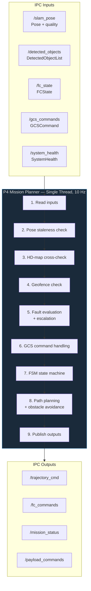

# Process 4 — Mission Planner: Design Document

> **Scope**: Detailed design of the Mission Planner process (`process4_mission_planner`).
> This document covers the FSM lifecycle, path planning strategies, obstacle avoidance,
> geofencing, fault management, and the main planning loop.

---

## Table of Contents

1. [Overview](#overview)
2. [Thread Architecture](#thread-architecture)
3. [IPC Channels](#ipc-channels)
4. [Component: MissionFSM](#component-missionfsm)
5. [Component: Path Planners](#component-path-planners)
6. [Component: Obstacle Avoiders](#component-obstacle-avoiders)
7. [Component: Geofence](#component-geofence)
8. [Component: FaultManager](#component-faultmanager)
9. [HD-Map Static Obstacles](#hd-map-static-obstacles)
10. [Extracted Sub-Components (PR #157)](#extracted-sub-components-pr-157)
11. [Main Loop](#main-loop)
12. [Configuration Reference](#configuration-reference)
13. [Testing](#testing)
14. [Known Limitations](#known-limitations)

---

## Overview

Process 4 is the autonomous decision-making core. It reads SLAM pose and detected objects,
evaluates faults, plans trajectories, avoids obstacles, and outputs velocity commands
to the flight controller via Process 5 (Comms). It runs as **1 thread** at a configurable
rate (default 10 Hz).

**Key responsibilities:**
- Mission lifecycle management (arm → takeoff → navigate → RTL → land)
- Path planning via D* Lite incremental planner (sole backend — A* removed in Issue #203)
- Real-time obstacle avoidance via ObstacleAvoider3D (sole backend — 2D potential field removed in Issue #207)
- Polygon + altitude geofencing with ray-casting
- 10-type fault evaluation with escalation-only policy (12 with VIO health, PR #190)
- GCS command handling (RTL, LAND, mid-flight mission upload)
- HD-map static obstacle integration with camera cross-validation
- Waypoint advancement with payload triggering

---

## Thread Architecture



Single-threaded — all logic runs sequentially in one loop iteration. This eliminates
concurrency bugs at the cost of requiring each step to complete within the 100 ms budget.

---

## IPC Channels

### Subscriptions (inputs)

| Channel | Type | Source | Required |
|---------|------|--------|----------|
| `/slam_pose` | `drone::ipc::Pose` | P3 (slam_vio_nav) | Yes |
| `/detected_objects` | `drone::ipc::DetectedObjectList` | P2 (perception) | Yes |
| `/fc_state` | `drone::ipc::FCState` | P5 (comms) | Yes |
| `/gcs_commands` | `drone::ipc::GCSCommand` | P5 (comms) | Optional |
| `/mission_upload` | `drone::ipc::MissionUpload` | P5 (comms) | Optional |
| `/system_health` | `drone::ipc::SystemHealth` | P7 (system_monitor) | Optional |

### Publications (outputs)

| Channel | Type | Consumers |
|---------|------|-----------|
| `/trajectory_cmd` | `drone::ipc::TrajectoryCmd` | P5 (comms → FC) |
| `/fc_commands` | `drone::ipc::FCCommand` | P5 (comms → FC) |
| `/mission_status` | `drone::ipc::MissionStatus` | P5 (comms → GCS), P7 |
| `/payload_commands` | `drone::ipc::PayloadCommand` | P6 (payload_manager) |
| `/drone_thread_health_mission_planner` | `drone::ipc::ThreadHealth` | P7 (system_monitor) |

---

## Component: MissionFSM

- **Header:** [`mission_fsm.h`](../process4_mission_planner/include/planner/mission_fsm.h)
- **Tests:** [`test_mission_fsm.cpp`](../tests/test_mission_fsm.cpp) (7 tests)
- **Namespace:** `drone::planner`

### State Machine

```
   IDLE ──on_arm()──► PREFLIGHT ──on_takeoff()──► TAKEOFF
                                                      │
                                          survey_duration_s > 0?
                                           yes │          no │
                                               ▼             │
                                            SURVEY           │
                                               │             │
                                  on_navigate()│◄────────────┘
                                               ▼
   EMERGENCY ◄──on_emergency()── NAVIGATE ──on_loiter()──► LOITER
                                    │    │                   │
                                    │    │ collision         │
                                    │    ▼ predicted         │
                                    │  COLLISION_RECOVERY    │
                                    │    │ (reverse + skip)  │
                                    │    └──► NAVIGATE       │
                                    │                        │
                                    │ on_rtl()       on_rtl()│
                                    ▼                        ▼
                                   RTL ──on_land()──► LAND ──on_landed()──► IDLE
```

States are defined in `ipc/shm_types.h` as `MissionState` enum (shared across all processes).

### SURVEY State (Issue #237)

Post-takeoff obstacle survey: the drone hovers at takeoff position while performing a slow yaw sweep to populate the occupancy grid before navigating. This gives the D* Lite planner a more complete obstacle picture before the first waypoint leg.

**Behaviour:**
- Triggered when `survey_duration_s > 0` in config (default 0.0 = skip, TAKEOFF → NAVIGATE directly)
- Yaw rate: `survey_yaw_rate` (default 0.3 rad/s, ~21 s for a full 360°)
- Target yaw is wrapped to [-π, π] via `std::fmod` to prevent unbounded growth
- During the sweep, the occupancy grid is fed camera detections; the log reports static/promoted cell counts
- Transitions to NAVIGATE when `elapsed_s ≥ survey_duration_s`

**Config:**
| Key | Type | Default | Description |
|-----|------|---------|-------------|
| `mission_planner.survey_duration_s` | float | 0.0 | Survey hover duration (0 = skip) |
| `mission_planner.survey_yaw_rate` | float | 0.3 | Yaw rate during survey (rad/s) |

### COLLISION_RECOVERY State (Issue #226)

Emergency evasive state entered when a dynamic obstacle is predicted to collide within
`collision_time_threshold_s`. Implemented in [`collision_recovery.h`](../process4_mission_planner/include/planner/collision_recovery.h) (PR #270).

**Behaviour:**
1. **Entry:** Triggered from NAVIGATE when dynamic obstacle prediction (see [Dynamic Obstacle Prediction](#dynamic-obstacle-prediction)) detects imminent collision
2. **Reverse:** Vehicle reverses along the last trajectory segment for `recovery_reverse_duration_s`
3. **Resume:** After reversal completes, the current waypoint is skipped and the mission resumes to the next waypoint
4. **Fault suppression:** During recovery, lower-severity fault actions (WARN, LOITER) are suppressed to avoid conflicting commands. Only RTL and EMERGENCY_LAND can override the recovery sequence.

**Config:**
| Key | Type | Default | Description |
|-----|------|---------|-------------|
| `mission_planner.collision_time_threshold_s` | float | — | Predicted collision time to trigger recovery |
| `mission_planner.recovery_reverse_duration_s` | float | — | Duration of reverse manoeuvre |

### Waypoint Struct

```cpp
struct Waypoint {
    float x, y, z;          // target position (world frame, metres)
    float yaw;              // target heading (radians)
    float radius;           // acceptance radius (m)
    float speed;            // cruise speed (m/s)
    bool  trigger_payload;  // trigger camera capture at this waypoint
};
```

### Key Methods

| Method | Description |
|--------|-------------|
| `load_mission(waypoints)` | Load waypoint list, reset index to 0 |
| `current_waypoint()` | Returns pointer to current waypoint (null if past end) |
| `advance_waypoint()` | Move to next waypoint. Returns false if mission complete |
| `waypoint_reached(px,py,pz,wp)` | 3D Euclidean distance < acceptance radius |
| `waypoint_overshot(px,py,pz)` | Direction-aware overshoot check (see below) |
| `set_fault_triggered(bool)` | Mark current state as fault-caused (blocks normal override) |

### Waypoint Overshoot Detection (Issue #236)

For intermediate waypoints (not the first or last), a dot-product check detects when the drone has overshot the target — i.e. flown past the waypoint without entering the acceptance radius.

**Algorithm:**
1. Compute the approach vector from the previous waypoint to the current waypoint
2. Compute the drone's offset from the current waypoint: `offset = drone_pos - wp_pos`
3. If `dot(offset, approach_vector) > 0` — the drone is "past" the waypoint along the approach direction
4. **Proximity guard:** Only triggers when the drone is within `acceptance_radius × overshoot_proximity_factor` (default 3.0) of the waypoint — prevents false advancement when the drone is geometrically "past" but far away on a parallel track

**Constraints:**
- First waypoint (index 0): no overshoot check (no previous waypoint to define approach direction)
- Last waypoint: always requires full acceptance radius (no overshoot allowed — ensures the mission truly completes)

**Config:** `mission_planner.overshoot_proximity_factor` (float, default 3.0)

---

## Component: Path Planners

Two pluggable strategies implement `IPathPlanner::plan(pose, waypoint) → ShmTrajectoryCmd`.
Selected via `mission_planner.path_planner.backend` config key.

### IPathPlanner Interface

- **Header:** [`ipath_planner.h`](../process4_mission_planner/include/planner/ipath_planner.h)
- **Factory:** `create_path_planner(backend_name) → unique_ptr<IPathPlanner>`

### DStarLitePlanner (`"dstar_lite"`) — the only path planner

- **Header:** [`dstar_lite_planner.h`](../process4_mission_planner/include/planner/dstar_lite_planner.h)
- **Tests:** [`test_dstar_lite_planner.cpp`](../tests/test_dstar_lite_planner.cpp) (33 tests)

#### OccupancyGrid3D

3D voxel grid backing the D* Lite search:

| Parameter | Default |
|-----------|---------|
| Grid size | 100 × 100 × 20 cells |
| Resolution | 1.0 m/cell |
| Origin offset | Centre of grid |

**Dual-layer obstacle model:**
- **Static layer** (permanent): HD-map obstacles via `add_static_obstacle(x, y, radius, height)`.
  Cell inflation radius applied. No TTL — persist forever.
- **Dynamic layer** (TTL): Camera/radar-detected objects via `update_obstacles()`. Each occupied cell
  carries a timestamp. Cells expire after TTL (default 3 s) to handle transient detections.
  Stale cell expiration only runs when `objects.num_objects > 0 || !occupied_.empty()` — a single missed detection frame does not wipe the grid.

**Dynamic → Static Promotion (Issue #237):**
Two promotion paths convert dynamic cells to permanent static cells:

1. **Camera-only promotion:** When `promotion_hits > 0`, a dynamic cell must be observed `promotion_hits` times before becoming static. Default 0 = disabled.
2. **Radar-confirmed promotion:** When `FusedObject::radar_update_count >= radar_promotion_hits` (default 3), the cell is immediately promoted to static — radar provides high-confidence range data.

**Promotion suppression:** Cells within Chebyshev distance ≤ 1 of an existing static cell (`near_static_cell_()`) are not promoted. This prevents parallax-induced wall growth from multi-track artefacts.

**Depth confidence gating:** The `min_promotion_depth_confidence` parameter (in [`occupancy_grid_3d.h`](../process4_mission_planner/include/planner/occupancy_grid_3d.h)) controls which detections can promote temporary grid cells to permanent static cells. Default is 0.3; scenario configs override to 0.8 to block camera-only detections (depth confidence 0.01--0.7) while allowing radar-confirmed detections (confidence 1.0) through. This prevents false cell promotion from camera-only monocular depth estimates.

**2D disk inflation:** Obstacles are inflated only in XY at their Z level (not vertically). Per-object inflation uses `estimated_radius_m` when available (from radar-confirmed detections), otherwise the default `inflation_radius_m`.

**Self-exclusion zone:** The drone's own cell ±1 (3×3 Chebyshev neighbourhood) is never marked occupied, preventing the planner from thinking it is inside an obstacle.

**Change tracking:** `changed_cells_` records occupancy changes for incremental planners (D* Lite). Duplicate entries are suppressed — when a cell is both inserted and promoted in the same frame, only one change is emitted.

#### D* Lite Search Algorithm

- **Connectivity:** 8-connected (2D horizontal movement at flight altitude — Issue #234)
- **Heuristic:** Euclidean distance (admissible, consistent)
- **Goal snapping:** If the goal cell is occupied, search lateral neighbours in a spiral up to `snap_search_radius` cells (default 8). Prefers ±X/±Y shift over ±Z.
- **Max iterations:** Bounded to prevent runaway searches (default 50000, configurable via `max_iterations`)
- **Fallback:** If no path found, returns direct-line velocity (logged as warning)
- **Velocity output:** Direction along first path segment, EMA-smoothed
- **Replan interval:** Configurable via `replan_interval_s` (default 0.5 s in scenario 18)
- **Speed ramping:** Within `ramp_dist_m` of the waypoint, speed is linearly reduced to `min_speed_mps`

#### Z-Band Search Restriction (Issue #234)

When `z_band_cells > 0`, the 3D search space is restricted to a vertical band of ±N cells around the start/goal Z range: `z_min = min(start.z, goal.z) - z_band_cells`, `z_max = max(...) + z_band_cells`. This dramatically reduces search volume for altitude-varying missions. Default is 0 (unlimited).

#### km Reinitialization Threshold (Issue #237)

D* Lite accumulates a `km` correction as the drone moves (`km += heuristic(old_start, new_start)`). When `km > 10.0`, the accumulated heuristic inflation makes incremental updates expensive. The planner reinitializes from scratch.

**Full reinitialization triggers:**
1. New goal or uninitialized
2. Queue size > 100,000 (memory bloat)
3. `km > 10.0` (heuristic inflation — Issue #237)
4. `changes.size() > 500` (cascading invalidations cheaper to recompute)

#### Backward Path Rejection (Issue #237)

When D* Lite produces a path where the first step points away from the goal (dot-product < 0) and a usable cached path exists, the planner **keeps the old path** rather than commanding the drone backward. This prevents oscillation when replanning produces suboptimal intermediate solutions during grid changes.

#### Pure-Pursuit Carrot Following

When `look_ahead_m > 0` (default 0.0), the planner uses pure-pursuit instead of cell-by-cell path following. `find_carrot()` walks forward along the planned path by the look-ahead distance and interpolates a smooth target point. The drone advances conservatively (half-cell) in carrot mode. When `look_ahead_m = 0` (legacy mode), the planner advances to the next cell when within `resolution_m × 1.5`.

### Planner + Avoider Pipeline (per-tick during NAVIGATE)

The path planner and obstacle avoider are **two distinct stages** that run in sequence
every tick inside P4. Both are entirely part of our stack — Gazebo (or real hardware)
only provides raw sensor data; all planning and avoidance logic runs on the companion
computer.

```text
                     Our Stack (P4 — mission_planner)
                     ════════════════════════════════
                                                                        External
  Perception (P2)                                                       ════════
  ┌──────────────┐
  │ Camera frames │──→ color_contour / YOLO detector ──→ ByteTrack tracker
  │ Radar scans   │──→ UKF fusion engine                                Gazebo / Real HW
  └──────────────┘                                                      provides raw
        │                                                               sensor data only
        ▼
  /detected_objects (IPC)
        │
        ▼
  ┌──────────────────────────────────────────────────────────────────┐
  │  Stage 1: D* Lite Path Planner                                   │
  │  ─────────────────────────────                                   │
  │  • Builds 3D occupancy grid from HD-map + camera detections      │
  │  • Searches for collision-free path from current pose → waypoint │
  │  • If path found → outputs velocity along first path segment     │
  │  • If NO path found (e.g. waypoint is at obstacle location)      │
  │    → logs "Planner fallback: no obstacle-free path"              │
  │    → outputs direct-line velocity toward waypoint                │
  └──────────────────────────┬───────────────────────────────────────┘
                             │ planned velocity
                             ▼
  ┌──────────────────────────────────────────────────────────────────┐
  │  Stage 2: ObstacleAvoider3D (3D Potential Field)                 │
  │  ───────────────────────────────────────────────                  │
  │  • Computes repulsive forces from nearby detected objects        │
  │  • Inverse-square decay within influence_radius_m                │
  │  • Predictive: uses object velocities for 0.5s look-ahead       │
  │  • Modifies the planned velocity to steer around obstacles       │
  │  • Even when Stage 1 falls back to direct-line, Stage 2 still   │
  │    pushes the drone away — this is the safety net                │
  └──────────────────────────┬───────────────────────────────────────┘
                             │ corrected velocity
                             ▼
                    /trajectory_cmd (IPC) → P5 (comms) → flight controller
```

**Key point:** When scenario logs show "Planner fallback: no obstacle-free path," the drone
is **not** flying blind. The D* Lite planner couldn't find a grid path (common when waypoints
are placed at obstacle locations), but the ObstacleAvoider3D still applies real-time repulsive
forces to steer around obstacles. The two stages are complementary — the planner handles
global route planning, the avoider handles local reactive avoidance.

---

## Component: Obstacle Avoiders

`IObstacleAvoider::avoid(planned, pose, objects) → ShmTrajectoryCmd`.
Selected via `mission_planner.obstacle_avoider.backend` config key.
PotentialFieldAvoider (2D) removed in Issue #207 — ObstacleAvoider3D is the only implementation.

### IObstacleAvoider Interface

- **Header:** [`iobstacle_avoider.h`](../process4_mission_planner/include/planner/iobstacle_avoider.h)
- **Factory:** `create_obstacle_avoider(backend, influence_radius, repulsive_gain)`

### ObstacleAvoider3D (`"3d"` / `"obstacle_avoider_3d"` / `"potential_field_3d"`)

- **Header:** [`obstacle_avoider_3d.h`](../process4_mission_planner/include/planner/obstacle_avoider_3d.h)
- **Tests:** [`test_obstacle_avoider_3d.cpp`](../tests/test_obstacle_avoider_3d.cpp) (18 tests)
- Full 3D repulsive field (includes Z component via configurable `vertical_gain`)
- Predictive avoidance: uses object velocities for 0.5 s look-ahead
- Inverse-square force decay with configurable repulsive gain
- Clamped corrections: max ±`max_correction_mps` per axis (default 3.0)
- Filters: stale objects (>`max_age_ms`, default 500 ms), low-confidence (<0.3)
- NaN input protection

#### Path-Aware Mode (Issue #229)

When `path_aware = true` (default), the avoider prevents reactive repulsion from fighting the planner's intended direction. This is critical when D* Lite has already computed an optimal route around obstacles — without path-awareness, the repulsive field can push the drone *backward* along the planned path, causing oscillation or route deviation.

**Algorithm:**
1. Compute the planned velocity direction: `dir = normalize(planned_velocity)`
2. Project the repulsive force onto the planned direction: `along = dot(repulsion, dir)`
3. If `along < 0` (repulsion opposes planned direction), strip the opposing component: `repulsion -= along * dir`
4. The remaining lateral component provides a "nudge" perpendicular to the path without fighting the planner

**Effect:** The avoider only applies corrections that are lateral (perpendicular) to the planned trajectory. D* Lite handles macro-level rerouting; the avoider handles micro-level lateral nudges for obstacles that appear between replanning cycles.

**Configuration:**
| Parameter | Default | Description |
|-----------|---------|-------------|
| `path_aware` | `true` | Enable path-aware lateral-only mode |
| `vertical_gain` | `1.0` | Z-axis repulsion multiplier (0.0 = lateral-only, 1.0 = full 3D) |
| `max_age_ms` | `500` | Maximum object age before filtering |
| `max_correction_mps` | `3.0` | Per-axis correction clamp |

### Dynamic Obstacle Prediction (Issue #226)

UKF velocity vectors from tracked objects are used to predict future positions and
proactively detect collisions. Implemented in [`mission_state_tick.h`](../process4_mission_planner/include/planner/mission_state_tick.h).

**Algorithm:**
1. For each tracked object with a UKF velocity estimate, predict its position over `prediction_horizon_s` (default 3.0 s)
2. Predicted positions are injected into the occupancy grid as temporary cells, giving the D* Lite planner advance warning of obstacle movement
3. If a predicted position intersects the drone's planned trajectory within `collision_time_threshold_s`, the FSM transitions to COLLISION_RECOVERY

**Config:**
| Key | Type | Default | Description |
|-----|------|---------|-------------|
| `mission_planner.prediction_horizon_s` | float | 3.0 | How far ahead to predict object positions |
| `mission_planner.collision_time_threshold_s` | float | — | Predicted collision time threshold to trigger recovery |

---

## Component: Geofence

- **Header:** [`geofence.h`](../process4_mission_planner/include/planner/geofence.h)
- **Tests:** [`test_geofence.cpp`](../tests/test_geofence.cpp) (21 tests)
- **Namespace:** `drone::planner`

### Algorithm

- **Polygon containment:** Ray-casting (point-in-polygon) — works for convex and concave polygons
- **Altitude band:** Floor and ceiling enforcement
- **Warning margin:** Pre-breach alert distance
- **NaN/Inf protection:** Returns safe `not-violated` for invalid inputs

### Key Methods

| Method | Description |
|--------|-------------|
| `set_polygon(vertices)` | Set boundary polygon (≥3 vertices) |
| `set_altitude_limits(floor, ceiling)` | Set vertical bounds |
| `set_warning_margin(m)` | Set pre-breach warning distance |
| `enable(bool)` | Enable/disable checking |
| `check(x, y, alt) → GeofenceResult` | Returns `{violated, margin_m, message}` |

### Integration with Main Loop

- Checked every tick when airborne (skipped during TAKEOFF to avoid false triggers near ground)
- Breach sets `fault_mgr.set_geofence_violation(true)` → triggers RTL via FaultManager
- Warning margin provides early alert before actual violation

---

## Component: FaultManager

- **Header:** [`fault_manager.h`](../process4_mission_planner/include/planner/fault_manager.h)
- **Tests:** [`test_fault_manager.cpp`](../tests/test_fault_manager.cpp) (31 tests)
- **Namespace:** `drone::planner`

### Design Principles

1. **Escalation-only:** Once an action is raised, it can only be superseded by a higher-severity action
2. **Config-driven:** All thresholds from `fault_manager.*` JSON keys
3. **Stateful:** Maintains high-water mark, loiter timer, geofence state across evaluate() calls

### Fault Types (bitmask)

| Flag | Trigger | Action |
|------|---------|--------|
| `FAULT_CRITICAL_PROCESS` | comms or SLAM reported dead | LOITER |
| `FAULT_POSE_STALE` | Pose age > 500 ms | LOITER |
| `FAULT_BATTERY_LOW` | Battery < 30% | WARN |
| `FAULT_BATTERY_RTL` | Battery < 20% | RTL |
| `FAULT_BATTERY_CRITICAL` | Battery < 10% | EMERGENCY_LAND |
| `FAULT_THERMAL_WARNING` | Thermal zone = 2 | WARN |
| `FAULT_THERMAL_CRITICAL` | Thermal zone ≥ 3 | RTL |
| `FAULT_PERCEPTION_DEAD` | Perception process not alive | WARN |
| `FAULT_FC_LINK_LOST` | FC disconnected > 3 s | LOITER → RTL (15 s) |
| `FAULT_GEOFENCE_BREACH` | Position outside polygon or altitude band | RTL |

> **Pending (PR #190, Issue #169):** Two additional VIO health faults:
> `FAULT_VIO_DEGRADED` (Pose quality ≤ 1 → LOITER) and `FAULT_VIO_LOST` (Pose quality = 0 → RTL).

### Action Severity Ordering

```
NONE < WARN < LOITER < RTL < EMERGENCY_LAND
```

### Escalation Flow

```
evaluate()
  ├─ Check 10 fault conditions → compute recommended_action
  ├─ Apply high-water mark (never downgrade)
  └─ If LOITER for > loiter_escalation_timeout (30s) → escalate to RTL
```

### FC Link-Loss Contingency

Two-stage response:
1. **3 s disconnected** → LOITER (wait for reconnect)
2. **15 s disconnected** → RTL (contingency timeout)

---

## HD-Map Static Obstacles

Static obstacles are loaded from `mission_planner.static_obstacles[]` in the config.
Each entry has `{x, y, radius_m, height_m}`.

### Camera Cross-Validation

The main loop tracks a `StaticObstacleRecord` for each HD-map entry:
- Every tick, checks if any camera detection falls within `radius_m + 1 m` laterally
  and `height_m + 0.5 m` vertically
- After 2 independent hits → marked as **confirmed** (logged for scenario validation)
- Unconfirmed obstacles still block A* (conservative policy)
- Warning logged when approaching an unconfirmed obstacle (within 3 m, throttled at 10 s)

### Collision Detection

Proximity-based check during NAVIGATE:
- If drone centre enters within `radius_m + 0.5 m` at or below obstacle height → log collision warning
- Throttled to once per 2 s to avoid log flooding

---

## Extracted Sub-Components (PR #157)

PR #157 refactored the monolithic `main.cpp` (809 → 366 lines) by extracting four
logically cohesive sub-systems into header-only classes under `process4_mission_planner/include/planner/`.
Each class is independently unit-tested with injected mocks — no Zenoh or real hardware required.

PR #270 added `collision_recovery.h` for the collision recovery FSM state.
PR #346 added review fixes to `gcs_command_handler.h`, `fault_response_executor.h`, and `mission_state_tick.h`.

### `FaultResponseExecutor`

**Header:** [`planner/fault_response_executor.h`](../process4_mission_planner/include/planner/fault_response_executor.h)

Executes fault responses (WARN → LOITER → RTL → EMERGENCY_LAND) based on the
current `FaultAction` from `FaultManager`. Enforces the **escalation-only policy**
(severity can never decrease) and skips action when the drone is not airborne.

| Method | Description |
|--------|-------------|
| `execute(action, state, bus)` | Apply fault action to trajectory + FC command |
| `reset()` | Clear applied action (on clean landing) |

### `GcsCommandHandler`

**Header:** [`planner/gcs_command_handler.h`](../process4_mission_planner/include/planner/gcs_command_handler.h)

Dispatches GCS commands (RTL / LAND / MISSION_UPLOAD) from `/gcs_commands`.
Deduplicates by command timestamp to prevent double-execution on resubscription.

| Method | Description |
|--------|-------------|
| `handle(cmd, state, waypoints)` | Process one GCS command; returns updated state |

**Stop trajectory convention:** All `publish_stop_trajectory` helpers send `valid=true` with zero velocities. P5 ignores `TrajectoryCmd` with `valid=false`, so the previous approach of sending `valid=false` to stop the vehicle was a no-op bug — the drone would continue on its last trajectory.

### `MissionStateTick`

**Header:** [`planner/mission_state_tick.h`](../process4_mission_planner/include/planner/mission_state_tick.h)

Contains all per-tick FSM transition logic (PREFLIGHT / TAKEOFF / SURVEY / NAVIGATE / RTL / LAND / IDLE).
Previously inlined inside the main planning loop; extraction makes each state independently testable.

| Method | Description |
|--------|-------------|
| `tick(ctx)` | Advance FSM one tick; `ctx` bundles pose, FC state, waypoints, bus refs |

### `StaticObstacleLayer`

**Header:** [`planner/static_obstacle_layer.h`](../process4_mission_planner/include/planner/static_obstacle_layer.h)

Loads HD-map static obstacles from config, performs camera cross-validation
(2-hit confirmation), and provides collision proximity checks.
Extracted from the previous inline logic in the planning loop.

| Method | Description |
|--------|-------------|
| `load(cfg)` | Parse `static_obstacles[]` config entries |
| `cross_check(pose, detections)` | Update confirmation hits per obstacle |
| `check_collision(pose)` | Returns true if drone is within margin of any obstacle |

---

## Main Loop

The planning loop runs at `mission_planner.update_rate_hz` (default 10 Hz):

```
while (running) {
    1. Touch heartbeat + systemd watchdog
    2. Read drone::ipc::Pose, drone::ipc::DetectedObjectList, drone::ipc::FCState, drone::ipc::SystemHealth
    3. Pose staleness check (500ms threshold)
    4. Camera cross-check of HD-map obstacles
    5. Geofence check (airborne only, skip TAKEOFF)
    6. FaultManager::evaluate() → apply escalation if needed
    7. Check GCS commands (RTL, LAND, MISSION_UPLOAD) — dedup by timestamp
    8. FSM state machine:
       - PREFLIGHT: send ARM every 3s until FC confirms
       - TAKEOFF: send TAKEOFF, wait for 90% altitude
       - SURVEY: hover + yaw sweep to populate occupancy grid (if survey_duration_s > 0)
       - NAVIGATE: plan path → avoid obstacles → publish trajectory
                   check waypoint reached → advance or RTL
       - RTL: monitor position → LAND when near home (after min dwell)
       - LAND: monitor altitude → IDLE when < 0.5m
    9. Publish drone::ipc::MissionStatus (state, progress, faults)
   10. Publish thread health at ~1 Hz
   11. Log diagnostics if warnings/errors
   12. Sleep for loop_sleep_ms
}
```

### FC Command Protocol

FC commands are sent via `drone::ipc::FCCommand` with a monotonic `sequence_id` for deduplication.
Commands carry the thread-local `CorrelationContext` for end-to-end tracing.

| Command | When |
|---------|------|
| ARM | PREFLIGHT, every 3 s until FC confirms armed |
| TAKEOFF(alt) | TAKEOFF, once |
| RTL | Mission complete, GCS RTL, fault RTL |
| LAND | Near home during RTL, GCS LAND, emergency |

---

## Configuration Reference

### `mission_planner.*`

| Key | Type | Default | Description |
|-----|------|---------|-------------|
| `update_rate_hz` | int | 10 | Main loop frequency |
| `takeoff_altitude_m` | float | 5.0 | Target takeoff altitude |
| `acceptance_radius_m` | float | 1.0 | Default waypoint radius |
| `cruise_speed_mps` | float | 2.0 | Default waypoint speed |
| `rtl_acceptance_radius_m` | float | 1.5 | Horizontal distance to trigger LAND during RTL |
| `landed_altitude_m` | float | 0.5 | Altitude threshold for "landed" detection |
| `rtl_min_dwell_seconds` | int | 5 | Min time in RTL before sending LAND |
| `survey_duration_s` | float | 0.0 | Post-takeoff obstacle survey hover duration (0 = skip) |
| `survey_yaw_rate` | float | 0.3 | Yaw rate during SURVEY (rad/s) |
| `overshoot_proximity_factor` | float | 3.0 | Waypoint overshoot proximity zone multiplier |
| `collision_time_threshold_s` | float | — | Predicted collision time to trigger COLLISION_RECOVERY |
| `recovery_reverse_duration_s` | float | — | Duration of reverse manoeuvre during collision recovery |
| `prediction_horizon_s` | float | 3.0 | Dynamic obstacle prediction look-ahead (seconds) |
| `path_planner.backend` | string | `"dstar_lite"` | Only `"dstar_lite"` is supported (A* removed in Issue #203) |
| `path_planner.max_iterations` | int | 50000 | D* Lite search iteration limit |
| `path_planner.replan_interval_s` | float | 0.5 | Replan interval (seconds between replans) |
| `path_planner.ramp_dist_m` | float | 3.0 | Speed ramp-down distance from waypoint |
| `path_planner.min_speed_mps` | float | 1.0 | Minimum speed during ramp-down |
| `path_planner.snap_search_radius` | int | 8 | Goal snap search radius (cells) |
| `path_planner.z_band_cells` | int | 0 | Z-band search restriction (0 = unlimited) |
| `path_planner.look_ahead_m` | float | 0.0 | Pure-pursuit carrot look-ahead distance (0 = cell-by-cell) |
| `occupancy_grid.resolution_m` | float | 0.5 | Grid cell size (metres) |
| `occupancy_grid.inflation_radius_m` | float | 1.5 | Obstacle inflation radius |
| `occupancy_grid.dynamic_obstacle_ttl_s` | float | 3.0 | Dynamic obstacle time-to-live |
| `occupancy_grid.min_confidence` | float | 0.3 | Minimum detection confidence for grid update |
| `occupancy_grid.min_promotion_depth_confidence` | float | 0.3 | Depth confidence threshold for static cell promotion |
| `occupancy_grid.promotion_hits` | int | 0 | Camera-only hit count for static promotion (0 = disabled) |
| `occupancy_grid.radar_promotion_hits` | int | 3 | Radar update count for immediate static promotion |
| `obstacle_avoider.backend` | string | `"potential_field_3d"` | Only ObstacleAvoider3D is supported (2D removed in Issue #207) |
| `obstacle_avoidance.min_distance_m` | float | 2.0 | Minimum avoidance trigger distance |
| `obstacle_avoidance.influence_radius_m` | float | 5.0 | Repulsive field radius |
| `obstacle_avoidance.repulsive_gain` | float | 2.0 | Repulsive force multiplier |
| `obstacle_avoidance.max_correction_mps` | float | 3.0 | Per-axis velocity correction clamp |
| `obstacle_avoidance.min_confidence` | float | 0.3 | Minimum object confidence to consider |
| `obstacle_avoidance.max_age_ms` | int | 500 | Maximum object age before filtering |
| `obstacle_avoidance.prediction_dt_s` | float | 0.5 | Look-ahead time for velocity-based prediction |
| `obstacle_avoidance.path_aware` | bool | true | Enable path-aware lateral-only mode (Issue #229) |
| `obstacle_avoidance.vertical_gain` | float | 1.0 | Z-axis repulsion multiplier (0 = lateral only) |
| `geofence.enabled` | bool | true | Enable geofence checking |
| `geofence.polygon[]` | array | 100×100m square | Boundary vertices `{x, y}` |
| `geofence.altitude_floor_m` | float | 0.0 | Minimum altitude |
| `geofence.altitude_ceiling_m` | float | 120.0 | Maximum altitude |
| `geofence.warning_margin_m` | float | 5.0 | Pre-breach warning distance |
| `waypoints[]` | array | 4 waypoints | Mission waypoints `{x, y, z, yaw, speed, payload_trigger}` |
| `static_obstacles[]` | array | — | HD-map obstacles `{x, y, radius_m, height_m}` |

### `fault_manager.*`

| Key | Type | Default | Description |
|-----|------|---------|-------------|
| `pose_stale_timeout_ms` | int | 500 | Pose age threshold for LOITER |
| `battery_warn_percent` | float | 30.0 | Battery → WARN |
| `battery_rtl_percent` | float | 20.0 | Battery → RTL |
| `battery_crit_percent` | float | 10.0 | Battery → EMERGENCY_LAND |
| `fc_link_lost_timeout_ms` | int | 3000 | FC disconnect → LOITER |
| `fc_link_rtl_timeout_ms` | int | 15000 | FC disconnect → RTL (contingency) |
| `loiter_escalation_timeout_s` | int | 30 | LOITER → RTL escalation delay |

---

## Testing

| Test File | Tests | Coverage |
|-----------|-------|----------|
| [`test_mission_fsm.cpp`](../tests/test_mission_fsm.cpp) | 15 | FSM transitions, waypoint loading, radius check, overshoot detection |
| [`test_dstar_lite_planner.cpp`](../tests/test_dstar_lite_planner.cpp) | 55 | Grid, D* Lite search, incremental replan, goal-snap, Z-band, km reinit, carrot smoothing, backward rejection, factory |
| [`test_obstacle_avoider_3d.cpp`](../tests/test_obstacle_avoider_3d.cpp) | 21 | 3D repulsion, predictive, NaN, path-aware mode, vertical_gain, factory |
| [`test_geofence.cpp`](../tests/test_geofence.cpp) | 24 | Polygon, altitude, margin, NaN/Inf |
| [`test_fault_manager.cpp`](../tests/test_fault_manager.cpp) | 41 | All 10 faults, escalation, loiter timeout, FC contingency, VIO health |
| [`test_static_obstacle_layer.cpp`](../tests/test_static_obstacle_layer.cpp) | 12 | Load empty/single/multi HD-map entries, cross-check 2-hit confirmation, low-quality pose skip, collision/no-collision, cooldown throttle, height check |
| [`test_gcs_command_handler.cpp`](../tests/test_gcs_command_handler.cpp) | 20 | RTL/LAND/MISSION_UPLOAD/PAUSE/RESUME dispatch, dedup by timestamp, unknown command ignored |
| [`test_fault_response_executor.cpp`](../tests/test_fault_response_executor.cpp) | 7 | WARN (no FC cmd), LOITER, RTL, EMERGENCY_LAND, escalation-only policy, non-airborne skip, reset clears state |
| [`test_mission_state_tick.cpp`](../tests/test_mission_state_tick.cpp) | 14 | PREFLIGHT ARM retry, TAKEOFF altitude threshold, SURVEY yaw sweep, waypoint reached + payload trigger, mission complete → RTL, RTL disarm → IDLE, landed → IDLE + fault reset |
| **Total** | **209** | |

Integration coverage via scenario tests in `config/scenarios/`:
- `01_nominal_mission.json` — 4-WP rectangular flight, no faults
- `02_obstacle_avoidance.json` — D* Lite + 3D avoider with HD-map obstacles (Tier 2, Gazebo)
- `03_battery_degradation.json` — Battery fault escalation
- `04_fc_link_loss.json` — FC link-loss contingency
- `05_geofence_breach.json` — Geofence breach detection
- `18_perception_avoidance.json` — Sensor-driven obstacle avoidance with no HD-map (static_obstacles empty). Camera+radar UKF fusion detects all obstacles at runtime, D* Lite replans dynamically, SURVEY phase for pre-detection. Compare with 02 which pre-loads HD-map. (Tier 2, Gazebo)

---

## Observability

P4 is the hub for GCS correlation IDs. Commands arriving on
`/gcs_commands` start a `ScopedCorrelation` that is propagated to all
downstream outputs (`/trajectory_cmd`, `/fc_commands`, mission status
logs).

### Structured Logging

| Field | Description |
|-------|-------------|
| `process` | `"mission_planner"` |
| `fsm_state` | Current FSM state name (e.g. `"MISSION"`, `"RTL"`, `"LOITER"`) |
| `waypoint_index` | Active waypoint index |
| `correlation_id` | 64-bit hex value (e.g. `0x000012340000001a`) from originating GCS command (if present) |
| `planner_backend` | Active path planner name |
| `avoider_backend` | Active obstacle avoider name |

> **Note:** These values appear in the `msg` text field of the JSON log line.
> `--json-logs` does not emit them as separate top-level JSON keys.

### Correlation IDs

| Source | Propagated to |
|--------|--------------|
| `/gcs_commands` (from P5) | `/trajectory_cmd`, `/fc_commands`, all P4 log lines while command is active |

Enable with `--json-logs`; search log output for `"correlation_id"`.

### Latency Tracking

| Channel | Direction |
|---------|----------|
| `/detected_objects` | subscriber |
| `/slam_pose` | subscriber |
| `/fc_state` | subscriber |
| `/gcs_commands` | subscriber |
| `/system_health` | subscriber |

Latency is tracked automatically on each `receive()` call. Call
`subscriber->log_latency_if_due(N)` in the planner thread to
periodically emit a p50/p90/p99 histogram (µs) to the log.

See [observability.md](observability.md) for the full correlation ID
flow diagram and histogram interpretation.

---

## Known Limitations

1. **Single-threaded:** All logic must complete within one loop period (100 ms at 10 Hz).
   D* Lite search is bounded by `max_iterations` but could still spike on complex grids.
2. ~~**No dynamic replanning on map change:**~~ **RESOLVED** (Issue #237). D* Lite maintains a persistent graph and re-plans incrementally when the occupancy grid changes. Replan interval is configurable (`replan_interval_s`).
3. **2D geofence:** Polygon is 2D (XY plane). No 3D volume geofencing.
4. **No return-path obstacle avoidance during RTL:** RTL delegates to PX4's RTL mode;
   the mission planner only monitors position to intercept with LAND.
5. **Waypoint yaw not enforced:** The FSM advances waypoints based on position only;
   yaw heading is set via trajectory output but not checked for arrival.
6. **Carrot mode + geofence interaction:** Pure-pursuit carrot following does not factor geofence boundaries when computing the look-ahead point. A carrot near the geofence edge could momentarily pull the drone toward the boundary.
7. **D* Lite reinit cost:** When reinitialization triggers fire (large queue, high km, excessive changes), the full search restarts from scratch. On large grids this can cause a one-frame latency spike.
