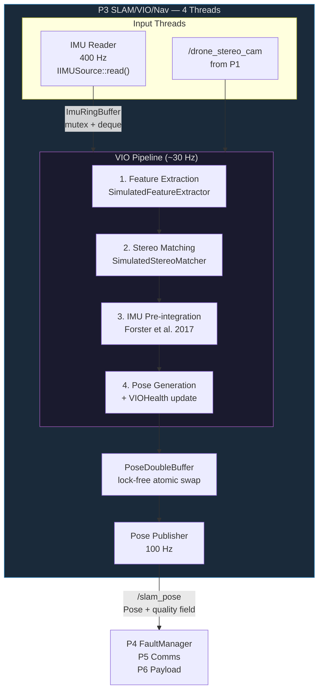

# Process 3 — SLAM/VIO/Nav: Design Document

> **Scope**: Detailed design of the SLAM/VIO/Navigation process (`process3_slam_vio_nav`).
> This document covers the visual-inertial odometry pipeline, IMU pre-integration,
> stereo matching, feature extraction, and pose estimation.

---

## Table of Contents

- [Process 3 — SLAM/VIO/Nav: Design Document](#process-3--slamvionav-design-document)
  - [Table of Contents](#table-of-contents)
  - [Overview](#overview)
  - [Thread Architecture](#thread-architecture)
  - [IPC Channels](#ipc-channels)
    - [Subscriptions (inputs)](#subscriptions-inputs)
    - [Publications (outputs)](#publications-outputs)
  - [Component: IVIOBackend](#component-iviobackend)
    - [Interface](#interface)
    - [Backends](#backends)
    - [SimulatedVIOBackend Pipeline](#simulatedviobackend-pipeline)
    - [Health State Machine](#health-state-machine)
    - [VIOOutput](#viooutput)
  - [Component: IFeatureExtractor](#component-ifeatureextractor)
    - [Interface](#interface-1)
    - [SimulatedFeatureExtractor](#simulatedfeatureextractor)
  - [Component: IStereoMatcher](#component-istereomatcher)
    - [Interface](#interface-2)
    - [SimulatedStereoMatcher](#simulatedstereomatcher)
    - [StereoMatch Struct](#stereomatch-struct)
  - [Component: ImuPreintegrator](#component-imupreintegrator)
    - [Pre-integrated Measurement](#pre-integrated-measurement)
    - [IMU Noise Model](#imu-noise-model)
    - [Error Detection](#error-detection)
  - [Thread-Safe Data Structures](#thread-safe-data-structures)
    - [PoseDoubleBuffer](#posedoublebuffer)
    - [ImuRingBuffer](#imuringbuffer)
  - [VIO Error Handling](#vio-error-handling)
    - [VIOError Structure](#vioerror-structure)
    - [Error Codes](#error-codes)
  - [Configuration Reference](#configuration-reference)
    - [`slam.*`](#slam)
    - [`slam.keyframe.*`](#slamkeyframe)
  - [Testing](#testing)
  - [Known Limitations](#known-limitations)

---

## Overview

Process 3 is the navigation backbone of the drone. It fuses stereo camera imagery with
high-rate IMU data to produce 6-DOF pose estimates via visual-inertial odometry (VIO).
The pose output feeds the Mission Planner (P4) and Comms (P5) for flight control and
telemetry.

The process runs **4 threads**:

| Thread | Rate | Role |
|--------|------|------|
| IMU Reader | 400 Hz | Reads IMU samples via HAL, pushes to ring buffer |
| VIO Pipeline | ~30 Hz | Feature extraction → stereo matching → IMU pre-integration → pose |
| Pose Publisher | 100 Hz | Publishes latest pose to IPC bus |
| Main (health) | 1 Hz | Publishes thread health, logs status |

---

## Thread Architecture



---

## IPC Channels

### Subscriptions (inputs)

| Channel | Type | Source | Required |
|---------|------|--------|----------|
| `/drone_stereo_cam` | `ShmStereoFrame` | P1 (video_capture) | Yes (SHM); warn-only (Zenoh) |

### Publications (outputs)

| Channel | Type | Consumers |
|---------|------|-----------|
| `/slam_pose` | `ShmPose` | P4 (mission_planner), P5 (comms) |
| `/drone_thread_health_slam_vio_nav` | `ShmThreadHealth` | P7 (system_monitor) |

---

## Component: IVIOBackend

- **Header:** [`ivio_backend.h`](../process3_slam_vio_nav/include/slam/ivio_backend.h)
- **Tests:** [`test_vio_backend.cpp`](../tests/test_vio_backend.cpp) (15 tests)
- **Namespace:** `drone::slam`

### Interface

```cpp
class IVIOBackend {
    virtual VIOResult<VIOOutput> process_frame(
        const ShmStereoFrame& frame,
        const std::vector<ImuSample>& imu_samples) = 0;
    virtual VIOHealth health() const = 0;
    virtual std::string name() const = 0;
};
```

### Backends

| Backend | Config value | Description |
|---------|-------------|-------------|
| `SimulatedVIOBackend` | `"simulated"` | Circular trajectory with noise. Runs full pipeline (extract → match → preintegrate) but generates pose independently. |
| `GazeboVIOBackend` | `"gazebo"` | Reads ground-truth odometry from gz-transport topic. Ignores stereo/IMU data. Requires `HAVE_GAZEBO` build flag. |

### SimulatedVIOBackend Pipeline

```
ShmStereoFrame + IMU samples
        │
        ├─ 1. Feature extraction (SimulatedFeatureExtractor)
        │      └─ Returns FeatureExtractionResult (features + timing)
        │
        ├─ 2. Stereo matching (SimulatedStereoMatcher)
        │      └─ Returns StereoMatchResult (matches + depth + timing)
        │      └─ Non-fatal failure → DEGRADED health, continue with IMU
        │
        ├─ 3. IMU pre-integration (ImuPreintegrator)
        │      └─ Computes Δα, Δβ, Δγ (position, velocity, rotation deltas)
        │      └─ Non-fatal failure → warning, pose still generated
        │
        ├─ 4. Pose generation (simulated circular trajectory)
        │      └─ Uses steady_clock timestamps (same epoch as FaultManager)
        │
        └─ 5. Health state machine update
               └─ INITIALIZING → NOMINAL → DEGRADED → LOST
```

### Health State Machine

| Transition | Condition |
|------------|-----------|
| INITIALIZING → NOMINAL | After `min_init_frames` (default 5) processed |
| NOMINAL → DEGRADED | Features < 30 or stereo matches < 15 |
| DEGRADED → NOMINAL | Features ≥ 30 and matches ≥ 15 |
| Any → LOST | Feature extraction hard failure |

### VIOOutput

```cpp
struct VIOOutput {
    Pose      pose;
    VIOHealth health;
    int       num_features, num_stereo_matches, imu_samples_used;
    double    feature_ms, stereo_ms, preint_ms, total_ms;
    uint64_t  frame_id;
};
```

---

## Component: IFeatureExtractor

- **Header:** [`ifeature_extractor.h`](../process3_slam_vio_nav/include/slam/ifeature_extractor.h)
- **Tests:** [`test_feature_extractor.cpp`](../tests/test_feature_extractor.cpp) (11 tests)

### Interface

```cpp
class IFeatureExtractor {
    virtual VIOResult<FeatureExtractionResult> extract(
        const ShmStereoFrame& frame,
        FrameDiagnostics& diag) = 0;
};
```

### SimulatedFeatureExtractor

- Generates synthetic features in a grid pattern across the image
- Feature count: 80–120 (randomised)
- Each feature gets a unique ID, pixel coordinates, and confidence score
- Tracks extraction timing for diagnostics

---

## Component: IStereoMatcher

- **Header:** [`istereo_matcher.h`](../process3_slam_vio_nav/include/slam/istereo_matcher.h)
- **Tests:** [`test_stereo_matcher.cpp`](../tests/test_stereo_matcher.cpp) (14 tests)

### Interface

```cpp
class IStereoMatcher {
    virtual VIOResult<StereoMatchResult> match(
        const ShmStereoFrame& frame,
        const std::vector<Feature>& features,
        FrameDiagnostics& diag) = 0;
};
```

### SimulatedStereoMatcher

- Generates synthetic disparities for input features
- Uses `StereoCalibration` for depth computation: `z = fx * baseline / disparity`
- Match rate: ~70% (randomised drop to simulate real-world failures)
- Computes mean depth and standard deviation
- Reports confidence per match

### StereoMatch Struct

```cpp
struct StereoMatch {
    uint32_t        feature_id;
    Eigen::Vector2f left_pixel, right_pixel;
    float           disparity;    // left_x - right_x (pixels)
    float           depth;        // baseline * focal / disparity (metres)
    float           confidence;   // [0, 1]
};
```

---

## Component: ImuPreintegrator

- **Header:** [`imu_preintegrator.h`](../process3_slam_vio_nav/include/slam/imu_preintegrator.h)
- **Source:** [`imu_preintegrator.cpp`](../process3_slam_vio_nav/src/imu_preintegrator.cpp)
- **Tests:** [`test_imu_preintegrator.cpp`](../tests/test_imu_preintegrator.cpp) (12 tests)

Implements the Forster et al. (2017) IMU pre-integration formulation.

### Pre-integrated Measurement

Between two keyframes, the pre-integrator computes:
- **Δα** — position change in body frame
- **Δβ** — velocity change in body frame
- **Δγ** — rotation change (quaternion)
- **9×9 covariance matrix** — uncertainty propagation
- **9×6 Jacobian w.r.t. biases** — first-order bias correction without re-integration

### IMU Noise Model

```cpp
struct ImuNoiseParams {
    double gyro_noise_density;   // rad/s/√Hz  (default 0.004)
    double gyro_random_walk;     // rad/s²/√Hz (default 2.2e-5)
    double accel_noise_density;  // m/s²/√Hz   (default 0.012)
    double accel_random_walk;    // m/s³/√Hz   (default 8.0e-5)
};
```

### Error Detection

- **Gap detection:** Flags `ImuDataGap` if sample interval > 2× expected period
- **Saturation detection:** Flags `ImuSaturation` if accel > 160 m/s² or gyro > 35 rad/s
- **Minimum samples:** Returns error if fewer than 2 samples provided

---

## Thread-Safe Data Structures

### PoseDoubleBuffer

Lock-free double buffer for VIO pipeline → pose publisher exchange:
- Writer: `write(Pose)` on alternating buffer index (atomic release store)
- Reader: `read(Pose&)` via atomic acquire load of current index
- No mutex — designed for single-writer / single-reader pattern
- `mark_initialized()` gate prevents reading before first pose

### ImuRingBuffer

Bounded ring buffer for IMU reader → VIO pipeline exchange:
- `push(ImuSample)` — mutex-protected, drops oldest if full (default capacity 2048)
- `drain(vector<ImuSample>&)` — moves all buffered samples to caller
- Tracks total pushed and drop counts for diagnostics

---

## VIO Error Handling

All VIO components return `VIOResult<T> = Result<T, VIOError>`.

### VIOError Structure

```cpp
struct VIOError {
    VIOErrorCode code;       // structured error code
    std::string  component;  // which stage failed
    std::string  message;    // human-readable
    uint64_t     frame_id;   // which frame triggered the error
};
```

### Error Codes

| Code | Component | Recovery |
|------|-----------|----------|
| `InsufficientFeatures` | Feature extractor | Health → DEGRADED |
| `FeatureExtractionFailed` | Feature extractor | Health → LOST |
| `StereoMatchFailed` | Stereo matcher | Continue with IMU only |
| `LowDisparityVariance` | Stereo matcher | Health → DEGRADED |
| `ImuDataGap` | Pre-integrator | Warning, continue |
| `ImuSaturation` | Pre-integrator | Warning, continue |
| `TrackingLost` | Pipeline | Health → LOST |
| `InitializationPending` | Pipeline | Health stays INITIALIZING |

---

## Configuration Reference

### `slam.*`

| Key | Type | Default | Description |
|-----|------|---------|-------------|
| `vio_rate_hz` | int | 100 | Pose publish rate |
| `visual_frontend_rate_hz` | int | 30 | (Legacy) visual frontend rate |
| `imu_rate_hz` | int | 400 | IMU sampling rate |
| `imu.backend` | string | `"simulated"` | IMU HAL backend |
| `vio.backend` | string | `"simulated"` | VIO backend (`"simulated"` or `"gazebo"`) |
| `vio.gz_topic` | string | `"/model/x500_companion_0/odometry"` | Gazebo odometry topic |
| `stereo.fx` | double | 350.0 | Focal length X (pixels) |
| `stereo.fy` | double | 350.0 | Focal length Y (pixels) |
| `stereo.cx` | double | 320.0 | Principal point X |
| `stereo.cy` | double | 240.0 | Principal point Y |
| `stereo.baseline` | double | 0.12 | Stereo baseline (metres) |
| `imu.gyro_noise_density` | double | 0.004 | Gyro noise (rad/s/√Hz) |
| `imu.gyro_random_walk` | double | 2.2e-5 | Gyro random walk |
| `imu.accel_noise_density` | double | 0.012 | Accel noise (m/s²/√Hz) |
| `imu.accel_random_walk` | double | 8.0e-5 | Accel random walk |

### `slam.keyframe.*`

| Key | Type | Default | Description |
|-----|------|---------|-------------|
| `min_parallax_px` | float | 15.0 | Min parallax for new keyframe |
| `min_tracked_ratio` | float | 0.6 | Min tracked feature ratio |
| `max_time_sec` | float | 0.5 | Max time between keyframes |

---

## Testing

| Test File | Tests | Coverage |
|-----------|-------|----------|
| [`test_vio_backend.cpp`](../tests/test_vio_backend.cpp) | 15 | Simulated + Gazebo backends, health transitions |
| [`test_feature_extractor.cpp`](../tests/test_feature_extractor.cpp) | 11 | Feature extraction, error cases |
| [`test_stereo_matcher.cpp`](../tests/test_stereo_matcher.cpp) | 14 | Stereo matching, depth computation |
| [`test_imu_preintegrator.cpp`](../tests/test_imu_preintegrator.cpp) | 12 | Pre-integration, gap/saturation detection |
| **Total** | **52** | |

---

## Observability

P3 is latency-critical: IMU runs at 400 Hz and VIO at 100 Hz. Both loops
emit structured logs and LatencyTracker histograms.

### Structured Logging

| Field | Description |
|-------|-------------|
| `process` | `"slam_vio_nav"` |
| `vio_rate_hz` | Measured VIO loop rate (last 100 iterations) |
| `tracked_features` | Feature count after optical flow |
| `keyframe_inserted` | `true` when a keyframe was added this epoch |
| `pose_x` / `pose_y` / `pose_z` | Published world-frame position (m) |
| `imu_rate_hz` | Measured IMU integration rate |

> **Note:** These values appear in the `msg` text field of the JSON log line.
> `--json-logs` does not emit them as separate top-level JSON keys.

### Correlation IDs

P3 does not participate in GCS correlation. The published `/slam_pose`
carries a `timestamp_ns` that downstream subscribers use for their own
latency measurements.

### Latency Tracking

| Channel | Direction |
|---------|----------|
| `/drone_stereo_cam` | subscriber |

Latency is tracked automatically on each `receive()` call. Call
`subscriber->log_latency_if_due(N)` in the visual frontend thread to
periodically emit a p50/p90/p99 histogram (µs) to the log.

See [observability.md](observability.md) for histogram interpretation.

---

## VIO Health → FaultManager Integration

The `Pose.quality` field carries VIO health information from P3 to P4:

| VIOHealth | `quality` | Meaning |
|-----------|-----------|---------|
| LOST | 0 | lost |
| INITIALIZING | 1 | degraded |
| DEGRADED | 1 | degraded |
| NOMINAL | 2 | good |
| _(Gazebo ground truth)_ | 3 | excellent |

P4's `FaultManager` reads `Pose.quality` on every `evaluate()` tick:
- **quality ≤ 0** → `FAULT_VIO_LOST` → RTL
- **quality ≤ 1** → `FAULT_VIO_DEGRADED` → LOITER

The simulated backend starts in INITIALIZING (quality=1) for the first 5 frames (~165 ms).
This does not cause a false fault trigger because `FaultResponseExecutor` skips
non-airborne states (IDLE, PREFLIGHT), and VIO reaches NOMINAL well before TAKEOFF.

> **Note:** VIO health fault escalation is implemented in PR #190 (Issue #169).

---

## Known Limitations

1. **No real VIO fusion:** The Simulated backend generates poses independently of visual/IMU data.
   Full sensor fusion (optimiser backend) is planned for Phase 2B.
2. **No keyframe selection:** Keyframe config keys exist but no keyframe decision logic runs yet.
3. **No loop closure:** No place recognition or loop closure optimisation.
4. **No relocalization:** Once tracking is LOST, there is no recovery path — the health
   stays LOST until the process is restarted.
5. **Fixed stereo calibration:** Calibration parameters are loaded at startup and cannot
   be updated at runtime.
