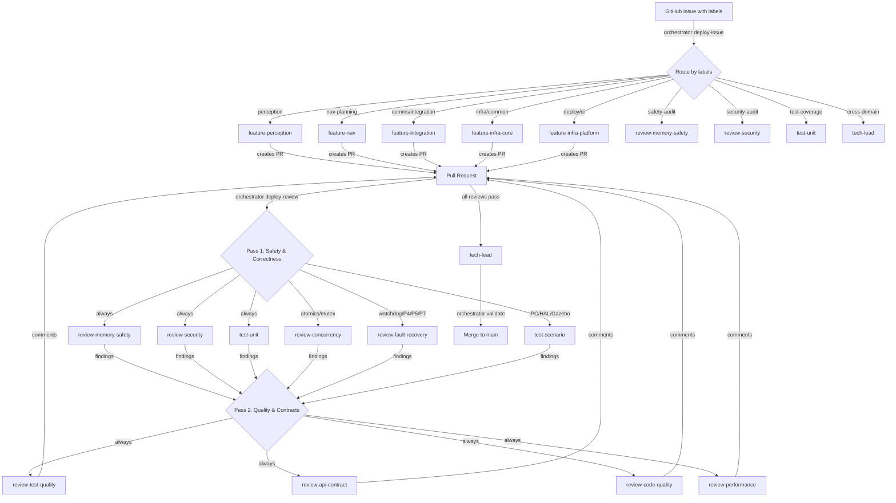
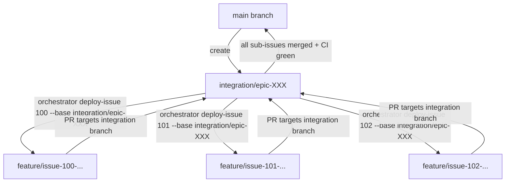

# Multi-Agent Pipeline Guide

This guide explains how the 17-agent pipeline works, how to use it, and how agents coordinate with each other and GitHub.

## How It Works

The pipeline applies **Amdahl's Law** to software verification: feature agents produce code in parallel, but more importantly, up to 10 verification agents verify every PR in **two parallel passes** — Pass 1 for safety & correctness (3-6 agents), Pass 2 for quality & contracts (4 agents). The only serial step is the tech lead's merge decision — minimizing the serial fraction that limits speedup.

```
                          ┌──────────────────────────────────────────────────────┐
                          │                    GitHub                            │
                          │  Issues ──► Labels ──► PRs ──► Reviews ──► Merge    │
                          └──────┬──────────────────────────────┬───────────────┘
                                 │                              │
                    ┌────────────▼────────────┐    ┌────────────▼────────────┐
                    │  orchestrator             │    │  orchestrator             │
                    │  deploy-issue 123         │    │  deploy-review 456        │
                    │   (routes by labels)      │    │   (routes by diff)        │
                    └────────────┬────────────┘    └────────────┬────────────┘
                                 │                              │
                    ┌────────────▼────────────┐    ┌────────────▼────────────┐
                    │  orchestrator start       │    │  orchestrator start      │
                    │   (model + role setup)    │    │   (parallel launches)    │
                    └────────────┬────────────┘    └────────────┬────────────┘
                                 │                              │
              ┌──────────────────▼──────────────────────────────▼──────────┐
              │                    Agent Execution                         │
              │                                                           │
              │  ┌─────────────────────────────────────────────────────┐  │
              │  │              FEATURE AGENTS (produce)               │  │
              │  │  perception │ nav │ integration │ infra-core │ plat │  │
              │  └──────────────────────┬──────────────────────────────┘  │
              │                         │ PR created                      │
              │  ┌──────────────────────▼──────────────────────────────┐  │
              │  │     PASS 1: SAFETY & CORRECTNESS (parallel)        │  │
              │  │  memory-safety │ concurrency │ fault │ security    │  │
              │  │  unit-test     │ scenario-test                     │  │
              │  └──────────────────────┬──────────────────────────────┘  │
              │  ┌──────────────────────▼──────────────────────────────┐  │
              │  │     PASS 2: QUALITY & CONTRACTS (parallel)         │  │
              │  │  test-quality │ api-contract │ code-quality │ perf │  │
              │  │  (receives Pass 1 findings as context)             │  │
              │  └──────────────────────┬──────────────────────────────┘  │
              │                         │                                 │
              └─────────────────────────┼─────────────────────────────────┘
                                        │
                          ┌─────────────▼─────────────┐
                          │        TECH LEAD           │
                          │  (serial merge decision)   │
                          │  orchestrator validate     │
                          └─────────────┬─────────────┘
                                        │
                                  Merge to main
```

## Agent Interaction Flow



## Integration Branch Flow (Multi-Issue Epics)

When a feature spans multiple issues across domains, use an **integration branch** to keep main demo-ready:



## The 17-Agent Roster

### Production Agents (write code)

| # | Role | Model | Scope |
|---|------|-------|-------|
| 1 | `tech-lead` | Opus | Routing, merge decisions, coordination |
| 2 | `feature-perception` | Opus | P1/P2, camera/detector HAL |
| 3 | `feature-nav` | Opus | P3/P4, planner/avoider HAL |
| 4 | `feature-integration` | Opus | P5/P6/P7, IPC, HAL backends |
| 5 | `feature-infra-core` | Opus | common/, CMake, config |
| 6 | `feature-infra-platform` | Opus | deploy/, CI, boards/, certification |

### Pass 1 — Safety & Correctness (read-only, parallel)

| # | Role | Model | Trigger | Focus |
|---|------|-------|---------|-------|
| 7 | `review-memory-safety` | Opus | Always | RAII, ownership, lifetimes |
| 8 | `review-concurrency` | Opus | If atomics/mutex/thread in diff | Races, atomics, deadlocks |
| 9 | `review-fault-recovery` | Opus | If P4/P5/P7/watchdog in diff | Watchdog, degradation |
| 10 | `review-security` | Opus | Always | Input validation, auth, TLS |
| 11 | `test-unit` | Sonnet | Always | GTest, coverage delta (tests/ only) |
| 12 | `test-scenario` | Sonnet | If IPC/HAL/Gazebo in diff | Gazebo SITL, integration (tests/ only) |

### Pass 2 — Quality & Contracts (read-only, parallel after Pass 1)

These agents always run and receive Pass 1 findings as context, allowing them to verify that flagged code has adequate test coverage, accurate documentation, and acceptable quality.

| # | Role | Model | Focus |
|---|------|-------|-------|
| 13 | `review-test-quality` | Opus | Tests exercise new code paths, assertions meaningful, boundary conditions |
| 14 | `review-api-contract` | Sonnet | Docstrings match implementation, data consistency, naming accuracy |
| 15 | `review-code-quality` | Sonnet | Dead code, DRY violations, complexity, naming, unnecessary abstractions |
| 16 | `review-performance` | Sonnet | Unnecessary copies, allocation in hot paths, algorithmic complexity |

### Operations Agent

| # | Role | Model | Focus |
|---|------|-------|-------|
| 17 | `ops-github` | Haiku | Issue triage, milestones, board |

### Agent Boundaries

Each agent has a defined scope of files it may edit. Review agents are **read-only** — they can only read code and post comments. The `python -m orchestrator boundaries` command enforces these boundaries (advisory in CI).

## Setup for New Users

The multi-agent framework runs on **your local machine** using the Claude Code CLI. Each user needs their own setup — there is no shared account or server.

### Prerequisites

| Requirement | Install | Verify |
|-------------|---------|--------|
| Python 3.10+ | System package or pyenv | `python3 --version` |
| Claude Code CLI | [docs.anthropic.com/en/docs/claude-code](https://docs.anthropic.com/en/docs/claude-code) | `claude --version` |
| GitHub CLI | `sudo apt install gh` or [cli.github.com](https://cli.github.com) | `gh auth status` |
| Build toolchain | See [GETTING_STARTED.md](GETTING_STARTED.md) | `cmake --version && clang-format-18 --version` |

### First-Time Setup

```bash
# 1. Clone the repo
git clone https://github.com/nmohamaya/companion_software_stack.git
cd companion_software_stack

# 2. Authenticate Claude Code CLI (uses YOUR API key — costs go to your account)
claude auth

# 3. Authenticate GitHub CLI
gh auth login

# 4. Set PYTHONPATH so the orchestrator module is discoverable
export PYTHONPATH=scripts     # Add to .bashrc / .zshrc to make permanent

# 5. Verify agent definitions exist
ls .claude/agents/    # Should show 17 .md files

# 6. Verify shared context exists
ls .claude/shared-context/   # Should show domain-knowledge.md, project-status.md

# 7. Build the project (needed before agents can run tests)
bash deploy/build.sh

# 8. Test the setup with a dry run
python -m orchestrator deploy-issue 123 --dry-run    # Shows routing without launching
python -m orchestrator list                          # Shows all 17 agent roles
```

### What's Included in the Repo

Everything an agent needs is checked into git:

| Component | Path | Purpose |
|-----------|------|---------|
| Agent definitions | `.claude/agents/*.md` | Role scope, tools, instructions per agent |
| Project instructions | `CLAUDE.md` | Build commands, architecture, coding standards |
| Shared context | `.claude/shared-context/` | Project status + domain knowledge (injected into every agent prompt) |
| Orchestrator package | `scripts/orchestrator/` | Python CLI: routing, pipeline FSM, review, tech-lead |
| Scenario configs | `config/scenarios/*.json` | Integration test scenarios |

### What's NOT Shared

| Item | Why | What to do |
|------|-----|-----------|
| API credentials | Per-user, per-account | Run `claude auth` with your key |
| GitHub auth tokens | Per-user | Run `gh auth login` |
| Session logs | Machine-local | Generated at `tasks/sessions/*.log` |
| Worktrees | Machine-local | Created at `.claude/worktrees/` by pipeline |
| Claude Code memory | Per-user (`~/.claude/`) | Builds up over time as you work |

### Cost Awareness

Each agent invocation consumes API tokens charged to **your** Claude account. Rough guide:
- Feature agent (Opus): ~$1-5 per issue depending on complexity
- Review agent (Opus): ~$0.50-2 per PR review
- Test agent (Sonnet): ~$0.25-1 per test run
- Pass 2 review agent (Sonnet): ~$0.25-1 per review
- Pipeline mode: runs 1 feature + 3-6 Pass 1 + 4 Pass 2 agents = ~$5-15 per issue

Use `--dry-run` on any script to preview what would be launched without spending tokens.

## Quick Start

> **Important:** All `python -m orchestrator` commands must be run from the **project root** with `PYTHONPATH=scripts` set (see First-Time Setup step 4).

### 1. Deploy an Agent for a GitHub Issue

The simplest way to use the pipeline — point it at an issue and it handles the rest:

```bash
# Interactive (default) — you approve changes and converse in real time
python -m orchestrator deploy-issue 123

# Headless mode — agent works autonomously, non-interactive
python -m orchestrator deploy-issue 123 --headless

# Preview routing without executing
python -m orchestrator deploy-issue 123 --dry-run

# Pipeline mode — 5 checkpoints with automated steps between
python -m orchestrator deploy-issue 123 --pipeline

# For epic sub-issues, branch from the integration branch
python -m orchestrator deploy-issue 123 --base integration/epic-XXX
```

#### Launch Modes

| Mode | Flag | Permissions | You do... |
|------|------|-------------|-----------|
| **Interactive** | *(default)* | You approve each change | Converse with the agent in real time |
| **Headless** | `--headless` | File edits auto-approved | Review `AGENT_REPORT.md` after, then accept/change/reject |
| **Pipeline** | `--pipeline` | 5 human checkpoints | Automated steps between checkpoints (see Pipeline Mode) |
| **Pipeline + notify** | `--pipeline --notify <topic>` | Same as pipeline | Same + push notifications on phone at each checkpoint |

**What happens (all modes):**
1. Fetches the issue from GitHub (title, body, labels)
2. Routes to an agent based on labels (priority-based: specific labels beat broad ones)
3. Creates a git worktree + branch
4. Updates `tasks/active-work.md`
5. Launches the agent with the issue context as its prompt

**Auto mode additionally:**
6. Agent commits locally but does NOT push or create a PR
7. Agent writes `AGENT_REPORT.md` with a structured change report
8. You review the report and choose: **accept**, **request changes**, or **reject**

### 2. Launch a Review on a PR

```bash
# Auto-route reviewers based on the PR's diff content
python -m orchestrator deploy-review 456

# Preview which reviewers would be triggered
python -m orchestrator deploy-review 456 --dry-run

# Force all reviewers
python -m orchestrator deploy-review 456 --all
```

Review agents launch in two passes and post a consolidated comment on the PR when done. Monitor progress in a separate terminal:

```bash
# Watch log sizes grow (see which agents are still working)
watch -n 5 'wc -l tasks/sessions/*-review-pr456-*.log'

# Tail a specific reviewer's output in real time
tail -f tasks/sessions/*-review-pr456-review-memory-safety.log
```

### 3. Manual Mode — Step-by-Step Walkthrough

This is the most hands-on workflow. You control every step, running each script individually. Best for learning the pipeline or when you want full visibility.

> **Note on paths:** When working inside a worktree (`.claude/worktrees/issue-N/`),
> scripts live in the main repo, not the worktree. Set `REPO_ROOT` to the main repo path:
> ```bash
> export REPO_ROOT=/path/to/companion_software_stack
> ```
> All script commands below use `$REPO_ROOT/scripts/...` to work from any directory.

#### Step 1: Deploy the feature agent interactively

```bash
# Preview routing first
python -m orchestrator deploy-issue 315 --base integration/epic-357 --dry-run

# Launch — you'll approve changes and converse with the agent
python -m orchestrator deploy-issue 315 --base integration/epic-357
```

The agent opens an interactive session. You guide the work, approve edits, and the agent commits when you're satisfied.

#### Step 2: Validate the agent's work (hallucination detection)

```bash
python -m orchestrator validate
```

Review the output — it checks build, test count, test execution, `#include` paths, and PR body references. Fix any issues before proceeding.

#### Step 3: Push and create the PR

```bash
cd .claude/worktrees/issue-315
git push -u origin <branch-name>
gh pr create --base integration/epic-357
```

#### Step 4: Deploy review agents on the PR

```bash
# Back in the main repo directory
python -m orchestrator deploy-review <pr-number>
```

This launches review agents in two passes — Pass 1 (safety: memory-safety, security, + conditional concurrency/fault-recovery) then Pass 2 (quality: test-quality, api-contract, code-quality, performance with Pass 1 findings). Monitor them:

```bash
# In a separate terminal — watch progress
watch -n 5 'wc -l tasks/sessions/*-review-pr<number>-*.log'

# Peek at a specific reviewer
tail -f tasks/sessions/*-review-pr<number>-review-memory-safety.log
```

When complete, a consolidated review is posted as a PR comment.

#### Step 5: Review the findings

The consolidated review is posted as a PR comment with findings grouped by reviewer and severity:

| Severity | Meaning | Action |
|----------|---------|--------|
| **P1** | Critical / blocks merge | Fix immediately |
| **P2** | Memory, perf, should fix | Fix before merge |
| **P3** | Code quality | Fix or document why not — follow-up OK |
| **P4** | Tests, docs, nice-to-have | Fix if time permits |

Read the PR comment on GitHub or fetch it locally:

```bash
# View the review comment
gh pr view <pr-number> --comments
```

#### Step 6: Feed review findings to the feature agent

Open an interactive session in the worktree with the **same feature agent** that did the original work — it has the most context for fixing issues.

```bash
cd .claude/worktrees/issue-<NUMBER>
python -m orchestrator start <agent-role>
```

Then paste a structured prompt listing each finding with severity, location, and the fix. Be specific — the more detail you give, the better the fixes:

```
The review agents found these issues on PR #<NUMBER>. Fix all P1 and P2 findings:

P1 (must fix):
1. <finding> — <specific fix instruction with file:line if available>
2. <finding> — <specific fix instruction>

P2 (should fix):
1. <finding> — <specific fix instruction>
2. <finding> — <specific fix instruction>

P3 (follow-up OK — file as separate issues if not fixing now):
1. <finding>
```

**Tips for writing the fix prompt:**
- Copy the fix suggestions directly from the review comment — reviewers give specific code snippets
- Include file paths and line numbers when the review provides them
- Group by severity so the agent prioritizes correctly
- Tell the agent explicitly which severities to fix now vs defer

The agent applies the fixes. You approve each change interactively.

**Example** (from a real review of IPC version fields):

```
The review agents found these issues on PR #361. Fix all P1 and P2 findings:

P1 (must fix):
1. validate() never checks version field — add `if (version != CURRENT_VERSION)
   return false;` as first line of every validate() method in ipc_types.h
2. FaultOverrides has no validate() method — add one that checks version and
   sentinel-range validity
3. IpcWaypoint aggregate inits in 5+ files NOT updated — silent coordinate
   corruption in process4_mission_planner/src/main.cpp,
   tests/test_fault_response_executor.cpp, tests/test_mission_state_tick.cpp,
   tests/test_mission_fsm.cpp, tests/test_collision_recovery.cpp
4. wire_deserialize accepts version-mismatched payloads — check
   out.version == T::CURRENT_VERSION after deserialization

P2 (should fix):
1. Add default member initializers (= 0, = {}, = false) to ALL fields in all
   IPC structs
2. Add _pad0 to FaultOverrides for consistency
3. Add missing static_assert(sizeof(...)) for SystemHealth, ThreadHealth,
   ProcessHealthEntry, ThreadHealthEntry, FaultOverrides, RadarDetection
4. Add version mismatch rejection tests for each struct
5. Add std::isfinite() checks for GCSCommand::validate() param1/param2/param3
```

#### Step 7: Re-validate and push fixes

```bash
python -m orchestrator validate
git push
```

Optionally re-run reviews on the updated PR to verify all findings are addressed:

```bash
python -m orchestrator deploy-review <pr-number>
```

#### Step 8: Merge in GitHub UI

Review the PR one final time in GitHub, then merge. After merge:

```bash
# Cleanup worktree and branches
python -m orchestrator cleanup
```

### 4. Orchestrated Session

For more control, use the session orchestrator which adds pre/post validation:

```bash
# Full session with pre-flight, agent, validation, and changelog
python -m orchestrator session feature-nav "Implement A* path planner" --issue 789
```

### 5. Launch an Agent Directly

For ad-hoc work or interactive sessions:

```bash
# List all available roles
python -m orchestrator list

# Launch with a task
python -m orchestrator start feature-perception "Add YOLOv8 detector backend"

# Interactive session (no task — opens Claude CLI)
python -m orchestrator start feature-nav

# Dry-run: print resolved config without launching
python -m orchestrator start feature-integration "test" --dry-run
```

### 6. Validate a Session

After an agent completes work, verify nothing was hallucinated:

```bash
# Validate current branch
python -m orchestrator validate

# Validate a specific branch
python -m orchestrator validate --branch feature/issue-123-foo
```

Checks: build succeeds, test count matches baseline, all tests pass, `#include` paths exist, PR body references real files.

### 7. After the Agent Finishes — Post-Agent Checklist

Once the agent completes its work (interactive or auto mode), changes are **local commits in the worktree** — nothing is pushed. Follow these steps:

```bash
# 1. Go to the worktree
cd .claude/worktrees/issue-<NUMBER>

# 2. Review what the agent did
git log --oneline <base-branch>..HEAD        # commits
git diff --stat <base-branch>..HEAD          # files changed

# 3. Validate (hallucination detection — checks build, tests, includes)
python -m orchestrator validate

# 4. Push and create PR
git push -u origin <branch-name>
gh pr create --base <base-branch>            # main or integration/epic-XXX

# 5. Deploy review agents on the PR
python -m orchestrator deploy-review <pr-number>

# 6. Address review comments, then merge the PR
```

**If using an integration branch** (multi-issue epic), there are additional steps after all sub-issues are merged:

```bash
# 7. Create final PR from integration branch to main
gh pr create --base main --head integration/epic-XXX \
  --title "feat(#XXX): Epic description"

# 8. After merge, cleanup
git branch -d integration/epic-XXX
git push origin --delete integration/epic-XXX
python -m orchestrator cleanup
```

**Quick reference for `<base-branch>`:**
- Single issue targeting main: `main`
- Sub-issue targeting an epic: `integration/epic-XXX`

### 8. View Dashboards and Stats

```bash
# Team-wide dashboard
python -m orchestrator dashboard --team

# Per-agent stats
python -m orchestrator dashboard --agent feature-perception

# Git-based agent stats (commits, lines, cost)
python -m orchestrator stats
```

### 9. Cleanup

```bash
# Remove stale branches and worktrees
python -m orchestrator cleanup

# Dry-run (show what would be cleaned)
python -m orchestrator cleanup --dry-run

# List all active worktrees
git worktree list
```

### 10. Tech-Lead Orchestration

The `orchestrate` command uses the tech-lead agent as a strategy layer to analyze issues, recommend routing/priority, and drive the full pipeline with human approval at every checkpoint.

```bash
# Orchestrate a single issue (tech-lead analyzes → routes → launches pipeline)
python -m orchestrator orchestrate 123

# Orchestrate an epic (tech-lead produces phased plan, executes sequentially)
python -m orchestrator orchestrate 500 --epic

# Preview the tech-lead's recommendation without executing
python -m orchestrator orchestrate 123 --dry-run
```

**Single-issue flow:**

1. Tech-lead (Opus) analyzes issue → recommends role, priority, sequencing, labels
2. Human reviews and approves/modifies routing
3. Ops-github (Haiku) applies labels and milestones
4. Feature agent works via `deploy-issue --pipeline` (5 checkpoints)

**Epic flow:**

1. Tech-lead produces a phased plan (Foundation → Feature → Polish)
2. Human approves the plan
3. Each phase's issues are orchestrated sequentially, with human approval between phases

### 11. Sync Project Status

Auto-regenerate `.claude/shared-context/project-status.md` from live data (git, GitHub, ctest) while preserving the human-authored `## Notes` section:

```bash
python -m orchestrator sync-status
```

This is also called automatically at pipeline CLEANUP and at the end of `orchestrator session`.

### 12. Health Report

```bash
python -m orchestrator health
```

Reports test count vs baseline, coverage delta, and build status.

## Pipeline Mode (`--pipeline`)

The pipeline mode chains all scripts into a single guided flow with **5 human checkpoints**. Everything between checkpoints is automated.

```bash
python -m orchestrator deploy-issue 123 --pipeline
python -m orchestrator deploy-issue 123 --pipeline --base integration/epic-300

# With mobile push notifications (ntfy.sh)
python -m orchestrator deploy-issue 123 --pipeline --notify drone-pipeline-yourname

# Or set topic via environment variable
export NTFY_TOPIC="drone-pipeline-yourname"
python -m orchestrator deploy-issue 123 --pipeline
```

### Remote Monitoring

Run pipelines on your dev machine and approve checkpoints from your phone. See the [Remote Pipeline Guide](REMOTE_PIPELINE_GUIDE.md) for full setup instructions.

**Quick version:**

1. Start the pipeline inside a tmux session: `tmux new-session -s pipeline-123`
2. SSH in from your phone (via NordVPN Meshnet or Tailscale + Termux)
3. Attach to the session: `tmux attach -t pipeline-123`
4. Optionally add `--notify <topic>` for push notifications at checkpoints

### Flow

```
Issue fetch + label routing (automated)
  → Worktree + branch creation (automated)
  → Agent works autonomously (automated)
  → AGENT_REPORT.md written
  │
  ▼
┌─────────────────────────────────────────────────────┐
│ CP1: Changes Review                                  │
│   You see: AGENT_REPORT.md + git diff --stat         │
│   Options: [a]ccept / [c]hanges / [r]eject           │
└─────────────────────┬───────────────────────────────┘
                      ▼
  orchestrator validate runs (automated: build, tests, hallucination detection)
                      │
┌─────────────────────▼───────────────────────────────┐
│ CP2: Hallucination Report                            │
│   You see: PASS/WARN/FAIL for build, test count,     │
│            test execution, #include paths, PR sanity  │
│   Options: [c]ommit / [b]ack to CP1 / [a]bort       │
└─────────────────────┬───────────────────────────────┘
                      ▼
  git push + PR title/body generated (automated)
                      │
┌─────────────────────▼───────────────────────────────┐
│ CP3: PR Preview                                      │
│   You see: PR title + body                           │
│   Options: [c]reate / [e]dit / [b]ack / [a]bort     │
└─────────────────────┬───────────────────────────────┘
                      ▼
  Pass 1 runs (automated: 3-6 safety & correctness agents in parallel)
  Pass 2 runs (automated: 4 quality & contract agents in parallel, with Pass 1 findings)
                      │
┌─────────────────────▼───────────────────────────────┐
│ CP4: Review & Test Findings                          │
│   You see: Merged findings from both passes          │
│   Pass 1: memory-safety, security, +conditional      │
│           concurrency, fault-recovery, test agents    │
│   Pass 2: test-quality, api-contract, code-quality,  │
│           performance (informed by Pass 1 findings)   │
│   Options: [a]ccept / [f]ix / [b]ack / [r]eject     │
└─────────────────────┬───────────────────────────────┘
                      ▼
  Feature agent fixes P1/P2 findings (automated, if [f]ix chosen)
  Re-runs review + test agents to verify fixes (automated)
                      │
┌─────────────────────▼───────────────────────────────┐
│ CP5: Final Summary                                   │
│   You see: commit log + validation status            │
│   Options: [d]one / [r]e-review / [b]ack / [a]bort  │
└─────────────────────┬───────────────────────────────┘
                      ▼
  Cleanup offered (automated)
  → Merge in GitHub UI (manual)
```

### Back-Navigation

Every checkpoint supports going **back** to the previous checkpoint. The pipeline is a state machine, not a linear sequence:

- **CP2 → CP1**: Re-review changes, request more modifications
- **CP3 → CP2**: Re-commit with different content
- **CP4 → CP3**: Edit PR before re-reviewing
- **CP5 → CP4**: Fix more items or re-review

### Example Walkthrough

```bash
$ python -m orchestrator deploy-issue 315 --pipeline --base integration/epic-300

═══════════════════════════════════════════════════════
  Phase 1/5 — Agent Working (feature-infra-core)
═══════════════════════════════════════════════════════
  ... agent works for ~5 minutes ...

═══════════════════════════════════════════════════════
  CHECKPOINT 1/5 — Changes Review
═══════════════════════════════════════════════════════
  # Change Report — Issue #315
  ## Summary
  Added version fields to all 21 IPC structs...
  ...
  [a] accept  [c] changes  [r] reject
  Your choice: a

  Running Validation (orchestrator validate)...
  [1/5] Build verification       PASS
  [2/5] Test count verification   PASS  (1309 tests)
  [3/5] Test execution            PASS
  [4/5] Include verification      PASS
  [5/5] PR sanity                 PASS

═══════════════════════════════════════════════════════
  CHECKPOINT 2/5 — Commit Approval
═══════════════════════════════════════════════════════
  Validation passed.
  [c] commit  [b] back  [a] abort
  Your choice: c

═══════════════════════════════════════════════════════
  CHECKPOINT 3/5 — PR Preview
═══════════════════════════════════════════════════════
  Title: feat(#315): Add version fields to all IPC structs
  Body: ...
  [c] create  [e] edit  [b] back  [a] abort
  Your choice: c
  PR created: https://github.com/.../pull/361

  Deploying review agents...
  Pass 1 (safety & correctness): 4 agents in parallel
  DONE  review-memory-safety
  DONE  review-security
  DONE  review-concurrency
  DONE  review-fault-recovery
  Pass 2 (quality & contracts): 4 agents in parallel
  DONE  review-test-quality
  DONE  review-api-contract
  DONE  review-code-quality
  DONE  review-performance

═══════════════════════════════════════════════════════
  CHECKPOINT 4/5 — Review Findings (2 passes)
═══════════════════════════════════════════════════════
  Pass 1: 0 P1, 2 P2, 1 P3
  Pass 2: 0 P1, 1 P2, 2 P3
  P1: validate() never checks version field (2 findings)
  P2: Missing default member initializers (1 finding)
  P2: Test doesn't exercise new validation path (1 finding)
  P3: Positional aggregate init fragile (1 finding)
  [a] accept  [f] fix  [b] back  [r] reject
  Your choice: f

  Launching feature agent to fix findings...
  ... agent fixes P1/P2 ...
  Re-validating... PASS

═══════════════════════════════════════════════════════
  CHECKPOINT 5/5 — Final Summary
═══════════════════════════════════════════════════════
  c885d53 feat(#315): Add version fields to all IPC structs
  a1b2c3d fix(#315): address review findings
  Validation passed.
  [d] done  [r] re-review  [b] back  [a] abort
  Your choice: d

  Pipeline Complete
  PR: https://github.com/.../pull/361
  Next step: Review and merge the PR in GitHub UI.
```

---

## Claude Code Skills (Interactive Pipeline)

In addition to the shell-based orchestrator commands, the pipeline is available as **Claude Code skills** that run inline in your current session. This provides a more natural interactive experience where Claude acts as tech-lead directly in the conversation.

### Available Skills

| Skill | Purpose |
|-------|---------|
| `/deploy-issue <N>` | Full pipeline inline — routing, agent work, 5 checkpoints, two-pass review, PR creation |
| `/deploy-issue <N> --base integration/epic-XXX` | Same but targeting an integration branch |
| `/commit` | Smart commit with format check, sensitive file detection, test count verification |
| `/review-pr <N>` | Two-pass domain-aware code review on a PR with severity-tagged findings |
| `/update-docs` | Auto-generate documentation updates for tracking files, design docs, and README |
| `/create-issue <type>: <title>` | Structured issue filing with domain detection, auto-labeling, and code context |
| `/run-scenario <N\|all>` | Gazebo SITL scenario runner with structured analysis and failure diagnosis |
| `/production-readiness` | 11-section pre-deployment audit (build, safety, security, tests, config, etc.) |

### Skills vs Orchestrator

| Capability | Orchestrator (`python -m orchestrator`) | Skills (`/deploy-issue`) |
|-----------|----------------------------------------|--------------------------|
| Agent launch | `claude` subprocess | Agent tool (inline) |
| Checkpoints | Console I/O prompts | Conversation (natural) |
| Tech-lead | Separate Claude process | Current session IS tech-lead |
| Two-pass reviews | Same routing | Same routing |
| Auto mode | `--auto` (no human) | N/A (always interactive) |
| Headless mode | `--headless` | N/A |
| tmux wrapping | `--tmux` | N/A (IDE native) |
| Mobile monitoring | `--notify <topic>` | N/A |

**When to use which:**
- **Skills**: interactive development in IDE/CLI — you're at your desk, want real-time conversation
- **Orchestrator**: unattended/CI use, remote monitoring via tmux+SSH, auto mode for batch processing

### Example

```
User: /deploy-issue 299 --base integration/epic-284

Claude: Fetching issue #299...
  Title: Add multi-class height priors for depth estimation
  Labels: [perception, enhancement]

  Routing Recommendation:
    Role: feature-perception
    Priority: P3 (specific domain match)
  Accept? [yes]

User: yes

Claude: Spawning feature-perception agent in isolated worktree...
  [agent works...]

  ═══ CHECKPOINT 1/5 — Changes Review ═══
  [presents AGENT_REPORT.md + diff stat]
  Recommendation: accept
```

---

## Label Routing Reference

Issues are routed to agents based on GitHub labels. When multiple domain labels exist, **priority wins** (not label order):

| Priority | Labels | Agent |
|----------|--------|-------|
| 3 (highest) | `perception`, `domain:perception` | feature-perception |
| 3 | `nav-planning`, `domain:nav` | feature-nav |
| 3 | `comms`, `domain:comms` | feature-integration |
| 3 | `ipc` | feature-infra-core |
| 2 | `integration`, `domain:integration` | feature-integration |
| 2 | `common`, `infra`, `infrastructure`, `modularity`, `domain:infra-core` | feature-infra-core |
| 1 (lowest) | `platform`, `deploy`, `ci`, `bsp`, `domain:infra-platform` | feature-infra-platform |
| Direct | `safety-audit` | review-memory-safety |
| Direct | `security-audit` | review-security |
| Direct | `test-coverage` | test-unit |
| Direct | `cross-domain` | tech-lead |

## Review & Test Routing Reference

`python -m orchestrator deploy-review` launches **review agents** and **test agents** in parallel, routed by diff content:

### Review Agents (safety review — read-only, Opus)

| Trigger in diff | Agents launched |
|-----------------|----------------|
| Any file | review-memory-safety + review-security |
| `std::atomic`, `mutex`, `thread`, `lock_guard` | + review-concurrency |
| P4/P5/P7 paths, watchdog, fault handling | + review-fault-recovery |

### Test Agents (build + test verification — Sonnet)

| Trigger in diff | Agents launched |
|-----------------|----------------|
| Any file | test-unit (build, run all tests, verify count vs baseline) |
| IPC, HAL, Gazebo configs | + test-scenario (scenario integration tests) |

Review agents analyze the diff for safety issues (P1-P4 severity). Test agents check out the PR branch, build, run tests, and verify test count against the baseline in `tests/TESTS.md`. All agents run in parallel and their output is consolidated into a single PR comment.

After fixes (`[f]ix` at CP4), **both review and test agents re-run automatically** to verify the fixes didn't introduce new issues or break tests.

## Shared State & Cross-Agent Context

Agents coordinate through these shared files:

| File | Purpose | Who writes | Who reads |
|------|---------|-----------|-----------|
| `tasks/active-work.md` | Live work tracker — what's in-progress | orchestrator deploy-issue (start + cleanup) | All agents at session start |
| `tasks/agent-changelog.md` | Completed work log — what was recently done | Pipeline CLEANUP, orchestrator session | All agents at session start |
| `.claude/shared-context/project-status.md` | Project state, priorities, blocking bugs, active epics | `orchestrator sync-status` + human notes | All agents at session start |
| `.claude/shared-context/domain-knowledge.md` | Non-obvious pitfalls discovered during work | Any agent (tech-lead reviews) | All agents at session start |
| `docs/guides/AGENT_HANDOFF.md` | Cross-domain handoff protocol | tech-lead | Agents during handoff |
| `tests/TESTS.md` | Test inventory and baseline count | Feature agents | All agents (verify test count) |
| `docs/tracking/PROGRESS.md` | Improvement history | Feature agents | Agents needing project context |
| `docs/tracking/ROADMAP.md` | Planned work and completion status | Feature agents | Agents checking what's done |
| `docs/tracking/BUG_FIXES.md` | Bug fix log with root causes | Feature agents | Agents investigating regressions |

### How Cross-Agent Context Works

Every agent session automatically receives context about other agents' work. Both `orchestrator deploy-issue` and `orchestrator start` inject this context into the agent's prompt at startup:

1. **Active work awareness** — The agent sees entries from `tasks/active-work.md` showing which issues are in-progress, on which branches, by which agents. This prevents two agents from unknowingly modifying the same files.

2. **Recent completion log** — The agent sees the last ~5 entries from `tasks/agent-changelog.md` showing what was recently completed. This prevents duplicate work and gives awareness of recent codebase changes.

3. **Project status** — The agent receives `.claude/shared-context/project-status.md`, which contains the current project state: active epics and their status, blocking bugs, priority queue, recent milestones, architecture decisions in effect. This is the "where are we now" briefing.

4. **Domain knowledge pitfalls** — The agent receives `.claude/shared-context/domain-knowledge.md`, which contains non-obvious technical pitfalls: build gotchas, API quirks, concurrency rules, sensor fusion architecture, known bugs and workarounds.

### Lifecycle of Shared State

```
Session Start                    Session End (Pipeline CLEANUP)
─────────────                    ─────────────────────────────
                                 
orchestrator deploy-issue         CLEANUP state:
  │                                │
  ├─ Write active-work.md         ├─ Mark active-work.md → completed
  │  (status: in-progress)        │
  │                                ├─ Append to agent-changelog.md
  ├─ Read active-work.md          │  (issue, branch, role, findings)
  │  (inject into prompt)          │
  │                                ├─ Check AGENT_REPORT.md for pitfalls
  ├─ Read agent-changelog.md      │  → remind about domain-knowledge.md
  │  (inject into prompt)          │
  │                                ├─ Run orchestrator sync-status
  ├─ Read project-status.md       │  (auto-update project-status.md)
  │  (inject into prompt)          │
  │                                └─ Verify issue↔PR linking
  └─ Read domain-knowledge.md
     (inject into prompt)
```

### Required Documentation Updates

Every agent (in both `--auto` and `--pipeline` mode) is instructed to update these docs before completing work:

- **`tests/TESTS.md`** — If tests were added/modified, update the count and add entries
- **`docs/tracking/PROGRESS.md`** — Add an improvement entry (number, title, date, files, rationale)
- **`docs/tracking/ROADMAP.md`** — Mark the issue as done if it appears in the roadmap
- **`docs/tracking/BUG_FIXES.md`** — Add an entry if the work is a bug fix

These updates ensure that the next agent session starts with accurate project state, not stale data.

## Workflow Examples

### Example 1: Single Issue

```bash
# 1. Create issue on GitHub with labels: "perception", "enhancement"
# 2. Deploy
python -m orchestrator deploy-issue 400

# Agent creates worktree, implements feature, creates PR
# 3. Review
python -m orchestrator deploy-review <pr-number>

# 4. Validate and merge
python -m orchestrator validate --branch feature/issue-400-...
# Tech lead merges if all checks pass
```

### Example 2: Multi-Issue Epic with Integration Branch

```bash
# 1. Create integration branch
git checkout -b integration/epic-500 main
git push -u origin integration/epic-500

# 2. Deploy sub-issues against the integration branch
python -m orchestrator deploy-issue 501 --base integration/epic-500
python -m orchestrator deploy-issue 502 --base integration/epic-500
python -m orchestrator deploy-issue 503 --base integration/epic-500

# Each agent creates a PR targeting integration/epic-500 (not main)

# 3. After all sub-PRs merge to integration branch:
# Create a single PR from integration/epic-500 → main
gh pr create --base main --head integration/epic-500 \
  --title "feat(#500): Epic description" \
  --body "Merges epic work from integration branch"

# 4. Delete integration branch after merge
git branch -d integration/epic-500
git push origin --delete integration/epic-500
```

### Example 3: Interactive Debugging Session

```bash
# Launch an agent interactively for a specific domain
python -m orchestrator start feature-integration

# You can now have a conversation with the agent about P5/P6/P7 code
```

### Example 4: Auto Mode — Full Walkthrough

This example walks through the complete `--auto` workflow for issue #315 (add version fields to IPC structs), targeting an integration branch.

#### Step 1: Create the integration branch (one-time per epic)

```bash
git branch integration/epic-357 main
git push -u origin integration/epic-357
```

#### Step 2: Ensure the issue has labels

```bash
$ gh issue view 315 --json labels --jq '.labels[].name'
ipc
platform
```

Good — `ipc` (priority 3) will route to `feature-infra-core`.

#### Step 3: Preview routing

```bash
$ python -m orchestrator deploy-issue 315 --base integration/epic-357 --dry-run

Fetching issue #315...
  Title:  feat(#300-C1): Add version fields to all IPC structs
  Labels: ipc
platform

Routing decision
  Issue:  #315 — feat(#300-C1): Add version fields to all IPC structs
  Role:   feature-infra-core
  Base:   integration/epic-357
  Branch: feature/issue-315-feat300-c1-add-version-fields-to-all-ipc

DRY RUN — would perform:
  1. git worktree add .claude/worktrees/issue-315 -b feature/issue-315-... integration/epic-357
  2. Update tasks/active-work.md
  3. Launch: orchestrator start feature-infra-core <issue prompt>
```

#### Step 4: Launch in auto mode

```bash
$ python -m orchestrator deploy-issue 315 --base integration/epic-357 --headless

Fetching issue #315...
  Title:  feat(#300-C1): Add version fields to all IPC structs
  Labels: ipc
platform

Routing decision
  Issue:  #315 — feat(#300-C1): Add version fields to all IPC structs
  Role:   feature-infra-core
  Base:   integration/epic-357
  Branch: feature/issue-315-feat300-c1-add-version-fields-to-all-ipc

Creating worktree...
  DONE  Worktree: .claude/worktrees/issue-315
  DONE  Updated tasks/active-work.md

Auto mode — agent working autonomously...
  Report: .claude/worktrees/issue-315/AGENT_REPORT.md

# ... agent works for several minutes ...
```

#### Step 5: Review the report

When the agent finishes, the report is displayed automatically:

```
═══════════════════════════════════════════════════════
  Agent work complete — review phase
═══════════════════════════════════════════════════════

# Change Report — Issue #315

## Summary
Added `uint16_t version` field to all 12 IPC structs in ipc_types.h with
default value 1. Updated serialization, added version validation on
deserialization, and added 24 new unit tests.

## Files Changed
| File                          | Change   | Reason                          |
|-------------------------------|----------|---------------------------------|
| common/ipc/include/ipc_types.h | Modified | Added version field to structs |
| common/ipc/src/message_bus.cpp  | Modified | Version validation on receive  |
| tests/test_ipc_versioning.cpp   | Created  | 24 new tests for versioning    |

## Tests Added/Modified
- test_ipc_versioning.cpp: version field defaults, wire format, mismatch handling

## Decisions Made
- Used uint16_t (not uint8_t) to allow >255 versions over project lifetime
- Version mismatch logs a warning but doesn't reject — forward compatibility

## Risks / Review Attention
- Wire format changed — existing recorded data won't deserialize without migration
- static_assert(is_trivially_copyable) still passes for all structs

## Build & Test Status
Build: PASS (zero warnings)
Tests: 1259 → 1283 (24 added, 0 failures)

═══════════════════════════════════════════════════════

  [a]ccept  — approve changes, ready for PR
  [c]hanges — request changes (opens interactive session)
  [r]eject  — discard all changes

  Your verdict: _
```

#### Step 6a: Accept

```
  Your verdict: a

  Accepted. Changes are committed in: .claude/worktrees/issue-315
  Next steps:
    cd .claude/worktrees/issue-315
    git push -u origin feature/issue-315-feat300-c1-add-version-fields-to-all-ipc
    gh pr create --base integration/epic-357
```

#### Step 6b: Request changes

```
  Your verdict: c

  Opening interactive session — tell the agent what to change.
  The agent has all its previous context.

> Use uint8_t instead of uint16_t for the version field, and add a
> migration helper for old recorded data.
```

The agent picks up its previous context (`--continue`) and applies your feedback. When done, you review again.

#### Step 6c: Reject

```
  Your verdict: r

  This will reset all changes. Are you sure? [y/N] y
  Changes discarded.
```

All changes in the worktree are reverted.

#### Step 7: Validate, push, and deploy reviewers

After accepting (step 6a), validate and create the PR:

```bash
cd .claude/worktrees/issue-315

# Validate — check for hallucinations
python -m orchestrator validate

# Push and create PR
git push -u origin feature/issue-315-feat300-c1-add-version-fields-to-all-ipc
gh pr create --base integration/epic-357

# Deploy review agents — they run in parallel
python -m orchestrator deploy-review <pr-number>
```

Monitor review progress in a separate terminal:

```bash
watch -n 5 'wc -l tasks/sessions/*-review-pr<number>-*.log'
```

#### Step 8: Review findings and feed back to the feature agent

The review agents post a consolidated comment on the PR. Read it:

```bash
gh pr view <pr-number> --comments
```

Each finding has a severity (P1-P4). For P1/P2 findings, open an interactive session
with the **same feature agent** that did the original work — it has the best context:

```bash
cd .claude/worktrees/issue-315
python -m orchestrator start feature-infra-core
```

Paste a structured prompt with each finding, severity, and specific fix instructions
(see [Manual Mode Step 6](#step-6-feed-review-findings-to-the-feature-agent) for the
full prompt template and a real-world example).

The agent applies fixes. You approve each change. Then re-validate and push:

```bash
python -m orchestrator validate
git push
```

Optionally re-run reviewers to verify fixes:

```bash
python -m orchestrator deploy-review <pr-number>
```

#### Step 9: Merge in GitHub UI

Once all P1/P2 findings are addressed, merge the PR in GitHub.

## Limitations

1. **No real-time agent-to-agent communication.** Agents coordinate through files (`active-work.md`, branches, PRs) — not direct messaging. If Agent A needs Agent B's output, Agent A must wait for Agent B's PR to merge.

2. **Review agents are advisory only.** Review agents post comments but cannot block merges programmatically. The tech lead (human or orchestrator) must read and act on review comments.

3. **No automatic conflict resolution.** When two agents modify overlapping files (even via separate worktrees), merge conflicts must be resolved manually. The integration branch pattern mitigates this but doesn't eliminate it.

4. **Label routing requires upfront labeling.** `orchestrator deploy-issue` routes based on GitHub labels. If an issue has no recognized labels, the command fails. Labels must be applied before deployment.

5. **Single-machine worktree limit.** All worktrees exist on one machine. The pipeline doesn't distribute agents across multiple machines (though the Claude Agent SDK could support this).

6. **Claude CLI dependency.** Agents require the Claude Code CLI installed and authenticated. Each agent invocation consumes API tokens — there's no built-in cost cap or rate limiting.

7. **Limited persistent agent memory across sessions.** Each agent invocation starts fresh. Cross-agent context (active work, recent changelog, domain knowledge) is injected into every prompt automatically, but agents cannot recall the full history of previous sessions or decisions. The shared-state files provide continuity but not deep context.

8. **CI integration is advisory.** The `agent-checks.yml` workflow warns about boundary violations and PR size — it doesn't block merges. The `auto-review.yml` workflow is disabled by default.

9. **Hallucination detection is heuristic.** `orchestrator validate` checks for common hallucination patterns (missing includes, phantom files in PR body, test count regression) but cannot catch all cases. Human review remains essential.

10. **No rollback automation.** If an agent's merged PR introduces a regression, there's no automated revert. Standard git revert workflows apply.

## Future Improvements

1. **Distributed agent execution.** Run agents on multiple machines or cloud instances, coordinated through GitHub as the source of truth. Each machine pulls issues, creates worktrees, and pushes PRs independently.

2. **Cost tracking and budgets.** Track API token usage per agent/session/issue. Set per-issue cost budgets with automatic termination. Dashboard shows cost-per-test, cost-per-line, and cost-per-fix.

3. **Automatic PR chaining.** When Agent A's PR merges, automatically trigger dependent agents (Agent B) based on handoff issues. Currently requires manual `orchestrator deploy-issue` invocation.

4. **Persistent agent context.** Give agents access to a vector store of previous sessions, decisions, and domain knowledge so they can learn from past work without re-deriving context.

5. **Merge queue integration.** Integrate with GitHub's merge queue to automatically sequence merges, run CI, and handle rebase conflicts.

6. **Real-time conflict detection.** Monitor active worktrees and warn when two agents are modifying overlapping files before they create PRs.

7. **Agent performance scoring.** Track metrics per agent role: review comment hit rate, test coverage delta, build break rate, hallucination rate. Use this to tune agent prompts and routing.

8. **Multi-repo support.** Extend the pipeline to work across multiple repositories (e.g., a shared library repo + an application repo).

9. **Blocking CI gates.** Promote `agent-checks.yml` from advisory to blocking once the pipeline is validated. Enable `auto-review.yml` to automatically trigger review agents on every PR.

10. **Natural language issue routing.** Use the issue title and body (not just labels) to route to the correct agent, eliminating the labeling requirement.
