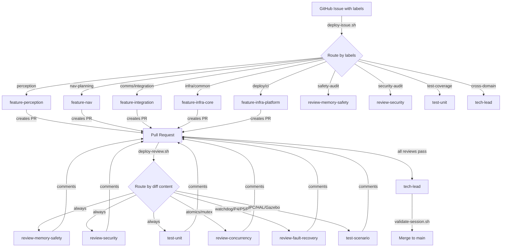
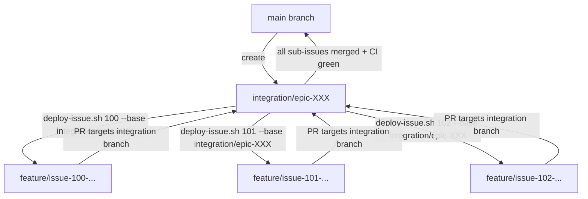

# Multi-Agent Pipeline Guide

This guide explains how the 13-agent pipeline works, how to use it, and how agents coordinate with each other and GitHub.

## How It Works

The pipeline applies **Amdahl's Law** to software verification: feature agents produce code in parallel, but more importantly, 4 review agents + 2 test agents verify every PR in parallel. The only serial step is the tech lead's merge decision — minimizing the serial fraction that limits speedup.

```
                          ┌──────────────────────────────────────────────────────┐
                          │                    GitHub                            │
                          │  Issues ──► Labels ──► PRs ──► Reviews ──► Merge    │
                          └──────┬──────────────────────────────┬───────────────┘
                                 │                              │
                    ┌────────────▼────────────┐    ┌────────────▼────────────┐
                    │   deploy-issue.sh 123    │    │   deploy-review.sh 456  │
                    │   (routes by labels)     │    │   (routes by diff)      │
                    └────────────┬────────────┘    └────────────┬────────────┘
                                 │                              │
                    ┌────────────▼────────────┐    ┌────────────▼────────────┐
                    │      start-agent.sh      │    │      start-agent.sh     │
                    │   (model + role setup)    │    │   (parallel launches)   │
                    └────────────┬────────────┘    └────────────┬────────────┘
                                 │                              │
              ┌──────────────────▼──────────────────────────────▼──────────┐
              │                    Agent Execution                         │
              │                                                           │
              │  ┌─────────────────────────────────────────────────────┐  │
              │  │              FEATURE AGENTS (produce)               │  │
              │  │  perception │ nav │ integration │ infra-core │ plat │  │
              │  └──────────────────────┬──────────────────────────────┘  │
              │                         │ PR created                      │
              │  ┌──────────────────────▼──────────────────────────────┐  │
              │  │           REVIEW AGENTS (verify in parallel)        │  │
              │  │  memory-safety │ concurrency │ fault │ security     │  │
              │  └──────────────────────┬──────────────────────────────┘  │
              │  ┌──────────────────────▼──────────────────────────────┐  │
              │  │            TEST AGENTS (verify in parallel)         │  │
              │  │            unit-test  │  scenario-test              │  │
              │  └──────────────────────┬──────────────────────────────┘  │
              │                         │                                 │
              └─────────────────────────┼─────────────────────────────────┘
                                        │
                          ┌─────────────▼─────────────┐
                          │        TECH LEAD           │
                          │  (serial merge decision)   │
                          │  validate-session.sh       │
                          └─────────────┬─────────────┘
                                        │
                                  Merge to main
```

## Agent Interaction Flow



## Integration Branch Flow (Multi-Issue Epics)

When a feature spans multiple issues across domains, use an **integration branch** to keep main demo-ready:



## The 13-Agent Roster

| # | Role | Model | Type | Scope |
|---|------|-------|------|-------|
| 1 | `tech-lead` | Opus | Orchestrator | Routing, merge decisions, coordination |
| 2 | `feature-perception` | Opus | Feature | P1/P2, camera/detector HAL |
| 3 | `feature-nav` | Opus | Feature | P3/P4, planner/avoider HAL |
| 4 | `feature-integration` | Opus | Feature | P5/P6/P7, IPC, HAL backends |
| 5 | `feature-infra-core` | Opus | Feature | common/, CMake, config |
| 6 | `feature-infra-platform` | Opus | Feature | deploy/, CI, boards/, certification |
| 7 | `review-memory-safety` | Opus | Review (read-only) | RAII, ownership, lifetimes |
| 8 | `review-concurrency` | Opus | Review (read-only) | Races, atomics, deadlocks |
| 9 | `review-fault-recovery` | Opus | Review (read-only) | Watchdog, degradation |
| 10 | `review-security` | Opus | Review (read-only) | Input validation, auth, TLS |
| 11 | `test-unit` | Sonnet | Test | GTest, coverage delta (tests/ only) |
| 12 | `test-scenario` | Sonnet | Test | Gazebo SITL, integration (tests/ only) |
| 13 | `ops-github` | Haiku | Operations | Issue triage, milestones, board |

### Agent Boundaries

Each agent has a defined scope of files it may edit. Review agents are **read-only** — they can only read code and post comments. The `check-agent-boundaries.sh` script enforces these boundaries (advisory in CI).

## Quick Start

### Prerequisites

- [Claude Code CLI](https://docs.anthropic.com/en/docs/claude-code) installed and authenticated
- GitHub CLI (`gh`) authenticated: `gh auth login`
- `jq` installed: `sudo apt install jq`
- Repository cloned with the agent definitions in `.claude/agents/`

### 1. Deploy an Agent for a GitHub Issue

The simplest way to use the pipeline — point it at an issue and it handles the rest:

```bash
# Route issue #123 to the right agent automatically
bash scripts/deploy-issue.sh 123

# Preview routing without executing
bash scripts/deploy-issue.sh 123 --dry-run

# For epic sub-issues, branch from the integration branch
bash scripts/deploy-issue.sh 123 --base integration/epic-XXX
```

**What happens:**
1. Fetches the issue from GitHub (title, body, labels)
2. Routes to an agent based on labels (priority-based: specific labels beat broad ones)
3. Creates a git worktree + branch
4. Updates `tasks/active-work.md`
5. Launches the agent with the issue context as its prompt

### 2. Launch a Review on a PR

```bash
# Auto-route reviewers based on the PR's diff content
bash scripts/deploy-review.sh 456

# Preview which reviewers would be triggered
bash scripts/deploy-review.sh 456 --dry-run

# Force all reviewers
bash scripts/deploy-review.sh 456 --all
```

### 3. Run a Full Orchestrated Session

For more control, use the session orchestrator which adds pre/post validation:

```bash
# Full session with pre-flight, agent, validation, and changelog
bash scripts/run-session.sh feature-nav "Implement A* path planner" --issue 789
```

### 4. Launch an Agent Directly

For ad-hoc work or interactive sessions:

```bash
# List all available roles
bash scripts/start-agent.sh --list

# Launch with a task
bash scripts/start-agent.sh feature-perception "Add YOLOv8 detector backend"

# Interactive session (no task — opens Claude CLI)
bash scripts/start-agent.sh feature-nav

# Dry-run: print resolved config without launching
bash scripts/start-agent.sh feature-integration "test" --dry-run
```

### 5. Validate a Session

After an agent completes work, verify nothing was hallucinated:

```bash
# Validate current branch
bash scripts/validate-session.sh

# Validate a specific branch
bash scripts/validate-session.sh --branch feature/issue-123-foo
```

Checks: build succeeds, test count matches baseline, all tests pass, `#include` paths exist, PR body references real files.

### 6. View Dashboards and Stats

```bash
# Team-wide dashboard
bash scripts/agent-dashboard.sh

# Per-agent stats
bash scripts/agent-dashboard.sh feature-perception

# Git-based agent stats (commits, lines, cost)
bash scripts/agent-stats.sh
```

### 7. Cleanup

```bash
# Remove stale branches and worktrees
bash scripts/cleanup-branches.sh

# List all active worktrees
git worktree list
```

## Label Routing Reference

Issues are routed to agents based on GitHub labels. When multiple domain labels exist, **priority wins** (not label order):

| Priority | Labels | Agent |
|----------|--------|-------|
| 3 (highest) | `perception`, `domain:perception` | feature-perception |
| 3 | `nav-planning`, `domain:nav` | feature-nav |
| 3 | `comms`, `domain:comms` | feature-integration |
| 3 | `ipc` | feature-infra-core |
| 2 | `integration`, `domain:integration` | feature-integration |
| 2 | `common`, `infra`, `infrastructure`, `modularity`, `domain:infra-core` | feature-infra-core |
| 1 (lowest) | `platform`, `deploy`, `ci`, `bsp`, `domain:infra-platform` | feature-infra-platform |
| Direct | `safety-audit` | review-memory-safety |
| Direct | `security-audit` | review-security |
| Direct | `test-coverage` | test-unit |
| Direct | `cross-domain` | tech-lead |

## Review Routing Reference

Reviews are routed based on **diff content**, not labels:

| Trigger in diff | Reviewers |
|-----------------|-----------|
| Any file | memory-safety + security + unit-test |
| `std::atomic`, `mutex`, `thread`, `lock_guard` | + concurrency |
| P4/P5/P7 paths, watchdog, fault handling | + fault-recovery |
| IPC, HAL, Gazebo configs | + scenario-test |

## Shared State

Agents coordinate through these files:

| File | Purpose | Who writes |
|------|---------|-----------|
| `tasks/active-work.md` | Live work tracker | deploy-issue.sh, agents |
| `tasks/agent-changelog.md` | Completed work log | run-session.sh |
| `.claude/shared-context/domain-knowledge.md` | Cross-agent pitfalls | Any agent (tech-lead reviews) |
| `docs/guides/AGENT_HANDOFF.md` | Cross-domain handoff protocol | tech-lead |

## Workflow Examples

### Example 1: Single Issue

```bash
# 1. Create issue on GitHub with labels: "perception", "enhancement"
# 2. Deploy
bash scripts/deploy-issue.sh 400

# Agent creates worktree, implements feature, creates PR
# 3. Review
bash scripts/deploy-review.sh <pr-number>

# 4. Validate and merge
bash scripts/validate-session.sh --branch feature/issue-400-...
# Tech lead merges if all checks pass
```

### Example 2: Multi-Issue Epic with Integration Branch

```bash
# 1. Create integration branch
git checkout -b integration/epic-500 main
git push -u origin integration/epic-500

# 2. Deploy sub-issues against the integration branch
bash scripts/deploy-issue.sh 501 --base integration/epic-500
bash scripts/deploy-issue.sh 502 --base integration/epic-500
bash scripts/deploy-issue.sh 503 --base integration/epic-500

# Each agent creates a PR targeting integration/epic-500 (not main)

# 3. After all sub-PRs merge to integration branch:
# Create a single PR from integration/epic-500 → main
gh pr create --base main --head integration/epic-500 \
  --title "feat(#500): Epic description" \
  --body "Merges epic work from integration branch"

# 4. Delete integration branch after merge
git branch -d integration/epic-500
git push origin --delete integration/epic-500
```

### Example 3: Interactive Debugging Session

```bash
# Launch an agent interactively for a specific domain
bash scripts/start-agent.sh feature-integration

# You can now have a conversation with the agent about P5/P6/P7 code
```

## Limitations

1. **No real-time agent-to-agent communication.** Agents coordinate through files (`active-work.md`, branches, PRs) — not direct messaging. If Agent A needs Agent B's output, Agent A must wait for Agent B's PR to merge.

2. **Review agents are advisory only.** Review agents post comments but cannot block merges programmatically. The tech lead (human or orchestrator) must read and act on review comments.

3. **No automatic conflict resolution.** When two agents modify overlapping files (even via separate worktrees), merge conflicts must be resolved manually. The integration branch pattern mitigates this but doesn't eliminate it.

4. **Label routing requires upfront labeling.** `deploy-issue.sh` routes based on GitHub labels. If an issue has no recognized labels, the script fails. Labels must be applied before deployment.

5. **Single-machine worktree limit.** All worktrees exist on one machine. The pipeline doesn't distribute agents across multiple machines (though the Claude Agent SDK could support this).

6. **Claude CLI dependency.** Agents require the Claude Code CLI installed and authenticated. Each agent invocation consumes API tokens — there's no built-in cost cap or rate limiting.

7. **No persistent agent memory across sessions.** Each agent invocation starts fresh. Context is provided through the agent definition file and the task prompt. Agents don't remember previous sessions (though `domain-knowledge.md` provides some continuity).

8. **CI integration is advisory.** The `agent-checks.yml` workflow warns about boundary violations and PR size — it doesn't block merges. The `auto-review.yml` workflow is disabled by default.

9. **Hallucination detection is heuristic.** `validate-session.sh` checks for common hallucination patterns (missing includes, phantom files in PR body, test count regression) but cannot catch all cases. Human review remains essential.

10. **No rollback automation.** If an agent's merged PR introduces a regression, there's no automated revert. Standard git revert workflows apply.

## Future Improvements

1. **Distributed agent execution.** Run agents on multiple machines or cloud instances, coordinated through GitHub as the source of truth. Each machine pulls issues, creates worktrees, and pushes PRs independently.

2. **Cost tracking and budgets.** Track API token usage per agent/session/issue. Set per-issue cost budgets with automatic termination. Dashboard shows cost-per-test, cost-per-line, and cost-per-fix.

3. **Automatic PR chaining.** When Agent A's PR merges, automatically trigger dependent agents (Agent B) based on handoff issues. Currently requires manual `deploy-issue.sh` invocation.

4. **Persistent agent context.** Give agents access to a vector store of previous sessions, decisions, and domain knowledge so they can learn from past work without re-deriving context.

5. **Merge queue integration.** Integrate with GitHub's merge queue to automatically sequence merges, run CI, and handle rebase conflicts.

6. **Real-time conflict detection.** Monitor active worktrees and warn when two agents are modifying overlapping files before they create PRs.

7. **Agent performance scoring.** Track metrics per agent role: review comment hit rate, test coverage delta, build break rate, hallucination rate. Use this to tune agent prompts and routing.

8. **Multi-repo support.** Extend the pipeline to work across multiple repositories (e.g., a shared library repo + an application repo).

9. **Blocking CI gates.** Promote `agent-checks.yml` from advisory to blocking once the pipeline is validated. Enable `auto-review.yml` to automatically trigger review agents on every PR.

10. **Natural language issue routing.** Use the issue title and body (not just labels) to route to the correct agent, eliminating the labeling requirement.
