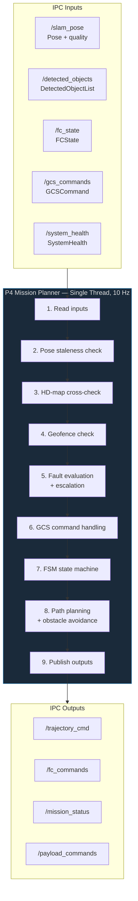

# Process 4 — Mission Planner: Design Document

> **Scope**: Detailed design of the Mission Planner process (`process4_mission_planner`).
> This document covers the FSM lifecycle, path planning strategies, obstacle avoidance,
> geofencing, fault management, and the main planning loop.

---

## Table of Contents

1. [Overview](#overview)
2. [Thread Architecture](#thread-architecture)
3. [IPC Channels](#ipc-channels)
4. [Component: MissionFSM](#component-missionfsm)
5. [Component: Path Planners](#component-path-planners)
6. [Component: Obstacle Avoiders](#component-obstacle-avoiders)
7. [Component: Geofence](#component-geofence)
8. [Component: FaultManager](#component-faultmanager)
9. [HD-Map Static Obstacles](#hd-map-static-obstacles)
10. [Extracted Sub-Components (PR #157)](#extracted-sub-components-pr-157)
11. [Main Loop](#main-loop)
12. [Configuration Reference](#configuration-reference)
13. [Testing](#testing)
14. [Known Limitations](#known-limitations)

---

## Overview

Process 4 is the autonomous decision-making core. It reads SLAM pose and detected objects,
evaluates faults, plans trajectories, avoids obstacles, and outputs velocity commands
to the flight controller via Process 5 (Comms). It runs as **1 thread** at a configurable
rate (default 10 Hz).

**Key responsibilities:**
- Mission lifecycle management (arm → takeoff → navigate → RTL → land)
- Path planning via pluggable strategy (A* or potential field)
- Real-time obstacle avoidance via pluggable strategy (3D repulsive field or 2D potential field)
- Polygon + altitude geofencing with ray-casting
- 10-type fault evaluation with escalation-only policy (12 with VIO health, PR #190)
- GCS command handling (RTL, LAND, mid-flight mission upload)
- HD-map static obstacle integration with camera cross-validation
- Waypoint advancement with payload triggering

---

## Thread Architecture



Single-threaded — all logic runs sequentially in one loop iteration. This eliminates
concurrency bugs at the cost of requiring each step to complete within the 100 ms budget.

---

## IPC Channels

### Subscriptions (inputs)

| Channel | Type | Source | Required |
|---------|------|--------|----------|
| `/slam_pose` | `drone::ipc::Pose` | P3 (slam_vio_nav) | Yes |
| `/detected_objects` | `drone::ipc::DetectedObjectList` | P2 (perception) | Yes |
| `/fc_state` | `drone::ipc::FCState` | P5 (comms) | Yes |
| `/gcs_commands` | `drone::ipc::GCSCommand` | P5 (comms) | Optional |
| `/mission_upload` | `drone::ipc::MissionUpload` | P5 (comms) | Optional |
| `/system_health` | `drone::ipc::SystemHealth` | P7 (system_monitor) | Optional |

### Publications (outputs)

| Channel | Type | Consumers |
|---------|------|-----------|
| `/trajectory_cmd` | `drone::ipc::TrajectoryCmd` | P5 (comms → FC) |
| `/fc_commands` | `drone::ipc::FCCommand` | P5 (comms → FC) |
| `/mission_status` | `drone::ipc::MissionStatus` | P5 (comms → GCS), P7 |
| `/payload_commands` | `drone::ipc::PayloadCommand` | P6 (payload_manager) |
| `/drone_thread_health_mission_planner` | `drone::ipc::ThreadHealth` | P7 (system_monitor) |

---

## Component: MissionFSM

- **Header:** [`mission_fsm.h`](../process4_mission_planner/include/planner/mission_fsm.h)
- **Tests:** [`test_mission_fsm.cpp`](../tests/test_mission_fsm.cpp) (7 tests)
- **Namespace:** `drone::planner`

### State Machine

```
   IDLE ──on_arm()──► PREFLIGHT ──on_takeoff()──► TAKEOFF
                                                      │
                                          on_navigate()│
                                                      ▼
   EMERGENCY ◄──on_emergency()── NAVIGATE ──on_loiter()──► LOITER
                                    │                        │
                                    │ on_rtl()       on_rtl()│
                                    ▼                        ▼
                                   RTL ──on_land()──► LAND ──on_landed()──► IDLE
```

States are defined in `ipc/shm_types.h` as `MissionState` enum (shared across all processes).

### Waypoint Struct

```cpp
struct Waypoint {
    float x, y, z;          // target position (world frame, metres)
    float yaw;              // target heading (radians)
    float radius;           // acceptance radius (m)
    float speed;            // cruise speed (m/s)
    bool  trigger_payload;  // trigger camera capture at this waypoint
};
```

### Key Methods

| Method | Description |
|--------|-------------|
| `load_mission(waypoints)` | Load waypoint list, reset index to 0 |
| `current_waypoint()` | Returns pointer to current waypoint (null if past end) |
| `advance_waypoint()` | Move to next waypoint. Returns false if mission complete |
| `waypoint_reached(px,py,pz,wp)` | 3D Euclidean distance < acceptance radius |
| `set_fault_triggered(bool)` | Mark current state as fault-caused (blocks normal override) |

---

## Component: Path Planners

Two pluggable strategies implement `IPathPlanner::plan(pose, waypoint) → ShmTrajectoryCmd`.
Selected via `mission_planner.path_planner.backend` config key.

### IPathPlanner Interface

- **Header:** [`ipath_planner.h`](../process4_mission_planner/include/planner/ipath_planner.h)
- **Factory:** `create_path_planner(backend_name) → unique_ptr<IPathPlanner>`

### DStarLitePlanner (`"dstar_lite"`) — the only path planner

- **Header:** [`dstar_lite_planner.h`](../process4_mission_planner/include/planner/dstar_lite_planner.h)
- **Tests:** [`test_dstar_lite_planner.cpp`](../tests/test_dstar_lite_planner.cpp) (33 tests)

#### OccupancyGrid3D

3D voxel grid backing the D* Lite search:

| Parameter | Default |
|-----------|---------|
| Grid size | 100 × 100 × 20 cells |
| Resolution | 1.0 m/cell |
| Origin offset | Centre of grid |

**Dual-layer obstacle model:**
- **Static layer** (permanent): HD-map obstacles via `add_static_obstacle(x, y, radius, height)`.
  Cell inflation radius applied. No TTL — persist forever.
- **Dynamic layer** (TTL): Camera-detected objects via `update_obstacles()`. Each occupied cell
  carries a timestamp. Cells expire after TTL (default 2 s) to handle transient detections.

#### D* Lite Search Algorithm

- **Connectivity:** 26-connected (full 3D neighbourhood including diagonals)
- **Heuristic:** Euclidean distance (admissible, consistent)
- **Goal snapping:** If the goal cell is occupied, search lateral neighbours first
  (avoids vertical oscillation). Prefers ±X/±Y shift over ±Z.
- **Max iterations:** Bounded to prevent runaway searches (default 10000)
- **Fallback:** If no path found, returns direct-line velocity (logged as warning)
- **Velocity output:** Direction along first path segment, EMA-smoothed
- **Caching:** Re-plans only when goal or obstacle state changes

---

## Component: Obstacle Avoiders

`IObstacleAvoider::avoid(planned, pose, objects) → ShmTrajectoryCmd`.
Selected via `mission_planner.obstacle_avoider.backend` config key.
PotentialFieldAvoider (2D) removed in Issue #207 — ObstacleAvoider3D is the only implementation.

### IObstacleAvoider Interface

- **Header:** [`iobstacle_avoider.h`](../process4_mission_planner/include/planner/iobstacle_avoider.h)
- **Factory:** `create_obstacle_avoider(backend, influence_radius, repulsive_gain)`

### ObstacleAvoider3D (`"3d"` / `"obstacle_avoider_3d"` / `"potential_field_3d"`)

- **Header:** [`obstacle_avoider_3d.h`](../process4_mission_planner/include/planner/obstacle_avoider_3d.h)
- **Tests:** [`test_obstacle_avoider_3d.cpp`](../tests/test_obstacle_avoider_3d.cpp) (12 tests)
- Full 3D repulsive field (includes Z component)
- Predictive avoidance: uses object velocities for 0.5 s look-ahead
- Inverse-square force decay with configurable repulsive gain
- Clamped corrections: max ±3 m/s per axis
- Filters: stale objects (>500 ms), low-confidence (<0.3)
- NaN input protection

---

## Component: Geofence

- **Header:** [`geofence.h`](../process4_mission_planner/include/planner/geofence.h)
- **Tests:** [`test_geofence.cpp`](../tests/test_geofence.cpp) (21 tests)
- **Namespace:** `drone::planner`

### Algorithm

- **Polygon containment:** Ray-casting (point-in-polygon) — works for convex and concave polygons
- **Altitude band:** Floor and ceiling enforcement
- **Warning margin:** Pre-breach alert distance
- **NaN/Inf protection:** Returns safe `not-violated` for invalid inputs

### Key Methods

| Method | Description |
|--------|-------------|
| `set_polygon(vertices)` | Set boundary polygon (≥3 vertices) |
| `set_altitude_limits(floor, ceiling)` | Set vertical bounds |
| `set_warning_margin(m)` | Set pre-breach warning distance |
| `enable(bool)` | Enable/disable checking |
| `check(x, y, alt) → GeofenceResult` | Returns `{violated, margin_m, message}` |

### Integration with Main Loop

- Checked every tick when airborne (skipped during TAKEOFF to avoid false triggers near ground)
- Breach sets `fault_mgr.set_geofence_violation(true)` → triggers RTL via FaultManager
- Warning margin provides early alert before actual violation

---

## Component: FaultManager

- **Header:** [`fault_manager.h`](../process4_mission_planner/include/planner/fault_manager.h)
- **Tests:** [`test_fault_manager.cpp`](../tests/test_fault_manager.cpp) (31 tests)
- **Namespace:** `drone::planner`

### Design Principles

1. **Escalation-only:** Once an action is raised, it can only be superseded by a higher-severity action
2. **Config-driven:** All thresholds from `fault_manager.*` JSON keys
3. **Stateful:** Maintains high-water mark, loiter timer, geofence state across evaluate() calls

### Fault Types (bitmask)

| Flag | Trigger | Action |
|------|---------|--------|
| `FAULT_CRITICAL_PROCESS` | comms or SLAM reported dead | LOITER |
| `FAULT_POSE_STALE` | Pose age > 500 ms | LOITER |
| `FAULT_BATTERY_LOW` | Battery < 30% | WARN |
| `FAULT_BATTERY_RTL` | Battery < 20% | RTL |
| `FAULT_BATTERY_CRITICAL` | Battery < 10% | EMERGENCY_LAND |
| `FAULT_THERMAL_WARNING` | Thermal zone = 2 | WARN |
| `FAULT_THERMAL_CRITICAL` | Thermal zone ≥ 3 | RTL |
| `FAULT_PERCEPTION_DEAD` | Perception process not alive | WARN |
| `FAULT_FC_LINK_LOST` | FC disconnected > 3 s | LOITER → RTL (15 s) |
| `FAULT_GEOFENCE_BREACH` | Position outside polygon or altitude band | RTL |

> **Pending (PR #190, Issue #169):** Two additional VIO health faults:
> `FAULT_VIO_DEGRADED` (Pose quality ≤ 1 → LOITER) and `FAULT_VIO_LOST` (Pose quality = 0 → RTL).

### Action Severity Ordering

```
NONE < WARN < LOITER < RTL < EMERGENCY_LAND
```

### Escalation Flow

```
evaluate()
  ├─ Check 10 fault conditions → compute recommended_action
  ├─ Apply high-water mark (never downgrade)
  └─ If LOITER for > loiter_escalation_timeout (30s) → escalate to RTL
```

### FC Link-Loss Contingency

Two-stage response:
1. **3 s disconnected** → LOITER (wait for reconnect)
2. **15 s disconnected** → RTL (contingency timeout)

---

## HD-Map Static Obstacles

Static obstacles are loaded from `mission_planner.static_obstacles[]` in the config.
Each entry has `{x, y, radius_m, height_m}`.

### Camera Cross-Validation

The main loop tracks a `StaticObstacleRecord` for each HD-map entry:
- Every tick, checks if any camera detection falls within `radius_m + 1 m` laterally
  and `height_m + 0.5 m` vertically
- After 2 independent hits → marked as **confirmed** (logged for scenario validation)
- Unconfirmed obstacles still block A* (conservative policy)
- Warning logged when approaching an unconfirmed obstacle (within 3 m, throttled at 10 s)

### Collision Detection

Proximity-based check during NAVIGATE:
- If drone centre enters within `radius_m + 0.5 m` at or below obstacle height → log collision warning
- Throttled to once per 2 s to avoid log flooding

---

## Extracted Sub-Components (PR #157)

PR #157 refactored the monolithic `main.cpp` (809 → 366 lines) by extracting four
logically cohesive sub-systems into header-only classes under `process4_mission_planner/include/planner/`.
Each class is independently unit-tested with injected mocks — no Zenoh or real hardware required.

### `FaultResponseExecutor`

**Header:** [`planner/fault_response_executor.h`](../process4_mission_planner/include/planner/fault_response_executor.h)

Executes fault responses (WARN → LOITER → RTL → EMERGENCY_LAND) based on the
current `FaultAction` from `FaultManager`. Enforces the **escalation-only policy**
(severity can never decrease) and skips action when the drone is not airborne.

| Method | Description |
|--------|-------------|
| `execute(action, state, bus)` | Apply fault action to trajectory + FC command |
| `reset()` | Clear applied action (on clean landing) |

### `GcsCommandHandler`

**Header:** [`planner/gcs_command_handler.h`](../process4_mission_planner/include/planner/gcs_command_handler.h)

Dispatches GCS commands (RTL / LAND / MISSION_UPLOAD) from `/gcs_commands`.
Deduplicates by command timestamp to prevent double-execution on resubscription.

| Method | Description |
|--------|-------------|
| `handle(cmd, state, waypoints)` | Process one GCS command; returns updated state |

### `MissionStateTick`

**Header:** [`planner/mission_state_tick.h`](../process4_mission_planner/include/planner/mission_state_tick.h)

Contains all per-tick FSM transition logic (PREFLIGHT / TAKEOFF / NAVIGATE / RTL / LAND / IDLE).
Previously inlined inside the main planning loop; extraction makes each state independently testable.

| Method | Description |
|--------|-------------|
| `tick(ctx)` | Advance FSM one tick; `ctx` bundles pose, FC state, waypoints, bus refs |

### `StaticObstacleLayer`

**Header:** [`planner/static_obstacle_layer.h`](../process4_mission_planner/include/planner/static_obstacle_layer.h)

Loads HD-map static obstacles from config, performs camera cross-validation
(2-hit confirmation), and provides collision proximity checks.
Extracted from the previous inline logic in the planning loop.

| Method | Description |
|--------|-------------|
| `load(cfg)` | Parse `static_obstacles[]` config entries |
| `cross_check(pose, detections)` | Update confirmation hits per obstacle |
| `check_collision(pose)` | Returns true if drone is within margin of any obstacle |

---

## Main Loop

The planning loop runs at `mission_planner.update_rate_hz` (default 10 Hz):

```
while (running) {
    1. Touch heartbeat + systemd watchdog
    2. Read drone::ipc::Pose, drone::ipc::DetectedObjectList, drone::ipc::FCState, drone::ipc::SystemHealth
    3. Pose staleness check (500ms threshold)
    4. Camera cross-check of HD-map obstacles
    5. Geofence check (airborne only, skip TAKEOFF)
    6. FaultManager::evaluate() → apply escalation if needed
    7. Check GCS commands (RTL, LAND, MISSION_UPLOAD) — dedup by timestamp
    8. FSM state machine:
       - PREFLIGHT: send ARM every 3s until FC confirms
       - TAKEOFF: send TAKEOFF, wait for 90% altitude
       - NAVIGATE: plan path → avoid obstacles → publish trajectory
                   check waypoint reached → advance or RTL
       - RTL: monitor position → LAND when near home (after min dwell)
       - LAND: monitor altitude → IDLE when < 0.5m
    9. Publish drone::ipc::MissionStatus (state, progress, faults)
   10. Publish thread health at ~1 Hz
   11. Log diagnostics if warnings/errors
   12. Sleep for loop_sleep_ms
}
```

### FC Command Protocol

FC commands are sent via `drone::ipc::FCCommand` with a monotonic `sequence_id` for deduplication.
Commands carry the thread-local `CorrelationContext` for end-to-end tracing.

| Command | When |
|---------|------|
| ARM | PREFLIGHT, every 3 s until FC confirms armed |
| TAKEOFF(alt) | TAKEOFF, once |
| RTL | Mission complete, GCS RTL, fault RTL |
| LAND | Near home during RTL, GCS LAND, emergency |

---

## Configuration Reference

### `mission_planner.*`

| Key | Type | Default | Description |
|-----|------|---------|-------------|
| `update_rate_hz` | int | 10 | Main loop frequency |
| `takeoff_altitude_m` | float | 5.0 | Target takeoff altitude |
| `acceptance_radius_m` | float | 1.0 | Default waypoint radius |
| `cruise_speed_mps` | float | 2.0 | Default waypoint speed |
| `rtl_acceptance_radius_m` | float | 1.5 | Horizontal distance to trigger LAND during RTL |
| `landed_altitude_m` | float | 0.5 | Altitude threshold for "landed" detection |
| `rtl_min_dwell_seconds` | int | 5 | Min time in RTL before sending LAND |
| `path_planner.backend` | string | `"potential_field"` | `"potential_field"` or `"dstar_lite"` |
| `obstacle_avoider.backend` | string | `"potential_field"` | `"potential_field"`, `"3d"`, etc. |
| `obstacle_avoidance.influence_radius_m` | float | 5.0 | Repulsive field radius |
| `obstacle_avoidance.repulsive_gain` | float | 2.0 | Repulsive force multiplier |
| `geofence.enabled` | bool | true | Enable geofence checking |
| `geofence.polygon[]` | array | 100×100m square | Boundary vertices `{x, y}` |
| `geofence.altitude_floor_m` | float | 0.0 | Minimum altitude |
| `geofence.altitude_ceiling_m` | float | 120.0 | Maximum altitude |
| `geofence.warning_margin_m` | float | 5.0 | Pre-breach warning distance |
| `waypoints[]` | array | 4 waypoints | Mission waypoints `{x, y, z, yaw, speed, payload_trigger}` |
| `static_obstacles[]` | array | — | HD-map obstacles `{x, y, radius_m, height_m}` |

### `fault_manager.*`

| Key | Type | Default | Description |
|-----|------|---------|-------------|
| `pose_stale_timeout_ms` | int | 500 | Pose age threshold for LOITER |
| `battery_warn_percent` | float | 30.0 | Battery → WARN |
| `battery_rtl_percent` | float | 20.0 | Battery → RTL |
| `battery_crit_percent` | float | 10.0 | Battery → EMERGENCY_LAND |
| `fc_link_lost_timeout_ms` | int | 3000 | FC disconnect → LOITER |
| `fc_link_rtl_timeout_ms` | int | 15000 | FC disconnect → RTL (contingency) |
| `loiter_escalation_timeout_s` | int | 30 | LOITER → RTL escalation delay |

---

## Testing

| Test File | Tests | Coverage |
|-----------|-------|----------|
| [`test_mission_fsm.cpp`](../tests/test_mission_fsm.cpp) | 7 | FSM transitions, waypoint loading, radius check |
| [`test_dstar_lite_planner.cpp`](../tests/test_dstar_lite_planner.cpp) | 32 | Grid, D* Lite search, incremental replan, goal-snap, factory |
| [`test_obstacle_avoider_3d.cpp`](../tests/test_obstacle_avoider_3d.cpp) | 12 | 3D repulsion, predictive, NaN, factory |
| [`test_geofence.cpp`](../tests/test_geofence.cpp) | 21 | Polygon, altitude, margin, NaN/Inf |
| [`test_fault_manager.cpp`](../tests/test_fault_manager.cpp) | 31 | All 10 faults, escalation, loiter timeout, FC contingency |
| [`test_static_obstacle_layer.cpp`](../tests/test_static_obstacle_layer.cpp) | 12 | Load empty/single/multi HD-map entries, cross-check 2-hit confirmation, low-quality pose skip, collision/no-collision, cooldown throttle, height check |
| [`test_gcs_command_handler.cpp`](../tests/test_gcs_command_handler.cpp) | 6 | RTL/LAND/MISSION_UPLOAD dispatch, dedup by timestamp, unknown command ignored |
| [`test_fault_response_executor.cpp`](../tests/test_fault_response_executor.cpp) | 7 | WARN (no FC cmd), LOITER, RTL, EMERGENCY_LAND, escalation-only policy, non-airborne skip, reset clears state |
| [`test_mission_state_tick.cpp`](../tests/test_mission_state_tick.cpp) | 10 | PREFLIGHT ARM retry, TAKEOFF altitude threshold, waypoint reached + payload trigger, mission complete → RTL, RTL disarm → IDLE, landed → IDLE + fault reset |
| **Total** | **129** | |

Integration coverage via scenario tests in `config/scenarios/`:
- `02_obstacle_avoidance.json` — A* planner + 3D avoider with HD-map obstacles
- `03_geofence.json` — Geofence breach detection
- `04_battery_rtl.json` — Battery fault escalation
- `06_fc_link_loss.json` — FC link-loss contingency

---

## Observability

P4 is the hub for GCS correlation IDs. Commands arriving on
`/gcs_commands` start a `ScopedCorrelation` that is propagated to all
downstream outputs (`/trajectory_cmd`, `/fc_commands`, mission status
logs).

### Structured Logging

| Field | Description |
|-------|-------------|
| `process` | `"mission_planner"` |
| `fsm_state` | Current FSM state name (e.g. `"MISSION"`, `"RTL"`, `"LOITER"`) |
| `waypoint_index` | Active waypoint index |
| `correlation_id` | 64-bit hex value (e.g. `0x000012340000001a`) from originating GCS command (if present) |
| `planner_backend` | Active path planner name |
| `avoider_backend` | Active obstacle avoider name |

> **Note:** These values appear in the `msg` text field of the JSON log line.
> `--json-logs` does not emit them as separate top-level JSON keys.

### Correlation IDs

| Source | Propagated to |
|--------|--------------|
| `/gcs_commands` (from P5) | `/trajectory_cmd`, `/fc_commands`, all P4 log lines while command is active |

Enable with `--json-logs`; search log output for `"correlation_id"`.

### Latency Tracking

| Channel | Direction |
|---------|----------|
| `/detected_objects` | subscriber |
| `/slam_pose` | subscriber |
| `/fc_state` | subscriber |
| `/gcs_commands` | subscriber |
| `/system_health` | subscriber |

Latency is tracked automatically on each `receive()` call. Call
`subscriber->log_latency_if_due(N)` in the planner thread to
periodically emit a p50/p90/p99 histogram (µs) to the log.

See [observability.md](observability.md) for the full correlation ID
flow diagram and histogram interpretation.

---

## Known Limitations

1. **Single-threaded:** All logic must complete within one loop period (100 ms at 10 Hz).
   A* search is bounded by max iterations but could still spike on complex grids.
2. **No dynamic replanning on map change:** A* re-plans per tick, but does not maintain
   a persistent graph — each search starts fresh.
3. **2D geofence:** Polygon is 2D (XY plane). No 3D volume geofencing.
4. **No return-path obstacle avoidance during RTL:** RTL delegates to PX4's RTL mode;
   the mission planner only monitors position to intercept with LAND.
5. **Waypoint yaw not enforced:** The FSM advances waypoints based on position only;
   yaw heading is set via trajectory output but not checked for arrival.
