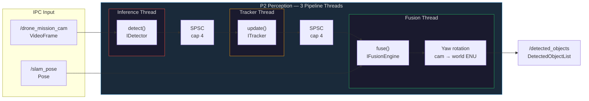

# Process 2 — Perception: Design Document

> **Scope**: Detailed design of the Perception process (`process2_perception`).
> This document covers the full pipeline from raw video frames to world-frame fused object positions.

---

## Table of Contents

1. [Overview](#overview)
2. [Thread Architecture](#thread-architecture)
3. [IPC Channels](#ipc-channels)
4. [Component: Detector](#component-detector)
5. [Component: Tracker](#component-tracker)
6. [Component: Fusion Engine](#component-fusion-engine)
7. [Camera → World Transform](#camera--world-transform)
8. [Object Classification](#object-classification)
9. [Configuration Reference](#configuration-reference)
10. [Data Types](#data-types)
11. [Deployment Profiles](#deployment-profiles)
12. [Known Gaps and Limitations](#known-gaps-and-limitations)

---

## Overview

Process 2 is a real-time computer vision pipeline that turns raw video frames into world-frame 3D object tracks. It is a three-stage pipeline running across three dedicated threads:



Each stage is independently pipelined. Backpressure is handled by lock-free SPSC ring drop (oldest frame is discarded when the ring is full).

---

## Thread Architecture

| Thread | Name (heartbeat) | Input | Output |
|--------|-----------------|-------|--------|
| Inference | `inference` | `drone::ipc::VideoFrame` via IPC subscriber | `Detection2DList` via SPSC ring |
| Tracker | `tracker` | `Detection2DList` via SPSC ring | `TrackedObjectList` via SPSC ring |
| Fusion | `fusion` | `TrackedObjectList` via SPSC ring + `drone::ipc::Pose` from IPC | `drone::ipc::DetectedObjectList` via IPC publisher |

**SPSC ring capacity**: 4 slots each. If the downstream thread is slower than upstream, the push fails silently (drop counter incremented, logged every 100 frames or on warning).

**Heartbeat / watchdog**: Each thread registers a `ScopedHeartbeat`. The main loop calls `ThreadHealthPublisher::publish_snapshot()` once per second. `ThreadWatchdog` is armed but all threads stay live under headless operation. Health is published on `THREAD_HEALTH_PERCEPTION`.

---

## IPC Channels

| Direction | Channel key (`drone::ipc::topics::`) | Message type | Source / Consumer |
|-----------|----------------------------|--------------|------------------|
| Subscribe | `VIDEO_MISSION_CAM` | `drone::ipc::VideoFrame` | Process 1 → Process 2 |
| Subscribe | `SLAM_POSE` | `drone::ipc::Pose` | Process 3 → Process 2 (fusion thread) |
| Publish | `DETECTED_OBJECTS` | `drone::ipc::DetectedObjectList` | Process 2 → Process 4 |
| Publish | `THREAD_HEALTH_PERCEPTION` | `drone::ipc::ThreadHealth` | Process 2 → Process 7 |

The IPC backend (SHM or Zenoh) is resolved from `ipc_backend` in the active config. Gazebo SITL configs default to `"zenoh"`.

---

## Component: Detector

**Interface**: `IDetector` (`detector_interface.h`)

```cpp
virtual std::vector<Detection2D> detect(
    const uint8_t* frame_data,
    uint32_t width, uint32_t height, uint32_t channels) = 0;
```

The detector receives raw pixel data from a `ShmVideoFrame` and returns a list of axis-aligned bounding boxes with class labels and confidence scores.

### Backends

#### `simulated` (default in `default.json`)

- Class: `SimulatedDetector`
- Generates 1–5 random detections per frame using `std::mt19937`
- Bounding boxes are uniformly distributed across the frame with random sizes (40–200 px), confidence (0.40–0.99), and class IDs (0–4)
- Used only for integration/unit testing without real video

#### `color_contour` (default in `gazebo_sitl.json`, `hardware.json`)

- Class: `ColorContourDetector`
- HSV-based color segmentation followed by connected-component labeling (union-find CCL)
- Suitable for controlled environment testing; works without a GPU / ONNX runtime
- **Single-pass classification:** `build_color_map()` converts each subsampled pixel to HSV exactly once and stores the winning color index (or `kNoColor = 0xFF`) — O(W·H) total regardless of the number of color classes
- **Spatial subsampling:** configurable `subsample` stride (default 2) halves both dimensions before classification, reducing pixel work by up to 4×; bounding boxes are scaled back to full resolution on output
- **Frame-rate cap:** optional `max_fps` sleep throttle (default 0 = unlimited) to free CPU headroom on embedded hardware
- Config keys: `confidence_threshold`, `min_contour_area`, `subsample`, `max_fps`

#### `yolov8` (production)

- Class: `OpenCvYoloDetector`
- Loads a YOLOv8-nano ONNX model via OpenCV DNN
- Input is resized to `input_size × input_size` (default 640), normalised to [0,1]
- Outputs raw 80-class COCO scores; boxes with score ≥ `confidence_threshold` survive NMS at `nms_threshold` IOU
- COCO class IDs are mapped to `ObjectClass` (see [Object Classification](#object-classification))
- Compile guard: `#ifdef HAS_OPENCV`; falls back to `color_contour` at runtime if OpenCV is absent
- Model path: `perception.detector.model_path` (default `models/yolov8n.onnx`)

### Detector Factory

`create_detector(backend, cfg)` in `detector_factory.cpp` selects and constructs the backend. Falls back gracefully to `color_contour` when `yolov8` is requested without OpenCV.

---

## Component: Tracker

**Interface**: `ITracker` (`itracker.h`)

```cpp
virtual TrackedObjectList update(const Detection2DList& detections) = 0;
```

### Backend: `ByteTrackTracker` (sole backend — SORT removed in Issue #205)

Implements ByteTrack (Zhang et al., ECCV 2022) two-stage association:

1. **Predict** — advance all active `KalmanBoxTracker` instances one step
2. **Stage 1** — build IoU cost matrix for ALL tracks vs high-confidence detections, solve with `HungarianSolver`
3. **Stage 2** — build IoU cost matrix for UNMATCHED tracks vs low-confidence detections, solve with `HungarianSolver` (recovers tracks through occlusion)
4. **Update** — apply Kalman measurement update for matched pairs
5. **Spawn** — create new `KalmanBoxTracker` for each unmatched high-confidence detection (low-conf never creates new tracks)
6. **Prune** — remove tracks exceeding `max_age` consecutive misses
7. **Emit** — output confirmed tracks (`hits ≥ min_hits`) as `TrackedObjectList`

#### KalmanBoxTracker

**State vector** (8-dimensional, constant-velocity model):

```
x = [cx, cy, w, h, vcx, vcy, vw, vh]
```

| Symbol | Description |
|--------|-------------|
| cx, cy | Bounding box center in pixels |
| w, h | Bounding box width and height in pixels |
| vcx, vcy | Velocity of center (px/frame) |
| vw, vh | Rate of change of size |

**State transition** (discrete, dt defaults to 1/30 s):
```
F = I₈ with F[0,4]=dt, F[1,5]=dt, F[2,6]=dt, F[3,7]=dt
```

**Measurement model** (`H`, 4×8): direct observation of `[cx, cy, w, h]`.

**Initial covariance**: `P = 10·I₈` with `P[4:8, 4:8] = 1000·I₄` (high velocity uncertainty on birth).

**Confirmation threshold**: `hits ≥ 3` — a new track is not emitted until it has been matched for 3 consecutive frames to suppress false positives.

**Staleness threshold**: `consecutive_misses > 10` — lost tracks are deleted after 10 frames with no association.

#### HungarianSolver

O(n³) Kuhn-Munkres (Hungarian) algorithm for optimal bipartite assignment. ByteTrack uses IoU (Intersection over Union) as the cost metric — any match above `max_iou_cost` (config default 0.7) is treated as no match.

- **Input**: `n_tracks × n_detections` cost matrix (doubles)
- **Output**: assignment vector + lists of unmatched rows and columns
- **Padding**: rectangular matrices are padded to square with `max_cost` entries
- Uses dual-variable (potential) formulation for O(n³) worst-case guarantee

---

## Component: Fusion Engine

**Interface**: `IFusionEngine` (`ifusion_engine.h`)

```cpp
[[nodiscard]] virtual FusedObjectList fuse(const TrackedObjectList& tracked) = 0;
```

The fusion engine maps 2D tracked objects to 3D camera-frame positions. Output positions are in **camera body frame** (forward=X, right=Y, down=Z); the `fusion_thread` rotates them to world ENU frame using the latest drone pose.

> **Terminology note:** Despite the name "fusion", the current backends do **not** perform
> multi-sensor fusion (e.g., fusing camera + LiDAR + radar). What they actually do:
>
> 1. **`camera_only`** — Monocular depth estimation via pinhole geometry (apparent-size
>    formula). Input: single RGB camera tracked 2D bboxes. Output: 3D camera-frame positions.
> 2. **`ukf`** — Per-object Unscented Kalman Filter for temporal smoothing of the monocular
>    3D estimates. Still single-camera input.
>
> The **stereo camera** feeds P3 (VIO/SLAM) for pose estimation, **not** P2 perception.
> True multi-sensor fusion would require integrating stereo depth, LiDAR point clouds,
> or radar returns — none of which are implemented yet.

### Backend: `camera_only`

Class: `CameraOnlyFusionEngine`

Stateless per-frame depth estimation using a three-tier monocular model:

#### Depth Estimation Tiers

| Priority | Condition | Formula | Description |
|----------|-----------|---------|-------------|
| 1 (primary) | `bbox_h > 10 px` | `depth = assumed_obstacle_height_m × fy / bbox_h` | Pinhole apparent-size formula; accurate for known obstacle height |
| 2 (fallback) | `ray_down > 0.01` | `depth = camera_height_m / ray_down` | Ground-plane intersection for nadir-view objects |
| 3 (near-horizon) | otherwise | `depth = 8.0 m` | Conservative estimate for objects near the image horizon |

Depth is clamped to **[1.0, 40.0] m** for tiers 1 and 2. The 8 m near-horizon fallback was chosen so that the mission planner's 5 m influence radius triggers before close approach.

#### Camera-Frame Position

```
position_3d.x = depth * 1.0              (forward = boresight)
position_3d.y = depth * (u - cx) / fx   (right)
position_3d.z = depth * (v - cy) / fy   (down)
```

where `(u, v)` is the Kalman-filtered bbox center in pixels.

#### Camera-Frame Velocity

```
velocity_3d.x = 0                               (no forward velocity from monocular)
velocity_3d.y = pixel_vel_x * depth / fx       (lateral m/s)
velocity_3d.z = pixel_vel_y * depth / fy       (vertical m/s)
```

**Covariance**: Fixed `5.0 · I₃` (large, reflecting monocular uncertainty).

---

### Backend: `ukf`

Class: `UKFFusionEngine`

Maintains one `ObjectUKF` instance per track ID. Each UKF instance carries a full 6-state Kalman filter using the Unscented Transform.

#### ObjectUKF State

```
x = [x, y, z, vx, vy, vz]   (6D, camera body frame)
```

| Index | Symbol | Meaning |
|-------|--------|---------|
| 0 | x | Forward depth (m) |
| 1 | y | Lateral right (m) |
| 2 | z | Down (m) |
| 3 | vx | Forward velocity (m/s) |
| 4 | vy | Lateral velocity (m/s) |
| 5 | vz | Vertical velocity (m/s) |

**Initial covariance**: `P = 10·I₆` with `P[3:6, 3:6] = 50·I₃` (high velocity uncertainty).

**Process noise** (constant-velocity model):

| Term | Value |
|------|-------|
| Q[0,0], Q[1,1] | 0.1 (position small noise) |
| Q[2,2] | 0.05 |
| Q[3,3], Q[4,4] | 1.0 (velocity higher noise) |
| Q[5,5] | 0.5 |

**Measurement noise**: `R = 2.0 · I₃`

#### UKF Tuning Parameters

| Parameter | Symbol | Value | Role |
|-----------|--------|-------|------|
| Spread | α | 1×10⁻³ | Controls sigma point spread around mean |
| Distribution prior | β | 2.0 | Optimal for Gaussian priors |
| Secondary scaling | κ | 0.0 | No secondary scaling |
| Lambda | λ | α²(n+κ)−n | Derived: −5.9999... for n=6 |
| Sigma points | 2n+1 | 13 | For STATE_DIM=6 |

#### Predict Step

Sigma points are propagated through the constant-velocity model:
```
x_new = x + v·dt
```
The predicted mean and covariance are recovered by weighted sums of the propagated sigma points, then `Q` is added.

The Cholesky decomposition of `P` is used to generate sigma points. If the matrix loses positive definiteness (numerical drift), the solver attempts up to 3 iterations of diagonal jitter regularization (`10⁻³`, `10⁻²`, `10⁻¹`). If all attempts fail, `L = I` is used as a last resort to avoid NaN propagation.

#### Camera Update Step (`update_camera`)

**Measurement model** (h: state → measurement):
```
z = [y/x, z/x, x]   →   [bearing_x, bearing_y, depth]
```

where `x = max(0.1, state[0])` (depth, guarded against divide-by-zero).

The actual measurement is constructed from the Kalman-tracked bbox center:
```
bearing_x = position_2d.x * 0.001    (rough pixel-to-bearing scale)
bearing_y = position_2d.y * 0.001
depth     = camera_height_m * fy / max(10, position_2d.y)
```

The Kalman gain is computed via `S.ldlt().solve(Pxz^T)` (LDLᵀ decomposition) instead of explicit `S.inverse()` for numerical stability. After the update, symmetry is enforced: `P = (P + Pᵀ) / 2`.

#### Track Lifecycle in UKFFusionEngine

- New `TrackedObject` not seen before → `ObjectUKF` created with `estimate_depth()` initial depth
- Each frame: `predict()` then `update_camera()` with tracker output
- Tracks not present in the current `TrackedObjectList` (i.e. pruned by ByteTrack) are erased from `filters_`

---

## Camera → World Transform

The `fusion_thread` holds the latest `ShmPose` (subscribed from `drone/slam/pose`). After calling `fuse()`, it rotates all output positions and velocities from camera body frame to world ENU frame.

### Coordinate Conventions

| Frame | X | Y | Z |
|-------|---|---|---|
| Camera body | Forward (boresight) | Right | Down |
| World ENU | North | East | Up |

### Rotation (yaw-only)

Pitch and roll are neglected for range estimation purposes. Yaw is extracted from the pose quaternion `(w, x, y, z)`:

```
yaw = atan2(2(w·qz + qx·qy), 1 - 2(qy² + qz²))
```

The rotation is applied:
```
world_north = dn + cam_x · cos(yaw) − cam_y · sin(yaw)
world_east  = de + cam_x · sin(yaw) + cam_y · cos(yaw)
world_up    = du − cam_z       (cam Z down = world −Z)
```

Velocity is rotated by the same 2D yaw rotation (no translation offset).

If no pose has been received yet (`has_pose = false`), the positions remain in camera body frame as published. This is noted via the `diag` counters but does not block publication.

---

## Object Classification

```cpp
enum class ObjectClass : uint8_t {
    UNKNOWN       = 0,
    PERSON        = 1,
    VEHICLE_CAR   = 2,
    VEHICLE_TRUCK = 3,
    DRONE         = 4,
    ANIMAL        = 5,
    BUILDING      = 6,
    TREE          = 7,
};
```

### COCO → ObjectClass Mapping (YOLOv8 backend)

| COCO ID | COCO Name | ObjectClass |
|---------|-----------|-------------|
| 0 | person | PERSON |
| 2 | car | VEHICLE_CAR |
| 5 | bus | VEHICLE_CAR |
| 7 | truck | VEHICLE_TRUCK |
| 14 | bird | ANIMAL |
| 15 | cat | ANIMAL |
| 16 | dog | ANIMAL |
| 17 | horse | ANIMAL |
| 18 | sheep | ANIMAL |
| 19 | cow | ANIMAL |
| all others | — | UNKNOWN |

BUILDING and TREE are not present in COCO 80 and are only set by custom detectors or simulated inputs.

---

## Configuration Reference

All keys are under `perception.*` in the active JSON config.

### Detector

| Key | Type | Default | Description |
|-----|------|---------|-------------|
| `perception.detector.backend` | string | `"simulated"` | One of `"simulated"`, `"color_contour"`, `"yolov8"` |
| `perception.detector.confidence_threshold` | float | `0.5` | Minimum detection confidence |
| `perception.detector.nms_threshold` | float | `0.4` | IoU threshold for NMS (yolov8 only) |
| `perception.detector.model_path` | string | `"models/yolov8n.onnx"` | Path to ONNX model (yolov8 only) |
| `perception.detector.input_size` | int | `640` | Network input square size in pixels |
| `perception.detector.min_contour_area` | int | `100` | Minimum contour area in px² (color_contour only) |
| `perception.detector.subsample` | int | `2` | Spatial subsampling stride; `1` = full resolution, `2` = half resolution in each axis (color_contour only) |
| `perception.detector.max_fps` | int | `0` | Maximum detection rate in Hz; `0` = unlimited; sleep-throttles the detect loop (color_contour only) |
| `perception.detector.max_detections` | int | `64` | Hard cap on detections per frame |

### Tracker

| Key | Type | Default | Description |
|-----|------|---------|-------------|
| `perception.tracker.backend` | string | `"bytetrack"` | Only `"bytetrack"` is supported (SORT removed in Issue #205) |
| `perception.tracker.max_age` | int | `10` | Max consecutive misses before deletion |
| `perception.tracker.min_hits` | int | `3` | Hits required for track confirmation |
| `perception.tracker.high_conf_threshold` | float | `0.5` | Stage 1 confidence threshold (high-confidence detections) |
| `perception.tracker.low_conf_threshold` | float | `0.1` | Stage 2 confidence threshold (low-confidence recovery) |
| `perception.tracker.max_iou_cost` | float | `0.7` | Max IoU cost for valid association |

### Fusion Engine

| Key | Type | Default | Description |
|-----|------|---------|-------------|
| `perception.fusion.backend` | string | `"camera_only"` | One of `"camera_only"`, `"ukf"` |
| `perception.fusion.fx` | float | `500.0` | Focal length x (px) |
| `perception.fusion.fy` | float | `500.0` | Focal length y (px) |
| `perception.fusion.cx` | float | `960.0` | Principal point x (px) |
| `perception.fusion.cy` | float | `540.0` | Principal point y (px) |
| `perception.fusion.camera_height_m` | float | `1.5` | Camera height above ground (m) — for ground-plane depth |
| `perception.fusion.assumed_obstacle_height_m` | float | `3.0` | Known obstacle height (m) — for apparent-size depth |

---

## Data Types

### `Detection2D` (camera output)

| Field | Type | Description |
|-------|------|-------------|
| `x, y, w, h` | float | Bounding box in pixel coordinates (top-left + size) |
| `confidence` | float | Detection score [0, 1] |
| `class_id` | ObjectClass | Semantic class |
| `timestamp_ns` | uint64 | Capture timestamp (nanoseconds) |
| `frame_sequence` | uint64 | Frame counter |

### `TrackedObject` (tracker output)

| Field | Type | Description |
|-------|------|-------------|
| `track_id` | uint32 | Unique persistent ID |
| `position_2d` | Vector2f | Kalman-filtered bbox center (pixels) |
| `velocity_2d` | Vector2f | Kalman-estimated velocity (px/frame) |
| `bbox_w, bbox_h` | float | Predicted bounding box size |
| `age` | uint32 | Frames since birth |
| `hits` | uint32 | Matched frames count |
| `misses` | uint32 | Consecutive unmatched frames |
| `state` | enum | TENTATIVE / CONFIRMED / LOST |

### `FusedObject` (fusion output, camera frame)

| Field | Type | Description |
|-------|------|-------------|
| `track_id` | uint32 | Matches tracker track_id |
| `position_3d` | Vector3f | 3D position (camera body frame before transform) |
| `velocity_3d` | Vector3f | 3D velocity estimate (m/s) |
| `position_covariance` | Matrix3f | 3×3 position uncertainty |
| `has_camera` | bool | Camera measurement present |

### `ShmDetectedObjectList` (IPC output, world frame)

Published per frame. Up to `MAX_DETECTED_OBJECTS` entries. Each entry mirrors `FusedObject` plus `class_id`, `heading` (always 0.0 currently).

---

## Deployment Profiles

| Config | Detector | Tracker | Fusion | IPC | Notes |
|--------|----------|---------|--------|-----|-------|
| `default.json` | simulated | bytetrack | camera_only | shm | Integration testing only |
| `gazebo_sitl.json` | color_contour | bytetrack | camera_only | zenoh | Gazebo SITL with Zenoh |
| `hardware.json` | color_contour | bytetrack | camera_only | shm | Real hardware (yolov8 opt-in) |
| `zenoh_e2e.json` | (per config) | bytetrack | camera_only | zenoh | End-to-end Zenoh testing |

> To enable the UKF fusion engine, set `"perception.fusion.backend": "ukf"` in the active config or a config overlay.

---

## Observability

P2 subscribes to mission camera frames and publishes fused object lists.
Latency is tracked from frame capture (P1 `timestamp_ns`) to P2 dequeue.

### Structured Logging

| Field | Description |
|-------|-------------|
| `process` | `"perception"` |
| `detection_count` | Objects detected in the current frame |
| `tracked_objects` | Active track count after ByteTrack association |
| `fused_objects` | Objects in the fused world-frame output |
| `latency_ms` | Frame ingest latency from `log_latency_if_due()` |

> **Note:** These values appear in the `msg` text field of the JSON log line.
> `--json-logs` does not emit them as separate top-level JSON keys.

### Correlation IDs

P2 does not participate in GCS correlation (no command path).

### Latency Tracking

| Channel | Direction |
|---------|----------|
| `/drone_mission_cam` | subscriber |

Latency covers the time from `CapturedFrame::timestamp_ns` (set by P1
at capture) to when P2 dequeues the frame for detection. Latency is
tracked automatically on each `receive()` call. Call
`subscriber->log_latency_if_due(N)` in the detector thread to
periodically emit a p50/p90/p99 histogram (µs) to the log.

See [observability.md](observability.md) for histogram interpretation.

---

## Known Gaps and Limitations

| Gap | Details | Tracked |
|-----|---------|---------|
| **UKF not default** | The UKF fusion backend is implemented and tested but the default config uses `camera_only`. The UKF backend should be validated in a scenario run before becoming default. | — |
| **Monocular depth uncertainty** | Depth estimates from apparent size assume a known obstacle height and fixed focal length. Errors propagate into the world-frame position seen by Process 4. The 3×3 `position_covariance` in UKF quantifies this but Process 4 does not currently use it. | — |
| **Yaw-only camera→world** | The body→world rotation in `fusion_thread` ignores camera pitch/roll. For aggressively pitched manoeuvres the world-frame position will have a systematic error. | — |
| **SimulatedDetector produces random positions** | The default config uses `simulated` detector, so the SPSC queues are always exercised but the object positions carry no semantic meaning. Switch to `color_contour` or `yolov8` for meaningful output. | — |
| **No cross-process factor graph** | Position fusion between Process 2 (camera) and Process 3 (VIO) is done only with a simple yaw rotation. A full factor graph (e.g. iSAM2) unifying IMU, visual odometry, and detected object tracks is a future improvement. | — |
